# The Adversary also benefits from Anonymity

```
TLDR: when everyone's anonymous, the only thing that matters is what everyone does. Does their action further the interests of law enforcement ? or do their actions repel the efforts of law enforcement ? Everyone's actions must be examined with logical reasoning to be able to determine if it's about baiting you into doing an opsec mistake, or to consolidate your opsec.

And still everyone could be a fed, no matter how trustworthy people appear to you, never deanonymize yourself because it could also be a fed trying to do everything to gain your trust, to bait you into confessing crimes to them. 
```

If the adversary doesn't maintain his own anonymity, then it's preety clear, you can easily tell that they're telling you to commit opsec mistakes like in the example below:

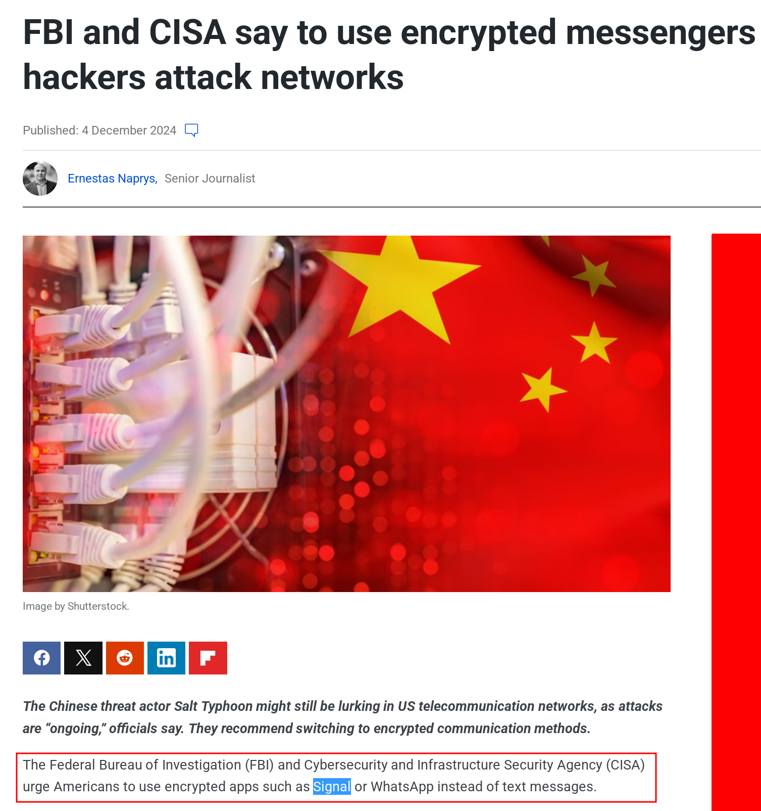

However if the adversary's anonymity is maintained, **then the only way to know if the guy is a fed or not is to look at what he does**. For example let's suppose you have some anonymous guy on the internet telling you to go contact you on telegram to do a sensitive activity:


Here since you don't know if the guy is a fed or not, you've got no choice but to look at what he's telling you to do, and since he's telling you to go talk to him on telegram, **you should logically analyze it and realize that he's trying to bait you into deanonymizing yourself to him** as we explained in our [previous tutorial](../telegramnoanonymity/index.md).

There are two strategies used by undercover cops using anonymity to bust people:

If the guy is telling you to make opsec mistakes while pretending to be your friend, then there's a very high likelihood of that guy being an undercover cop like in the example above. This is especially clear if they are not willing to correct their dangerous opsec advice after you point out their flaws [like in this thread](https://dreadytofatroptsdj6io7l3xptbet6onoyno2yv7jicoxknyazubrad.onion/post/44bc0e010ccfbb5eaad0/?context=d2c89c2ea0abd369f5#c-dd46c0147bbdde703e)

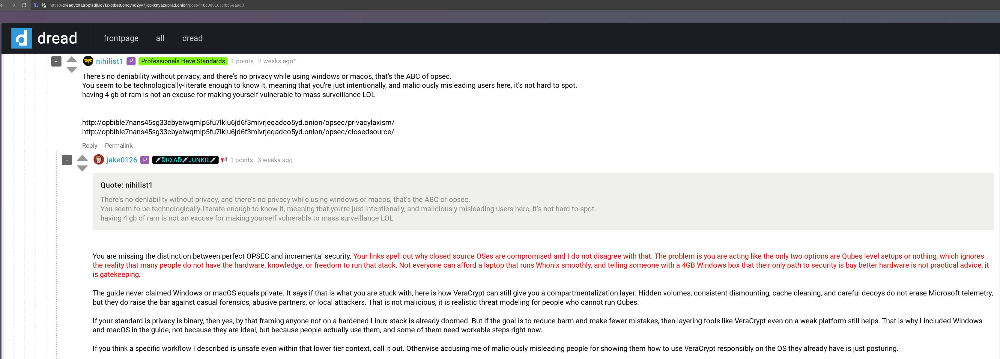

Rather, as you can see, they get angry that you expose their baits as being baits. It's very revealing most of the time, just challenge their recommendations with simple logic and see how they react.


On the other hand, if the guy is telling you to have perfect OPSEC to achieve privacy, anonymity and deniability, it means the guy is here to not help the cops but to help the individuals, therefore it's a very low probability of him being an undercover cop.

**BUT that's still not a reason to deanonymize yourself to him because it could still be a fed that's trying to do everything to make you trust him.** ESSENTIALLY BAITING YOU INTO DEANONYMIZING YOURSELF ON YOUR OWN. They gain your trust and then they just listen to you talk, gathering incriminating evidence.

Watch [this interview](https://www.youtube.com/watch?v=PHFmEFJkSK8) that scott payne did on soft white underbelly, and especially i want you to realize the lengths that they are willing to go to gain people's trust, it's really something.

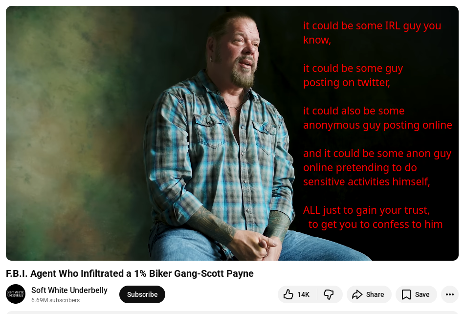

For instance, this guy in particular posed as a drug dealer, as a hitman, as some white supremacist, and as a biker gang guy, infiltrating criminal organizations all to get people to confess to him, just to gather as much incriminating evidence on them as possible, some infiltrations he did even took years before they even proceeded with arrests.

**In short, everyone could be a fed, and there's nothing you can do to prove or disprove it.** There's only probabilities. If someone's telling you to commit opsec mistakes, very likely that they are a fed, if someone's telling you to maintain perfect opsec, very unlikely that they are a fed, **but it could still be a fed that's trying to gain your trust to get you to confess to him, therefore never let your guard down.**

For instance at Nowhere, everyone's anonymous by default. Even the administrators are anonymous. We trust each other to some extent, especially due to how the hierarchy works as a meritocracy, but still that would not justify any of us deanonymizing ourselves to each other. **Everyone's threat model even includes what would happen in case if an administrator were to be a fed: they wouldn't be able to deanonymize anyone from the community, from a regular contributor to the rest of the administrators.**

That obviously means no IRL meetings, no sharing of what we do on our other identities, no telling each other what our real names are, no sharing files containing deanonymizing metadata, no talking on telegram / signal, nothing that would widen our attack surface unecessarily, because anyone could be a fed. Simple as that.

# Clearing Misconceptions:
When decentralization and anonymity are involved, **the only trust that matters is "me, who do I trust ?"** you can't let any other anonymous guy online decide that for you, because that could be a fed trying to manipulate you:

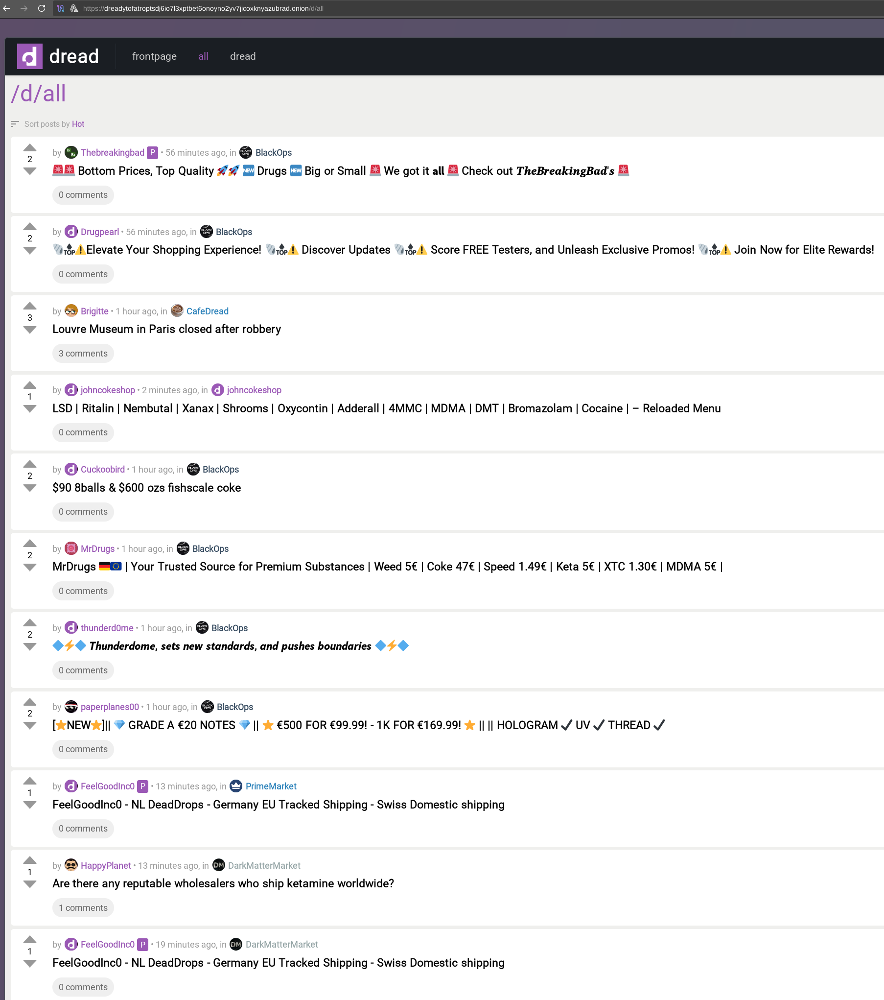

Let's suppose the following context: you go on an anonymous reddit clone available over .onion only, where everyone's anonymous by default, upvoting and downvoting each other's threads and comments. And it just so happens that there's an opsec board on it, **it's both a fertile ground for individuals to level up their opsec, but it's also a fertile ground for undercover cops to tell individuals to make opsec mistakes to make it easier for them to bust them.**

## Misconception 1: the one with the most upvotes can also be the adversary boosting his own account's reputation using his alt accounts:

Since everyone can sign up multiple times anonymously to argue with themselves, and upvote their own threads and comments, nothing's stopping a malicious adversary from telling everyone to make opsec mistakes (such as attempting to use windows / macos for sensitive use), and at the same time upvoting his own thread and comments to appear as the most trust-worthy guy out there.

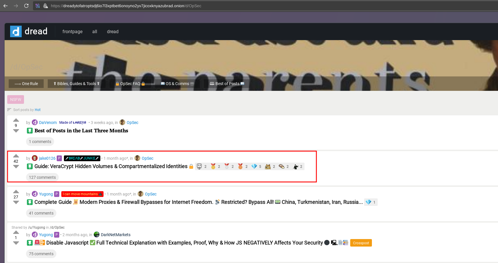


 ## Misconception 2: the adversary can make up multiple identities to craft stories to appear trustworthy (aka the hero syndrome):
 
For example let's suppose you (as an adversary) is creating a new account to act like a dumb activist like [/u/antidarknet](https://dreadytofatroptsdj6io7l3xptbet6onoyno2yv7jicoxknyazubrad.onion/u/antidarknet), going on dread to act like the guy everyone hates (they ddos websites, they try to ddos monero, dox people, etc) 

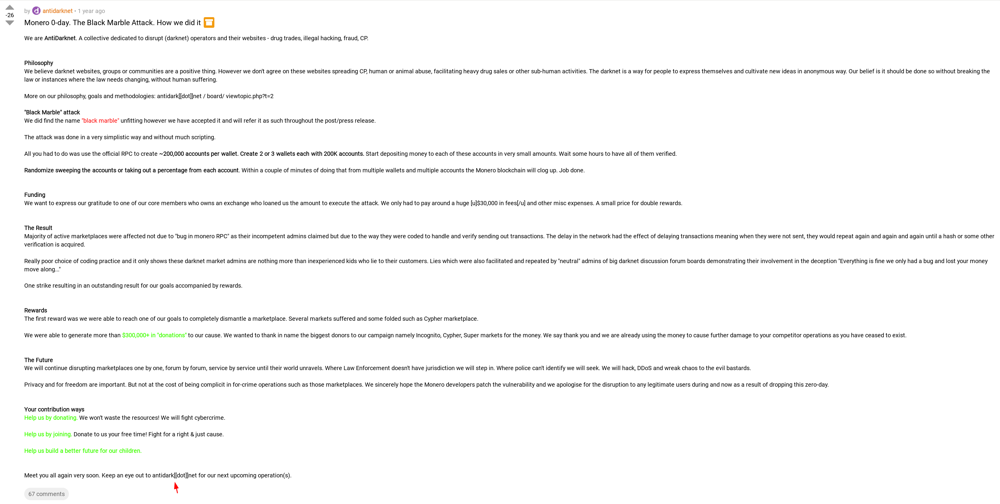

See the archive of their [now defunct website](https://web.archive.org/web/20240820001919/https://antidark.net/):
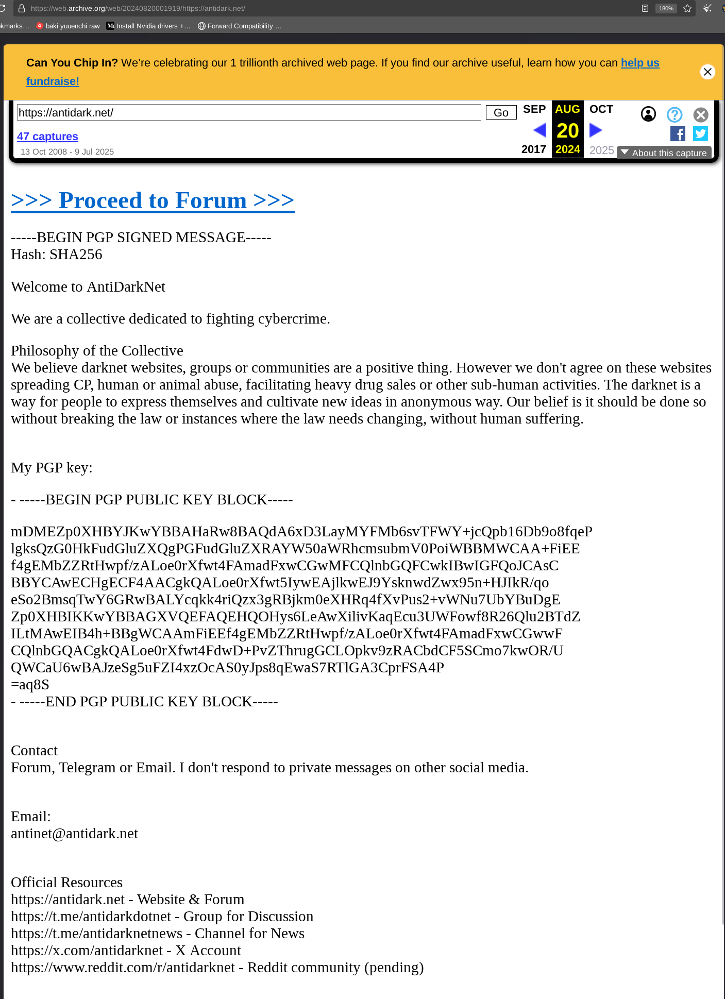

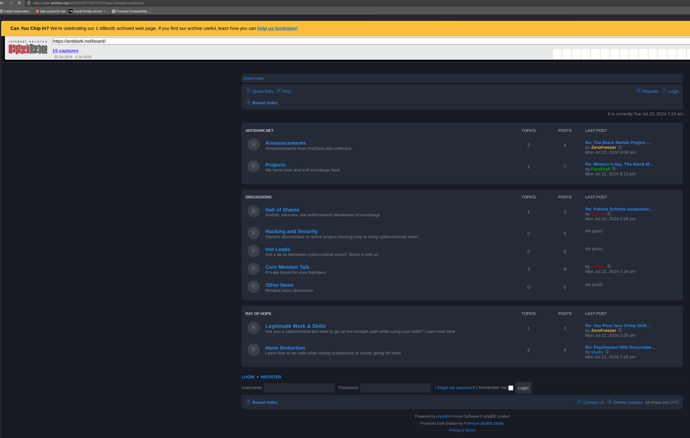

That same adversary could just go and make another account to pretend that they just hacked their other dumb activist identity to act like they are the hero everyone was waiting for, to give everyone a reason to think they are trustworthy:

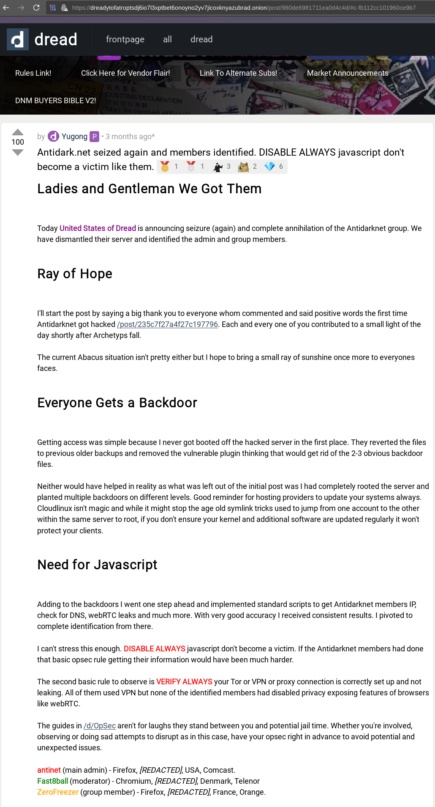

The stories told about that one hero guy could have been told to you on purpose, since both identities are anonymous anyway so you've got no possible way of proving that the hero guy wasn't also the dumb activist guy. The stories that some anonymous dude publicly says is not enough to make them trustworthy, you should still logically analyze what they try to tell you to do, especially if they advise you to do opsec mistakes, you should call them out for it anyway.

## Misconception 3: the adversary can also be mods on boards

The administrators of that reddit clone could have also be duped into believing that some people are trustworthy like in the example above, and thus they can make them mods on critical boards like /d/opsec:

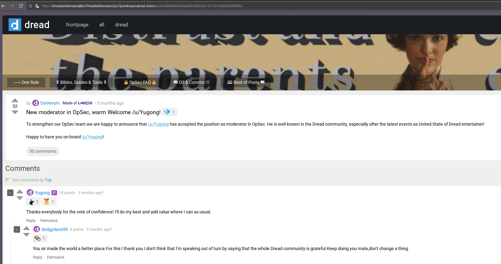

Which gives them more powers like giving and removing flairs from users (to make the feds look like they are trusted members and to make the legit users look like they are bad actors), pinning malicious threads where they motivate people to make opsec mistakes like in the example above, and using their position of power to manipulate people into not exposing them by threatening them with bans:

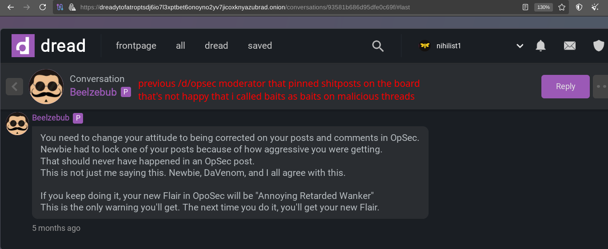

And when you manage to expose a moderator (meaning one identity of the adversary amongst the countless others), they just get rid of it and replace it with another of their own identities to further infiltrate the place to keep corrupting it as much as possible, until they gain complete control over it. 

**Yep, the "embrace, extend, and extinguish" strategy also extends to online communities.**


     