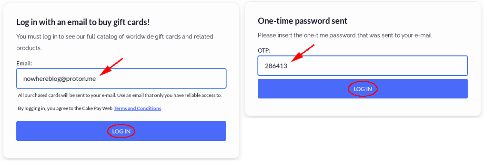

# How to Get a Credit Card Anonymously (Credit Cards as a Service)

```
TLDR: you can get and use a virtual credit card anonymously by ordering it with XMR and by using a residential proxy to skip the KYC procedure
```


## **Introduction**

With the growing economy and increasingly aggressive marketing, every company is competing to earn your business. There are no shortages of ways to spend your hard-earned money, but you may not always want to have your purchases tied to your real identity. For in person purchases, there is the obvious choice of cash as no information about you is recorded. However, online is a different story. E-commerce is heavily reliant on the use of credit cards, which leave a digital trail of metadata that ties back to you, is shared with third parties and is repackaged and sold to data brokers. Some forward-thinking vendors accept cryptocurrency but given online markets as a whole, this is still relatively niche. If your preferred method of buying something is Monero and your target vendor doesn't accept Monero, wouldn't it be great if you could still just use Monero anyway? In this article, we will explore how to obtain an anonymous prepaid card for Monero using Cake Pay and how to use this prepaid card to purchase a VPS from Hostinger, a KYC web hosting provider. 

## _OPSEC Recommendations:_

  1. Hardware : (Personal Computer / Laptop)

  2. Host OS: [Linux](../linux/index.md)

  3. Hypervisor: [libvirtd QEMU/KVM](../hypervisorsetup/index.md)

  4. Virtual Machine: [Whonix](../whonixqemuvms/index.md) or [Tails](../tailsqemuvm/index.md)


Every steps listed below are to be done via the Tor browser, in order to preserve our anonymity.


## **Obtaining the Card**

Using the Tor Browser, navigate to **https://buy.cakepay.com**. Here we are going to select the Mastercard Prepaid USD Debit (Virtual Only) option. Click Buy Now. 

When prompted, enter an [anonymous email](../anonemail/index.md) and then retrieve and enter the one-time password emailed to us. 

The next screen has some important information on it. It informs us that a name and email will be required for sign-up. It just doesn't specify that it has to be _our_ name and address. This card will not work in Apple Pay or Google Wallet, not that we were planning on using those anyway. Additionally, trying to redeem this card while using a VPN (or in our case, the Tor Browser) may fail. More on that later. Enter a desired amount and click Buy Now. 

We are now presented with a payment screen. 

Copy the destination address and amount into your Monero wallet and send the payment. 

Cake Pay will quickly detect the payment, and after a few more on-chain confirmations it will say the invoice is paid. 

Back in your inbox, you will now receive an email with Redemption Instructions and a Code. 

Attempting to redeem the code through the Tor Browser or through a VPN will fail and after around 10 consecutive attempts your redemption link and code will be temporarily locked. 

This is where a [residential proxy](../anonproxy/index.md) will come in handy. After setting one up, we can continue unimpeded using the Tor Browser. Input the code, confirm you are not a robot and click Submit. 

Our card purchase was successful. Copy the code and navigate to the provided link. 

Enter the code and click on Redeem Code. 

Complete the captcha if prompted by sliding the puzzle piece in place. 

We are now prompted to fill out the information we want for registering this card. We enter a name, an address that is for sale online, a phone number and email. After everything is populated click the checkboxes and finally hit Activate. Note that the phone number is not verified in any way. 

Our card is ready! 

## **Using the Card**

With our (digital) card in hand, it's time to actually buy something. Hostinger is a clearnet web hosting company with no explicitly stated support for signing up anonymously. All of their payment options require some information about the user and while their site supports a long list of cryptocurrencies, they somehow forgot to accept Monero. That's OK, we have a prepaid card for that. 

Using the Tor Browser, navigate to **https://hostinger.com** and click on Hosting -> VPS hosting. 

If prompted, verify you are human. 

We will select a plan that costs less than the amount on our prepaid card. 

OPTIONAL: A quick online search found a promo code. Apply it and click Continue. 

It is time to create an account. Enter an email address and password. 

Enter the billing details we used to create our prepaid card. Note that a phone number is not required here. 

Enter the card details and click Submit payment. 

## **VPS Configuration**

We are now prompted to configure our VPS. A few quick steps are required before we can start using it. Click through to choose a location, an OS, a malware scanner, set a root password and then click Finish setup. 

## **Conclusion**

After a short setup, our VPS is ready! 

Let's try to connect via [SSH over Tor](../anonaccess/index.md). 
    
    
    ~ ❯ torsocks ssh root@145.223.79.150
    The authenticity of host '145.223.79.150 (145.223.79.150)' can't be established.
    ED25519 key fingerprint is SHA256:bF9YlAl82SyfCu3X911lclJ0TwywiU6qgNtKCYDdnd0.
    This key is not known by any other names.
    Are you sure you want to continue connecting (yes/no/[fingerprint])? yes
    Warning: Permanently added '145.223.79.150' (ED25519) to the list of known hosts.
    root@145.223.79.150's password:
    Linux srv636770 6.1.0-26-cloud-amd64 #1 SMP PREEMPT_DYNAMIC Debian 6.1.112-1 (2024-09-30) x86_64
    
    The programs included with the Debian GNU/Linux system are free software;
    the exact distribution terms for each program are described in the
    individual files in /usr/share/doc/*/copyright.
    
    Debian GNU/Linux comes with ABSOLUTELY NO WARRANTY, to the extent
    permitted by applicable law.
    root@srv636770:~#
    
    

And that's it ! we have managed to get access to a credit card anonymously, and we also managed to use it to get a VPS anonymously, all while maintaining our anonymity.

