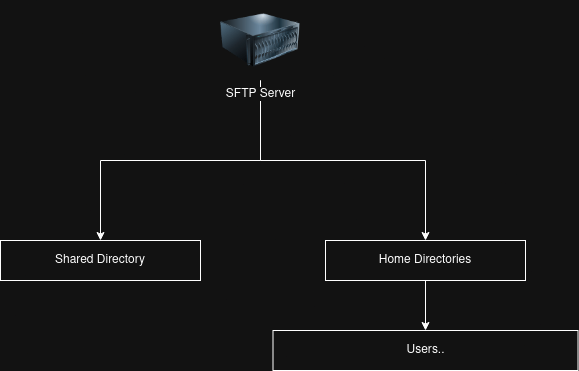

# Mounting a remote drive over Tor (using SFTP)

```
TLDR: you can store data on a remote server, while keeping the remote server's location anonymous thanks to Tor
```

On this tutorial, we'll be showcasing how you can create and mount a remote drive securely over Tor. We'll be using SFTP and SSHFS for this tutorial, and try to configure the server to be as secure as possible.

## Server Configuration

First, we have to install `sshd` and Tor

```bash
root@fileserver:~# apt install openssh-server tor
```

We'll create a new group for the users we'll grant access to our fileserver. This group allows us to lock the users into a directory, and/or also disable SSH access entirely.

```bash
root@fileserver:~# addgroup fileserver
Adding group `fileserver' (GID 1001) ...
Done.
```

Let's setup the directory structure of our fileserver. We'll choose `/fileserver` for this, and create directories for both home directories and a shared directory of files

```bash
root@fileserver:~# mkdir -p /fileserver
root@fileserver:~# mkdir /fileserver/home
root@fileserver:~# mkdir /fileserver/shared
root@fileserver:~# chown -R root:fileserver /fileserver/shared
root@fileserver:~# chmod -R 774 /fileserver/shared
```

The directory structure looks like this:



Now, let's edit `sshd`'s configuration.

```bash
root@fileserver:~# vim /etc/ssh/sshd_config.d/fileserver.conf
```

Add this to the new configuration file, if you want the users in `fileserver` group to only access SFTP:

```
Match Group fileserver
        ChrootDirectory /fileserver
        X11Forwarding no
        AllowTcpForwarding no
        PermitTTY no
        ForceCommand internal-sftp
```

Restricting users to SFTP-only provides a significantly reduced attack vector, since users cannot execute commands or programs in the server.

**IMPORTANT**: You should create seperate users for chrooted SFTP-only access and regular SSH access for users who may want both.

You should restart `sshd` after configuring.

```bash
root@fileserver:~# systemctl restart sshd
```

### Creating users

Before we start creating users, we should make a symlink of the fileserver directory inside the directory itself. This may seem odd, but it is just to fix an issue with home directories not properly working.

```bash
root@fileserver:~# cd /fileserver
root@fileserver:/fileserver# ln -s . fileserver
```

We can create users by setting the base home directory to `/fileserver/home/` and initial groups as `fileserver`. For example: we'll create a user for Bob.

```bash
root@fileserver:~# useradd -m -b /fileserver/home/ -G fileserver bob
```

Now, Bob has a user and their home directory is in `/fileserver/home/bob`


### Hosting SFTP behind Tor

Modify Tor's configuration to host a hidden service forwarding the SSH port.

```bash
root@fileserver:~# vim /etc/tor/torrc
```

Insert this to the file:

```
HiddenServiceDir /var/lib/tor/fileserver_service/
HiddenServicePort 22 127.0.0.1:22
```

Now, restart Tor to use the new configuration.

```bash
root@fileserver:~# systemctl restart tor
```

We can get the .onion hostname of our new fileserver from `/var/lib/tor/fileserver_service/hostname`

```bash
root@fileserver:/var/lib/tor/fileserver_service# cat hostname 
wjlpqxc2xsj3575nxlnj7rvctfr57rons56auisfrjjqzmqrbutnsmad.onion
```

## Client Configuration

First, install SSHFS, Tor and `netcat-openbsd`

```bash
root@localhost:~# apt install sshfs tor netcat-openbsd
```

We'll write a configuration file for SSH for our fileserver host. This is to make it easier to reference the fileserver in SSHFS and SFTP configurations.

```bash
root@localhost:~# vim /etc/ssh/ssh_config.d/fileserver.conf
```

```
Host tor_fileserver
    Hostname wjlpqxc2xsj3575nxlnj7rvctfr57rons56auisfrjjqzmqrbutnsmad.onion
    ServerAliveInterval 20
    ProxyCommand /bin/nc -xlocalhost:9050 -X5 %h %p
```

Enable and start Tor.

```bash
root@localhost:~# systemctl enable --now tor
```

You can test out if the server and the configuration works out using `ssh` and `sftp`. It should be similar to the output below:

```bash
bob@localhost:~$ ssh bob@tor_fileserver
bob@wjlpqxc2xsj3575nxlnj7rvctfr57rons56auisfrjjqzmqrbutnsmad.onion's password: 
PTY allocation request failed on channel 0
This service allows sftp connections only.
Connection to wjlpqxc2xsj3575nxlnj7rvctfr57rons56auisfrjjqzmqrbutnsmad.onion closed.
bob@localhost:~$ sftp bob@tor_fileserver
bob@wjlpqxc2xsj3575nxlnj7rvctfr57rons56auisfrjjqzmqrbutnsmad.onion's password: 
Connected to tor_fileserver.
sftp> pwd
Remote working directory: /home/bob
sftp> ls /
/fileserver  /home        /shared      
sftp> exit
```

As root, we should generate a SSH keypair and copy it over to the fileserver, so we don't have to authenticate via passwords (the server should be configured to have `PubkeyAuthentication yes`, and ideally `PasswordAuthentication no` after this process)

```bash
root@localhost:~# ssh-keygen -t ed25519
Generating public/private ed25519 key pair.
Enter file in which to save the key (/root/.ssh/id_ed25519): 
Enter passphrase (empty for no passphrase): 
Enter same passphrase again: 
Your identification has been saved in /root/.ssh/id_ed25519
Your public key has been saved in /root/.ssh/id_ed25519.pub
The key fingerprint is:
SHA256:CgaDruP+EYCsS/HOD8VQDmIbjnQfrbHtfaUqLBSB72Y root@localhost
The key's randomart image is:
+--[ED25519 256]--+
| = o.o.          |
|B.=.=o..         |
|+*o..o*          |
|o +oo= .     .   |
|.o o+oo S   o    |
|o.o.oE o . o     |
|+  =+ o   o      |
|..  +. o .       |
|.o.. .. .        |
+----[SHA256]-----+
root@localhost:~# ssh-copy-id -s bob@tor_fileserver
/usr/bin/ssh-copy-id: INFO: Source of key(s) to be installed: "/root/.ssh/id_ed25519.pub"
/usr/bin/ssh-copy-id: INFO: attempting to log in with the new key(s), to filter out any that are already installed
/usr/bin/ssh-copy-id: INFO: 1 key(s) remain to be installed -- if you are prompted now it is to install the new keys
bob@wjlpqxc2xsj3575nxlnj7rvctfr57rons56auisfrjjqzmqrbutnsmad.onion's password: 
sftp> -get .ssh/authorized_keys /root/.ssh/ssh-copy-id.dZKXo77Clg/authorized_keys
sftp> -mkdir .ssh
remote mkdir "/home/bob/.ssh": Failure
sftp> chmod 700 .ssh
sftp> put /root/.ssh/ssh-copy-id.dZKXo77Clg/authorized_keys .ssh/authorized_keys
sftp> chmod 600 .ssh/authorized_keys

Number of key(s) added: 1

Now try logging into the machine, with:   "sftp 'bob@tor_fileserver'"
and check to make sure that only the key(s) you wanted were added.

root@localhost:~# sftp bob@tor_fileserver
Connected to tor_fileserver.
sftp> exit
root@localhost:~# 
```

Now you can mount the fileserver in a new directory (we'll use `/mnt/fileserver/` for this)

```bash
root@localhost:~# mkdir /mnt/fileserver
root@localhost:~# sshfs bob@tor_fileserver:/ /mnt/fileserver/
```

To make this persistent across device reboots, we can write a new entry in `/etc/fstab`

```
bob@tor_fileserver:/    /mnt/fileserver/        fuse.sshfs      x-systemd.automount,_netdev,allow_other,reconnect        0       0
```
