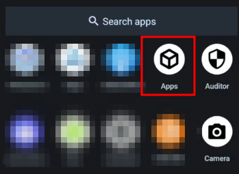
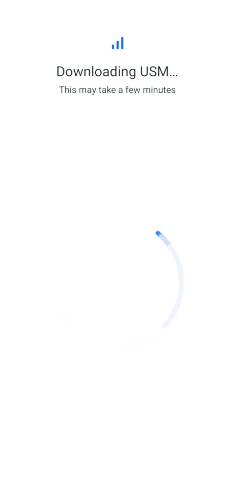
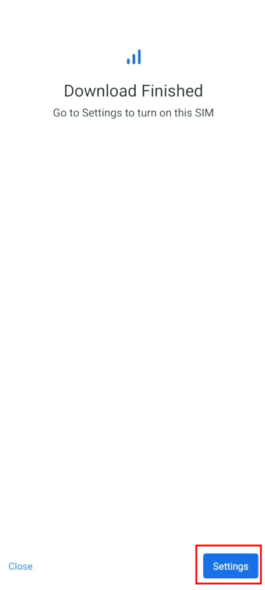
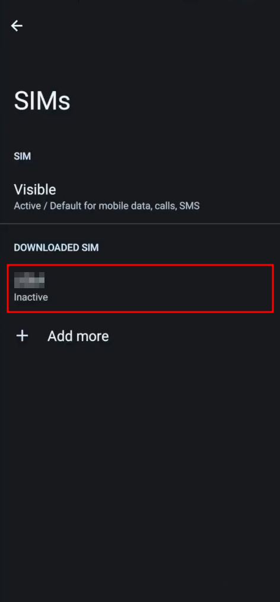
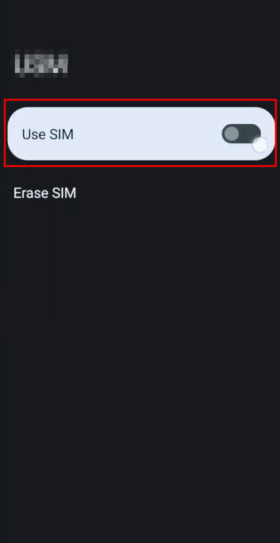
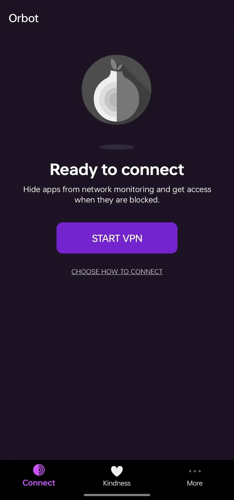
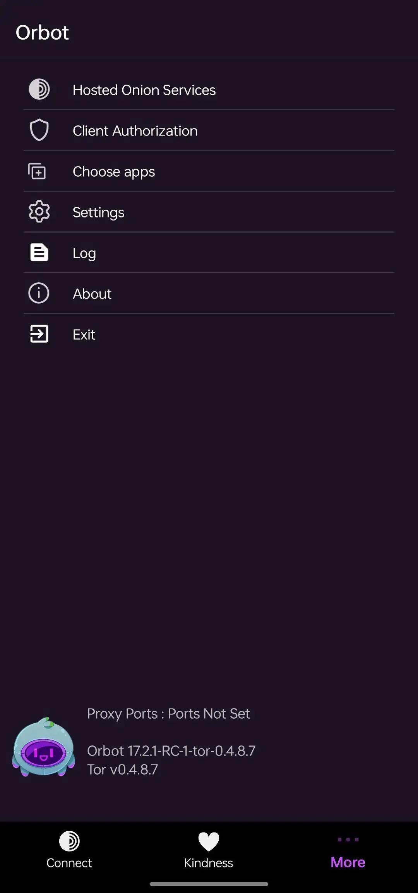
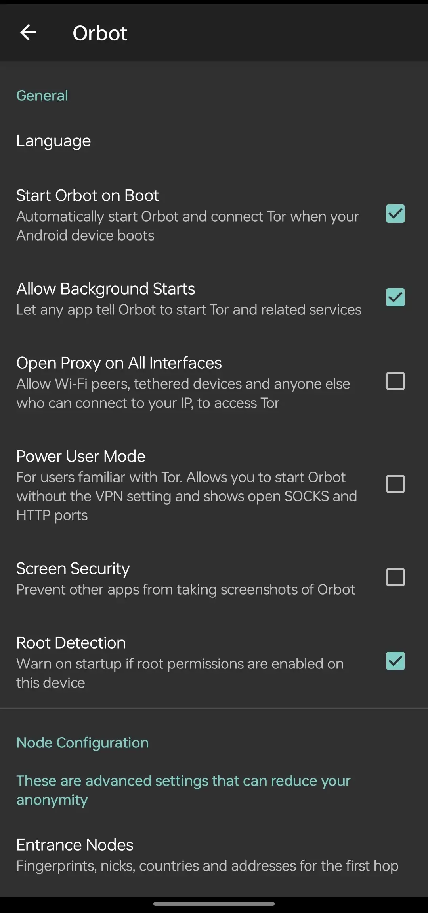
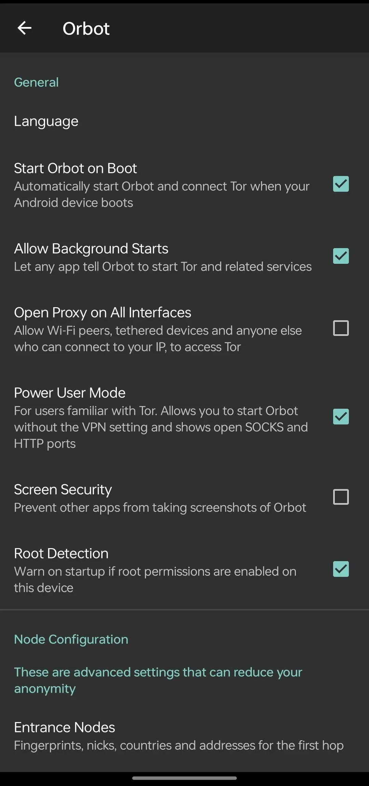

# How to remain Anonymous during a protest

```
TLDR: leave your phone at home and dress in all black to ensure you remain indistinguishable from the rest of the protesting crowd 
```

You just turned on your TV and saw that there is a **protest** near the white house because the government decided that end to end encryption leads to terrorism and are passing a law to ban it. You feel patriotic and know that it isn't right. **You show up to the protest without telling anyone** for a few hours and you get back home proud that you showed your support to the people. However, the police bangs your door and **arrests you for taking part in the protest**.


## **Phones are tracking devices for Law Enforcement**


Government, Internet Service Providers (ISPs), Cellular network providers can all **find out where you are** with the help of your device emitting and receiving radio waves. These entities use various methods to track you down at **any given time**. This is called **Geofencing**.


### **Tower Triangulation**


This is where multiple cellular towers are used to geometrically locate devices connecting or pinging them by measuring the strength of the connection from each tower.

more towers present around you = more accurate location

**Towers even at a distance of 5 miles from you can be used to triangulate your location precisely.**

### **Wifi Triangulation**


  


Wifi routers often interact together especially when they're from the same ISP. When your device recognizes a wifi network nearby (as seen in the wifi details option of your phone) which also allows them to determine the **signal strength** of each router.

This can be used to geometrically determine your device's location based on how strong the nearby signals are, **even when you're not connected to it.**

**Two routers are enough to track you precisely upto a 6 feet error. You're surrounded by tens of them.**

On Android and Apple devices, wifi can also be used to geofence you with GPS through Google or Apple Network Location Provider (NLP) service. Making it even easier to geo-locate your device.

### **GPS/A-GPS**

Your phone constantly searches for satellites to connect to Global Positioning System (GPS) signals.

Both Android and Google devices use Google-SUPL service for gps queries - [supl.google.com:7275]. This **happens even if you do not connect your phone to a WiFi or Cellular data**.

A-GPS stands for 'Assisted GPS'. It is when the SUPL GPS service works with the on-device GPS module to be even efficient in location tracking.

Blocking this service greatly impacts cellular data connectivity and disables location services on your device.

You can read more about issues of SUPL and how to disable it in [magisk-supl-replacer repo](https://github.com/PlqnK/magisk-supl-replacer/blob/master/README.md).

**TLDR; Unless if your phone is powered off in a faraday bag, wherever it goes, there exists a permanent record of where a phone has been and that record is known by Law Enforcement entities.**

## **Prevention - staying Anonymous outdoors.**

> ⚠️ Read the entire article before taking any actions or steps as half-knowledge could easily land you **in jail**.

Reminder: Anonymity is when you are amongst a group of people, and you are indistinguishable from the other members of the group.

---

### **Look the same**

To minimize the risk of being identified by police or surveillence devices like CCTV, protestors including you should adopt a uniform. The best way to do this is implementing the following.


  * Wearing all black - (_long sleeve tshirts_ , pants, socks, shoes, _gloves_ , _glasses_ , and _masks_.) 
  

  * No jewellery - necklaces, watches, earrings, bracelets, etc.
  

  * Dress up such that you're always ready for a run.
  

  * Do not touch surfaces with your bare hands and leave potential fingerprints.
  

  * Do not carry any weapon, signal jammer, or any such device that might get you in trouble in the court.

---

### **Leave your primary personal (public use) phone ACTIVATED at YOUR home.**

Taking your phone to the protest, deactivating your phone or trying to mask the location of your phone can be a good reason for Law Enforcement agencies to put you on the suspicion list. All that the law enforcement needs to prove you guilty of participating in the protest is your primary phone (affiliated to you publically) to be nearby the protest, potentially landing you in jail and big trouble, even if you went just to buy grandma's medicine.

Leaving your phone activated at home leaves **no digital trace** of you ever being affiliated with the protestors.

As we have discussed the various methods that Law Enforcement agencies can track you down precisely, and there isn't much you can do to stop it, leaving your personal mobile phone, smart watch, or any other smart device at home is the best way to stay anonymous in a protest, leaving no proof that you took part in it and [denying](../deniability/index.md) that you ever left your home.


## **How to have a phone for anonymous use?**


The safest and simplest way to stay anonymous is to keep your phone at home, as explained above, for deniability, where you can claim that you stayed at home during the protest. 


> ⚠️ Proceed only if you need connectivity for communications while doing anonymous outdoor activities.

Best preferred Android ROM is **GrapheneOS**. If you REALLY NEED a secondary phone and it is compatible with LineageOS, you can proceed with it. You WILL NEED to make changes to the LineageOS firewall (+ block `supl.google.com:7275`), but it won't be even close to Graphene in terms of security.

### **Preparation - indoors**

  * Use your main pc to flash [GrapheneOS](../graphene/index.md) on a pixel phone. Only proceed if you get one. Otherwise, don't use a secondary phone at all.

  * Get a decently reviewed _Faraday bag_ on amazon. However its recommended to buy it physically with cash or learn how to make Faraday bag [here](https://invidious.privacyredirect.com/watch?v=sQ_V9LYfiUg), [here](https://invidious.privacyredirect.com/watch?v=jfSe-xyQQzg), or [here](https://invidious.privacyredirect.com/watch?v=PYHvMXAXGE4).
  
    Make sure to check wheter your faraday bag works on not at your home prior the protest by putting your or someone else's phone inside it with cellular data and gps/location enabled and trying to call/track it. 

  * After you have flashed your pixel with GrapheneOS (first step), **DO NOT CONNECT** TO ANY WIFI OR CELLULAR NETWORK. Now switch your phone off and immediately put it in a faraday bag, making sure its completely sealed. Its is good to cover and disguise the faraday bag as a normal envelope or put it in a bag to avoid high-level suspicion. 

  * Use sites like [ Openwifimap](https://openwifimap.net) __through tor__ to pre-scan and find free open WiFi around the protest to use in a secondary phone and the place where you plan to use active internet (as shown later).

  * Use a Faraday bag at all times to store your secondary phone when you don't _**need**_ to use it.
  
    ⚠️ Do this only if you **NEED** to use secondary phone for the protest.
  

Next steps **a.** and **b.** are for accessing internet anonymously ONLY AFTER you have completed the above steps.

#### **a. Accessing internet anonymously - eSIM**

  * Using [Whonix VM](../whonixqemuvms/index.md) or [Tails VM](../tailsqemuvm/index.md), via the tor browser and some [Monero](../truecrypto/index.md) (XMR), purchase an eSIM from <https://silent.link> and note down the activation code on a piece of paper.

    It is important to write the _combined activation code_ down on a piece of paper or print the QR activation code (both given by silent.link after the purchase), and not in any digital or audio format because you do not want to leave any evidence of you ever interacting with the anonymous eSIM providers and arise suspicion.

  * Write down the activation instructions below on a piece of paper. Dress up all black and go to a random place insignificant to you, get your phone out of the faraday bag, and connect to an open wifi network. There activate the eSIM as instructed below.
  


#### **Activating eSIM**


Navigate to your grapheneOS setting and click on "Network and Internet" 


There you will find that the "priviledged eSIM management is disabled. This is because the google play services and google play service framework is not present by-default in graphene."


Navigate to your app drawer and click on "Apps"




Now install "Google Services Framework" and "Google Play Services"


Navigate back to "Network and Internet" in the settings. The eSIM managament option should be enabled now.


Click on the eSIM management option. Then click "Download a SIM instead." 


Click "Next."


Here, either scan the printed QR code on the piece of paper. Otherwise, navigate to "Need Help?" and select the option to input the code manually. Input the _combined activation code_ from the silent site that you noted down on the piece of paper.


You might see different sim name downloading when you activate the sim. Its fine.




Navigate to "settings" after you've finished downloading the eSIM.




Click on the downloaded eSIM option.




Toggle "Use SIM"




Make sure to enable use for data if you want to access internet. You now have access to your private and anonymous eSIM. If you encounter any abnormal issue, using tor browser, head to [silent help](https://silent.link/faq).


**DO NOT FORGET TO REMOVE BOTH GOOGLE SERVICES THAT YOU DOWNLOADED EARLIER.**


  * Make sure that while you're doing this, you're not under any security surveillance (cameras, law enforcement buildings, etc).
  

  * Once you validate that the eSIM works, power the device off, and put it in the faraday back again right away.

---

> ⚠️ Although eSIM method works well, you need to remember that the moment you activate it, the systems _start tower-triangulation right away_ and doing it anywhere close to your location of interest might be _potentially risky_. You also need to be careful NOT to switch it on at your own home by any chance, or you could hear the _bang on your door soon_. This is why its best to use open public wifi.
  

> ⚠️ Remember NEVER to carry both - your personal/primary and your secondary phones at the same time. If and only if need to for critical reasons, make sure to ALWAYS keep atleast one of them in a faraday bag at all times and do NOT switch on both of them simultaneously.

Leave your primary phone INDOORS and ACTIVATED while you are outdoors.

---

### **b. Accessing internet anonymously - public wifi**

#### 

  * There are multiple advantages to use tools like [openwifimap](https://openwifimap.net) to find public WiFi cafe networks to connect to.
  

  * If for some reason the app/website does not show free open WiFi around your area, you might want to go for a walk like a normal person just to grab some coffee and note down the password without any suspicious movements.
  

  * Make sure to install [f-droid](https://f-droid.org/) on your grapheneOS and install [tor browser](../torbrowsing/#installing-the-tor-browser-on-mobile) and [orbot](https://support.torproject.org/glossary/orbot/) vpn from it. Check "Setting up package managers" section of [GrapheneOS tutorial](../graphene/index.md) to be guided through how to install fdroid securely. 
  

  * Go in your grapheneOS settings and search for 'VPN' , find and select more options for orbot vpn after opening the orbot app once and giving it permission to start a VPN. Select the option to set orbot as an "Always-on VPN" and turn on "Block all connections not using this VPN".
  
    *or*
  
    Install Mullvad VPN and proceed with the same steps to block all connections not using Mullvad.


### **Setting up orbot**

  
For routing internet traffic to specific servers anonymously, nothing beats tor. You can learn how to extensively do so [here](../torthroughvpn/index.md).
  
  
> ⚠️ If tor is banned and [illegal in your country](../toolslegality/index.md#tor), you **NEED** to access it through a [VPN like Mullvad](../vpn/index.md).
> 
> If VPNs are also [banned in your country](../toolslegality/index.md#vpns), you **NEED** to use [cloak](../cloak/index.md) or [v2ray](../v2ray/index.md). We do not have an article on using v2ray on a mobile device yet, however I can recommend [XiVPN](https://f-droid.org/en/packages/io.github.exclude0122.xivpn/) app.
> 
> You can more about it [here](../torthroughvpn/index.md#tor-and-vpns-combinations).


For now, we will just set up orbot as power user (socks proxy) through which we can safely route our SimpleX chat (below) messages securely.


Navigate to the orbot app after you have installed from the steps above



Go to "More" (three dots) on the bottom left of the screen



Go to settings



Enable "Power User mode"




> ⚠️ Although Mullvad is one of the very few trustable VPNs out there, we can NEVER trust a single entity so its better and free to use Orbot.


Now whenever you are outdoors onto doing something sensitive, being unidentifiable with the uniform and your gear, you can take the phone out of the faraday bag, power it on and use it.

---

## **Anonymous Communications**

A trusted, decentralised communication platform for discussing things about the protest is the most important thing. Despite having all the proxies and anonymization tools in your hand, if the Law Enforcement already knows about the people going to protest, they can arrest them prior the protest.
  
This is why you need a secure, decentralised, end-to-end encryption based messaging platform.

### **Simplex Chat**

For sensitive communications while outdoors, it is suggested to use [SimpleX chat with disappearing messages](https://simplex.chat/blog/20230103-simplex-chat-v4.4-disappearing-messages.html#disappearing-messages) turned on.
  
You NEED to make sure to turn on disappearing messages on both ends, incase authorities get hold of your device and search for your chats. Having messages set to disappear after a said amount of time allows you to have **deniability**.
  
We will be also showing how to use SimpleX as an all-in-one privacy messenger for all your activities in one of our future tutorials. 

## **Physical opSec**

What you do in day-to-day life is a big part of who you are, your personality, your agenda, etc. You NEED to be aware of your physical operational security and take care of it properly. 

### **Your body language**

> sourced from [cia assessment training](https://wikileaks.org/cia-travel/secondary-screening/WikiLeaks_CIA_Assessment_on_Surviving_Secondary_Screening.pdf) papers from wikileaks.


#### While interacting with people of the protest, you need to take care make sure that you:

  * **Do NOT tell anyone your real name**. Create a pseudonym for every group/contact. SimpleX chat offers this feature within their app to randomly generate one using "Incognito mode" within the app.
  

  * **Do NOT vocally talk about protest at home, near devices. SimpleX chat should be the _only_ place you talk about the protest**.

  * Do NOT share personal info (address, phone number, birth year, family background) with **ANYONE**.


#### When going outside to safely access services like eSIM or tor, as we talked earlier, always keep in mind to:

  * NOT go to a location that holds a significance to you.

  * NOT go to a location that is near Law Enforcement premises or under surveillence (CCTV) without being sure you've not been followed and are unidentifiable.

  * Put your uniform in a bag `(A)` and put a bag `(B)` in the bag `(A)`. Go to a subway restroom and wear the uniform making sure no cameras are watching you. Make sure to now put the bag `(A)` in bag `(B)` and proceed with your work as shown in the below diagram.


  

Keep the **secondary phone switched off** in a **faraday bag** at **all times**.

Switch it on or remove it from the faraday bag STRICLY ONLY AFTER YOU HAVE DISGUISED (ONLY after reaching public washroom `A`). Put the phone back in before removing your disguise (BEFORE leaving public washroom `B`).


