# How to get and use residential proxies anonymously

```
TLDR: you can rent and use residential proxies anonymously, to be able to anonymously access websites that block Tor and VPN IPs.
```

While Tor is a requirement to protect your anonymity online, some services refuse to be accessed anonymously, and are intentionally blocking connections coming from Tor exit nodes. These services are against your anonymity, but there are still ways to access them anonymously:


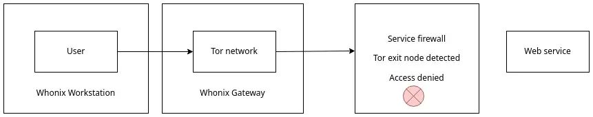

A residential proxy will reroute your access through a residential IP address, which makes your connection look like it is coming from your ISP or your mobile carrier.

_Serverside Context:_ This setup is to be considered only in the case where the destination website also blocks your attempts at connecting there via a [(you -> Tor -> VPN -> destination)](../whentorisblocked/index.md) setup.


Under this setup, you can access those websites that are blocking both Tor and VPN traffic, while still keeping your anonymity intact.

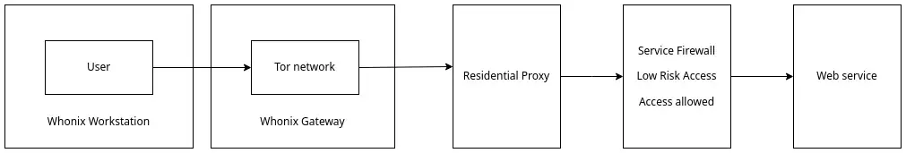

Warning: This setup is not officially supported by the Tor Project; it should be considered experimental. It is still recommended to use the default setup of Whonix and the Tor browser for the rest of your anonymous activities online.

For further details on how you can combine Tor and VPNs to protect your anonymity, refer to [this tutorial](../torthroughvpn/index.md)

Other useful reference: <https://www.whonix.org/wiki/Tunnels/Connecting_to_Tor_before_a_proxy>

## _OPSEC Recommendations:_

  1. Hardware : (Personal Computer / Laptop)

  2. Host OS: [GNU/Linux](../linux/index.md) (Or Qubes OS)

  3. Hypervisor: [libvirtd QEMU/KVM](../hypervisorsetup/index.md) (Or Qubes OS's Xen)

  4. Virtual Machine: [Whonix](../whonixqemuvms/index.md) (that must be dedicated to the (you -> Tor -> residential proxy -> website) setup 

## **Proxy Purchase**

_Warning:_ Everything below needs to be done inside the dedicated new Whonix workstation VM!

[smspool.net](https://smspool.net/) is chosen to be the proxy provider for this demo; the author is not affiliated with this service. It is used because it is Monero friendly, but other service providers should work similarly.

First, you need to register:

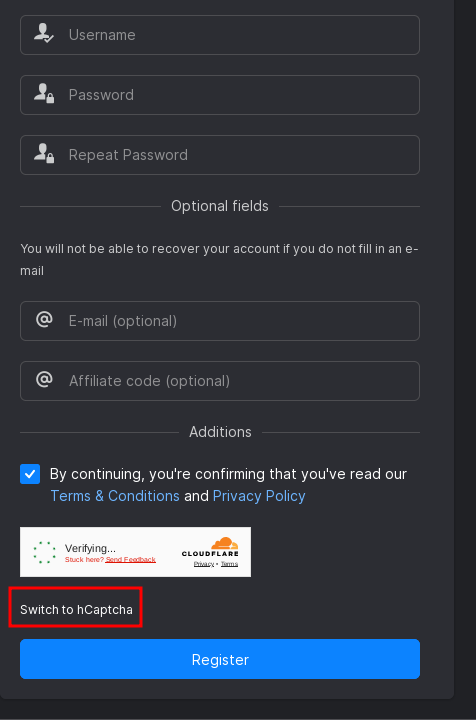

Choose "switch to hCaptcha" otherwise, you might get stuck at the Cloudflare verification.

The next step is to deposit Monero into the website and purchase the proxy.

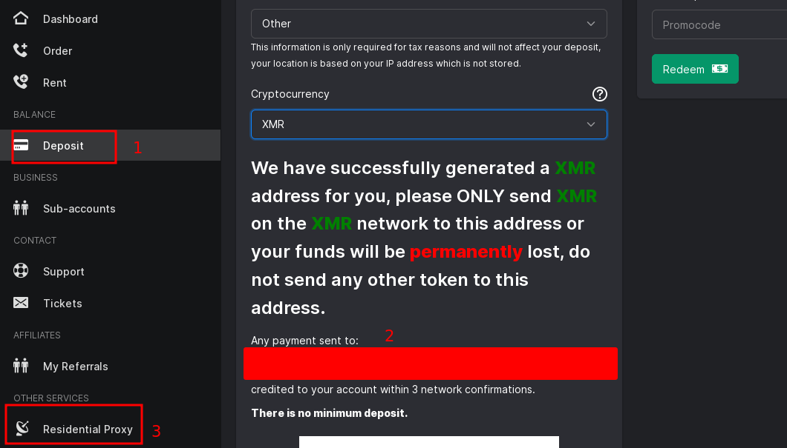

When your deposit gets credited, purchase the proxy.

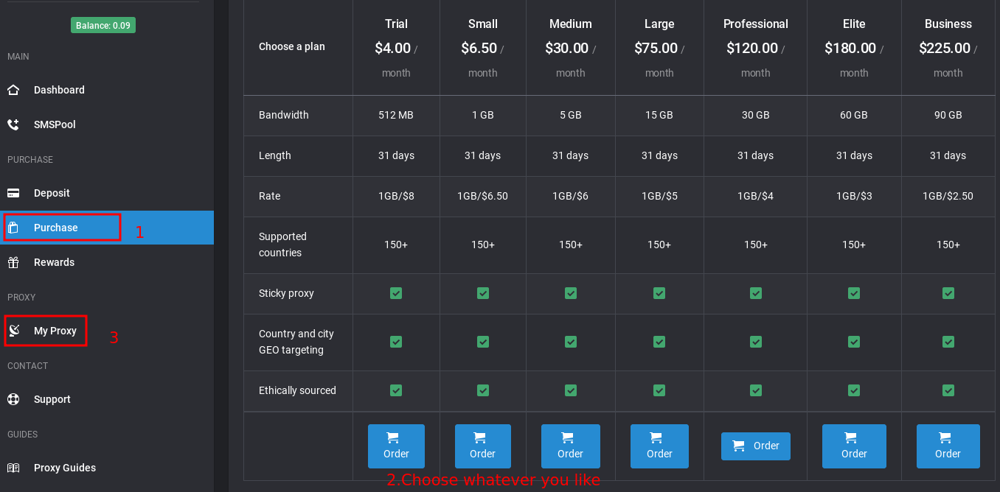

Now your proxy is ready. Check for the details inside the "My Proxy" section.

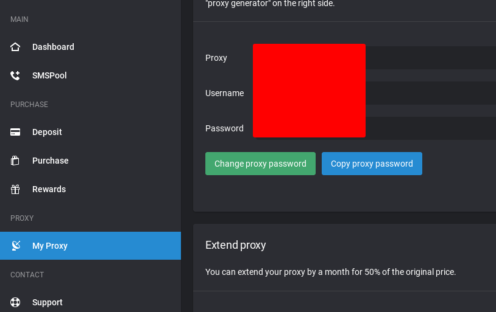

Copy your proxy IP, port, username, and password. It will be used later.

## **Browser setup**

Due to an upstream change, the proxy setup method mentioned in the Whonix tutorial is not working <https://www.whonix.org/wiki/Tunnels/Connecting_to_Tor_before_a_proxy/Proxy_Settings_Method>

One of the other methods is to use the FoxyProxy addon. **However, please note that installing a plugin will change the Tor browser fingerprint, so it is highly recommended you keep the rest of your anonymous activities in a separate default Whonix Workstation VM.** Use this setup only when you are in this specific server-side context.


Choose the "add-ons and themes" in the Firefox menu and search for FoxyProxy.


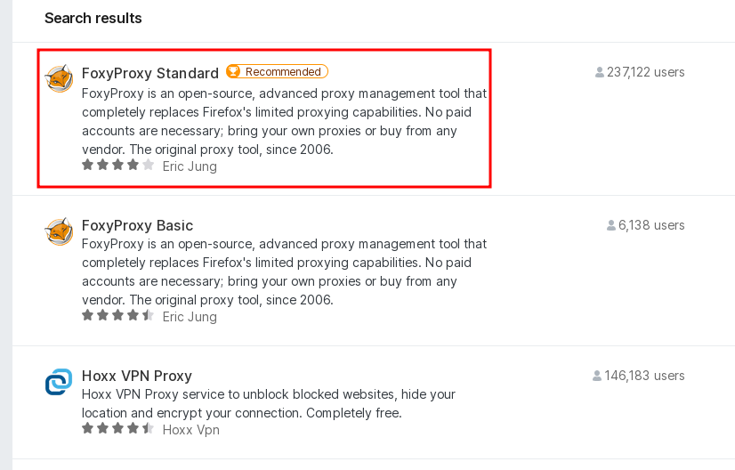

Install the plugin, pin the plugin, and allow it to work in private windows.

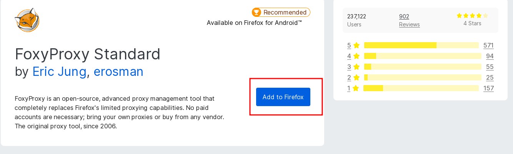

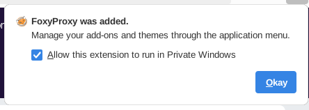

## **Connect to Proxy**

Finally, we will connect to the proxy we just purchased.

First, find FoxyProxy in the menu bar and choose "options".


Add the proxy information in the "proxy" tab.

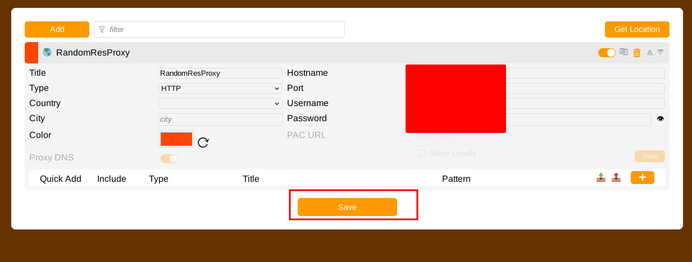

In this demo, the proxy is HTTP; if you use a different provider and it doesn't work, try to check the protocol. Fill all the info and save it.

Now check the website you want to access. It is blocked because you are still using the Tor exit node.

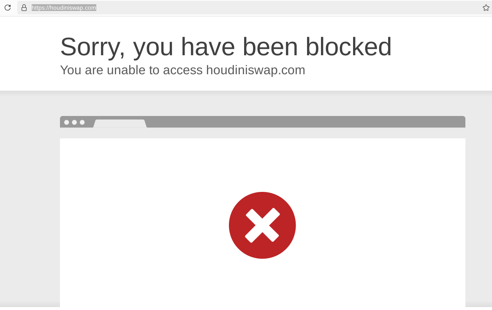

Choose the proxy you just added in the FoxyProxy button, and reset your Tor browser identity.

Now access <https://check.Torproject.org>, and you should see a warning saying you are not using Tor, due to having the connection originating from the residential Proxy IP. **This means that you have successfully completed the (you -> Tor -> residential proxy -> website) setup, effectively hiding that you're using Tor from the destination website.**

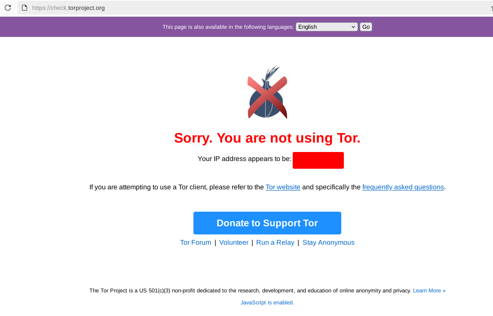

Now try the website that blocks Tor, it should work now if you did everything correctly!


