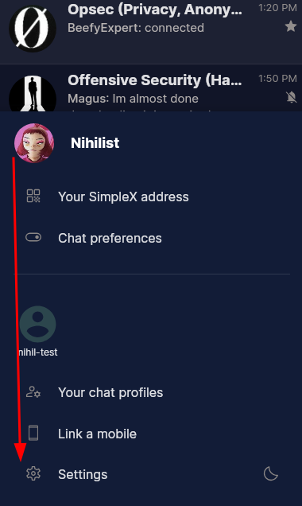
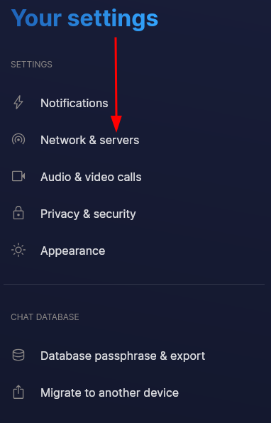
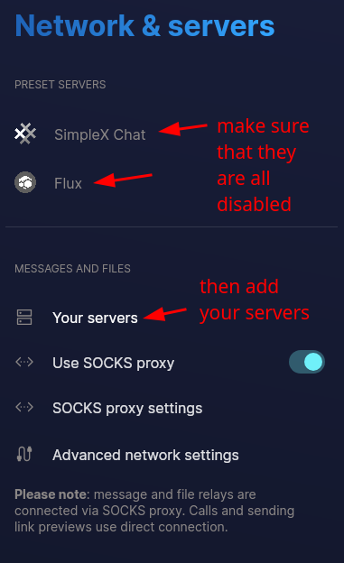
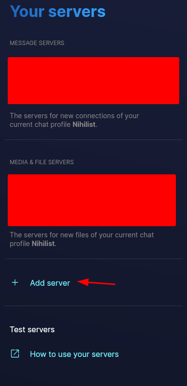
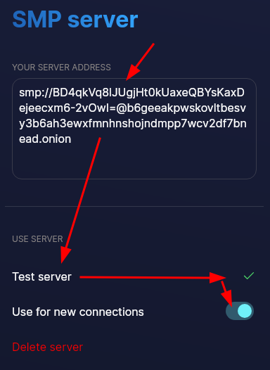
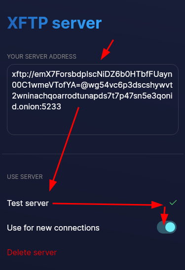
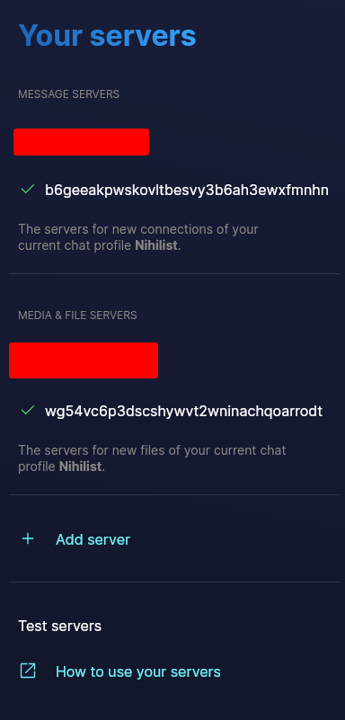
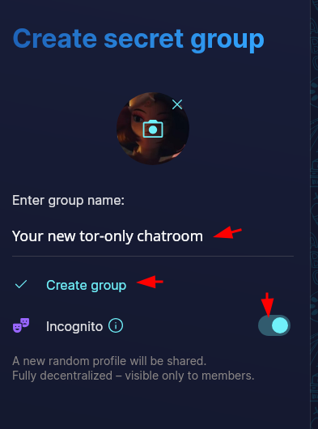

# Anonymous Simplex SMP & XFTP Servers setup

```
TLDR: you can host simplex SMP and XFTP servers anonymously, by making them onion-only. And you'll still be able to connect to regular users by using them because of simplex's 2 hop private routing mechanism
```


 **If you do not have SimpleX installed on the clientside please refer to this tutorial [post](../anonsimplex/index.md)**

## **Only using your own onion-only simplex server doesn't isolate you.**

A common misconception that people seem to have is that you wouldn't be able to communicate with regular simplex users that don't have Tor connectivity, when you're only using your own onion-only simplex servers. **But that's not true, you're not even isolated when using onion-only servers.** This mode of thinking comes the fact that traditional federated apps (like the fediverse) don't care about server-side anonymity. But, lucky for us, the official simplex servers also allow Tor connections in between simplex servers, which makes this whole setup possible.


In reality, thanks to Simplex's Private Routing protocol, (which is a 2 hop routing protocol), **your trusted simplex server (which is onion-only) communicates with the other party's trusted simplex server, as long as they have Tor connectivity.** And if the other peer is using the default Simplex Servers, which all have Tor connectivity, then they can still communicate to your own onion-only simplex server, which ensures that you're not isolated when you want to have a public, yet anonymous community [like the one we have at Nowhere.](http://nowherejezfoltodf4jiyl6r56jnzintap5vyjlia7fkirfsnfizflqd.onion/simplex.html)

That's what we are going for in this tutorial. We're going to setup a simplex server that is onion-only, to protect the server-side anonymity, **and we'll use our simplex client to only connect through our onion-only simplex server, and we'll create group chats with it so that we can have our own public, yet anonymous chatroom.**

## **SimpleX Server Setup**

It's important to note that in theory, it doesn't matter which SimpleX server you connect to, as all communications are end-to-end encrypted. When you connect via Tor, it further ensures that the server itself won't be able to trace your connection back to you. Your anonymity is maintained through the use of Tor, and your conversations are protected by SimpleX's encryption.

We're going to make use of [HackLiberty's tutorial](https://forum.hackliberty.org/t/simplex-server-docker-installation-guide-smp-xftp/140) on how to install and configure a SimpleX server using Docker.

We're going to be using Docker to run the server, so before you continue, please follow [**this guide**](../docker-intro/index.md) to be sure you have the proper packages installed and permissions granted.

In this guide we're going to be using the [official remote images](https://hub.docker.com/u/simplexchat), however if you want to fork and build your own, we have a [**guide here**](../simplex-forking/index.md) where you can do so.

We'll be creating and editing some files in this post, you can use your favorite CLI text editor such as `vim` or `nano` or your favorite GUI text editor.

First we're going to create a directory where we can do all of our commands and operations, such as:

    mkdir -p ~/simplex-server
    cd ~/simplex-server

Then we'll make two files, one will be called `docker-compose.yml` with the following contents:

    networks:
      tor-test:
        driver: bridge
        ipam:
          config:
            - subnet: 10.6.0.0/24
              gateway: 10.6.0.1

    services:
      simplex-smp-server:
        image: simplexchat/smp-server:latest
        container_name:  simplex-smp
        restart: always
        user: "1000:1000" #user uid - change if necessary
        ports:
          - "127.0.0.1:5223:5223" #this will expose port 5223 to internet
        volumes:
          - ./smp/config:/etc/opt/simplex:Z
          - ./smp/logs:/var/opt/simplex:Z
        environment:
          - ADDR=${SIMPLEX_ADDR}
    #     - PASS=${SIMPLEX_PASSWORD} #for non public servers
        networks:
          tor-test:
            ipv4_address: 10.6.0.5
        security_opt:
          - no-new-privileges:true
        cap_drop:
          - ALL

      simplex-xftp-server:
        image: simplexchat/xftp-server:latest
        container_name:  simplex-xftp
        user: "1000:1000" #user uid - change if necessary
        ports:
          - "127.0.0.1:5233:5233" #port mapping to expose xftp to internet on port 5233
        restart: always
        volumes:
          - ./xftp/config:/etc/opt/simplex-xftp:Z
          - ./xftp/logs:/var/opt/simplex-xftp:Z
          - ./xftp/files:/srv/xftp
        environment:
          - ADDR=${XFTP_ADDR}
          - QUOTA=150gb #change to set your own quota
        networks:
          tor-test:
            ipv4_address: 10.6.0.6
        security_opt:
          - no-new-privileges:true
        cap_drop:
          - ALL

      tor:
        image: osminogin/tor-simple
        container_name: tor-simplex
        volumes:
          - ./tor-data:/var/lib/tor
          - ./tor-data/torrc:/etc/tor
        networks:
          tor-test:
            ipv4_address: 10.6.0.4

And another called `.env` with the following contents (we will replace the ADDRs soon. You can set the password to whatever you like):

    SIMPLEX_ADDR="nowhere"
    SIMPLEX_PASSWORD="dawiuhwaihyawy4129y89u0u1"
    XFTP_ADDR="nowhere"
    # no clearnet at all

Then we're going to create the folders with these commands:

    mkdir -p {xftp,smp}/{config,logs}
    mkdir -p xftp/files
    mkdir -p tor-data/torrc
    mkdir -p tor-data/{simplex-xftp,simplex-smp}

You can see our final folder structure like so:

    → find . | sort
    .
    ./docker-compose.yml
    ./.env
    ./smp
    ./smp/config
    ./smp/logs
    ./tor-data
    ./tor-data/simplex-smp
    ./tor-data/simplex-xftp
    ./tor-data/torrc
    ./xftp
    ./xftp/config
    ./xftp/files
    ./xftp/logs

Now we need to assign the proper permissions to our new directories with these commands:

    chmod 700 tor-data/simplex-{xftp,smp}
    sudo chown 100:65533 tor-data/simplex-{xftp,smp}
    sudo chown -R 100:65533 tor-data/

Be aware that [SimpleX's documentation](http://isdb4l77sjqoy2qq7ipum6x3at6hyn3jmxfx4zdhc72ufbmuq4ilwkqd.onion/docs/server.html#quick-start) doesn't recommend by default that the servers be anonymous, they only care about the users being anonymous, that's why they recommend these 3 lines in the `torrc` configuration:

    SOCKSPort 0
    HiddenServiceNonAnonymousMode 1
    HiddenServiceSingleHopMode 1

**DO NOT USE THESE, otherwise your servers' location will be known.** Instead, create a file `tor-data/torrc/torrc` and paste in this text (you'll need `sudo` permissions to create this file):

    SOCKSPort 0.0.0.0:9050 
    HiddenServiceDir /var/lib/tor/simplex-smp
    HiddenServicePort 5223 simplex-smp:5223
    HiddenServicePort 443 simplex-smp:5223
    HiddenServicePort 80 simplex-smp:80
    HiddenServiceDir /var/lib/tor/simplex-xftp
    HiddenServicePort 5233 simplex-xftp:5233

Then we're going to run the docker containers so that it creates the tor hostnames for both the smp and xftp services, so that we can use both in the `.env` file:

    docker compose up

We are just starting the Tor stack so we can generate the hostnames, so if you see some errors, it's fine:

    simplex-xftp exited with code 1
    simplex-xftp  | Incorrect $ADDR environment variable. Please specify the correct one in format: smp1.example.org / example.org

Output the hostnames from the files that the Tor daemon created:

    → sudo cat tor-data/simplex-smp/hostname
    b6geeakpwskovltbesvy3b6ah3ewxfmnhnshojndmpp7wcv2df7bnead.onion

    → sudo cat tor-data/simplex-xftp/hostname
    wg54vc6p3dscshywvt2wninachqoarrodtunapds7t7p47sn5e3qonid.onion

Edit the `.env` file to include these new hostnames.

    SIMPLEX_ADDR="b6geeakpwskovltbesvy3b6ah3ewxfmnhnshojndmpp7wcv2df7bnead.onion"
    SIMPLEX_PASSWORD="dawiuhwaihyawy4129y89u0u1"
    XFTP_ADDR="wg54vc6p3dscshywvt2wninachqoarrodtunapds7t7p47sn5e3qonid.onion"

Now bring your docker containers down and back up again so they will create the config files we're about to edit:

    docker compose down
    docker compose up

Again, if you get some errors, you can ignore them for now:

    simplex-smp exited with code 1
    simplex-xftp exited with code 1
    simplex-xftp  | Incorrect $ADDR environment variable. Please specify the correct one in format: smp1.example.org / example.org

Then we edit the smp config correctly as we will **NOT** use the clearnet at all, namely by commenting out the clearnet config lines.

    # This will comment out the appropriate lines
    → sudo sed -i.bak '/^static\_path:/s/^/# /; /^https:/s/^/# /; /^cert:/s/^/# /; /^key:/s/^/# /' smp/config/smp-server.ini

    # You can it was successful here:
    → cat smp/config/smp-server.ini | tail -n3
    #https: 443
    #cert: /etc/opt/simplex/web.crt
    #key: /etc/opt/simplex/web.key

Then we also configure it so that the simplex smp server goes through the docker tor daemon to connect to other servers. First for the SMP server, in `smp/config/smp-server.ini`. You'll need `sudo` permissions to edit this file. These are the key-values you'll set, they'll all be under the `[PROXY]` section:

    host_mode: onion
    required_host_mode: off
    socks_proxy: 10.6.0.4:9050
    socks_mode: always

So your config file will look something like this:

    [PROXY]
    # Network configuration for SMP proxy client.
    # `host_mode` can be 'public' (default) or 'onion'.
    # It defines prefferred hostname for destination servers with multiple hostnames.
    host_mode: onion
    required_host_mode: off

    # The domain suffixes of the relays you operate (space-separated) to count as separate proxy statistics.
    own_server_domains: 6wnvwmyfseik3gjnggc6ktyg5zo55xjemsokd44l7xl2pchruu3fcoad.onion

    # SOCKS proxy port for forwarding messages to destination servers.
    # You may need a separate instance of SOCKS proxy for incoming single-hop requests.
    socks_proxy: 10.6.0.4:9050

    # `socks_mode` can be 'onion' for SOCKS proxy to be used for .onion destination hosts only (default)
    # or 'always' to be used for all destination hosts (can be used if it is an .onion server).
    socks_mode: always

    # Limit number of threads a client can spawn to process proxy commands in parrallel.
    # client_concurrency: 32

And also for the XFTP server in `xftp/config/file-server.ini`. You'll need `sudo` permissions to edit this file. There's one potential value to change, the `port` under `[TRANSPORT]`, which may be set to `443`, and if it is, should be set to our port `5233`:

    [TRANSPORT]
    # host is only used to print server address on start
    host: kcdeknkchwhsydtg5uvwv54jyxzxygtpzswf7r6k4j2xj4cu6c2rqwid.onion
    port: 5233
    log_tls_errors: off
    # control_port: 5226

Then we simply run the docker containers again:

    # The flag -d which will detach the process and run it in the background
    # The final command will allow you to see the logs and Ctrl+C to exit them
    # Without exiting the daemon process
    → docker compose down && docker compose up -d && docker compose logs -f

    Starting simplex-xftp ... done
    Starting simplex-smp  ... done
    Starting tor-simplex  ... done

    # Couple log lines you'll see scattered in the logs, this tells us our server addresses that we'll add to our client later
    simplex-smp            | Server address: smp://BD4qkVq8lJUgjHt0kUaxeQBYsKaxDejeecxm6-2vOwI=@b6geeakpwskovltbesvy3b6ah3ewxfmnhnshojndmpp7wcv2df7bnead.onion:5223
    simplex-xftp           | Server address: xftp://emX7ForsbdpIscNiDZ6b0HTbfFUayn00C1wmeVTofYA=@wg54vc6p3dscshywvt2wninachqoarrodtunapds7t7p47sn5e3qonid.onion:5233

_Sidenote:_ One important thing to note though is that you shouldn't be the only one to use your own simplex servers as if you are the only one to use that one simplex server, people may figure out that you're the same person when trying to use different profiles. This is why you should list your simplex servers publicly somewhere, either in your own community like i did [here](http://nowherejezfoltodf4jiyl6r56jnzintap5vyjlia7fkirfsnfizflqd.onion/simplex.html): 


Or you can list your simplex servers on public lists like this one:


Optional but recommended: Since you are using docker containers, you can easily automate keeping them updated with a simple cronjob:
    
    [ Wonderland ] [ /dev/pts/4 ] [~]
    → crontab -e
    
    #daily simplex containers update
    0 0 * * * docker compose -f /srv/simplex/docker-compose.yml pull ;  docker compose -f /srv/simplex/docker-compose.yml down; docker compose -f /srv/simplex/docker-compose.yml up -d
    
    

Once that's done, we can go ahead and add the servers in our simplex client:

## **Configure SimpleX To Use Your Server**

Now from our simplex client we need to make sure that we are using our own simplex servers, which have the following URL that we got from our logs earlier (Quick note, one or both of your server addresses may be trailed with an addition port like `,443`, you can delete this part when you input them into your client)"

    SMP server:
    smp://BD4qkVq8lJUgjHt0kUaxeQBYsKaxDejeecxm6-2vOwI=@b6geeakpwskovltbesvy3b6ah3ewxfmnhnshojndmpp7wcv2df7bnead.onion:5223
    
    XFTP server:
    xftp://emX7ForsbdpIscNiDZ6b0HTbfFUayn00C1wmeVTofYA=@wg54vc6p3dscshywvt2wninachqoarrodtunapds7t7p47sn5e3qonid.onion:5233










And now that our simplex client is ONLY using our onion-only simplex servers, we can create our own chatrooms:

## **How to Create Chatrooms in Incognito mode**

Now that we are using our own simplex servers, we can create a chatrooms in incognito mode (meaning that our username will simply be a random noun and adjective):




Enter a name for your group. You can also add a photo for the group.

Tick the **Incognito** option. Doing this ensures your profile name and image is hidden from your group members and allows for anonymous connections with other people without shared data. Once you have filled out the necessary information, press **Create group**.


as noted above, since you are only using tor-only simplex servers, **this means that you are forcing the users to use Tor to be able to join your invite links.** Here's what the invite link looks like:
    
    https://simplex.chat/contact#/?v=2-7&smp;=smp%3A%2F%2FBD4qkVq8lJUgjHt0kUaxeQBYsKaxDejeecxm6-2vOwI%3D%40b6geeakpwskovltbesvy3b6ah3ewxfmnhnshojndmpp7wcv2df7bnead.onion %2FSMvbQfvtczzC7r6Sv3gEgy_s01_ZYPh_%23%2F%3Fv%3D1-3%26dh%3DMCowBQYDK2VuAyEA9kSAhfaJMzC8YWZzkpoCL8mnBmq2U8VE8_v5HYk0nyE%253D&data;=%7B%22groupLinkId%22%3A%22zjrwnXSNIBJO9ZhoHcRRkQ%3D%3D%22%7D

as you can see the default invite link looks like that, and as you can see the onion server address appears in the link, which is the reason why if the user that wants to join doesn't have tor connectivity, he won't be able to join. If you don't want to use any of simplex's servers, you can simply replace the **https://simplex.chat/** at the beginning with your simplex smp server onion url as follows:

http://b6geeakpwskovltbesvy3b6ah3ewxfmnhnshojndmpp7wcv2df7bnead.onion/contact#/?v=2-7&smp;=smp%3A%2F%2FBD4qkVq8lJUgjHt0kUaxeQBYsKaxDejeecxm6-2vOwI%3D%40b6geeakpwskovltbesvy3b6ah3ewxfmnhnshojndmpp7wcv2df7bnead.onion%2FSMvbQfvtczzC7r6Sv3gEgy_s01_ZYPh_%23%2F%3Fv%3D1-3%26dh%3DMCowBQYDK2VuAyEA9kSAhfaJMzC8YWZzkpoCL8mnBmq2U8VE8_v5HYk0nyE%253D&data;=%7B%22groupLinkId%22%3A%22zjrwnXSNIBJO9ZhoHcRRkQ%3D%3D%22%7D


If you want to not contact any simplex server to be able to view the invite link, you can simply replace the server address to **simplex:/** , which will transform the link as follows:
    
    
simplex:/contact#/?v=2-7&smp;=smp%3A%2F%2FBD4qkVq8lJUgjHt0kUaxeQBYsKaxDejeecxm6-2vOwI%3D%40b6geeakpwskovltbesvy3b6ah3ewxfmnhnshojndmpp7wcv2df7bnead.onion%2FSMvbQfvtczzC7r6Sv3gEgy_s01_ZYPh_%23%2F%3Fv%3D1-3%26dh%3DMCowBQYDK2VuAyEA9kSAhfaJMzC8YWZzkpoCL8mnBmq2U8VE8_v5HYk0nyE%253D&data;=%7B%22groupLinkId%22%3A%22zjrwnXSNIBJO9ZhoHcRRkQ%3D%3D%22%7D
    
## **Conclusion**

By following this tutorial, you've set up a secure, anonymous simplex server on Tor. You've configured a SimpleX server with `.onion` addresses and create incognito chatrooms. This setup ensures that your private conversations remain secure and untraceable.

### **What You've Accomplished**

- Configured SimpleX servers to use `.onion` addresses.
- Created incognito chatroooms
