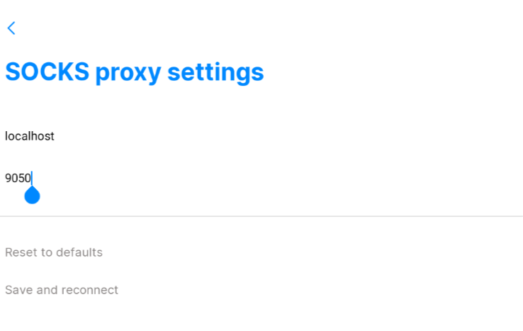
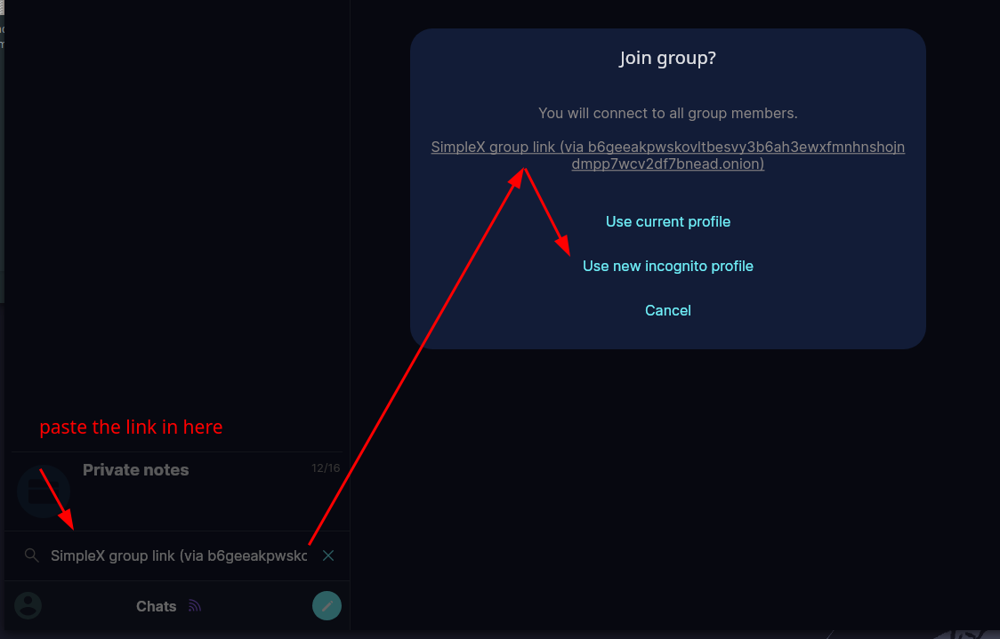

# Anonymity - Easy Anonymous Chats Using SimpleX 

```
TLDR: you can chat anonymously by configuring SimpleX to only connect through Tor to onion SMP and XFTP servers.
```


In this tutorial we're going to see how to setup a chat application for Anonymous use. This is especially important in a world where mass-surveillance is nearly-omnipresent. It has become the end users' responsibility to uphold their privacy and anonymity while communicating online.


## **Choosing the most appropriate chat application**

In order to choose the most appropriate messaging app for our intended use (Anonymity), we have the following requirements:

_Privacy:_

  1. The application must be free and open source (FOSS)

  2. The application must have End to End Encryption by default (E2EE)

  3. The application must allow us to run and use our own servers (Decentralization)


_Anonymity:_

  1. The application must support Tor .onion servers out of the box

  2. The application must allow you to chat without requiring any information (no emails, no usernames, no phone numbers)

  3. The application must have the ability for us to join chatrooms without revealing our identity (Incognito Mode)


_Deniability:_

  1. The application must have disappearing messages (Deniability)


You'd be surprised to see that as of right now (November 2024) there is only SimpleX that actually fits all of these criteria. therefore that's what we'll use for Anonymous chats.

## _Mobile OPSEC Recommendations:_

  1. Hardware : Google Pixel Phone

  2. Host OS: [GrapheneOS](../graphene/index.md)

  3. Graphene Profile: Anonymous Use 

  4. Applications: Orbot and SimpleX 


## _Desktop OPSEC Recommendations:_

  1. Hardware : (Personal Computer / Laptop)

  2. Host OS: [Linux](../linux/index.md)

  3. Hypervisor: [libvirtd QEMU/KVM](../hypervisorsetup/index.md)

  4. Virtual Machine: [Linux](../hypervisorsetup/index.md) or [Whonix](../whonixqemuvms/index.md) or [Tails](../tailsqemuvm/index.md)

  5. Application: Tor (if not on Whonix or Tails), and SimpleX 


We will be going through how to set up your own SimpleX server through Tor, and how to configure your Android client to route your traffic through it.

## **How to Set Up Anonymous Chats**

### **Step 1. Option A: GNU/Linux**

First, update your package list and install Tor by running the following commands in your terminal:
    
    
    sudo apt update
    sudo apt install tor

Once installed, start the Tor service:
    
    
    sudo systemctl start tor@default

Next you'll need to download SimpleX AppImage which can be [found here on SimpleX website](https://simplex.chat/downloads/).

Open a terminal in the directory of your downloaded AppImage. Make the AppImage executable, then launch it:
    
    
    [ mainpc ] [ /dev/pts/26 ] [~]
    → chmod +x simplex-desktop-x86_64.AppImage
    
    [ mainpc ] [ /dev/pts/26 ] [~]
    → ./simplex-desktop-x86_64.AppImage
    
    

### **Step 1. Option B: Android**

Download and install the Orbot .apk from [the GitHub repository](https://github.com/guardianproject/orbot/releases).


Open Orbot, and in the bottom-right corner, tap on **More** , then **Settings** to enter the settings.

In the settings menu, scroll down and enable the **Power User Mode**.

After enabling Power User Mode, go back to the More section and press **Choose apps** and select SimpleX in the list. Go back to **Connect** in the bottom navigation menu and press **Connect**.


Download and install [SimpleX using F-Droid](https://f-droid.org/packages/chat.simplex.app/)


### **Step 2.**

Navigate through the setup process, select your username, and press Create. The screenshots showcase the process for Android, but the steps are identical for Linux/GNU as well.


Once you've created your profile, open the kebab menu on the bottom left and open **Settings > Network and servers** and activate SOCKS Proxy. Press **SOCKS proxy settings** and set your port to 9050, then save.

 


**To learn how to create your own onion-only SimpleX SMP and XFTP servers, please refer to [this tutorial](../anonsimplex-server/index.md)**




### **You have now successfully configured SimpleX to use Tor!**


## **How to Join Chatrooms in Incognito mode**

If you have received an invite to a SimpleX chatroom, you can join it by pressing the input field at the bottom of the screen labeled **Search or paste SimpleX link**.

Paste your invite link into the input field and press **Enter**.



You will be met with a window asking whether you'd like to connect using your current profile or using an Incognito profile.

Select **Use new incognito profile**. 

This is because we don't want to reveal what our simplex username is, we just want to join the chatroom using a random username that is not tied to our identity.


And there as you can see, everyone that joins in in incognito gets a random pseudonym with the format "Random Adjective Random Word" effectively helping the users maintain their anonymity while in the chat.


## **Conclusion**

By following this tutorial, you've set up a secure, anonymous chat system using SimpleX and Tor.You've learned how to install Orbot, joined incognito chatrooms anonymously. This setup ensures that your private conversations remain secure and untraceable.

### **What You've Accomplished**

- Installed Orbot and routed traffic through the Tor network.  
- joined anonymous chatrooms in incognito mode.

