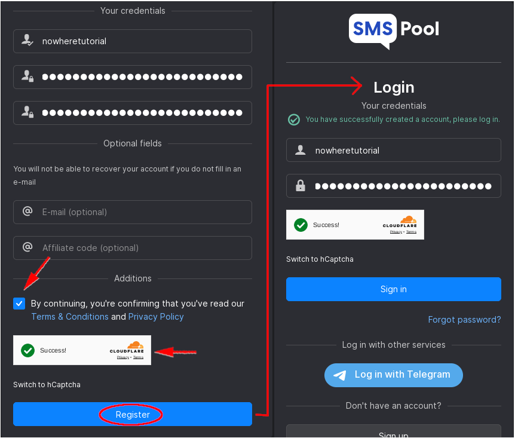
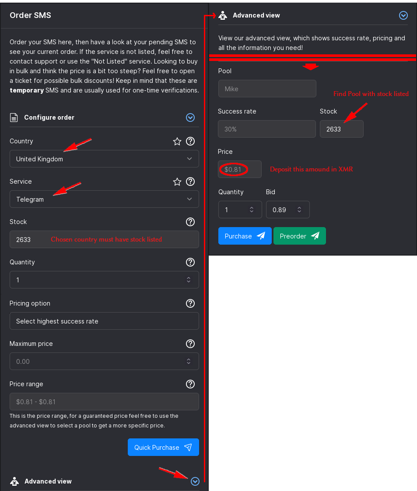

# How to Receive Anonymous SMSes (Remote SMSes as a Service)

```
TLDR: you can recieve SMSes anonymously by using non-KYC SMS SaaS services.
```


## **Introduction**

Many services ask for your phone number when signing up to perform SMS verification. This is undesirable for many reasons, including the possible sharing of your information with third parties, exposure during data leaks, and correlating social demographics for further surveillance. To get around this we need a way to receive SMS messages anonymous in order to sign up for our desired services. While you may get lucky and be able to get around the phone number requirement with various free online services that receive SMSes, it is generally not a reliable solution because many of the phone numbers provided are already taken, blocked or incompatible due to their VoIP infrastructure. In this article we will explore **SMSpool: a cheap, non-KYC, non-VoIP phone service provider that accepts crypto payments.** Specifically, we will explore how to receive a one-time SMS code to sign up for a Telegram account anonymously. 

## **Setup**

Using the Tor browser, navigate to smspool.net. You may be automatically redirected to an onion address: 

Register a unique username and password. Accept the Terms & Conditions, verify you are human and click Register. Then simply log in. 

We will need to get a sense of prices to know how much this is going to cost. On the left sidebar, click on Order and select your desired country and service. We'll go with a United Kingdom phone number for Telegram. Scroll down and click on Advanced view to see more detailed information. Scroll down some more and find a Pool that has stock listed. In this case, the Mike Pool has plenty of stock and a listed price of $0.81. We will need to deposit this amount of XMR into our account. Note: the listed success rate is not very reliable and while 30% may seem low, there is actually no penalty for failed attempts since orders purchased that do not receive an SMS in the allotted timeframe are automatically refunded. 

The next step is funding your account. On the left panel, click on Deposit. Select Cryptocurrency, leave your country set to Other, and finally select XMR. SMSpool will output a newly generated XMR address which you can use to fund your account either by copy/pasta or by scanning the QR code. 

Using DuckDuckGo, we calculate $0.81 to be 0.00532927 XMR. We populate the required fields in our Monero Wallet and send the transaction, leaving the default transaction priority. Once the transaction is sent and has received around 10 on-chain confirmations, you will receive a notification on SMSpool that your funds are received. 

With your account funded, it's time to purchase a one-time-use SMS verification. Proceed in the same way you did when checking prices and click Purchase on the Mike Pool option under the Advanced view. 

  1. You will now see a phone number generated onscreen under the Pending SMS section
  2. Enter this number in your phone Telegram app
  3. Proceed to the next screen on Telegram
  4. You should now receive an SMS code in the Pending SMS section on SMSpool
  5. Enter the SMS code into Telegram


## **Conclusion**

Simply complete the remaining steps onscreen and voilà! If prompted for an email address, alias addresses from SimpleLogin will do the trick despite the onscreen warning from SMSpool about disposable email addresses not working. SMSpool doesn't reuse phone numbers for the same service so the number you purchased for Telegram will not be resold to anyone else signing up for Telegram. They also do not rotate phone numbers after a period of time has passed. However, it is possible that upstream carriers may recycle numbers after some 6 months and this is something that SMSpool does not have control over. [Sauce](https://files.catbox.moe/i9xqzc.png) 

