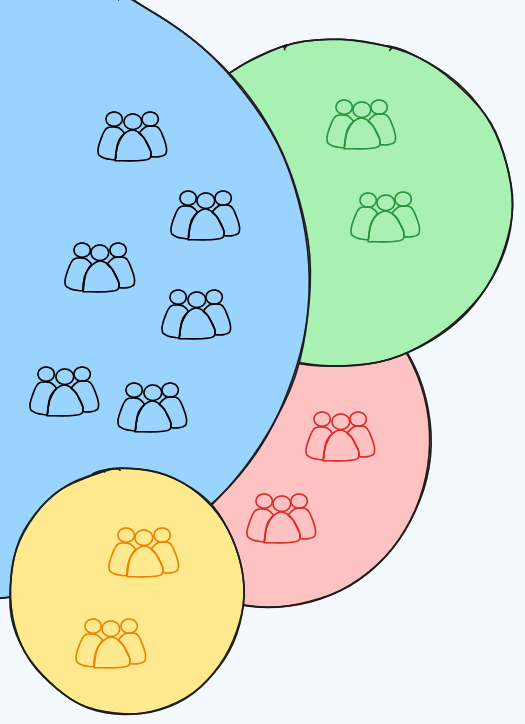

# What is Anonymity ? Why is it Important ? 

```
TLDR: Anonymity is what you need to be able to act online without repercussions.
```

## **What is Anonymity ?**

Anonymity is the absence of Identification (or Onymity), **it is when individuals are indistinguishable from each other, they all look the same.**


In short, **Anonymity means you are not identified.** In this example, Someone hid their identity, and is talking to Alice. That someone is anonymous until Jack can figure out who that person is. 

Anonymity is extremely fragile when that Someone is not implementing strict [OPSEC](../opsec/index.md) practices, relating to:

  1. _Using the correct Technology_ : (What is that Someone using, to protect their Anonymity ? (A mask, a Coat, a mask / the Tor network, i2p, etc))

  2. _Using the correct Behavior_ : (By that Someone's actions, they are not revealing who they are. (They are not saying they are Walter Hartwell White living at XYZ)


_DISCLAIMER:_ That Someone remains Anonymous **UNTIL THEY MAKE ONE OPSEC MISTAKE !**

Keep in mind that maintaining Anonymity is a much stricter practice than that of maintaining Privacy, as you will see, more threat vectors come into the picture.

## **Anonymous Amongst Who ? What are the odds ?**

**The strength of your Anonymity is measured by the odds of finding you amongst a group of people.**

 \- Anonymity

let's say your Anonymity is Perfect and you are simply **"one human being in the world"** , the adversary currently has a chance of **1 out of 8 billion** to guess that it is you. He'd do better to try and play the lottery than to try and guess that it's you.


Now let's say the adversary knows that you live in France what are the odds now ?


**If the adversary knows you live in France** , the odds have been significantly reduced from 1 out of 8 billion to **1 out of 65 million** , but still that's not enough to accurately pinpoint you, the probability of the adversary figuring out who you are is still very low.

 \- Pseudonymity

But now let's say that the adversary knows more than that, let's suppose that **the adversary knows that you have a masters in cybersecurity, and that you work a general IT job in France, for a software company.** Now the odds have shrinked further, especially if the adversary is able to combine multiple sources of data to try and profile you.


Let's say you are trying to chat on [SimpleX](../anonsimplex/index.md) while the adversary is in the chat with you, and he sees that you have a [gorillaz profile picture](https://www.youtube.com/watch?v=S03T47hapAc), call yourself Nihilist, and talk about Opsec all the time. If the adversary is good at profiling you over time, he could have already shrinked down the odds to **1 out of 10 thousand** people. Here we're talking about a drastically reduced anonymity, **which we can consider to be pseudonymity.** but that is still not enough to know who you are IRL.

 \- Onymity

But you need to be aware that even the tiniest opsec mistake can reduce the odds of your anonymity to **1 out of 1** , where you are effectively deanonymized. For instance let's say you are in this [SimpleX chatroom ](https://simplex.chat/contact#/?v=2-7&smp=smp%3A%2F%2FL5jrGV2L_Bb20Oj0aE4Gn-m5AHet9XdpYDotiqpcpGc%3D%40nowhere.moe%2FWdXMbz3Yq9baXgQVKy2EppUm0NCcYluM%23%2F%3Fv%3D1-3%26dh%3DMCowBQYDK2VuAyEAtVlfehjn5VhPIhDI_ses2kw3itcjMpLMvLlUFejMNlU%253D&data=%7B%22type%22%3A%22group%22%2C%22groupLinkId%22%3A%22gUgzlCwi97y1rHaezDZcLg%3D%3D%22%7D), and let's say you are sending a picture of your own [limited edition MoneroChan fumo plushie](https://monerosupplies.com/product/monerochan-plush/):


Now the thing is, **there are only 100 of those plushies** out there, if the adversary is the seller of those monerochan plushies, your anonymity odds has been reduced to **1 out of 100** , that's because he knows to whom he sent those 100 plushies, meaning he now only has a group of 100 people to guess who you are from. But upon closer exception it is worse than you may think:


If you look closer at the image the "Certificate of authenticity" says that **it is the 41st plushie amongst the 100 that exist**. Therefore if the adversary is the plushie seller, **your anonymity odds have been reduced 1 out of 1 as he knows to whom he sent the 41st plushie.** Meaning that you just deanonymized yourself for that particular adversary. 

You get the idea, if you want to remain Anonymous, you need to always ask yourself **"how many people could send that?"** , _if you were to send that picture i sent above, you'd realize that this is a bad idea_. The same concept applies as if you were to say what is your real IRL name, your phone number, your home address, your home public IP address, etc. **Do not give bullets to an adversary, as he will use everything you give him to shoot you.**

The least info you send about yourself, what you like, what you dislike, where you live, where you work, what's your past, the better, as otherwise it will be exponentially easier for an adversary to narrow down the possibilities of who you could be, amongst a given group of people.

A question arises, how can we quantify how anonymous we are? When there are adversaries after you and important things to protect, this is a very important issue to consider because, **if you can't measure anonymity or the weight of your decisions, how can you tell when you make large mistakes or can improve?**

We are going to use simple **Information Theory** for this, a field that deals with everything related to information and gives us a framework. By using "bits" to quantify information, we will have a way to calculate impact. 

## **Anonymity and Information**

In Information Theory, a "bit" is defined as **any information that reduces the space of possibilities by a factor of 2.** This definition may seem weird so an example helps display it clearly. 

Imagine I am a detective and I know one out of 16 suspects is the culprit. Assume there are 8 men and 8 women. 

Now, checking security cameras, I learn it was 100% a male by the figure size. With this piece of information, I can rule out the 8 women as suspects, leaving me with only 8 remaining suspects (the men). 

With that information, my suspects went from 16 —> 8, **it halved.** Therefore, the information that the culprit was male is **1 bit.**


This is a powerful concept since it allows us to **quantify the value and impact of any information and combine them.**

Let's make this clearer:   
  
You can be fully deanonymized with just ~33 bits of information since log2(8 billion) ≈ 33. If you half a group of 8 billion things 33 times, you will always be left with 1 singular item, which in this case would be your real identity. 

So in a game of anonymity, **your goal is to minimize the amount of bits you leak and your adversary's goal is to get as many bits as possible until they can brute force your true identity.**

(Note that it is impossible to leak 0 bits of information. This will be shown later, but you will always be interacting: your computer will be connected to a network which uses TCP/IP for packet routing which travels through underground cables, and so on, so information transfer will occur.) 

### Adversaries

  


Before we can get into specifics of our framework, we have to understand adversaries. They are **entities (individuals, companies, states) who are trying to deanonymize you.**

Our threat model and approach depends on the resources of the adversary. 

If your home (ISP) IP address is leaked, some guy on the internet may know what city you live in based on IP geolocation. Thats roughly, assuming a city population of 30,000, log2(8 billion/30000) ≈ 21.2 bits of information. A lot, yes, but as a regular person, it will be mostly infeasible to search the city for your identity, unless he had more information. 

However, let's say your adversary is a Nation State. They will simply subpoena the ISP who owns the IP address, obtaining your name, address, and payment details, all 33 bits collected. **When dealing with more resourceful adversaries, they are able to extract more with what they learn.**


  
As displayed in the diagram, strong adversaries have more opportunity and gain with the same information. 

Motives also vary between adversaries. Google, who let's say has been watching your search history and browser info, learns that you are in New York City, in your 20s, male, skii, and love cats. There will be very few people who meet this whole criteria, but Google obtains this information for advertisement targeting. 

### Information Leakage

  


Now that we understand information, let's briefly look at how we leak information and how identifiable it is.

_Activity Schedules:_ Over a long enough time period, any form of activity such as forum posts, account logins, tweets, and git commit will fall into a specific time zone. Depending on your location this can leak **roughly ~6-6.5 bits of information.**  
_Network/Browser:_ You will still be connecting to the internet and several parties (ISP, VPN, Website) get various fingerprintable info. This can leak **anywhere from ~2-10+ bits of information.**  
_Words:_ Your speech topics and patterns can provide insight into your age, interests, race, and professsion, leaking **anywhere from ~2-20+ bits of information.**

Without going into detail, your physical attributes, username, gait, and many other things leak information. However, the true power that the adversary has is **the combination of information.** They collect as many bits as possible since they can be **added together,** as mentioned previously.

Think of your adversary drawing circles to encompass each piece of information they have. Even from huge sample sizes, just ~16 bits narrows you down to a few thousand people extremely fast and when the adversary is a state, they can likely bruteforce to figure out the last few bits in that group.


  
  
As showcased before with the plushie, OPSEC failures often occur with drastic leakage of bits. Most information, even if not identifiable and simple, is highly usable and a single leak of something that contains 10+ bits of information could be enough. A few examples:

\- Mentioning that you were close to an real world event, narrowing you to a part of a country. (8+ bits)   
\- Giving clues to your ethnicity/languages AND real world location. (12+ bits)   
\- Logging into a personal account at the same time as an anonymous forum account with the same IP. (20+ bits). 

**Seemingly mundane information transfer is highly compromising when put together.**

So if we are constantly leaking information, what can we do? 

## **Anonymity in Practice**

  
There are two ways to maintain anonymity with bit leakage in mind: **Being in opaque, identical groups and misdirection.**

### Identical Groups

  


One of the core ideas of anonymity, as mentioned earlier, is that everyone should appear the exact same. But why?

We can see that the thing that makes bit leakage very dangerous is the combination of them. If an adversary figures out three details about you, even if they are found independently and are vague, when put together, the group size becomes incredibly small. Now, can we stop them from combining the information? 

This is where the idea of being in **identical groups** comes in. 

For an adversary to reliably combine informational bits, the groups (circles in the diagram) have to be transparent. For example, if an adversary knows that you are male and in Germany, then they can put those together without problem since [Male in Germany] is **distinct.**

Now let's say instead your adversary knows you use [TOR](../torvsvpns/index.md) and live in Germany. Independently, these are ~12 bits and ~6.6 bits of information. But there's an issue for the adversary. The group of TOR users is opaque, **every single one looks the same.** You cannot distinguish a German TOR user from a TOR user, **therefore these two pieces of information cannot be combined.**

Let's look at this in our previous circle view:




  
In the left image, although there are 4 groups, everyone person inside of a group looks the same. Overlapping regions can't be seen or analyzed and information can't be combined. **The only thing an adversary can know is that you are somewhere in each of the circles independently.**

However, in the right image, the groups are transparent and people are distinct. You can see the people in each overlapping and, with the combined information that you are part of all four groups, they can easily deanonymize you in the very small overlapping. 

So, by using tools ([TOR](../torvsvpns/index.md) , [XMR](../truecrypto/index.md), etc) where every user is identical and non-identifiable, we are not only minimizing bit leakage but also **making most leaked bits unusable** , significantly decreasing deanonymization risk.

It's recommended to be of roughly aware of how many bits you have leaked in an anonymous persona in order to maintain anonymity. We can take advantage of bit leakage by providing **false information which may mislead an adversary.**

To change things like speech, you can use [local LLMs](../stylometry/index.md) and perhaps give fake data about location, skillset, and other idenifiable information. If an adversary combines the incorrect bits with real information, they may be looking for you in a completely wrong group/area. 

**Awareness** is crucial: **knowing what your adversary might know, actively minimizing bit leakage, and staying in identical, non-identifiable groups** are all important. 

## **The Enemies of Anonymity: Surveillance, KYC procedures and Centralisation**

 The first the and foremost enemy of Anonymity is Surveillance of any kind. **Privacy is a REQUIREMENT if you want Anonymity**.
    
    
    Example: 
    
    Jack is surveilling Bob 24/7. He sees that Bob purchases a mask and a coat, He sees that Bob wears the mask to then go outside to do something sketchy.
    	
    Conclusion:
    
    Because Bob did not have Privacy from Jack in the first place, Bob cannot have Anonymity either.
    
    

Surveillance CANNOT be tolerated when you want Anonymity. So before you try to learn to be anonymous online, learn why and how to get Privacy online [here](../privacy/index.md). 

The other major enemy of Anonymity is **Know Your Customer (KYC) Procedures** , these are ways for services to force their customers to identify themselves, whether they like it or not.
    
    
    Example:
    
    Jack owns an online service (such as a centralised crypto exchange), he accumulated a large userbase over the years, over 1000 active users. The government where Jack operates is ramping up their financial regulations on businesses, and now Jack is being forced to identify all of it's users using standard KYC procedures
    
    Bob (an user on the website) that was anonymous up until that point, is now forced to do the following if he wants to keep using the platform:
    1) state his real life name
    2) his date of birth
    3) his home address
    4) send photos of his identity card
    5) send photos of his face (facial left, front and right sides)
    
    Conclusion:
    	
    Jack is either forced to identify his users or go out of business
    Bob is either forced to identify himself or stop using the service
    
    All of it because the government intends to destroy Bob's right to remain Anonymous online.
    
    

 But the root cause of surveillance and KYC procedures, is that **every centralised entity (any public or private business) will be eventually forced to comply to their government's requests** , at the expense of their users.

**There are only 2 possible long-term outcomes for Centralisation:**

  1. Act as a governmental proxy to enforce regulations/agendas, at the expense of users' rights

  2. Or be forced out of business altogether.


To be able to achieve Anonymity, you need Privacy, and at least some level of Decentralisation (in the case of anonymization networks like Tor for instance), as we will see in our next tutorials.

## **Why is Anonymity Important ?**

In a way, Anonymity is an improvement over Privacy. In the sense that Privacy is about being about to seclude yourself or information about yourself. **Anonymity is the logical next step to Privacy,** Where you not only just conceal what your actions are, **but also who you are.**

Depending on the context, especially if you are living in a dictatorship, **Anonymity is vital for you to act freely, out of the grasp of adversaries.**

As we have discussed [previously](../governments/index.md), for a government's laws to be respected, **they need to be enforced.**


And for the laws to be enforced, governments need:

  1. To know what happened (lack of Privacy, using Surveillance )

  2. To know who did it (lack of Anonymity, using KYC procedures )


Governmental control as a concept itself rests upon these fundamental 2 pillars, the detriment of the individual's Privacy, and Anonymity.

In order to regain the control you lost to dictatorships, you first need Privacy, and then you need Anonymity. 

Most governments want to control the public opinion through opression and censorship, **Journalism is one of the most demanding sectors in terms of Anonymity,** especially in authoritarian/dictatorship governments where censorship is omnipresent, for them, very sadly, Anonymity is the difference-maker between life and death in those areas of the world.

**Anonymity is the only way to act safely when you are living under a tyrannical government** that can throw you in jail for no reason whatsoever (look at the conviction rates, [especially in US Federal courts](https://www.pewresearch.org/short-reads/2023/06/14/fewer-than-1-of-defendants-in-federal-criminal-cases-were-acquitted-in-2022/) with their Plea deals).


For instance, the [Freedom of the Press index](https://rsf.org/en/index) is a great indicator to tell if you are living in a country that employs censorship as a means to control the population or not. Make no mistake, Governments are often ready to murder journalists to protect their public image, like in Mexico: [[1]](https://iv.nowhere.moe/watch?v=KfTZKtA3aWk) [[2]](https://iv.nowhere.moe/watch?v=xlLXkZlJBbA).

Essentially, **the idea is to reduce your attack surface as much as possible,** given the context of near-omnipresent surveillance, **Privacy has it's limits, and Anonymity very often becomes the only way out of opression.** If noone knows who did something, there can't be any repercussions for the perpetrating party. 

In a way, Anonymity is superior to Privacy because **whatever happened may have been hidden thanks to Privacy, but it may be discovered at a later point in time.** Anonymity on the other hand, if maintained, **remains a permanent way to act without any repercussions.**


