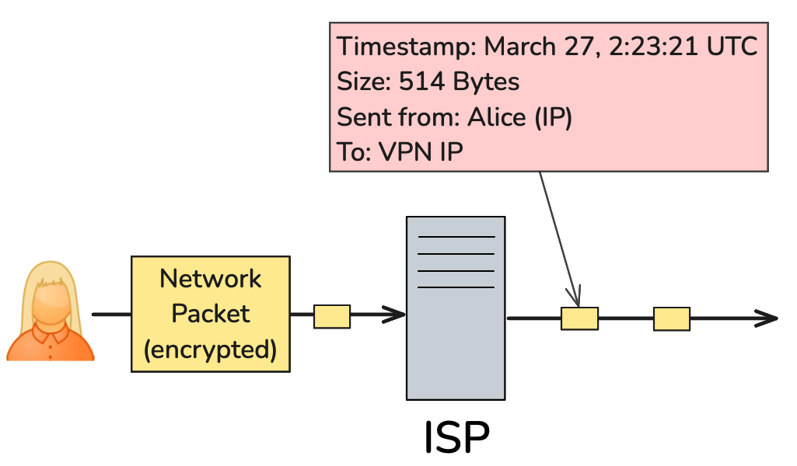
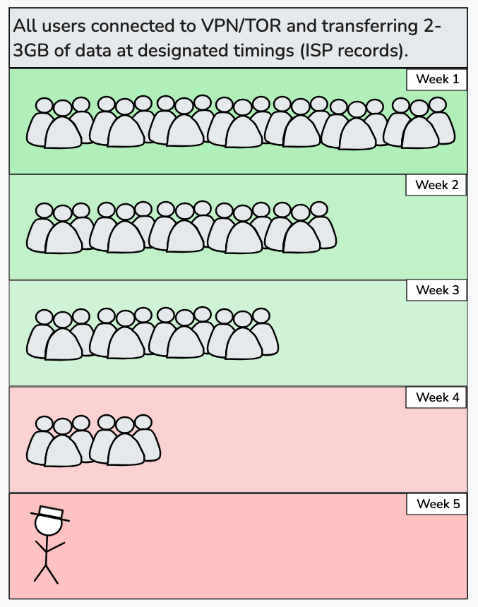

# Why is Metadata detrimental to Anonymity? 

```
TLDR: metadata is an often forgotten attack surface that can be used to deanonymize you, especially when sending photos, or documents
```

## **What is Metadata?**

Metadata is simply **data about data.** When you send a message, what you actually said, the content, is the data but all of the information such as:  
\- who you sent it to   
\- the time you sent it   
\- the size of the message   
\- where you sent it from, etc   
are the **metadata of that message.**

Even if the actual content is encrypted, **metadata reveals a significant amount of information about you and your activities.** Moreover, it cannot be avoided by nature of information transfer, **if you are using an application or conducting an activity, there will always be metadata.** (eg. You cannot send a message without a recipient.) 


  


We can better understand the threat it poses through a few examples. 

Let's say there is an adversary monitoring calls and cell towers.   
Using your phone, at your home you contact a friend to go to a store. When you arrive, you call once more to meetup, then shop for a little while, and lastly eat at a restaurant after ordering online. 

During this time, **the adversary did not see you or interact with you** and even the calls and website were encrypted. But they **collected metadata passively.**  
Here is a diagram that displays what occurred and what the adversary collected: 


  


Now the metadata is very brief, but since phone lines and locations are known, it becomes clear who did what and went where. **Even though they couldn't hear the calls,** because of the timings, call duration, and the location information, **the fact that its a meetup is obvious.**

**With just metadata, the adversary is able to determine where you went, what you did, and who you're connected to.** This is exactly why it's so dangerous: **a small amount can leak significant information and interaction isn't needed.**

Anonymity also crumbles very quickly. Let's say Alice posts on a forum at various times for months. 

When her **post timings are analyzed** , it reveals she's somewhere in the CET timezone from sleep schedules. Then, looking at **shadows, nature, and other data in an image she posted,** the location is narrowed to a specific city in France. Finally, with the **way she writes** on the forum, based on her references and slang, the adversary estimates she's in her 20s and works as an architect. 


  


With **file data and speech tendencies,** Alice's identity can be narrowed down to only **100-500 people** (26+ bits of information). No advanced deanonymization technique was used here, just **analysis of the attributes of her actions and activity.**

> "We kill people based on metadata."  
>   
>  \- Former Director of the NSA and CIA Michael Hayden 

Metadata has been **mass collected** for many years now by several nations and adversaries as revealed in things like the [Snowden leaks](https://en.wikipedia.org/wiki/2010s_global_surveillance_disclosures). It's easy to collect for nations since if you **control infrastructure** like ISPs and telecommunication, metadata will always be present and observable. 

In a more general sense, **the entire goal of the adversary is to find information that uniquely identifies you.**  
Metadata provides exactly that: If they know where you go, the groups you interact with, the timing of your activity, the way you speak, the things you look at, etc, **the adversary can creative a very identifying profile.**  
Even if each singular piece of metadata provides minor information, adversaries use it to form **associations** , connecting each one of those fragments to see an entire picture where your possible profile is narrowed.  
For more context on information and anonymity, [this tutorial](../anonymityexplained/index.md) is recommended as a prerequisite. 

We will will focus on understanding most major attack vectors for metadata collection and briefly cover simple mitigation. Having a clear picture of **where metadata leakage occurs and what leaks is crucial.**

It is useful to classify metadata in two types: 

\- **Application metadata:** any metadata from applications, like network data or browser information. 

\- **Behavioral metadata:** information that's leaked by your actions, such as activity schedules or speech tendencies. 


## **Application Metadata**

  


### Networks

  


No matter what tools you use, various parties will get bits of information from your **network activity** which, when aggregated or analyzed over time, can leak significant information or even deanonymize you. 

All internet data is transferred in **packets** , smaller bundles of data along with information such as how to route them. The ISPs, since the data flows through them, are able to see the **size, timing, and destination** of each packet even if the data is encrypted. Each website has a **unique pattern** of packets that are sent back and forth which can be identified with artificial intelligence, meaning that even if the data is encrypted, they are able to reasonably infer what sites you visited and when. 



  


[TOR](../torvsvpns/index.md) mitigates some of this by making all packets the same size, but the ISP is still able to see the **total amount of data transferred** and the **timing.**

Let's say that you connect to an anonymous forum account by going You->VPN->Tor->Website. You log in every Wednesday and Thursday between 4-6 P.M., post some comments and interact, and upload about 2GB of data. The ISP can see that you connected to a VPN and transferred 2GB of data between those times.  
If an adversary is trying to deanonymize the forum account, they will look for a **pattern in activity.** For access to the network metadata, they can ask all ISPs to monitor who connects to either a VPN/TOR at that time and uploads a similar amount of data.  
Let's see what a chart of this would look like: 



  


This is a very simple attack which only involves ISP metadata and note that in real scenarios, this is not done by hand but by artificial intelligence and with more variables and information.  
To avoid such analysis, [DAITA](https://mullvad.net/en/vpn/daita) (Defense Against AI-Guided Traffic Analysis) should be used which is covered in more detail in [this tutorial](../torthroughvpn/index.md). 

**Combining DAITA with generally not having highly predictable patterns makes network metadata difficult to use** and these attacks far harder. 

### Cell Towers

  


As simply displayed in the initial example, cell towers and telecommunications are one of the largest spots for metadata collection. Specifically: the exact **who, when, and where** of every call. Unlike networks or other platforms, the identity of every connected phone is known and location can be determined by cell tower triangulation. The metadata is enough to entirely deanonymize and map most actions and is explained in [this tutorial](../phonenumbers/index.md).   
Simply, **anonymity is not compatible with cell towers and they should be avoided entirely.**

###  Browsers

  


To operate and communicate with websites, **your web browser sends out various information that is unique and identifiable.**

A non-exhaustive list is as follows: 

  * User Agent Header: The user agent header is a header sent in all of your HTTP(S) requests and will be formed something like this:  
Mozilla/5.0 (X11; Linux x86_64; rv:134.0) Gecko/20100101 Firefox/134.0   
It identifies your:  
\- Operating system and version  
\- Browser and version  

  * DNS Provider
  * IP Address and Provider
  * Monitor Size in pixels (eg. 1920x1080)
  * Hardware Details (RAM, CPU Cores, etc)
  * Browser Window Size
  * Time Zone
  * Typing Speed
  * Yes or No for: JavaScript, Cookies, Adblockers, and more.


(Again, this is only a portion of what can potential be derived. You can visit [deviceinfo.me](https://deviceinfo.me) or [coveryourtracks.eff.org](https://coveryourtracks.eff.org) to see the full information.) 

Obviously for anonymity, this is terrible. If you log into an anonymous forum account with the same browser as you do a personal email account, **the browser profile will appear the same, effectively deanonymizing you if the information is combined.**  
Moreover, this also stops any form of persona separation because **all of your activity is uniquely tied to that browser footprint,** regardless of wheter you are logged in, what site you're on, or even if you're routing through TOR. 

Mitigation for this is quite straightforward: usage of the [Tor Browser ](../torvsvpns/index.md) since **every user is made to look the same.** Most of the identifying metadata mentioned before is not a threat since configuration is uniform across all users. 

However, metrics like typing speed, mouse patterns, operating system, and a few others will still be leaked, so when consistently visiting the same websites using the Tor Browser, **vary your activities** so the information is not usable. 

### File Data

  


All files come with metadata. Metadata is not necessarily bad, for example the directory where a file is stored will be listed in the metadata and certain metadata is required. However, some types of file metadata can entirely compromise anonymity. 

Most images taken by any camera **contain sensitive information like the device used, operating system, and even the exact GPS coordinates** of where the picture was taken in their **EXIF metadata.**

If these files are uploaded anywhere, **the party that receives the file could potentially pinpoint your exact location.**

Let's use an example: Say I have a sample image from an iPhone camera, called image.jpeg, taken at the Eiffel Tower.   
We can use an open source command line tool called **exiftool** to both **view and modify the metadata.**

Install it with: 
    
    
    ~$ sudo apt install exiftool

Now to view the metadata, all we have to do is run the following command: 
    
    
    $ exiftool path/to/your/file
    # In our example:
    $ exiftool image.jpeg
    
    ExifTool Version Number         : 13.00
    File Name                       : image.jpeg
    Directory                       : .
    File Size                       : 2.1 MB
    File Modification Date/Time     : 2025:01:23 12:34:22.832-00:00
    File Access Date/Time           : 2025:01:23 12:34:22.832-00:00
    File Inode Change Date/Time     : 2025:01:23 12:34:22.832-00:00
    File Permissions                : -rw-r--r--
    ...
    Make                            : Apple
    Camera Model Name               : iPhone 15
    ...
    Resolution Unit                 : inches
    Software                        : 18.2.1
    Modify Date                     : 2025:01:23 12:34:22
    Host Computer                   : iPhone 15
    ...
    Flash                           : Off, Did not fire
    Focal Length                    : 6.3mm
    ...
    Lens Make                       : Apple
    Lens Model                      : iPhone 15 back triple camera 6.3mm f/1.6
    ...
    GPS Latitude Ref                : North
    GPS Latitude                    : 48 deg 51' 29.6" N
    GPS Longitude Ref               : East
    GPS Longitude                   : 2 deg 17' 40.2" E
    GPS Altitude Ref                : 0
    GPS Altitude                    : 35 m
    GPS Time Stamp                  : 12:34:22
    GPS Date Stamp                  : 2025:01:23
    GPS Position                    : 48 deg 51' 29.6" N, 2 deg 17' 40.2"
    ...
    Date Created                    : 2025:01:23 12:34:22
    ...
    Device Manufacturer             : Apple Computer Inc.
    ...
    Image Size                      : 4032x3024
    ...
    Create Date                     : 2025:01:23 12:34:22.832-00:00
    Date/Time Original              : 2025:01:23 12:34:22.832-00:00
    Modify Date                     : 2025:01:23 12:34:22-00:00
    ...
    Lens ID                         : iPhone 15 back triple camera 6.3mm f/1.6
    
    # Note this is a sample output and may not be exactly the same.
    

(Only the identifying details are listed here and "..." represents where more attributes are listed since images come with a large amount of metadata.) 

As displayed, the EXIF data leaks significant information like location, device, and version. Even with GPS data off, **it can help form a profile on you.** Information of what device you are using can be valuable. 

Removing the metadata is very simple, we just have to run the following command: 
    
    
    $ exiftool -all= -overwrite_original /path/to/your/image
    # In our example:
    $ exiftool -all= -overwrite_original image.jpeg
    

Now running exiftool once more on the new file to see the metadata will only result in non-removable metadata which is not sensitive. 
    
    
    $ exiftool image.jpeg
    
    ExifTool Version Number         : 13.00
    File Name                       : image.jpeg
    Directory                       : .
    File Size                       : 2.1 MB
    File Modification Date/Time     : 2025:01:23 12:34:22.832-00:00
    File Access Date/Time           : 2025:01:23 12:34:22.832-00:00
    File Inode Change Date/Time     : 2025:01:23 12:34:22.832-00:00
    File Permissions                : -rw-r--r--
    File Type                       : JPEG
    ...
    # No sensitive metadata will be listed.
    

Metadata doesn't only exist in EXIF format in images, it can also be embedded in files like PDFs. 

Elsevier, the largest academic publisher, **embedded unique hashes in PDF metadata** for each [download](https://news.ycombinator.com/item?id=30082138), meaning that your copy was uniquely identifiable. If you downloaded a file like this and then shared it in your anonymous persona, you would instantly be deanonymized since **the specific copy ties back to your account only.** Using the same exiftool commands as before will remove this metadata as well. 


  


Similar identifying methods may be in other files or from general content and it is advised to use plaintext and thoroughly **remove all metadata before uploading anything.**

### Image Geolocation

  


An image of the real world contains a significant amount of data such as the buildings in it or the lighting. Figuring out where a picture was taken is a rather popular activity in everything from OSINT to GeoGuessr. 

A few techniques are using [shadows](https://www.bellingcat.com/resources/2021/05/18/unsure-when-a-video-or-photo-was-taken-how-to-tell-by-measuring-the-length-of-shadows) to determine timing, [perspective](https://www.bellingcat.com/resources/2023/09/07/measuring-up-how-to-calculate-the-size-of-objects-in-open-source-material) to determine distance, [bruteforcing](https://www.youtube.com/watch?v=cMsaj4SSwCw) after reducing search space, and looking at nature or other details to determine location. Usually bits of information that have already been leaked, like timezones or regions, are used to know where to search and then geospatial analysis is done, both by artificial intelligence and by hand. 

Essentially, nearly every location has identifiable features and most images can be traced very close to their origin. It's safest to **not post images** when conducting anonymity-critical activities. 

## **Behavioral Metadata**

  


Behavioral metadata functions differently in that it will be present with any interaction. The way we do something will indicate some information regardless of what application we're using. You can't speak English visibly while hiding the fact you speak English. This makes metadata threats more unique but we can still control it by managing our actions more carefully. 

### Activity Schedules

  


**Every action** we do in an anonymous persona will have **a specific time metadata paired with it** \- The "When?" question. 

This applies to forum posts, account logins, git commits, tweets, and any form of interaction. Using all of this collected metadata, a graph can be created. 

Here is one for Satoshi Nakamoto by the chainbulletin, where each red dot is an activity (forum posts, git commits, etc) at the day and time. 


  


Most people have **a waking time of roughly 8AM-12PM, hence it is very likely that a person lives in the timezone where that lines up.** If their activity always took place at night, they would have to be entirely nocturnal over a long period which is very improbable. 

To apply our logic and analyze the data, we can shift the timings and graph into all other major time zones: 


  


Now, since the activity would be at night, we can **rule out** all of Asia and Australia. The only time zones where the waking time seems reasonable are PT, ET, and GMT, where most of his activity is done in the 8AM-12PM range and **a clear, natural sleep schedule at night is displayed.**   
By plotting **timing metadata only,** without including any actual data or other conclusions, **roughly 3 bits of information is reliably leaked.**

It is very difficult to conceal activity schedules and they **will emerge over a long enough time period.** Its danger comes from **providing confirmation of other analysis** or debunking misdirections:  
If you're trying to make your persona appear to be in France but your activity schedules line up with Asia, your misdirection will fail. Hence, it is important **be aware that your region may be known for decision making.**

### Speech

  


Our writing and speech are **uniquely identifiable** and often contain details about us. **Who you are, your interests and skills, even the content you consume,** all of it can be **signaled** in your wording and interpreted with **stylometry** (statistical analysis of writing).  
More specifically, the **way we speak and write** , such as word choice, slang, grammar, references, speech quirks, and more all **leak information.**

Let's look at a few examples: 

\- If your forum posts have certain **slang,** an adversary can **estimate your age** , which can be 2-3 bits of information.   
\- If your writing is consistently highly technical and includes references and wording central to a specific field, the adversary can roughly guess **your profession, level of knowledge, and skills,** which could be 10+ bits of information.   
\- **Metaphors** and **word choice** , or speaking in multiple languages can reveal **ethnicity, location, or content you've read.**   


  


Using Satoshi Nakamoto as an example again, one of the most discussed things about his identity are his speech forms: specifically his use of British English and always double spacing after each period, something mostly done by those who learned to type much earlier or on a typewriter. **Two very simple pieces of writing metadata give clues to his age and ethnicity.**

When paired with other information on you, the way you speak can easily leak 20+ bits of information. 

The best mitigation is the use of [local llms](../stylometry/index.md) to **change your writing styles and remove your unique tendencies.** With consistent rewording, identifiable traits in your writing metadata will be much harder to find. Generally, **caution should also be practiced,** such as **not using references or topics that could give clues to your identity.**

### Physical Attributes

Your physical profile is very unique and could be used by an adversary depending on what information they have. If an adversary knows what you look like and your region or city, depending on their resources, they may be able to bruteforce to find your identity. For example, its easier much easier to find someone if you know their height and hair color along with their main profile. It usually only leaks through writing or speech and can be avoided by **not discussing or referencing physical attributes.**

### Social Maps

  


**Who you interact with** is one of the most collected pieces of behavioral metadata by adversaries and is extremely usable. From cell tower call records to IP addresses, finding who talked to who is consistently logged. Even most messaging apps, despite employing encryption, leak metadata of who talks to who. 

When an adversary learns who you're connected to, **all information about the connected individual is now relevant to profiling you.** Here is a simple example: 

Seeing that you've communicated with Alice publicly before, the adversary begins investigating her. They find a public forum and then find your account with the same anonymous persona on the forum, giving them more data (your forum posts) for deanonymization.  
Since it's now clear you and Alice share interests, they look further and, from the way she speaks, estimate her age and profession and use that information to narrow your profile. 


  


Another example would be if an adversary finds everyone you speak to works in a specific profession or shares an attribute, there's a high likelihood you also share that attribute. 

Usually these statistical analyses are done algorithmically and on much large populations where a lot of connections occur. Instead of one platform and two people like in the example, it could be hundreds of times larger.  
When a distinct connection is discovered by an adversary, **it provides a direction to look for you in.**

This is also another reason [usage/persona isolation](../internetsegmentation/index.md) is needed since any metadata or communication that connects both profiles together may compromise anonymity if the information on each profile is combined. 

Mitigation for this is mostly using the right programs like [SimpleX](../anonsimplex/index.md) where metadata is not usable and taking caution with any communication done in an anonymous persona. 

## **Conclusion**

  


Metadata's impact on anonymity is focused on creating a **profile** over a long enough period, using bits of leaked information from applications and behavior to statistically narrow your identity. However, if we can observe where most metadata leaks, minimizing it is straightforward. 

The amount of usable metadata leaked can be drastically reduced by using the **right applications and taking precaution in each action.** With controlled and minimal metadata leakage, metadata-based deanonymization becomes much harder for adversaries. 

