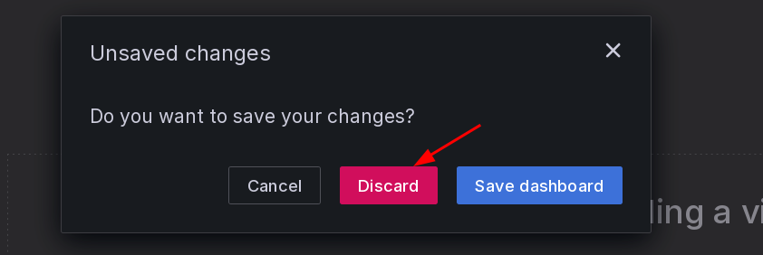

# Anonymous Server Monitoring (Grafana, Prometheus, Node-exporter) 

```
TLDR: you can monitor servers while maintaining serverside anonymity
```

In this tutorial we're going to cover how you can monitor the resource consumption of your remote servers while maintaining your anonymity, using Grafana, Prometheus, and node exporter.


## **What is the targeted setup?**


In this setup, we have 3 servers. Server A is going to monitor Server B and C.


Server A is going to have the following 3 services:
    
    
    -Grafana: to display the data retrieved by prometheus
    -Prometheus: to retrieve the data served by the node-exporters
    -node-exporter: to serve the server resource usage data (ex: CPU consumption, RAM consumption, etc)
    	
    

Server B and C are going to have the node-exporter service on them, and thanks to it Server A's prometheus service is going to be able to monitor their resource consumption.

Now the added complexity that we have to navigate in this tutorial is that **each server can only be reached by their own .onion hostnames.** we cannot query them via their IPs directly because otherwise we'd reveal the origin and destination of the servers. Hence in this tutorial we're going to maintain the Serverside anonymity.

## **Server A setup (Grafana, Prometheus, Node-exporter)**

Server A needs to have docker installed according to [this tutorial](../docker-intro/index.md#installation).

Next we create the desired docker compose stack:

    [ Wonderland ] [ /dev/pts/22 ] [/srv/]
    → mkdir /srv/grafana ; cd /srv/grafana
    
    [ Wonderland ] [ /dev/pts/22 ] [/srv/]
    → vim docker-compose.yml


Then, we need to have the following `docker-compose.yml`:
    
    
    [ Wonderland ] [ /dev/pts/19 ] [/srv/grafana]
    → cat docker-compose.yml
    
    networks:
      tor-monitoring:
        driver: bridge
        ipam:
          config:
            - subnet: 10.16.0.0/24
              gateway: 10.16.0.1
    
    services:
      grafana:
        image: grafana/grafana-enterprise:latest
        container_name: grafana
        restart: unless-stopped
        ports:
         - '127.0.0.1:3222:3000'
        volumes:
          - grafana-data:/var/lib/grafana
        environment:
          GF_INSTALL_PLUGINS: "grafana-clock-panel,grafana-simple-json-datasource,grafana-worldmap-panel,grafana-piechart-panel"
        networks:
          tor-monitoring:
            ipv4_address: 10.16.0.5
    
      prometheus:
        image: prom/prometheus:latest
        volumes:
          - ./prometheus/:/etc/prometheus/
          - prometheus_data:/prometheus
        command:
          - '--config.file=/etc/prometheus/prometheus.yml'
          - '--storage.tsdb.path=/prometheus'
          - '--web.console.libraries=/usr/share/prometheus/console_libraries'
          - '--web.console.templates=/usr/share/prometheus/consoles'
        networks:
          tor-monitoring:
            ipv4_address: 10.16.0.4
        restart: always
    
      tor:
        image: osminogin/tor-simple
        container_name: tormonitoring
        volumes:
          - ./tor-data:/var/lib/tor
          - ./tor-data/torrc:/etc/tor
        networks:
          tor-monitoring:
            ipv4_address: 10.16.0.3
    
    volumes:
        prometheus_data: {}
        grafana-data: {}
    	
    

From there, you can already pull the containers and activate them:
    
    
    [ Wonderland ] [ /dev/pts/19 ] [/srv/grafana]
    → docker compose pull ; docker compose up -d
    
    

It's going to first pull the containers and then activate them, but we need to do some changes first to ensure that the tor container works as intended:
    
    
    [ Wonderland ] [ /dev/pts/19 ] [/srv/grafana]
    → docker compose down
    	
    [ Wonderland ] [ /dev/pts/19 ] [/srv/grafana]
    → vim tor-data/torrc/torrc
    
    [ Wonderland ] [ /dev/pts/19 ] [/srv/grafana]
    → cat tor-data/torrc/torrc
    SOCKSPort 0.0.0.0:9050
    
    [ Wonderland ] [ /dev/pts/19 ] [/srv/grafana]
    → chown -R 100:65533 tor-data/
    
    

then we also configure prometheus to scrape the destination servers:
    
    
    [ Wonderland ] [ /dev/pts/19 ] [/srv/grafana]
    → vim prometheus/prometheus.yml
    
    [ Wonderland ] [ /dev/pts/19 ] [/srv/grafana]
    → cat prometheus/prometheus.yml
    global:
      scrape_interval:     15s # By default, scrape targets every 15 seconds.
      external_labels:
        monitor: 'datura-monitor'
    
    scrape_configs:
      - job_name: 'wonderland'
        scrape_interval: 5s
        proxy_url: socks5h://10.16.0.3:9050
        static_configs:
        - labels: {}
          targets:
          - serverAjezfoltodf4jiyl6r56jnzintap5vyjlia7fkirfsnfizflqd.onion:9100
          - serverBjezfoltodf4jiyl6r56jnzintap5vyjlia7fkirfsnfizflqd.onion:9100
          - serverCjezfoltodf4jiyl6r56jnzintap5vyjlia7fkirfsnfizflqd.onion:9100
        basic_auth:
          username: 'admin'
          password: 'P@SSW0RD'
    	
    

And then we can re-activate the containers:
    
    
    [ Wonderland ] [ /dev/pts/19 ] [/srv/grafana]
    → docker compose up -d
    	
    

once done, we can configure the nginx reverse proxy to make sure that we can access our grafana instance:
    
    
    [ Wonderland ] [ /dev/pts/19 ] [/srv/grafana]
    → vim /etc/nginx/sites-available/monitoring
    
    [ Wonderland ] [ /dev/pts/19 ] [/srv/grafana]
    → cat /etc/nginx/sites-available/monitoring
    upstream monitoringend {
            server 127.0.0.1:3222;
            #server 10.8.0.2:3009;
    }
    
    
    server {
            listen 4443;
            listen [::]:4443;
            server_name monitoring.nowherejezfoltodf4jiyl6r56jnzintap5vyjlia7fkirfsnfizflqd.onion;
    
            location / {
                                    proxy_set_header Host $http_host;
                    proxy_pass http://monitoringend;
                    proxy_http_version 1.1;
                    proxy_set_header Upgrade $http_upgrade;
                    proxy_set_header Connection "Upgrade";
                    #client_max_body_size 1G;
            }
    }
    
    [ Wonderland ] [ /dev/pts/19 ] [/srv/grafana]
    → ln -s /etc/nginx/sites-available/monitoring /etc/nginx/sites-enabled/
    
    [ Wonderland ] [ /dev/pts/19 ] [/srv/grafana]
    → nginx -t
    nginx: the configuration file /etc/nginx/nginx.conf syntax is ok
    nginx: configuration file /etc/nginx/nginx.conf test is successful
    
    [ Wonderland ] [ /dev/pts/19 ] [/srv/grafana]
    → systemctl restart nginx
    
    

## **Configuring Grafana**

Next, we can access our grafana instance to create the admin account and login:


Once logged in we make sure that our grafana instance uses our prometheus instance as a datasource:

  

here we mention the local IP of the prometheus container, being 10.16.0.4, with the service accessible on port 9090:

 

Then, we import a dashboard to make sure that we can visualize the data we are monitoring, out of which i recommend the excellent ["Node Exporter Full"](https://grafana.com/grafana/dashboards/1860-node-exporter-full/) dashboard (whose ID is 1860) 

    

There, the dashboard is imported, but there's no data to be seen yet because we didn't configure the node-exporter daemons on the servers that we want to monitor.

## **Configuring node-exporter on the remote servers**

Next, we're going to configure node-exporter on the servers that we want to monitor:
    
    
    [ Wonderland ] [ /dev/pts/19 ] [/srv/node-exporter]
    → cat docker-compose.yml
    version: '3.7'
    
    services:
    
      node-exporter:
        container_name: node-exporter
        image: quay.io/prometheus/node-exporter:latest
        #command:
          #- '--path.rootfs=/host'
        network_mode: host
        pid: host
        volumes:
          - /proc:/host/proc:ro
          - /sys:/host/sys:ro
          - /:/rootfs:ro
          - /:/host:ro,rslave
          - ./web.yml:/etc/prometheus/web.yml
        command:
          - '--path.rootfs=/host'
          - '--path.procfs=/host/proc'
          - '--path.sysfs=/host/sys'
          - --collector.filesystem.ignored-mount-points
          - "^/(sys|proc|dev|host|etc|rootfs/var/lib/docker/containers|rootfs/var/lib/docker/overlay2|rootfs/run/docker/netns|rootfs/var/lib/docker/aufs)($$|/)"
          - "--web.config.file=/etc/prometheus/web.yml"
        restart: always
        deploy:
          mode: global
    
    

Now that docker-compose.yml is written, we need to write a small python script to hash the basicauth password:
    
    
    [ Wonderland ] [ /dev/pts/19 ] [/srv/node-exporter]
    → vim gen-pass.py
    
    [ Wonderland ] [ /dev/pts/19 ] [/srv/node-exporter]
    → cat gen-pass.py
    import getpass
    import bcrypt
    
    #sudo apt install python3-bcrypt
    
    password = getpass.getpass("password: ")
    hashed_password = bcrypt.hashpw(password.encode("utf-8"), bcrypt.gensalt())
    print(hashed_password.decode())
    
    [ Wonderland ] [ /dev/pts/19 ] [/srv/node-exporter]
    → sudo apt install python3-bcrypt -y
    
    [ Wonderland ] [ /dev/pts/19 ] [/srv/node-exporter]
    → python3 gen-pass.py
    password: P@SSW0RD
    $2b$12$AZg14Yp.hvDLk/iaYk9.ReqXyfonW94cwqzzxewZDWzTdAQZFo3zy
    
    

now with the hashed password, we can write the web.yml config file that the node exporter will use:
    
    
    [ Wonderland ] [ /dev/pts/19 ] [/srv/node-exporter]
    → vim web.yml
    
    [ Wonderland ] [ /dev/pts/19 ] [/srv/node-exporter]
    → cat web.yml
    basic_auth_users:
        admin: $2b$12$AZg14Yp.hvDLk/iaYk9.ReqXyfonW94cwqzzxewZDWzTdAQZFo3zy
    
    

And now finally we can pull the container image and activate it:
    
    
    [ Wonderland ] [ /dev/pts/19 ] [/srv/node-exporter]
    → docker compose pull ; docker compose up -d
    
    

Then we also make sure that the node-exporter port 9100 is accessible via the onion domain, as otherwise we can't access it while maintaining the serverside anonymity: 
    
    
    [ Wonderland ] [ /dev/pts/19 ] [/srv/node-exporter]
    → cat /etc/tor/torrc | grep 9100
    HiddenServicePort 9100 127.0.0.1:9100
    
    [ Wonderland ] [ /dev/pts/19 ] [/srv/node-exporter]
    → systemctl restart tor@default
    
    

And now from there the server should be monitored as intended.

## **Visualizing the result**

Now that the remote server's node-exporter is reachable via it's onion domain, we can see that the resource usage started to appear in the dashboard that we setup earlier:


In this case, in the event of the remote server being seized, the adversary would only be able to see that it has been queried to from a tor exit node IP. This is to make sure that your anonymous infrastructure is able to sustain having each of it's individual servers being taken down, as long as they are not all taken down at once.

And that's it ! We can now monitor our own remote servers, while maintaining serverside anonymity at the same time. 

