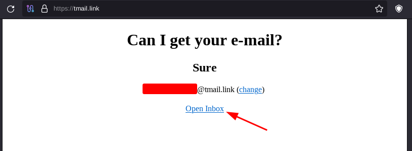
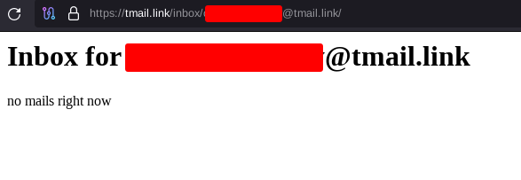
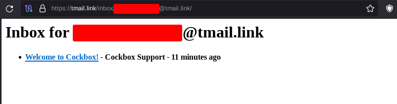
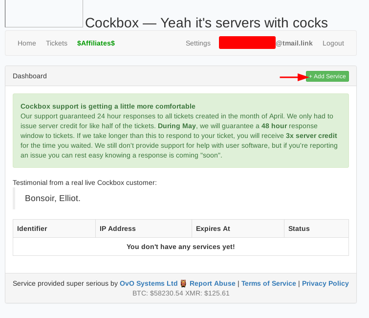
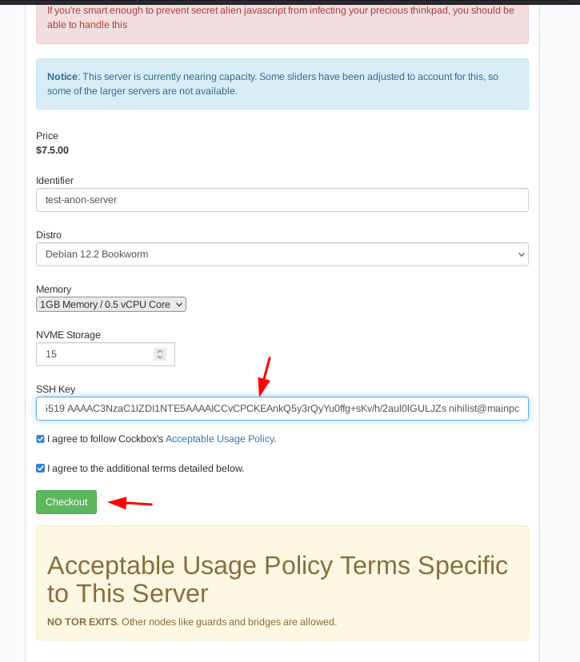
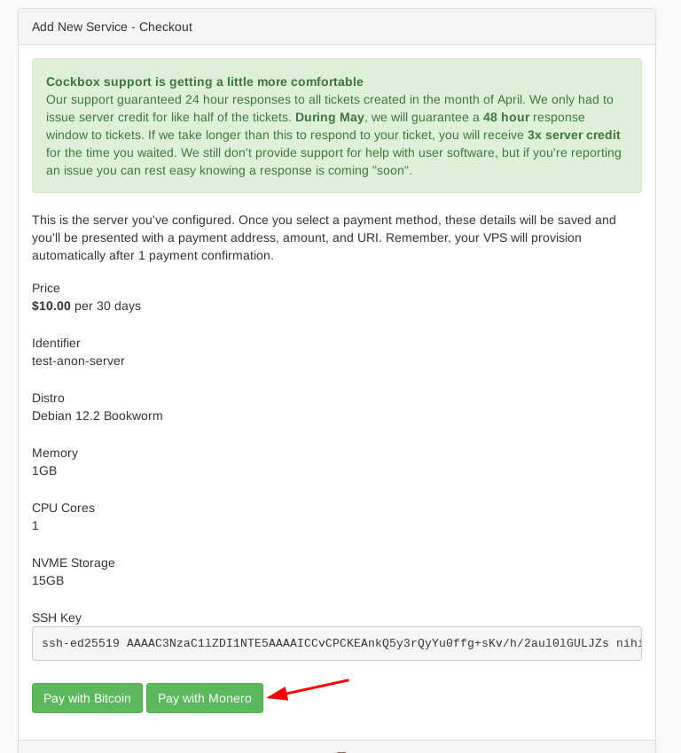

# Renting Remote VPS Servers Anonymously (non-KYC cloud resellers)

```
TLDR: you can rent VPSes anonymously by paying them in Monero with non-KYC cloud resellers
```


In this tutorial we're going to cover how you can rent remote servers while maintaining your anonymity from the initial payment to the actual use of the server.


## **Finding out a non-KYC Cloud Provider and Email Provider**

As we discussed [previously](../truecrypto/index.md), KYC is out of the question if you want to remain anonymous. So you need to find **a cloud provider that allows you to rent servers without any KYC**.

To find one you can go on [kycnot.me](https://kycnot.me/?t=service&q=hosting):


the current one I use for my services is ServersGuru, as they can resell popular cloud providers like hetzner.

In our example below we'll use Cockbox. but first thing we need is a non-KYC email provider, to do so we could follow [Privacy Guides' recommendation](https://www.privacyguides.org/en/email/) and create an account on Tuta, but for simplicity I'll use a temporary email from `tmail.link` (now defunct). You can use [cs.email](https://cs.email/) or [yopmail](https://yopmail.com/) instead.

> If you register with disposable email, you may not be able to reset password later in case you forget it.
>
> Theoretically speaking, an administrator of such email service could gain access to your VPS account at any time (reset the password and receive the email).
>
> Therefore, it is **much better** to use a private non-disposable email that only you have access to.

  

Now that the account is created, we can also validate if we can receive mails:

## **Purchasing the server anonymously (using Monero)**

  

Next we generate a SSH key to connect to the server:
    
    
    [ mainpc ] [ /dev/pts/5 ] [~]
    → ssh-keygen -t ed25519 -C ""
    Generating public/private ed25519 key pair.
    Enter file in which to save the key (/home/nihilist/.ssh/id_ed25519): /home/nihilist/.ssh/ssh-key-test
    /home/nihilist/.ssh/ssh-key-test already exists.
    Overwrite (y/n)? y
    Enter passphrase (empty for no passphrase):
    Enter same passphrase again:
    Your identification has been saved in /home/nihilist/.ssh/ssh-key-test
    Your public key has been saved in /home/nihilist/.ssh/ssh-key-test.pub
    The key fingerprint is:
    SHA256:hu1aO2qMU0XuaRDTRiVHH3Jl2hNP/0prlAnpPCTGECo
    The key's randomart image is:
    +--[ED25519 256]--+
    |       o=+= o.+ .|
    |      o.+= + * +.|
    |    E .*  + * o o|
    |     ..oo. = . +.|
    |      .+S.  + = .|
    |      .o+    + o |
    |     + .o     +  |
    |    o oo..   .   |
    |     oo...       |
    +----[SHA256]-----+
    
    [ mainpc ] [ /dev/pts/5 ] [~]
    → cat .ssh/ssh-key-test.pub
    ssh-ed25519 AAAAC3NzaC1lZDI1NTE5AAAAIHqt0O2ZbRt/7ikk0PdPRcb1GRBE5YNDdBHFCMGIdeHb
    
    



validate the VPS purchase with the Monero option:

 

Then here we send the Monero payment:

 

then wait 10-20 minutes for the payment to be validated by the network, and then you should recieve the mail with your server accesses:


Now that the server is provisionned, we can connect to it:

## **Accessing the server anonymously (SSH through Tor)**

To access the server anonymously, you just need to ssh there through tor using torsocks:
    
    
    [ mainpc ] [ /dev/pts/6 ] [~]
    → cat .ssh/config| head -n4
    Host test-server
            User root
            hostname 185.216.68.156
            IdentityFile ~/.ssh/id_ed25519
    
    [ mainpc ] [ /dev/pts/6 ] [~]
    → torsocks ssh test-server
    The authenticity of host '185.216.68.156 (185.216.68.156)' can't be established.
    ED25519 key fingerprint is SHA256:Od5FT4wcALDHXXK2B4t6lM8idsDmUfhqWpDFjStgBwI.
    This key is not known by any other names.
    Are you sure you want to continue connecting (yes/no/[fingerprint])? yes
    Warning: Permanently added '185.216.68.156' (ED25519) to the list of known hosts.
    Linux cockbox 6.1.0-13-amd64 #1 SMP PREEMPT_DYNAMIC Debian 6.1.55-1 (2023-09-29) x86_64
    
    The programs included with the Debian GNU/Linux system are free software;
    the exact distribution terms for each program are described in the
    individual files in /usr/share/doc/*/copyright.
    
    Debian GNU/Linux comes with ABSOLUTELY NO WARRANTY, to the extent
    permitted by applicable law.
    
    root@cockbox:~# id
    uid=0(root) gid=0(root) groups=0(root)
    
    root@cockbox:~# apt update -y ; apt upgrade -y ; apt autoremove -y
    	
    

And that's it! We now have access to a remote server, we acquired it anonymously, and are now using it anonymously as well.

