# Hiding files in videos (small or large files) with zuluCrypt

```
TLDR: you can hide files in videos using zulucrypt, and maintain deniability about it as long as the original file is not found by the adversary.
```


zuluCrypt is a feature rich Linux-based encryption application that can manage a wide range of volumes including: PLAIN dm-crypt, LUKS, TrueCrypt, VeraCrypt and Microsoft Bitlocker. One feature that sets zuluCrypt apart from other encryption tools is the ability to hide (small or large) files and folders within video files via the "Encrypted Container Hidden In Video/Cover File (Steganography)" option, leaving the video file fully functional and therefore acting as an ideal method of hiding important information in plain sight.

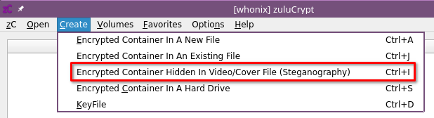


zuluCrypt can be installed on multiple Linux distributions. For Debian-based distro's, simply use your favourite package manager or run the following apt command in the terminal:
    
    
    sudo apt install zulucrypt-gui
    

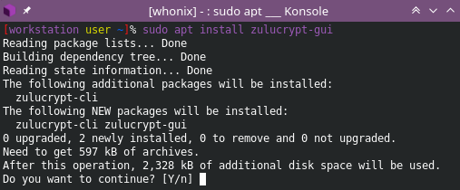

In this tutorial we'll be using zuluCrypt on [Whonix](https://www.whonix.org/), an OS designed for optimal privacy and security. For other Linux distro's, visit the maintainer's official page at <https://mhogomchungu.github.io/zuluCrypt/> Once installed, zuluCrypt should be visible in your desktop environment's app launcher or you can simply start zuluCrypt-gui from the terminal by running:
    
    
    zuluCrypt-gui
    

Now that zuluCrypt is fully functional, it's time to find a video file to use as your container. In this tutorial we'll be using an mp4 file as our video container, so if you have an mp4 video file you'd like to use then follow the next steps with your own mp4 video file. If you need an mp4 video file, the following sites are excellent resources for free public domain movies that are ideal containers as they're copyright free:  
<https://www.publicdomaintorrents.info/index.md>  
<https://archive.org/details/feature_films>  
<https://publicdomainmovie.net/>  
  
We'll be using "Night of the Living Dead" available from <https://archive.org/details/night_of_the_living_dead> so we'll download the mp4 version (396.2MB) in the terminal with wget as follows:
    
    
    wget https://archive.org/download/night_of_the_living_dead/night_of_the_living_dead_512kb.mp4
    

Now that we have our video file, it's time to decide what files we need to hide. In this case we're going to hide some secret documents that are already zipped up in another archive as shown below:

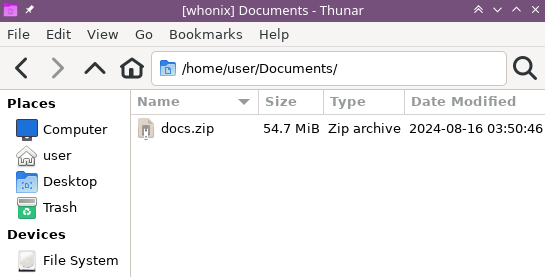

Switching back to zuluCrypt, we click on "Create", "Encrypted Container Hidden In Video/Cover File (Steganography)" or use the keyboard shortcut CTRL+I to commence the process.


Observe and read the important message carefully then click "OK" when ready to continue

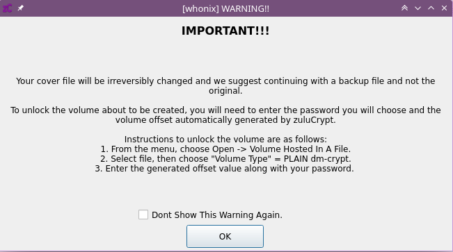

We then select our mp4 cover file "night_of_the_living_dead_512kb.mp4" then set a container size and password as shown below.

**DISCLAIMER: take note that you should pick a video file that does not exist anywhere else on the web, it should not be possible to compare the original checksum of the video file, and the edited video file. Ideally the original video should be permanently erased after being edited as shown below:**
    
    
    /home/user/night_of_the_living_dead_512kb.mp4
    397m
    100
    password
    

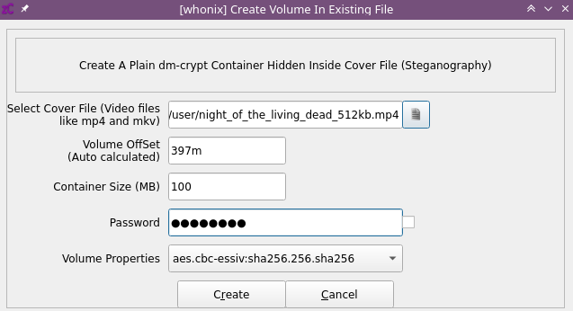

After the volume has been created, zuluCrypt will automatically close the window and lead you back to the main screen.  
We can now open our container and add our secret documents archive.  
Click on "Open", "Volume Hosted In A File" or use the keyboard shortcut CTRL+Z

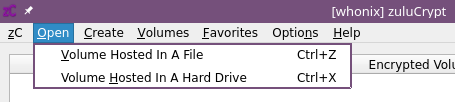

Complete all of the parameters (example shown below) ensuring to: select your mp4 file, set the "Volume Type" to "PLAIN dm-crypt", enter the correct offset amount (397m in our case) and enter the password. Then click "Open".

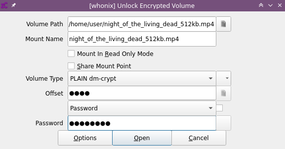

The mp4 container will now be loaded in zuluCrypt. Right-click on the mounted container, then "Open Folder" to open the container with your default file manager.

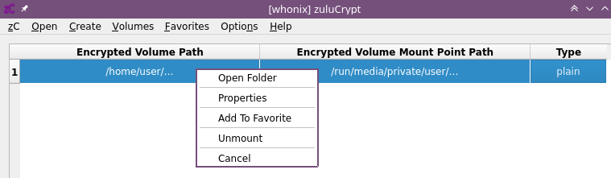 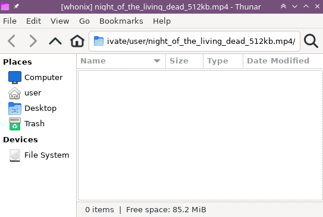

We can now use the file manager (e.g. Thunar) to copy our secret documents archive (docs.zip) into the mp4 container

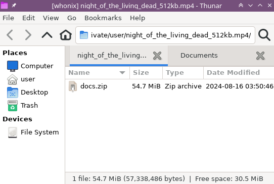

Now that our mp4 container has our secret documents, we can close the file manager and right-click, "Unmount" our container in zuluCrypt

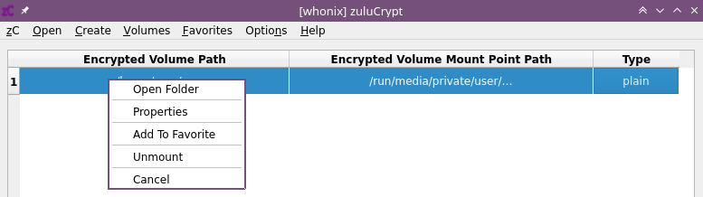

We now have a fully functional mp4 video that contains our secret documents. This will make it significantly harder for an attacker who may have gained access to your system to discover your secret documents.  
Finally, we can reconfirm the video plays by opening the mp4 in VLC by running the following VLC command (or using your preferred method):
    
    
    vlc night_of_the_living_dead_512kb.mp4
    


And of course, make sure that the original video file does not exist anywhere else, if it does, make sure that it's deleted.