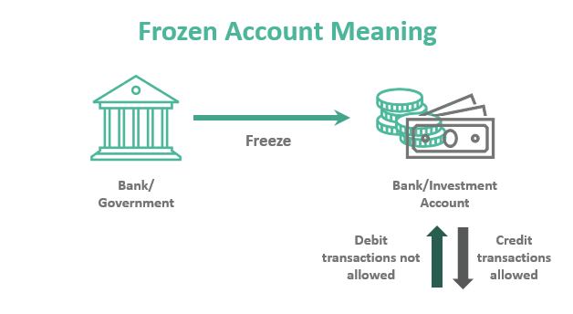

# Never tell your bank that you bought crypto

```
TLDR: tell your bank that the bank transfer was to buy something on a flea market, and there's no receipt at all for it.
```

## Introduction

Let's say you've read this [article](../prepareforCBDCs/index.md) and decided to prepare for the arrival of CBDCs by purchasing Monero. Considering that banks work closely with governments and that CBDCs are heavily considered as a means for governments to maintain control over citizens, how do you think your bank would react? No surprise, it's likely they'll react negatively.


## What can you say to your bank? 

If you are aware about how banks and governments react to it, you probably understand by now that openly telling your bank you're buying cryptocurrencies, especially privacy-focused ones, is not a great idea.

Here's how it could go:

*Your phone rings.*

*You*: Hello?
*Bank*: Hello, this is your bank advisor. We've noticed several recent money transfers from your account and would like to understand their purpose.
*You*: Oh! Yes, I bought some Monero. It's a privacy-focused cryptocurrency. Are you familiar with it?
*Bank*: Yes, I'm aware. Thank you for the information.

*A few minutes later, your bank account is frozen for suspicious activity.*


Here's what you could say to avoid raising red flags:

"I went to a flea market/street market/bazaar and bought a couple of watches. They were quite expensive, and I didn't have enough cash with me, so I transferred the money directly to the seller—it was just easier."

If you used [Retoswap](../haveno-client-f2f/index.md) to buy your Monero, the transaction is impossible to trace. Without clear evidence, the bank may only have suspicions, which is less risky than confirming your cryptocurrency purchase, unless, of course, the person you traded with reports the transaction to authorities, which is highly unlikely.

If the bank asks for proof, such as a receipt, you can explain that it was a street market vendor and that no receipt was provided. This is common and generally accepted. If needed, you can also explain that you may have been scammed, and the watches (or jewelry or other item) didn't turn out to be worth what you paid. Appearing a bit naïve in this context can actually help your case.


But why are banks reacting like this? That's what I want to explain in the next paragraphs. 

## Bank & Governments relationships 

In order to understand how it would be a bad idea to say to your bank that you bought crypto, you need to understand what are the [relationships](https://chestofbooks.com/finance/banking/Banking-And-Business/I-Relationships-Between-Governments-And-Banks.html) between them and the governments. 

1) **Regulation and Oversight**

Officially, governments [regulate](https://en.wikipedia.org/wiki/Banking_regulation_and_supervision) the banking industry to ensure stability, protect consumers, and prevent financial crises. This includes setting rules on lending, interest rates, liquidity, and capital requirements. For example, central banks, like the Federal Reserve in the U.S. or the European Central Bank, are responsible for setting monetary policy, which directly influences how commercial banks operate.

In practice, however, governments often struggle with managing their own budgets and are frequently the cause of financial crisis. In many cases, their regulation of the banking system serves more to control the economy and the population than to protect it.


Example: The government may require banks to hold a certain percentage of deposits in reserve, ensuring money is available when needed. But once your money is in a bank, technically, you no longer own it.

2) **Monetary Policy and Central Banks**

[Central](https://en.wikipedia.org/wiki/Central_bank) banks are government institutions that control a country's money supply and interest rates. They can directly influence how banks lend money by changing the federal funds rate (in the U.S.) or the discount rate in other countries. This control is one of the ways governments exercise power over the financial system.

Example: When the central bank lowers interest rates, commercial banks can lend more easily, making loans cheaper for businesses and consumers. This is one of the primary tools used by governments to stimulate or slow down economic growth.


3) **Government Debt and Bonds**

Governments [borrow](https://usafacts.org/articles/what-is-the-us-national-debt-and-how-has-it-grown-over-time/) money to finance public spending by issuing bonds. Banks are major buyers of these bonds, which are seen as low-risk, interest-paying assets. In return, the government benefits from the banks' participation in funding national debt.

Example: A government may issue treasury bonds, and banks, in turn, purchase these bonds to earn interest and help finance public services, infrastructure, and other expenditures.

As you can see, they work closely together, sharing mutual interests.


4) **Deposit Insurance and Bailouts**

Governments provide insurance on bank [deposits](https://www.financestrategists.com/banking/bank-account/bank-account-deposits/) (e.g., FDIC insurance in the U.S.) to ensure consumer confidence and prevent runs on banks. If a bank becomes insolvent, governments sometimes step in with bailouts or emergency funding to prevent systemic collapse. Essentially, this is how you manipulate the population by creating a false sense of stability.

Example: During the 2008 financial crisis, several major banks required government bailouts, including institutions like JPMorgan and Bank of America. This was done to stabilize the financial system and avoid a broader economic meltdown.


5) **CBDCs (Central Bank Digital Currencies)**

Governments are exploring or developing Central Bank Digital Currencies [(CBDCs)](../prepareforCBDCs/index.md) to digitize their national currencies. These would allow central banks to have direct control over digital money, increasing their ability to monitor and regulate the flow of funds. CBDCs could also make it harder for individuals to use decentralized, private cryptocurrencies like Monero, which are not under government control. 

Example: China's Digital Yuan is one of the most advanced CBDC projects. It allows the Chinese government to track all transactions in real-time, ensuring tighter control over the economy and population.


6) **Banks as Agents of Government Policy**

Banks are often used by governments to execute financial policies. This can include anything from distributing government payments (like stimulus checks or welfare) to enforcing [tax](https://accountinginsights.org/can-the-irs-take-money-from-your-bank-account-heres-what-to-know/) policies and regulations. Banks must comply with Know Your Customer (KYC) and Anti-Money Laundering (AML) regulations, which are heavily enforced by governments to combat financial crimes in order to maintain control.

Example: If a government wants to issue stimulus checks, they may coordinate with banks to distribute funds to citizens' accounts. Similarly, banks collect taxes through automatic withholdings in cooperation with the government's tax agency. They are feeding the parasite. 


7) **Political Influence and Lobbying**

Banks wield significant political power through lobbying. They influence government policies, often advocating for policies that protect their interests, like lower taxes or fewer regulations. Conversely, governments may pressure banks to follow specific policies, such as freezing accounts of individuals or entities linked to illegal activities or sanctions. And, if you ever read this [article](../everyoneisacriminal/index.md), you know that anything can become illegal. 

Example: In the U.S., banks often lobby against higher capital reserve requirements or regulations that limit their ability to generate profits. On the other hand, governments may request banks to comply with sanctions and freeze accounts of individuals or entities suspected of terrorism or corruption.



## Banks relationships with cryptocurrencies 

Now that we understand the relationship between banks and governments, let's take a look at their relationship with cryptocurrencies.

1) **Cautious Cooperation**

Some banks are beginning to explore or integrate [blockchain](https://en.wikipedia.org/wiki/Blockchain) technology (the underlying tech behind cryptocurrencies) to enhance their own systems, officially for faster payments, settlement, and security. However, this is also closely tied to their desire to maintain control over cryptocurrencies.


A few banks offer crypto custodial services, allowing clients to store or manage digital assets. 

2) **Skepticism & Resistance**

Most traditional banks view cryptocurrencies with skepticism, primarily because they:

- Operate outside of government control

- Are often used in anonymous or [decentralized](https://www.tastycrypto.com/defi/decentralized-crypto-exchange-explained/) transactions

- Challenge the monopoly banks have over monetary systems


Banks worry that widespread crypto use could:

- Undermine central bank authority

- Reduce their role in transactions and savings

- Encourage capital flight and regulatory avoidance

These concerns are very similar to those of governments, as the economy remains their weak point.

3) **Account Closures & Restrictions**

Some individuals or businesses that deal heavily with crypto (especially privacy coins like Monero) report:

- Bank account closures

- Transaction blocks

- Delays or investigations due to "[suspicious](https://financeband.com/what-happens-when-there-is-suspicious-activity-on-your-bank-account) activity"

This is because banks must comply with anti-money laundering (AML) and know-your-customer (KYC) regulations, and cryptocurrencies can appear as a risk. In reality, since governments want to maintain control over all financial transactions to ensure they can collect taxes, any use of cryptocurrency is often viewed as a potential threat.


4) **Regulatory Influence**

Banks lobby for stronger [regulation](https://coinedition.com/eus-new-legislation-to-ban-monero-zcash-and-non-kyc-wallets/) on cryptocurrencies, especially those they perceive as threats to financial stability or state-controlled monetary policy (e.g., Central Bank Digital Currencies, or CBDCs).

Some governments, influenced by banking interests, use regulation to limit or control the use of crypto. Like Europe with Monero. 


5) **Summary**

Banks and cryptocurrencies often have opposing goals:

- Banks support a centralized, controlled system tied to state power.

- Cryptocurrencies promote decentralization, autonomy, and borderless finance.

But the line is blurring. Some banks adapt, while others resist or try to co-opt the crypto movement through CBDCs or regulated blockchain solutions.


## Conclusion 

Banks and governments are falling behind, and that works in our favor. We can still operate under their radar because we are adapting faster than they are. However, don't give them any opportunity to charge you with [baseless](../financescausedownfall/index.md) claims. Focus on OPSEC, stay anonymous, and keep pushing forward! No government official should have any insight into what you're doing or why, as they will always try to use that information against you if they feel they're losing control.


