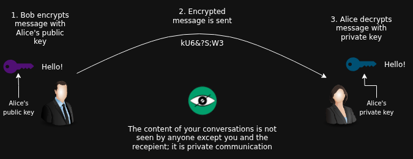
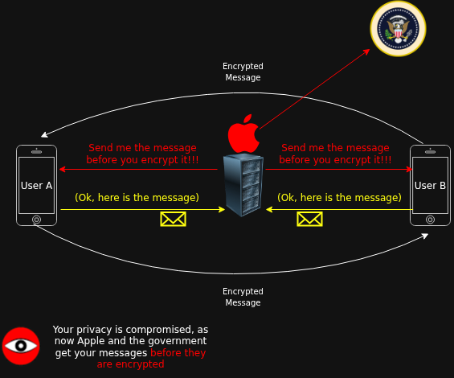
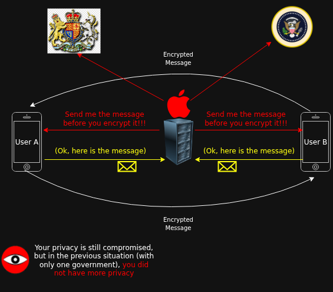
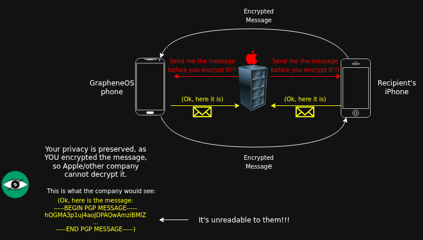

# E2EE Doesn't provide privacy if the software is closed-source

```
TLDR: If the eye of Sauron can already see one end of the tunnel, you never had privacy to begin with. They saw the data before it got encrypted, and then you encrypted the data and sent it to them. You've bought into the illusion of privacy, that's all.
```

Using closed source E2EE software does not provide privacy.

This is essential to understand because many people and corporations will try to trick others into believing that closed source software can be private.


## **Explaining E2EE**

E2EE is short for "end to end encryption." This type of encryption uses asymmetric cryptography, in which each user has a public key and a private key. [This post on not trusting server-side encryption](../serversideencryption/index.md#the-solution-end-to-end-encryption) provides a more full explanation of asymmetric cryptography.



This process of encrypting and sending messages can also be used in the other direction, where Alice will use Bob's public key to encrypt a message. Then she will send it to him, and he will decrypt the message using his private key.

## **The problem** ##

Now, some companies such as Apple and Meta provide E2EE applications such as iMessage or WhatsApp. These apps claim to offer end to end encryption, protecting the user from any middleman who might want to listen in on their conversations. However, for both of these companies, their chat apps are [closed-source software](../closedsource/index.md). This means that it is impossible for any user to verify what the application does do or doesn't do.

The problem is that, while these closed source chat apps do provide end to end encryption, ***there is no way to know if the apps exfiltrate the users' messages before encrypting them.*** So Apple can easily add code to their iMessage app that tells it to encrypt and send messages to the recipient, **but** now the app also copies all messages before encrypting them and sends them to Apple's server. (The same applies to other closed-source E2EE apps.)



As a user of Apple services, you have no control or knowledge of whether Apple engages in this practice.

Additionally, if Apple devices send your messages to Apple prior to encrypting them, then the US government can also see all your messages, as Apple is a US-based company, [and has bent the knee to the government](../individualreignssupreme/index.md#controlled-companies). So Apple provides a way for US intelligence agencies to bypass the encryption of their messaging protocol.

In essence, **E2EE doesn't matter if the chat app can secretly export your messages before they are encrypted.** Closed source E2EE apps such as iMessage and WhatsApp provide the most convenient way to trick users into believing they are safe. The "privacy" offered by the closed source E2EE lures in the average person who doesn't realize the encryption these apps offer is actually bogus for privacy.

## **The UK government as a practical example** ##

In February of 2025 the UK government asked Apple to add a backdoor to iCloud. This would enable the UK government to access any user's personal files without needing to subpoena/ask Apple first. Apple refused, and instead disabled ADP (Advanced Data Protection) for all users in the UK. If enabled, ADP just added E2EE for many Apple cloud services such as iCloud itself, but also Photos, Notes, Reminders, and some other things ([full list](https://support.apple.com/en-us/102651)). But now, UK users can no longer have E2EE for some of their most valuable data.

This removal, while not directly affecting many users (as most UK users did not previously have ADP enabled), has still caused a lot of discomfort for some UK residents. In reality, UK users of Apple's cloud services have no grounds for complaint. They are using proprietary services that already send their data to the US governemnt. So the UK Apple users never even had privacy to begin with; [being watched by one camera is just as intrusive as being watched by two](../closedsource/index.md#privacy-is-not-a-spectrum).

It's the same situation, just with two watchers instead of one. The reality is that it was never private to begin with.



## The EU and chat control
At the time of writing (November 2025), the EU is pushing the so-called "Chat Control" proposal. This act would mandate all online messaging services, including E2EE ones such as WhatsApp and Signal, to scan for child abuse material. The compromise to privacy here is similar to the way the UK government's desired situation would compromise privacy. The message contents would be analyzed *pre-encryption* and would potentially be sent to a central server for further inspection ([see this article for more details](https://web.archivep75mbjunhxc6x4j5mwjmomyxb573v42baldlqu56ruil2oiad.onion/web/20251103132757/https://www.snopes.com/news/2025/10/21/eu-digital-surveillance/)). However, it is safe to assume that the majority of content will be stored indefinitely, as any kind of personal information can be valuable for the state in the future (for manipulation, smear campaigns, blackmail, incriminate you out of context, etc.). As an end-user, you would have no control over if, when, or where your message content is scanned and stored.


## Counter-example to further explain

Consider this scenario, in which you have privacy. You are using a [GrapheneOS phone](../graphene/index.md) and you want to send a message privately over Apple's (or any intrusive company's) messaging service to somebody. On the GrapheneOS phone, you first manually encrypt your message using your recipient's [PGP](../pgp/index.md) key. Then you send the message through the closed-source message service.



Even though you are using a service that does not provide privacy, **you still have privacy, as you encrypted the message yourself, and relied on open-source encryption software instead of closed-source encryption software**. Apple/other company can see the data you send over their message service, but all they can see is a PGP encrypted message, which is meaningless for them, as they have no way to decrypt it and see the true contents.

(If you do send an encrpted message over such a chat platform, it is best to use a web interface through a private open-source browser, instead of installing a closed-source application. Besides reading the messages you send, any closed-source apps you install can also collect numerous other data/metadata about you and your messages. Additionally, be aware that the recepient's closed-source OS could just read the message right after the recepient decrypts it with PGP.)

## **What do I do?**

The simplest thing to do is to move your data away from big tech companies that don't care about your privacy. How do you know which companies to avoid? **If a tech company releases closed source software, then they don't care about your privacy.** Apple was used as an example, but this applies to all companies that distribute closed-source software.

For example, Windows (owned by Microsoft) and MacOS (owned by Apple) are both closed source. You should [replace your closed-source operating system with Linux](../linux/index.md). You should also acquire a [phone that is supported by GrapheneOS](https://grapheneos.org/faq#supported-devices) and then [install GrapheneOS onto it](../graphene/index.md). With an iPhone or a stock Android phone, you are allowing a great deal of spying to be done on your personal activities.

WhatsApp is owned by Meta, and is closed source software. You need to use open source chat applications: since the code is public, you are able to verify that your messages aren't being sent anywhere *pre-encryption*. [SimpleX](../privatesimplex/index.md) is a great messenger to use.

Another thing to do is to [set up your own home server](../homeserver/index.md) to host your data on your own hardware and run open-source web services for yourself+friends/family.

## Avoid closed source software/non-reproducible binaries
Utlimately, don't use closed source software, as you cannot verify what it does, and cannot know what data it collects about you. The code is not viewable, so the behavior cannot be certain. All apps that you use, even simple tools like an image viewer, a screen recorder, or a game, should be open source. If it's closed source, then you can't know what the app is sending back to its servers.

Non-reproducible *binaries* should also be avoided. If compiling the source code for a software gives a different binary file every time it's compiled, then you can't compare a non-reproducible binary you download with a binary you compile yourself. I.e., compiling the code yourself would produce a slightly different file from what you originally downloaded. This means that your original binary file could have malicious code inserted into it, and it would be very difficult to detect this. However, you can still use applications that offer non-reproducible binaries, [so long as you build the software from source yourself](../compilation/index.md) and don't use the prebuilt binaries.
