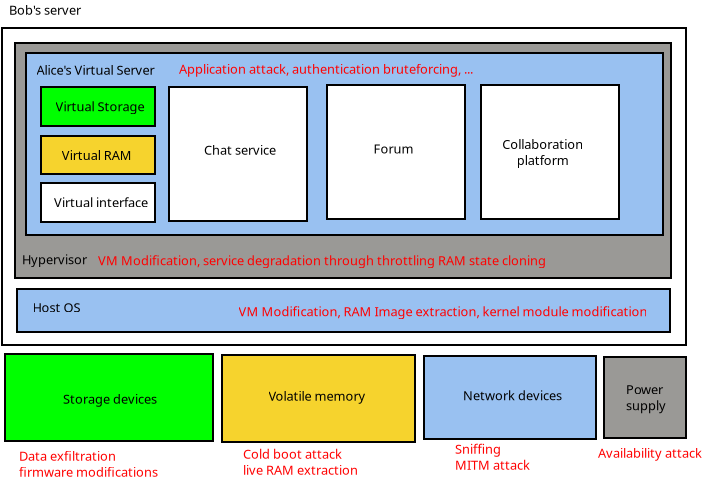
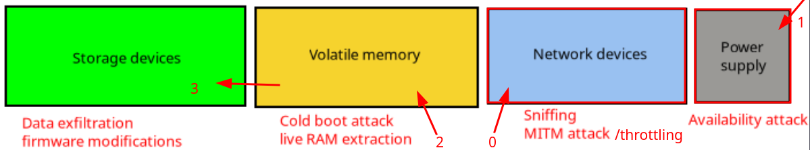

# **When the Adversary is the cloud provider himself**

```
TLDR: the adversary can easily see everything that's going on in VPSes. But it's a harder task to do the same when they're trying to peek into what's happening in dedicated baremetal servers since you get to have access to the server on the Host OS layer directly.
```


Since the 2010's VPS have become cheaper and widely available. From your local mom and pop datacenter where you can rent a baremetal Pi equivalent to highly secured Amazon datacenters and on-demand cpu/bandwidth allocation you can now find a broad range of options for your operational and security needs.   
  
If clandestinity is a requirement, there also are cryptocurrency-based options in jurisdictions without LEO cooperation treatises with your own.   
  
But, **what if the adversary is already inside?**  
in this post we are going to do a threat modelling exercise:  
  


  1. Context and assumptions: what are the capabilities of our adversary? what about our own OPSEC requirments?
  2. Threats: what the adversary might want to acomplish (their goal)
  3. Attack Scenarii: a quick list of possible attacks
  4. Mitigation measures: what we can do to make those attack uneconomical, harder

  
  
**Let's start with an image to visualize exactly what the trust and security boundaries are in such a setup**   
  



## **Context and assumptions**

### **Setting up the scene**

Alice wishes to start hosting a coordination platform for her activist group, but she doesn't want to host the platform herself for the following reasons: 

  * Shes does not want to have incriminating data in her house
  * She is unable to provide the required level if high availability for her group's safety and operational standards
  * She has limited bandwidth/electricity to devote to her cause

  
  
She gets in touch with Bob, owner and operator of Bob's friendly datacenter, and orders from him a VPS (Virtual Private Server). Bob's pretty open-minded so Alice is free to use whatever OS she wants, gets a public IP.   
  


### **Enters Leo**

One day Bob's phone rings, it's Leo calling! Leo asks Bob to confirm that he indeed has Alice as a customer. Without further ado, Leo pays Bob a visit! After entering the premises and showing a government agency badge, Leo asks for complete access to Bob's infrastructure and binds him with a gag order to make sure no one hears about his investigation. Even if Bob is sympathetic to Alice or wishes to protect his customers he would now run afoul of his country's laws if he were to warn them. Leo might have been nice to him but he is not to be trifled with... 

### **What can Leo do to Alice's server?**

Commandeering an office in Bob's datacenter, Leo gets to work. He has plenty of options: 

  1. _Network sniffing:_ Leo can capture and log ALL trafic related to Alice's activity inside Bob's datacenter, so he will know the IP of everyone interacting with her platform
  2. _Firmware/hardware attacks:_ during maintenance windows, Leo could tamper with the BIOS/UEFI of Alice's server (if she had chosen a bare-metal option), or with her server's storage devices in order to deactivate encryption or exfiltrate data unnoticed
  3. _Memory attacks:_ **Leo is able to take snapshots of Alice's VPS RAM** to gather anything that she stores in memory. **This means that Leo is able to retrieve the disks' encryption keys which are stored in memory, and use it to view the disks' contents.**

  4. If Alice had chosen a bare-metal server instead Leo would have to refrigerate the RAM sticks, cut the power and then extract the RAM sticks in order to retrieve same data, but such an attack would be much harder to carry out compared to doing the same to a VPS.


## **Alice's threat model**

Alice is very happy with her new deployment. The platform runs great and her team has started using it in earnest. Still, the bond of implicit trust that now exists between her and Bob bothers here. She decides to do a quick threat modelling exercise to calm her mind: instead of wondering about whatifs, she is going to identify the risks associated with her current setup and find ways to mitigate them. 

### **Threats to Confidentiality**

If Bob was dishonest (or compelled into acting dishonestly), he would be able to harvest information directly from her server's memory! (She doesn't know Leo is already hard at work)  
  
**Impacted assets**  


  * **Decryption keys:** (eg: her https private key, the disk encryption key, **allowing Bob to decrypt any data stored either in RAM or on the VPS' disk**)
  * Any Sensitive data: (ephemeral private messages on her forum that are only kept in RAM, either in an encrypted or unencrypted form)
  * Software states: (session cookies, metadata, etc)

  
  
Bob could also use side-channel attacks by monitoring the underlying server's power usage or run cache timing attack to find the value of her cryptographic secret keys even if Bob's hardware allows her to store them in a dedicated secure chip! 

### **Threats to integrity**

Someone with Bob's level of access (he is the administrator of the _hypervisor_ \- the software that runs Alice's virtual server) could also: 

  * Run an [evil maid attack](https://www.vice.com/en/article/hacker-bios-firmware-backdoor-evil-maid-attack-laptop-5-minutes/): inject their own code in the bootloader, in Alice's OS image or inside the hypervisor which Alice can't monitor
  * Through the hypervisor, tamper with Alice's virtual machine to compromise it


### **Threats to availability**



Having access to the physical layer of the network as well as the power grid feeding the servers, Bob could disrupt Alice's operations in the following way:

  * 0) Disconnect Alice's VM from the network or Throttle Alice's network traffic
  * 1) Cut the power off to Alice's host server to perform a cold boot attack 


## **VPS Attack scenarios**

### **Live RAM extraction**

#### Attack

Bob makes a RAM snapshot of the virtual machine. on a VPS it is very easy and can be done without notice. 

#### Countermeasures

**Can't be addressed without renting a bare-metal server instead.** Alice would need the baremetal server's hardware to support RAM encryption (such as [AMD SEV](https://www.amd.com/content/dam/amd/en/documents/epyc-technical-docs/specifications/56860.pdf) and [Intel SGX](https://www.intel.com/content/www/us/en/products/docs/accelerator-engines/software-guard-extensions.html), where the idea is to store the encryption keys in the CPU directly instead of storing it in the RAM). 

### **Malicious Libvirt or Xen Interception**

#### Attack

Bob modifies the hypervisor's behavior to manipulate network, disk, or console input/output in real time. Can inject fake SSH authentication prompts or steal plaintext database queries before they reach encrypted storage. 

#### Countermeasures

None, this would be undetectable from within the VPS. 

### **Covert Persistent Backdoor via VMState Injection**

#### Attack

Bob can embed custom logic in the hypervisor to modify the VPS state after every reboot, reinfecting it persistently. Similar to [NSA’s DEITYBOUNCE attack](https://www.schneier.com/blog/archives/2014/01/nsa_exploit_of.html), where malware implants are injected into firmware or hypervisor layers to reinfect systems post-wipe. 

#### Countermeasures

Hardly any, if the modification has been done directly in the kernel and in such a way that disables rootkit-detection or other security systems then it can't be detected or mitigated 

## **Conclusion**

A VPS provides no privacy from a malicious cloud provider. **It is like a glass box, as long as the data stored there is encrypted from the same device, it can be decrypted by the cloud provider**

If data is meant to remain unreadable from the cloud provider, it would need to be encrypted elsewhere, and THEN sent to the VPS. That way the cloud provider wouldn't have access to the decryption keys that would've otherwise been stored in the servers' RAM.

Only encrypted data should transit/be stored in it and the decryption keys should never be present on the VPS itself.

## **Bare Metal Attack scenarios**

### **Live RAM extraction**

#### Attack

Leo has to refrigerate the RAM using liquid nitrogen, power down the baremetal server, boot onto a live USB stick, in order to extract the RAM contents that didn't get wiped out yet. 

#### Countermeasures

Alice would need hardware that supports RAM encryption (such as AMD SEV and Intel SGX), **that way Leo would have to find a way to extract the encryption keys from the CPU directly** , to be able to decrypt the ram contents, to be able to decrypt the disk contents. If AMD SEV or Intel SGX is used to encrypt RAM, then he would have to ask Intel or AMD directly to get him the encryption keys that were stored in the CPU (and that is only if it's possible).   
  
This attack is both costly and obvious as it requires the server to go offline. Alice's decides to accept the risk for now and reevaluate based on the evolving sensitivity of the data stored on her server. 

### **BMC Exploitation**

#### Attack

A malicious firmware update is deployed to the Baseboard Management Controller (BMC), providing stealthy persistent access and enabling future compromise of the OS or hypervisor. 

#### Countermeasures

This attack has the same issue as the previous one and could be deployed during a schedule maintenance at Bob's datacenter. Ensuring a TPM is present on the motheboard and only signed firmware updates are accepted is a first step. This wouldn't protect her from a malicious update signed with a legitimate key as some government agency could deploy. Another, better option would be to opt for a physical enclosure only she can access in the datacenter and be present during maintenance, **but physical access to the server is not possible as Alice wants to maintain her anonymity. Such enclosure would need to be monitored and trigger a server poweroff in case of breach.**

### **Evil Maid Attack**

#### Attack

With physical access to the server, a rogue technician could inject a rootkit into the UEFI to mainain persistance, running their code before the OS loads. 

#### Countermeasures

A physically locked enclosure such as ones used by payment processors in their datacenters would greatly reduce the likelihood of this attack. 

## **Conclusion**

Following her analysis, Alice understands that having a VPS gives her no privacy from her cloud provider. That all of her traffic and data can easily be seen, copied or moved. **VPSes are trivial to extract data from, they are like glassboxes for the cloud provider.**
  
Thus, **if Alice were to run a sensitive service on a VPS it will only ever be a short-lived one, it is only a matter of time until the cloud provider looks in the correct direction to see what Alice is trying to do on that VPS**. Such a VPS will live on borrowed time from the moment it is started because as soon as the service provider will decide to look into it it will be easily identified and shut down.

This is the first strategy when it comes to running remote sensitive services: **Multiple Glassboxes Strategy:**

 One way to avoid such issues and the availability implications is to run a fleet of VPSes with load balancers and redirectors. That way, any instance being shutdown by the cloud provider becomes a non-event that does not impact overall availability. This requires the following: 

  * _Automation:_ spinning up a new instance anonymously must be fast, (preferably automated if possible) and standardized, **in order to have at least 2 nodes running at the same time to maintain the high availability of the hidden service**
  * _Logistics:_ you must identify various [non-KYC cloud provider resellers](../anonymousremoteserver/index.md) to have a way to create dormant accounts anonymously with them and schedule a "cool off" period when an instance gets shutdown
  * _Monitoring:_ you must be immediately made aware when a service goes down in order to spin up a new one 

  
Keep in mind that availability is only a third of the equation, integrity and confidentiality are also in jeopardy as soon as the cloud provider takes notice. You will have to put in place mitigations measures through your SOPS (standard operating procedures).


And lastly there is the second remote sensitive service strategy: **The Blackbox Strategy**

The idea here **is to only use baremetal servers** , rather than using VPSes, in order to have as close of an access to the server's hardware as possible, to reduce the capabilities that the adversary has on the server, preventing him from seeing what the contents of that server are.

This strategy is much more expensive as baremetal servers are not as cheap as VPSes, **but the advantage is that the cloud provider has to put in much, much more effort to extract data from the memory** (by performing a lengthy cold boot attack), in order to be able to decrypt the contents of the disks.

The upside is that you'll have to spin up new instances way less often than you'd have to when you were using VPSes, due to how much more expensive it is for a cloud provider to figure out that you're running a sensitive service on their servers. 

