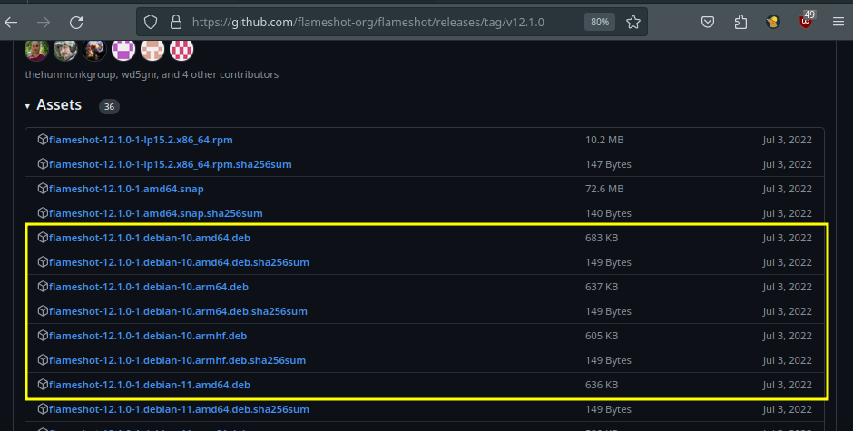

# How to compile open source software + How to verify software integrity 

```
TLDR: follow the projects' build from source steps, and then check the produced binary's checksum to confirm that the binary's integrity is as the project advertises it to be.
```

## _OPSEC Recommendations:_

  1. Hardware : PC / Laptop / Homeserver / Remote Server

  2. OS : [Linux](../linux/index.md)


I recommend using this setup for [Private use](../privacy/index.md), as per the [4 basic OPSEC levels](../opsec4levels/index.md).


## **Why compile even compile software yourself ?**

as we have discussed [previously](../closedsource/index.md), software needs to first be written by a developer, then compiled to produce a binary file (like an .exe file on windows, or a binary file on debian) to be used.


The largest website to find open-source software repositories is [Github](https://github.com), where we can find open source projects.

In this case, Bob wants to have a screenshot software on debian, and he wants it to be open-source:


Here we see that there is a popular screenshot software called "Flameshot" that is available on github:


All of the sourcecode is available, and Bob if is concerned that there may be spyware, he can browse all of the code to check if there is any spyware in it or not.


Next, Bob can find the compiled binaries of flameshot in the releases tab:



But! Bob is an open-source purist, he thinks that the flameshot developers intentionally compiled the software with spyware into it, **Bob doesn't trust that they could compile the software for him, hence he wants to compile the software himself.**

## **How to compile software (ex: C++)**

Each software can come with different compilation requirements, make sure you read their documentation on how to compile software, for example [flameshot](https://github.com/flameshot-org/flameshot?tab=readme-ov-file#compilation) has specific instructions to compile their software: 
    
    
    [ mainpc ] [ /dev/pts/4 ] [~]
    → cd Documents
    
    [ mainpc ] [ /dev/pts/4 ] [~/Documents]
    → git clone https://github.com/flameshot-org/flameshot
    Cloning into 'flameshot'...
    remote: Enumerating objects: 18204, done.
    remote: Counting objects: 100% (5467/5467), done.
    remote: Compressing objects: 100% (339/339), done.
    remote: Total 18204 (delta 5251), reused 5155 (delta 5128), pack-reused 12737
    Receiving objects: 100% (18204/18204), 23.03 MiB | 2.38 MiB/s, done.
    Resolving deltas: 100% (13494/13494), done.
    
    [ mainpc ] [ /dev/pts/4 ] [~/Documents]
    → cd flameshot
    
    
    # Compile-time
    sudo apt install g++ cmake build-essential qtbase5-dev qttools5-dev-tools libqt5svg5-dev qttools5-dev -y
    
    # Run-time
    sudo apt install libqt5dbus5 libqt5network5 libqt5core5a libqt5widgets5 libqt5gui5 libqt5svg5 -y
    
    # Optional
    sudo apt install git openssl ca-certificates -y
    

Now that the dependencies are installed, we start to compile flameshot:
    
    
    [ mainpc ] [ /dev/pts/4 ] [~/Documents/flameshot]
    → cmake -S . -B build && cmake --build build
    -- The CXX compiler identification is GNU 12.2.0
    -- Detecting CXX compiler ABI info
    -- Detecting CXX compiler ABI info - done
    -- Check for working CXX compiler: /usr/bin/c++ - skipped
    -- Detecting CXX compile features
    -- Detecting CXX compile features - done
    -- Setting build type to 'RelWithDebInfo' as none was specified.
    CMake Warning at cmake/Cache.cmake:28 (message):
      ccache is enabled but was not found.  Not using it
    Call Stack (most recent call first):
      CMakeLists.txt:84 (include)
    
    
    -- Performing Test Wall_FLAG_SUPPORTED
    -- Performing Test Wall_FLAG_SUPPORTED - Success
    -- Performing Test pedantic_FLAG_SUPPORTED
    -- Performing Test pedantic_FLAG_SUPPORTED - Success
    -- Performing Test Wextra_FLAG_SUPPORTED
    -- Performing Test Wextra_FLAG_SUPPORTED - Success
    Flameshot predefined color palette large: false
    -- Found Git: /usr/bin/git (found version "2.39.2")
    git found: /usr/bin/git in version     2.39.2
    FLAMESHOT_GIT_HASH: c1dac522
    -- Configuring done
    -- Generating done
    -- Build files have been written to: /home/nihilist/Documents/flameshot/build
    [  1%] Automatic MOC for target SingleApplication
    [  1%] Built target SingleApplication_autogen
    [  2%] Building CXX object external/singleapplication/CMakeFiles/SingleApplication.dir/SingleApplication_autogen/mocs_compilation.cpp.o
    
    [...]
    
    

Here, it's starting to compile, wait for it to reach 100%, then you can run the binary file as follows:


    
    
    [...]
    
    [ 96%] Building CXX object src/CMakeFiles/flameshot.dir/tools/abstracttwopointtool.cpp.o
    [ 97%] Building CXX object src/CMakeFiles/flameshot.dir/tools/capturecontext.cpp.o
    [ 97%] Building CXX object src/CMakeFiles/flameshot.dir/tools/toolfactory.cpp.o
    [ 98%] Building CXX object src/CMakeFiles/flameshot.dir/main.cpp.o
    [ 98%] Building CXX object src/CMakeFiles/flameshot.dir/flameshot_autogen/IJ3KGTTQ5V/qrc_graphics.cpp.o
    [100%] Linking CXX executable flameshot
    [100%] Built target flameshot
    	
    [ mainpc ] [ /dev/pts/4 ] [~/Documents/flameshot]
    → ls
    appveyor.yml  CMakeLists.txt      docs                   LICENSE    scripts         src
    build         CODE_OF_CONDUCT.md  external               packaging  shell.nix       tests
    cmake         data                flameshot.example.ini  README.md  snapcraft.yaml
    
    [ mainpc ] [ /dev/pts/4 ] [~/Documents/flameshot]
    → ls -lash build/src/flameshot
    49M -rwxr-xr-x 1 nihilist nihilist 49M Jun 28 14:14 build/src/flameshot
    
    [ mainpc ] [ /dev/pts/4 ] [~/Documents/flameshot]
    → ./build/src/flameshot
    
    

if you want to be able to launch the flameshot binary without specifying the full path each time, you can add it to your system PATH:
    
    
    [ mainpc ] [ /dev/pts/5 ] [~/Documents/flameshot]
    → ls -lash build/src/flameshot
    49M -rwxr-xr-x 1 nihilist nihilist 49M Jun 28 14:14 build/src/flameshot
    
    [ mainpc ] [ /dev/pts/5 ] [~/Documents/flameshot]
    → echo $PATH
    /usr/local/bin:/usr/bin:/bin:/usr/local/games:/usr/games
    
    [ mainpc ] [ /dev/pts/5 ] [~/Documents/flameshot]
    → ln -s $(pwd)/build/src/flameshot /usr/local/bin/flameshot
    ln: failed to create symbolic link '/usr/local/bin/flameshot': Permission denied
    
    [ mainpc ] [ /dev/pts/5 ] [~/Documents/flameshot]
    → sudo ln -s $(pwd)/build/src/flameshot /usr/local/bin/flameshot
    [sudo] password for nihilist:
    
    [ mainpc ] [ /dev/pts/5 ] [~/Documents/flameshot]
    → which flameshot
    /usr/bin/flameshot
    
    [ mainpc ] [ /dev/pts/5 ] [~/Documents/flameshot]
    → flameshot
    
    

As we run the binary from the commandline, we then see the flameshot program opening here:


as we click on the logo, we can enter the screenshot mode:


then we click and drag to select the area of the screenshot:


Then we can click the "save" icon to save the image somewhere:


More about file and software verification can be found in this [post](../file-verification/index.md)