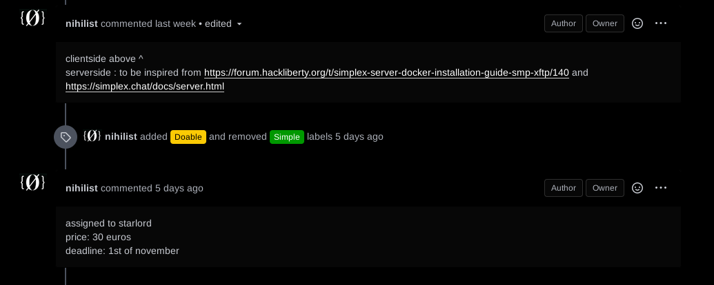
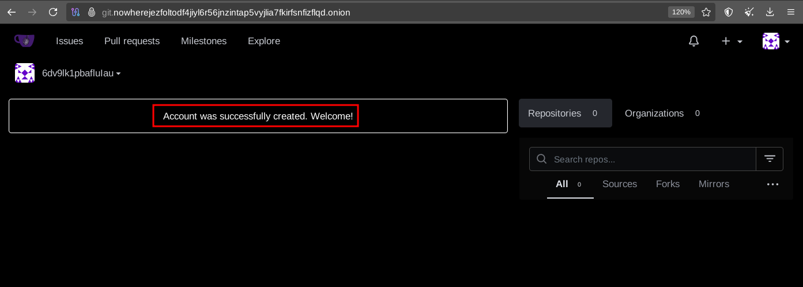
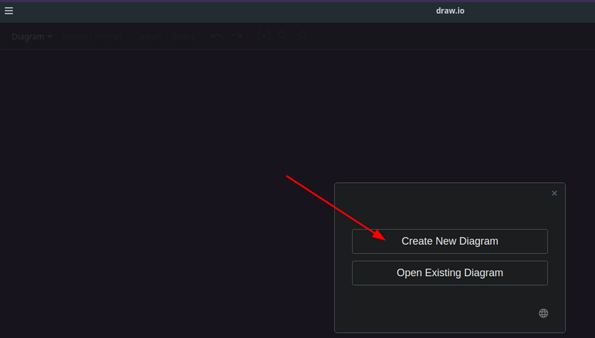
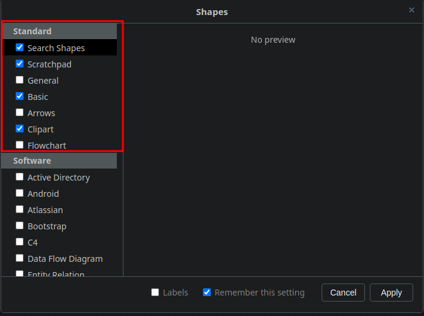
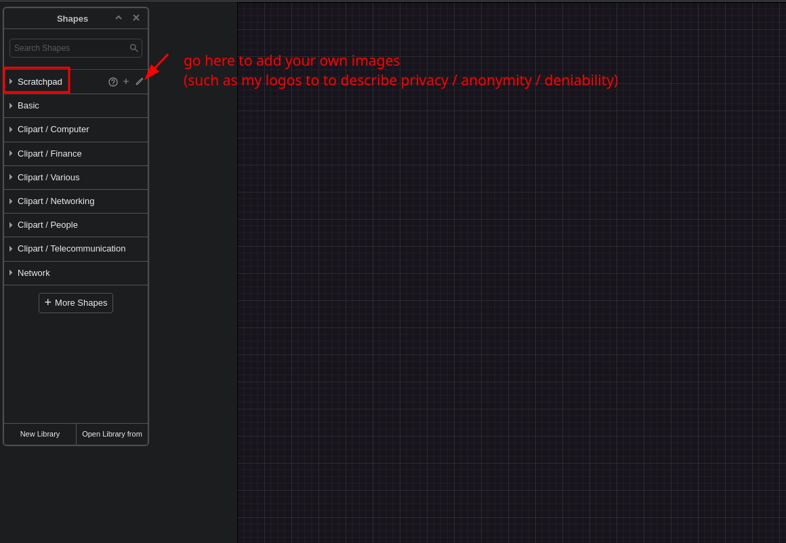
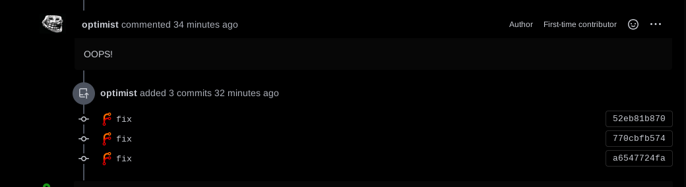

# How to become a Contributor 

```
TLDR: sign up on git datura, ask to get assigned to issues, get assigned to an issue, fork the repository, git clone it, make edits to it, submit it for review, if review is not OK then make further edits to it, if review is OK, then your contribution will get merged and you'll get paid within 72 hours.
```

In this tutorial we're going to look at how you can contribute to The Opsec Bible, we'll look into how the work is being organized, and how to contribute via Forgejo.


## The Opsec Bible Organisation

First of all, to know what tutorials we'd like to have completed, check out our [Opsec Forgejo Project board](http://gdatura24gtdy23lxd7ht3xzx6mi7mdlkabpvuefhrjn4t5jduviw5ad.onion/nihilist/the-opsec-bible/projects/1): 


Each tutorial (even if completed) has it's own assigned issue on Forgejo

You can pick one that you'd like to do, if you see one that is in either the "to be brainstormed" or the "to be assigned" columns (example: [Easy Private Chats - SimpleX](http://gdatura24gtdy23lxd7ht3xzx6mi7mdlkabpvuefhrjn4t5jduviw5ad.onion/nihilist/the-opsec-bible/issues/61). 

If there is no todolist on each assigned forgejo issue, you are free to brainstorm it like so:


If a blogpost forgejo issue doesn't have a todolist yet, please follow this general template to write it:
    
    
    Privacy - Easy Private Chats with SimpleX
    
    To be explained:
    - Graph of the targeted setup
    - why is this setup relevant ? What are the threats ? What are we trying to achieve (Privacy / Anonymity / Deniability) ? 
    - what are your options ? 
    - comparing option A B and C
    - In this tutorial we're going to use option B because it is superior due to these criterias blah blah blah
    
    To be showcased:
    - how to install the clientside application
    - how to install the serverside application
    - how to configure the application
    - show that it works as intended
    
    

The idea being that each issue needs to have a clear todolist to bring clarity on what needs to be done in it. **Please check if the tutorial is already assigned to someone already or not**. In short, please **choose a tutorial that is neither done, nor assigned yet**, and then ask a [maintainer](#who-are-the-maintainers) directly if you can get assigned to it.



At first, we are assigning only **one contributor per tutorial** and only **one tutorial per contributor** at a time, with a **default deadline of 2 weeks**. to complete the assigned tutorial. (if you want to extend the deadline, you'll have to contact a [maintainer](#who-are-the-maintainers) first).

The length of the deadline we give to contributors also depends on how much the contributor has contributed in the past, they start at 2 weeks contributions, to then arrive at 4 weeks per deadlines after 3 successful contributions. You can see the status of contributors on the [Contributors tracking project board](http://gdatura24gtdy23lxd7ht3xzx6mi7mdlkabpvuefhrjn4t5jduviw5ad.onion/nihilist/contributors-tracking/projects/10).


The list of tutorials that are not assigned yet are in the second column, once you have chosen one just ping any [maintainer](#who-are-the-maintainers) on [Opsec SimpleX group chat](http://nowherejezfoltodf4jiyl6r56jnzintap5vyjlia7fkirfsnfizflqd.onion/simplex.html).

You can also submit a suggestion to us directly if you think this blog is missing something crucial, such as a brand new blogpost idea **(although make sure it remains on topic for Privacy / Anonymity / Deniability) we are NOT looking for regular Sysadmin tutorials here.**

If you think one of the existing tutorials is missing something, feel free to criticize them in their assigned issues (ping any [maintainer](#who-are-the-maintainers) when you do so, so we don't miss it):


After discussing with the [maintainer](#who-are-the-maintainers) what task you want to do, we'll confirm on the price for that tutorial and after we get your confirmation we'll assign it to you, and that's when you can start to work on it.

_Disclaimer:_ if you're not used to writing technical stuff, please aim for the tutorials that are labeled as "Simple" and that you actually understand. Don't try to bite more than you can chew, otherwise we might refuse further contributions coming from you. You should be at least familliar with the topic you intend to talk about.

## **How to contribute new tutorials**

Now you first need to sign up on forgejo, click the **Register** button and fill out your details.


  


DO NOT give your real email here, you can put a dummy one. Email is not verified.


  


If account creation is successful, you'll be automatically logged in.


  


Now, you can ask to join our [Contributors private chatroom](http://nowherejezfoltodf4jiyl6r56jnzintap5vyjlia7fkirfsnfizflqd.onion/simplex.html) where we brainstorm new contributions, formulate todolists, assign those todolists to contributors like you, and review those contributions:


From there, you can fork the repository, from your new account:


You can leave everything as default as shown below: 


Now from there you continue from the commandline, do a git clone the repository you just forked, and do the edits you need to do:
    
    
    [ mainpc ] [ /dev/pts/18 ] [~/Documents]
    → apt install git tor torsocks -y
    
    [ mainpc ] [ /dev/pts/18 ] [~/Documents]
    → git config --global http.proxy socks5h://localhost:9050

    [ mainpc ] [ /dev/pts/18 ] [~/Documents]
    → git config --global https.proxy socks5h://localhost:9050

    [ mainpc ] [ /dev/pts/18 ] [~/Documents]
    → git clone http://gdatura24gtdy23lxd7ht3xzx6mi7mdlkabpvuefhrjn4t5jduviw5ad.onion/optimist/opsec-blogposts
    Cloning into 'the-opsec-bible'...
    remote: Enumerating objects: 3400, done.
    remote: Counting objects: 100% (3400/3400), done.
    remote: Compressing objects: 100% (2729/2729), done.
    remote: Total 3400 (delta 1588), reused 2109 (delta 609), pack-reused 0 (from 0)
    Receiving objects: 100% (3400/3400), 149.35 MiB | 6.82 MiB/s, done.
    Resolving deltas: 100% (1588/1588), done.
    
    [ mainpc ] [ /dev/pts/18 ] [~/Documents]
    → cd opsec-blogposts
    
    

If you are reusing the repository after you're done sending pull requests, don't forget to do a git pull to make sure you're working on an up-to-date repository, we are [frequently pushing new commits](http://gdatura24gtdy23lxd7ht3xzx6mi7mdlkabpvuefhrjn4t5jduviw5ad.onion/nihilist/opsec-blogposts/commits/branch/main).
    
    
    [ mainpc ] [ /dev/pts/18 ] [the-opsec-bible]
    → git pull http://gdatura24gtdy23lxd7ht3xzx6mi7mdlkabpvuefhrjn4t5jduviw5ad.onion/optimist/opsec-blogposts
    
    

Now that you're on the latest commit, you can start to do your own changes from inside vscodium directly:

 
    wget -qO - https://gitlab.com/paulcarroty/vscodium-deb-rpm-repo/raw/master/pub.gpg \
        | gpg --dearmor \
        | sudo dd of=/usr/share/keyrings/vscodium-archive-keyring.gpg
    
    echo 'deb [ signed-by=/usr/share/keyrings/vscodium-archive-keyring.gpg ] https://download.vscodium.com/debs vscodium main' \
        | sudo tee /etc/apt/sources.list.d/vscodium.list
    
    sudo apt update && sudo apt install codium

    codium
    

    

now from there if you have a new tutorial to create you can copy the template tutorial folder called "0_template" into another folder:


    

In the new tutorial folder (here it's **1_newtutorial**) you will find the template index.md file that you can edit from vscodium directly:


    
You can also view your edits in real time from vscodium's built-in markdown visualizer as shown above.

Make sure that you follow the quality standard described [here](../qualitystandard/index.md): **start with the Why, then the What, then the How**. Follow the template and edit it accordingly to fit the tutorial you want to contribute.

_DISCLAIMER:_ We are not taking any shortcuts in this blog, we expect you to talk about the path, to list the steps that are on that path, **and more importantly want you to show the audience how YOU walk that path.**

For the "How" parts specifically, as you are expected to explain and show the audience how to do things, **make sure you use images and screenshots like so:**
        
    


To take screenshots, you can use [flameshot](../compilation/index.md), it has everything you need for screenshots. When you take screenshots, dont forget to draw arrows to mention where the user needs to click, add text if something needs to be clarified, etc. and then save your screenshot in the same folder as your blogpost contribution (in this case, in **opsec-blogposts/1_newtutorial/1.png**)
    
    
    apt install flameshot -y 
    
    flameshot
    

` 

_Sidenote:_ If you are showcasing any IRL steps to make, take pictures to explain what needs to be done, just like how Nihilist did in [how to install GrapheneOS](../graphene/index.md) tutorial.

If you are showcasing a complex tutorial please make a graph to explain what you are talking about. One graph will convey the equivalent of a wall of text in one clear image, it's a matter of efficiently conveying information to the audience. We used to make graphs using yEd Graphs (but it's closed source) so instead as of q3 2024, we are using Drawio to make them, both tools have got everything you need to write complex graphs.
    
    
    [ mainpc ] [ /dev/pts/3 ] [blog/opsec/manifesto]
    → apt search draw.io
    Sorting... Done
    Full Text Search... Done
    draw.io/now 24.7.17 amd64 [installed,local]
      draw.io desktop
    
    [ mainpc ] [ /dev/pts/3 ] [blog/opsec/manifesto]
    → apt install draw.io
    
    [ mainpc ] [ /dev/pts/3 ] [blog/opsec/manifesto]
    → drawio
    
    

 

 

 

 



If you want to use my logos for onymity, surveillance, centralisation, complexity, etc you can find them in the **opsec-blogposts/logos/** directory:


Then, i'll let you go through the [drawio documentation](https://www.drawio.com/doc/) to learn how to use it, as there's alot to cover to add logos, change shapes, add text, add arrows, etc:


But in the end you should have a good looking graph like this one to both highlight the problem, and the solution as per the tutorial template:


and if there are any commands (or terminal output) to be shown, **copy paste from your terminal directly into the index.md file** don't take screnshots of it, as this is going to help us save some disk space, you can use the **backticks code blocks** for that purpose :
    
    ```sh
    [ localhost ] [ /dev/pts/23 ] [~]
    → neofetch
           _,met$$$$$gg.          user@localhost
        ,g$$$$$$$$$$$$$$$P.       --------------
      ,g$$P"     """Y$$.".        OS: Debian GNU/Linux 12 (bookworm) x86_64
     ,$$P'              `$$$.     Host: KVM/QEMU (Standard PC (Q35 + ICH9, 2009) pc-q35-7.2)
    ',$$P       ,ggs.     `$$b:   Kernel: 6.1.0-33-amd64
    `d$$'     ,$P"'   .    $$$    Uptime: 3 days, 6 hours, 13 mins
     $$P      d$'     ,    $$P    Packages: 1610 (dpkg), 6 (snap)
     $$:      $$.   -    ,d$$'    Shell: zsh 5.9
     $$;      Y$b._   _,d$P'      Resolution: 3840x2160
     Y$$.    `.`"Y$$$$P"'         WM: i3
     `$$b      "-.__              Theme: Adwaita-dark [GTK2/3]
      `Y$$                        Icons: hicolor [GTK2/3]
       `Y$$.                      Terminal: tmux
         `$$b.                    CPU: 11th Gen Intel i7-11700K (4) @ 3.600GHz
           `Y$$b.                 GPU: 00:01.0 Red Hat, Inc. Virtio 1.0 GPU
              `"Y$b._             Memory: 11838MiB / 32096MiB
                  `"""
    ```


Now let's say that your tutorial is ready to be sent over for review. So now you need to git push it to your forked repository like so:
    
    
    [ mainpc ] [ /dev/pts/18 ] [~/Documents/opsec-blogposts]
    → git config --global user.email "optimist@nowhere.jez"
    
    [ mainpc ] [ /dev/pts/18 ] [~/Documents/opsec-blogposts]
    → git config --global user.name "optimist"
    
    [ mainpc ] [ /dev/pts/18 ] [~/Documents/opsec-blogposts]
    → git add -A
    
    [ mainpc ] [ /dev/pts/18 ] [~/Documents/opsec-blogposts]
    → git commit

    new tutorial contribution
    # Please enter the commit message for your changes. Lines starting
    # with '#' will be ignored, and an empty message aborts the commit.
    #
    # On branch main
    # Your branch is up to date with 'origin/main'.
    #
    # Changes to be committed:
    #   new file:   opsec/1_newtutorial/index.md
    
    ESC :wq
    
    [ mainpc ] [ /dev/pts/18 ] [~/Documents/opsec-blogposts]
    → git push
    Username for 'http://gdatura24gtdy23lxd7ht3xzx6mi7mdlkabpvuefhrjn4t5jduviw5ad.onion': optimist
    Password for 'https://optimist@gdatura24gtdy23lxd7ht3xzx6mi7mdlkabpvuefhrjn4t5jduviw5ad.onion':
    Enumerating objects: 7, done.
    Counting objects: 100% (7/7), done.
    Delta compression using up to 4 threads
    Compressing objects: 100% (4/4), done.
    Writing objects: 100% (4/4), 388 bytes | 388.00 KiB/s, done.
    Total 4 (delta 3), reused 0 (delta 0), pack-reused 0
    remote:
    remote: Create a new pull request for 'optimist:main':
    remote:   http://gdatura24gtdy23lxd7ht3xzx6mi7mdlkabpvuefhrjn4t5jduviw5ad.onion/optimist/opsec-blogposts/compare/main...optimist:main
    remote:
    remote: . Processing 1 references
    remote: Processed 1 references in total
    To http://gdatura24gtdy23lxd7ht3xzx6mi7mdlkabpvuefhrjn4t5jduviw5ad.onion/optimist/opsec-contributions
       7c759d3..7067b5c  main -> main
    
    

Now you have pushed your changes to your forked respository, from there you can make a Pull request (asking to pull in your changes, to the [main repository](http://gdatura24gtdy23lxd7ht3xzx6mi7mdlkabpvuefhrjn4t5jduviw5ad.onion/nihilist/opsec-blogposts)) as follows:

 

 


now from there your pull request is created, and we'll review it as soon as we get the time:


If it's not complete, we'll comment in there asking you to add what's missing, **changes that you must actually finish before the deadline.** To add further changes simply add more commits to it


    [ mainpc ] [ /dev/pts/18 ] [~/Documents/opsec-blogposts]
    → vim newtutorial/index.md
    
    [ mainpc ] [ /dev/pts/18 ] [~/Documents/opsec-blogposts]
    → git add -A
    
    [ mainpc ] [ /dev/pts/18 ] [~/Documents/opsec-blogposts]
    → git commit
    
    forgot to do this change!
    # Please enter the commit message for your changes. Lines starting
    # with '#' will be ignored, and an empty message aborts the commit.
    #
    # On branch main
    # Your branch is up to date with 'origin/main'.
    #
    # Changes to be committed:
    #   modified:   newtutorial/index.md
    
    ESC :wq
    
    [main eb4b994] forgot to do this change!
     1 file changed, 1 insertion(+), 1 deletion(-)
    
    [ mainpc ] [ /dev/pts/18 ] [~/Documents/the-opsec-bible]
    → git push
    Username for 'http://gdatura24gtdy23lxd7ht3xzx6mi7mdlkabpvuefhrjn4t5jduviw5ad.onion': optimist
    Password for 'https://optimist@gdatura24gtdy23lxd7ht3xzx6mi7mdlkabpvuefhrjn4t5jduviw5ad.onion':
    Enumerating objects: 9, done.
    Counting objects: 100% (9/9), done.
    Delta compression using up to 4 threads
    Compressing objects: 100% (4/4), done.
    Writing objects: 100% (5/5), 432 bytes | 432.00 KiB/s, done.
    
    



Then wait for a [maintainer](#who-are-the-maintainers) to confirm the content is complete, and then we'll accept the pull request and merge it into the main repository.


_Warning:_ your contribution is supposed to follow [the quality standard](../qualitystandard/index.md), if your contribution doesn't follow the quality standard closely, we're going to keep refusing your contribution until you make it good enough to be acceptable. 

If you intend on becoming [a maintainer](../maintainers/index.md) you need to keep submitting contributions that are at least 95% completed each time. The worst you could do is submit a contribution that is 30% completed and waste our time with a tedious reviewing process (which will force us to stop accepting contributions coming from you aswell, if it keeps happening), We'll tolerate it if that's your first contribution, but you should strive to improve your writing skills with each new contribution that you submit. **The best contributors (which are fit to become maintainers) are supposed to send nearly completed contributions upon the first review.**

## Why is there a quality standard to follow ?

This is what we are paying you for, writing QUALITY content. It doesn't matter if you reveal the secret of the universe in a blogpost, it won't be accepted until you properly write it for all the noobs out there to get it, from the Why, to the What, to the How.

We do not write blogposts that only ultra-geeks can achieve, we write blogposts that are supposed to be accessible to anyone that aren't tech savvy to begin with.

Yes, our tutorials intend to cover the peak of mount opsec, but we also intend to make our tutorials cover the ABC of opsec aswell, and to properly achieve that, we have [a quality standard as explained here](../qualitystandard/index.md).

## **Updating existing tutorials**

Sometimes it happens that a tutorial is outdated, has errors or just needs some methodology updates. If you have an idea for something that could be added, or if you want to fix some errors in the tutorial, contact us on simplex or open an issue on [Forgejo](http://gdatura24gtdy23lxd7ht3xzx6mi7mdlkabpvuefhrjn4t5jduviw5ad.onion/nihilist/the-opsec-bible/issues). We will discuss the changes and make sure they're going in the right direction. If it's a small change (like fixing typos or modifying just a few sentences), you can make a pull request with the changes without contacting us.

Usually, there are already a few issues for blog updates listed on the [project board](http://gdatura24gtdy23lxd7ht3xzx6mi7mdlkabpvuefhrjn4t5jduviw5ad.onion/nihilist/the-opsec-bible/projects/1). If you want to help, feel free to pick one and start working on it.
The steps are similar to what we have for creating new tutorial \- fork the repository, create a branch and edit appropriate blog post. When you're done with your changes, open a pull request so that we can review them.

Depending on how much of the tutorial is actually changed, you should credit yourself accordingly. For the sake of this example, let's say you're **optimist** (the person making an update) and **Nihilist** is the original author of the blog post.

### **Minor fixes**

If the changes you've made are small (let's say less than 20% of the blog post), you should keep the name of the original author. You may change the date to inform readers it has been changed recently, but this is not strictly required. Do not add your XMR address in the footer. This doesn't mean that you won't be getting paid. If you're working on an issue on the project board, there's often a reward even for small edits.


### **Complete rewrite**

Sometimes the tutorial needs to be rewritten entirely (more than 75% changes). In this case, you can treat the tutorial as if it was written by you from the beginning.


## What's on topic and offtopic?

Check out [this tutorial](../offtopic/index.md) for the full explanation.


## How to submit good contributions?

Apart from the points already mentioned here, we **REQUIRE** you to follow the [quality standard](../qualitystandard/index.md) of our opsec bible project. It contains a lot of tips on how to explain the topic, make useful graphs and avoid mistakes.

Additionally, you can look at other blog posts (especially the [core tutorial](/tags/#tag:core-tutorial) ones) to see how they're written.

## Will I get the price promised?

If your contribution gets approved and merged, then **yes**. You are guaranteed to receive at **least the price** set by maintainer when assigning the issue to you. However if your contribution gets rejected by a reviewer, you won't get any compensation.

You can read more about it in the [maintainers guide](../maintainers/index.md#determining-the-price).

If you did not get the correct amount, please contact one of [the maintainers](#who-are-the-maintainers) as soon as possible.

## What are **Core Tutorials**?

Those are the tutorials which are the most important for our Opsec Bible. Thus, if you are contributing or updating them, you will get **2x payment**.

Of course, this doesn't come for free. Contributions for those **must** be high quality and detailed.
We will review them with even more scrutiny and not accept any shortcuts.

You can see all of the already written ones [here](/tags/#tag:core-tutorial). On our forgejo instance, they are marked with [`Core tutorial`](http://gdatura24gtdy23lxd7ht3xzx6mi7mdlkabpvuefhrjn4t5jduviw5ad.onion/nihilist/the-opsec-bible/issues?q=&type=all&sort=&labels=50&state=open&milestone=0&project=0&assignee=0&poster=0) or [`High-value tutorial`](http://gdatura24gtdy23lxd7ht3xzx6mi7mdlkabpvuefhrjn4t5jduviw5ad.onion/nihilist/the-opsec-bible/issues?q=&type=all&sort=&labels=7&state=open&milestone=0&project=0&assignee=0&poster=0) labels.


## How long does it take to...

### Review your contribution

A reviewer should respond within **3 days (72 hours)** of you opening the pull request. This is just an upper bound, in practice the reviews are usually done much quicker. If the reviewer didn't respond during this time period, you can ping [us](#who-are-the-maintainers) on SimpleX asking for progress.

In some cases, when the review is complex (for example requires recreating the steps), it can take over 3 days to fully review your contribution. The reviewer will comment on your PR saying what he needs to do and how much time will it take.

When the reviewer requests changes, you have the time (until the deadline) to address the issues reviewer raised. After that's done, you can expect an answer within 72 hours. If it's necessary, your deadline *can* be extended in order to fix the things pointed out by the reviewer.

### Send payment

**After the pull request is merged**. It can also take up to a few days to receive your payment. [Noone](http://nowherejezfoltodf4jiyl6r56jnzintap5vyjlia7fkirfsnfizflqd.onion/noone.html) periodically sends payments to all issues from the [Payment to be sent](#the-opsec-bible-organisation) column.

So far, as of August 2025, approximately 60 contributions have been successfully paid for, so if you are worried about payments, don't hesitate to ask around.

## Who are the maintainers?

You can see up-to-date list of maintainers on [nowhere website](http://nowherejezfoltodf4jiyl6r56jnzintap5vyjlia7fkirfsnfizflqd.onion/index.html).

As of July 2025, those are:

1. [Nihilist](http://nowherejezfoltodf4jiyl6r56jnzintap5vyjlia7fkirfsnfizflqd.onion/nihilist.html)
2. [oxeo0](http://nowherejezfoltodf4jiyl6r56jnzintap5vyjlia7fkirfsnfizflqd.onion/oxeo0.html)
3. [Midas](http://nowherejezfoltodf4jiyl6r56jnzintap5vyjlia7fkirfsnfizflqd.onion/midas.html)
4. [Doctor Dev](http://nowherejezfoltodf4jiyl6r56jnzintap5vyjlia7fkirfsnfizflqd.onion/doctordev.html) (mostly focused on [darknet lantern](../darknetlantern/index.md) project)

They are responsible for [assigning you tasks](http://opbible7nans45sg33cbyeiwqmlp5fu7lklu6jd6f3mivrjeqadco5yd.onion/opsec/maintainers/#assigning-contributors-onto-todolists), [reviewing your contributions](http://opbible7nans45sg33cbyeiwqmlp5fu7lklu6jd6f3mivrjeqadco5yd.onion/opsec/maintainers/#reviewing-contributions) and merging them after the review.

You can contact any maintainer in case you got questions.


## When am I eligible to become a maintainer too ?


If you are in the "Very Good" contributor column on the contributor tracking board, **you are eligible to become a maintainer.** 

To end up in here, you'll need to submit nearly-completed blogposts in one go. The least time it takes to review them, the better for us. (and inversely, the shittier your contribution, the more time it makes us waste) If you want to become worthy of the maintainer role, you'll need to:

- Submit enough contributions that are almost completed in ONE go (meaning they require only one quick review to be validated, instead of several)
- Posting regularly and being somewhat active (i expect you to spend some personal time on this project if you want that maintainer seat)
- Suggest new content by proposing changes to existing blogposts or by creating new issues for potential blogposts that are missing on the opsec blog right now
- Write todolists on issues that are missing todolists

We have a limit of 5 maintainers currently, but don't hesitate to ask anyway if you are interested in becoming one nonetheless.

