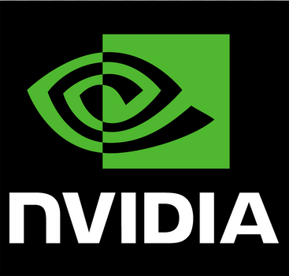
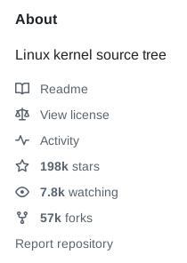

# Corporations are the cancer of FOSS projects

```
TLDR: Corporations embrace FOSS projects, to extend them with proprietary code, to be able to extinguish them. Why? Because that's how they exterminate competition.
```

## What are FOSS projects? 

FOSS stands for Free and Open-Source Software.

It refers to software that is both:

1) Free (in terms of cost): Users can download, use, and often modify the software without any cost. These kinds of projects are central to the spirit of Linux, as they aim to provide access to anyone who needs these tools.

2) Open-Source: The software's source code is publicly available, meaning anyone can inspect, modify, and distribute it. This transparency is crucial, as it allows security researchers to verify which products effectively protect user anonymity and confidentiality.

Some popular examples of FOSS include:

- [Linux](../linuxbasics/index.md) (an open-source operating system)

- [LibreOffice](https://www.libreoffice.org/download/download-libreoffice/) (an office suite)

- [Mozilla Firefox](https://www.mozilla.org/en-US/) (web browser)

- [VLC](https://www.videolan.org/) Media Player (media player)

FOSS is often developed collaboratively, with contributions from people around the world. It is generally seen as promoting transparency, user freedom, and community-driven innovation.


## Power corrupts 

In the flawed system that governments have put in place, two main factors drive corruption: power and money. When profit becomes the primary goal, power inevitably [corrupts](https://writingexplained.org/idiom-dictionary/absolute-power-corrupts-absolutely). Power can be held by various entities at different levels, but in the end, individuals rarely hold true power.

Governments are the entities that hold the most significant power, but corporations are next in the power hierarchy. The reason is simple: corporations heavily contribute to the government's economy, so governments, in turn, grant them significant influence. These corporations are so entrenched in their pursuit of power that they will go to great lengths to maintain it, especially by eliminating competition.


And you know what? The main competitors to these corporations are FOSS (Free and Open-Source Software) projects. Why? Because FOSS offers the same products and services as corporations but for free, which undermines the profit-driven motives of the corporate world.

> Here is a [citation](https://www.phrases.org.uk/meanings/absolute-power-corrupts-absolutely.html) that I'd like to share with you: "Power corrupts; absolute power corrupts absolutely" *Lord Acton*

Unfortunately, human nature tends to show that power often corrupts individuals, even those who may have been well-intentioned at the start. And this is something governments are fully aware of. They know, as deeply corrupt institutions themselves, that granting power will ultimately lead to further corruption.

Moreover, there's a widespread belief that money equals power. This misconception is perpetuated by various [media](https://fusebay.com/wealth/money-is-power/) outlets, keeping the false narrative alive and well.

Power exists only because people allow others to exercise it over them. Power is used to control the masses and concentrate resources in the hands of a few, while others suffer and die.


And this is exactly where populations can strike back. As governments use their power to accumulate resources, that's where the fight should be focused, on the corrupt economy they've set in place.

A notable example where people used economic pressure to remove power is the American Civil Rights Movement in the 1950s and 1960s, particularly the Montgomery Bus Boycott (1955-1956).

In this case, the African American community in Montgomery, Alabama, led by figures like Rosa Parks, Martin Luther King Jr., and other local activists, used economic leverage as a powerful form of resistance against racial segregation. When Rosa Parks was arrested for refusing to give up her seat to a white passenger on a segregated bus, the African American community decided to boycott the city's bus system.

The boycott lasted over a year, with African Americans refusing to use the buses, which resulted in a significant loss of revenue for the bus company. The economic impact was profound: it crippled the bus system financially, forcing local authorities to reconsider their segregationist policies. The boycott was a key moment in the broader Civil Rights Movement, showing how economic pressure can be a tool to challenge and dismantle oppressive systems of power.


This strategy of using economic influence to challenge and eventually remove power is also seen in other historical movements, such as the anti-apartheid movement in South Africa, where international economic sanctions were used to pressure the apartheid regime into reform.

## Embrace, Extend, Extinguish

"Embrace, Extend, Extinguish" is the [strategy](https://en.wikipedia.org/wiki/Embrace,_extend,_and_extinguish) used by corporations to push people away from FOSS projects and towards their own proprietary solutions.

This strategy was first developed by Microsoft, who initially presented it to the public as "Embrace & Extend".

Here is how this strategy works: 

1) **Embrace**

In this initial phase, a company embraces a popular technology, platform, or open standard that is widely used by the market. The idea is to get involved with the existing ecosystem to gain trust, build credibility, and tap into the established user base. By adopting or supporting a widely accepted technology (such as an open-source project or an industry standard), the company positions itself as being supportive of innovation and the needs of the community. It is essentially carried out in the same way that secret agents might infiltrate an enemy to destroy it from within.

Example:

Microsoft embraced the Internet Explorer browser in the 1990s, integrating it into Windows and pushing it as the default browser. 

They also embraced Java, an open-source programming language, for a while.


2) **Extend**

In the second phase, the company extends the embraced technology by adding proprietary features, changes, or enhancements that are not part of the original ecosystem. These additions often make the technology more attractive to the company's existing customer base and users but are not necessarily compatible with other platforms or standards.

The extensions may include features that lock users into the company's proprietary system, making it difficult for them to easily migrate to alternative solutions. That's parasitic work.

Example:

Microsoft extended Internet Explorer by adding proprietary features that were exclusive to Windows, making it more convenient for Windows users but less compatible with other operating systems.

Microsoft also extended the Java programming language by creating J#, a proprietary version of Java, which tied users more closely to their ecosystem.


3) **Extinguish**

In the final phase, the company works to extinguish or eliminate the original open technology or competitor. This may be done by either using their power to dominate the market, pushing competitors out, or by gradually making the extended proprietary version the industry standard. Over time, they aim to make the original solution irrelevant, forcing users to adopt the proprietary version or platform. And that's exactly how you become the hostage of a big corporation. (Hello, [Apple](https://techspective.net/2017/04/14/apple-dangers-lock/)!)

Example:

With Internet Explorer, Microsoft was able to dominate the web browser market to such an extent that it marginalized competitors like Netscape Navigator, eventually leading to its decline.

By creating proprietary formats and APIs, Microsoft was able to extinguish Java's appeal, pushing developers toward .NET—its own proprietary platform.


The goal of "Embrace, Extend, Extinguish" is not necessarily to improve the original technology but to weaken the competition and co-opt the ecosystem to benefit the company's own proprietary products. Once the competition is diminished or irrelevant, the company can lock in users to its platform, ensuring market dominance.

## Corrupted FOSS projects 

Some really great FOSS projects has been highly corrupted by corporations in the past, leading to the death of their deep nature, being fully open source. 

1) **X.Org (X Window System)**

*Initial Phase: Community-driven Open-Source*

The X Window System (or X11) was originally developed in the mid-1980s by the Massachusetts Institute of Technology (MIT) as part of a project to create a windowing system that could work across different hardware and software platforms. It was open-source from the start and widely adopted in the Unix and later Linux communities.

[X.Org](https://x.org/wiki/) was formed as the steward of the open-source version of X11, maintaining and developing it in the open for years. The project was driven largely by volunteers and the open-source community, with contributions from universities, researchers, and hobbyists.

*Corporate Influence:*

[X.Org](https://en.wikipedia.org/wiki/X_Window_System) was largely community-driven until the early 2000s, but corporate influence began to grow significantly around the same time as Linux gained more commercial attention. As Linux began to enter the enterprise space, large corporations such as Intel, NVIDIA, AMD, and others started contributing to the development of X.Org in ways that aligned with their business interests.

Graphics hardware vendors like NVIDIA and AMD began providing [proprietary](https://lwn.net/Articles/195351/) drivers for Linux systems that relied on X11. However, these drivers were often not fully open-source or had limited functionality in comparison to their Windows counterparts. This created tension in the community as these vendors would focus on making sure their proprietary drivers worked well with X11, often at the expense of promoting open-source alternatives.


*The Shift Toward Proprietary Solutions:*

While X.Org itself was open-source, the push from hardware vendors to keep certain components proprietary, such as graphics drivers, shifted the focus away from a fully open ecosystem.

NVIDIA was particularly notorious in this regard. The company often refused to contribute to the open-source graphics driver stack, preferring to develop and release proprietary drivers that were tightly integrated with their hardware but not open to the community. This caused issues with X.Org, as it often had to work around proprietary solutions, which undermined the goals of openness and community-driven development.

This is a perfect example of the *Embrace, Extend, Extinguish* strategy used by corporations. They decided to take part in a beautiful project and sought profits without considering the impact it could have on the original project.



*Resulting Tension:*

Over time, the corporate involvement in X.Org led to fragmentation. The community-driven vision of an entirely open and interoperable system clashed with the commercial interests of hardware manufacturers, who wanted more control over the ecosystem. X.Org struggled to balance between being open-source while accommodating the growing influence of proprietary software.

2) **Xlib**

*Xlib (Core X11 Library) and Corporate Influence:*

[Xlib](https://x.org/releases/current/doc/libX11/libX11/libX11.html) is the client-side library that interacts with the X server (the core of the X Window System). It provides developers with the necessary tools to create graphical applications on Unix-like systems using X11.

While Xlib itself has generally remained open-source, it has been influenced by corporate interests. Companies like Red Hat, Canonical, and others have contributed patches or focused on making Xlib more compatible with proprietary software stacks, especially for X11 and Wayland (the next-gen window system that was initially intended to replace X11 but hasn't fully done so yet).

Once again, corporate interests were prioritized in a project they didn't even create.


3) **The Rise of Wayland (Shift Away from X11)**

In response to these concerns, [Wayland](https://wayland.freedesktop.org/) was created as a modern alternative to X11. It aimed to fix the many issues with X11, such as security vulnerabilities, poor performance, and complexity. However, Wayland has also faced challenges with corporate influence:

Intel, AMD, and other hardware manufacturers have supported Wayland due to its potential to offer better performance and smoother graphics.

Despite the open-source nature of Wayland, its adoption has been slow because large corporations still rely heavily on X11, especially in enterprise environments. The push for compatibility between proprietary drivers (like those from NVIDIA) and Wayland remains a challenge for the open-source community, as NVIDIA in particular has been slow to fully support Wayland.

That's exactly how corporations eliminate their competitors. They gain a monopoly and decide which projects can survive, until they infect and control them.


**Summary of Corporate Influence:**

X.Org and its associated technologies, like Xlib, were initially community-driven but have seen increasing corporate influence, primarily from hardware manufacturers who want proprietary control over drivers and solutions.

Proprietary drivers, like those from NVIDIA, and corporate-backed Linux distributions (such as Red Hat and Canonical) have influenced the development of X.Org, pushing it towards a model that sometimes conflicts with the core open-source principles of the project.

The development of Wayland was intended as a solution to the issues with X11, but it too faces corporate interests, particularly from hardware vendors, who have slow or limited adoption of fully open standards.

In essence, while X.Org and Xlib have remained largely open-source, they have been corrupted or influenced by corporate interests, particularly in how hardware support is handled and how proprietary solutions are promoted, making it harder for true community-driven projects to thrive.

4) **MySQL**

[MySQL](https://www.mysql.com/) was one of the most popular relational database management systems (RDBMS) and a critical component of many open-source stacks, including the LAMP stack (Linux, Apache, MySQL, PHP/Perl/Python). However, after Oracle acquired Sun Microsystems (which owned MySQL), the future of MySQL became [uncertain](https://www.infoworld.com/article/2302876/the-future-of-mysql-in-a-post-sun-world-2.html).

*Oracle's Influence*: 

Oracle, being a for-profit company, made changes to MySQL that were more oriented toward commercial interests. It introduced proprietary extensions, such as thread pooling, enhanced backup tools, audit logging, and authentication plugin, and features that were not available in the community version, making it harder for users to trust MySQL's [open-source](https://www.wired.com/2011/09/oracle-mysql-moves/) commitment.

*The Fork*: 

In response to Oracle's control over MySQL, the original developers of MySQL forked the project and created [MariaDB](https://mariadb.org/), a fully open-source and community-driven alternative. However, Oracle's influence continues to shape MySQL's development, and some view MariaDB as the more "authentic" open-source solution.


5) **OpenOffice**

[OpenOffice](https://www.openoffice.org/) was once the most popular open-source office suite, competing with Microsoft Office. However, after Oracle acquired Sun Microsystems (which originally owned OpenOffice), the project experienced a shift in direction.

*Oracle's Influence*: 

Oracle was slow to develop OpenOffice further, and its leadership didn't seem as committed to the project's open-source philosophy as Sun Microsystems had been. This created uncertainty in the community about the future of OpenOffice.

*Forking to LibreOffice*: 

As a result, a large portion of the OpenOffice community, including The Document Foundation, decided to fork OpenOffice and created [LibreOffice](https://www.libreoffice.org/), a fully community-driven, open-source office suite. LibreOffice has since grown in popularity and is seen as the true open-source alternative to Microsoft Office.


And there are many more examples. Corporations are hating FOSS and are willing to do anything to take it and destroy it. Competitors are seen as enemies to be eliminated after all resources have been extracted.

In addition, I would like to add a FOSS project on which we will need to keep an eye on : Linux

Linux is one of the most successful Free and Open-Source Software (FOSS) projects in the world, powering everything from smartphones (Android) to supercomputers and servers. However, it's important to recognize that the Linux kernel is now heavily influenced by large corporations.

## Corporate Contributions

Today, the majority of code [contributions](https://news.itsfoss.com/huawei-kernel-contribution/) to the Linux kernel come from developers paid by companies like:

Intel: Contributes [heavily](https://www.linuxfoundation.org/blog/blog/the-top-10-developers-and-companies-contributing-to-the-linux-kernel-in-2015-2016) to support their chipsets and hardware optimizations.

Google: Focuses on Android compatibility, containerization (e.g., cgroups), and cloud infrastructure.

IBM/Red Hat: Works on enterprise features, scalability, and integration with systems like RHEL.

Microsoft: Surprisingly, is now a top contributor, mainly to improve Linux support in Azure cloud and Windows Subsystem for Linux (WSL).


**What This Means**

Corporate involvement has enabled Linux to scale rapidly and reach critical sectors (cloud, embedded, mobile), but it also brings trade-offs:

Prioritization of Enterprise Needs: Features are often driven by what corporations need for their infrastructure or products. This can leave niche use cases or community priorities behind.

*Examples:*

[systemd](https://en.wikipedia.org/wiki/Systemd): Originally developed by Red Hat, it replaced older init systems. It offers powerful features, but sparked controversy for being monolithic and less transparent, which some saw as a shift away from the Unix philosophy of modularity.

Google's Android patches: While based on the Linux kernel, Android diverges in some key areas (e.g., power management, drivers) which aren't always upstreamed cleanly, leading to fragmentation.

Microsoft's WSL: Provides Linux user-space on Windows, but under heavy Microsoft control, further blurring the lines between open-source goals and proprietary ecosystems.

Linux remains a free and open-source project at its core, governed by the Linux Foundation and Linus Torvalds, but the direction of its development is undeniably shaped by the needs of corporations. This isn't necessarily “corruption,” but rather a concentration of influence that users and contributors should be critically aware of.



## Fake Open Source

Some corporations release projects under an open-source license to appear as though they are supporting the community, while still including proprietary components or retaining critical control over the project. This practice creates a façade of openness without granting full transparency or freedom. Here are a few examples illustrating this approach:

### Windows [Terminal](https://github.com/microsoft/terminal):

Although Windows Terminal is open source and hosted on GitHub, it depends on several components that are tightly coupled with the Windows ecosystem, which remain closed-source. This means that while developers can contribute, Microsoft retains full control over the broader integration and long-term direction.

### Twitter/X after Elon Musk's acquisition: 

[Twitter](https://www.wired.com/story/twitters-open-source-algorithm-is-a-red-herring/) made parts of its recommendation algorithm public in 2023, claiming a move toward transparency. However, key parts, including data, training methods, and moderation algorithms, remained proprietary, making the release more symbolic than practically open. The last commit was made 2 years ago. 


### Google Android: 

While Android is based on the open-source AOSP (Android Open Source Project), many essential apps and services (e.g., Google Play, Google Maps) are proprietary. This creates a situation where the core is open but the practical functionality is locked behind closed-source tools.

### ElasticSearch: 

Elastic [changed](https://dattell.com/data-architecture-blog/opensearch-vs-elasticsearch-in-2025-whats-changed-and-what-hasnt/) the licensing of Elasticsearch from Apache 2.0 to SSPL in 2021, citing abuse by cloud providers. While technically open, the new license is not recognized by the OSI and limits usage, making the project less "free" in practice. This led to the community-driven fork OpenSearch backed by Amazon.

### Microsoft with GitHub: 

Microsoft [acquired](https://mashable.com/article/microsoft-closes-7-5-billion-github-acquisition) GitHub, which is one of the largest platforms for hosting open-source projects. They portray themselves as a supporter of the open-source community, but the reality is they are now in control of the platform that hosts countless open-source projects. GitHub's "free" tiers may be seen as a way to foster more projects and contributions, but Microsoft's intent is also to control and monetize the data and traffic generated on the platform. In addition, Copilot was highly trained thanks to this acquisition. 


### Facebook (Meta) with React: 

Facebook made [React](https://github.com/facebook/react) open-source, which became wildly popular for building user interfaces. While it's great for developers who can freely use it, Facebook still benefits by controlling the core of the framework, and its reliance on Facebook's ecosystem ties developers to a proprietary platform. It creates a dependency cycle: if Facebook makes changes that favor their business model (such as deep integration with Facebook's other services), developers have little choice but to follow.

That's basically how some corporations try to position themselves as open-source "heroes", when in reality, their true goals are profit and control over software.

## Conclusion 

As seen through these multiple examples, corporations are the cancer of FOSS projects. They destroy them by infecting them like a virus, draining their vital energy before killing them. As stated before, power corrupts, and these corporations hold too much power in the market. They decide which FOSS projects to target, leaving no chance for the creators and maintainers to remain independent of their control. One of the best responses, in my opinion, was seen with MySQL and OpenOffice, when forks were created to continue parallel development outside the corporate system. This is exactly the kind of fight we need to undertake with parallel economies!
