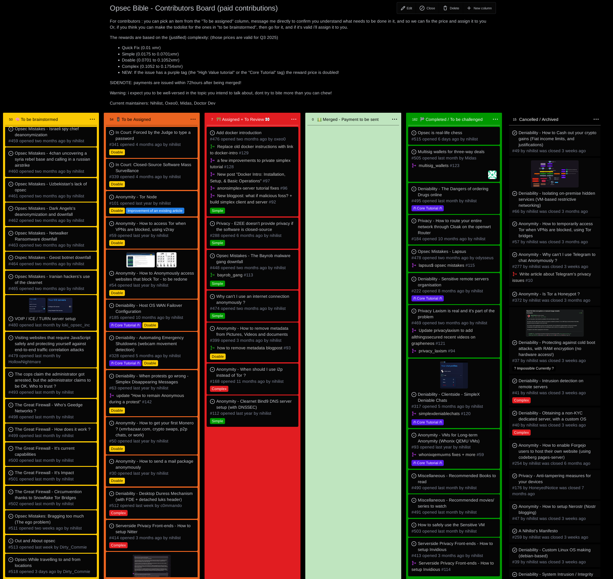
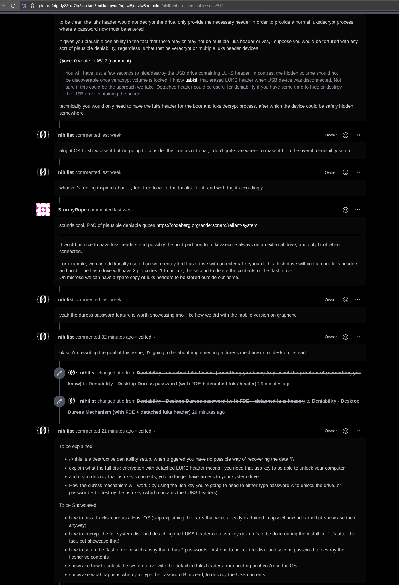

# How to write good Criticism 

```
TLDR: stick to what was said, accurately explain what was missed and what should have been explained instead. And obviously keep your ad hominem to yourself, argue like an adult.
```

In this tutorial, we're going to cover how you can contribute as a reader, by effectively criticizing the blogposts we wrote, in order to help us find what we overlooked so that we can fix it.

Message to everyone that ever wrote, and will ever write criticism regarding the blogposts we wrote so far: **Go ahead, if you are closer to the truth than we are, you're more than welcome to tell us about it and why, but if you want to get your point across efficiently, you have to learn how to criticize like an adult.**


## **Nobody knows everything**

First of all, i'll clear up a misconception that people seem to think far too often: **No, [i don't know everything.](../../productivity/scio-nihil/index.md)** In fact noone does, don't pretend otherwise. There is a reason as of why we are welcoming criticism on all of our blogposts: **we are aware that we don't know everything, and we strive to know as much as we possibly can.**


Just because you managed to fill your head (this bucket) with water from the ocean (knowledge from a particular topic), **doesn't mean that you managed to empty the whole ocean into your bucket.** Nobody knows everything, myself included, and yourself included. Yeah i know, it's hard to admit sometimes.

Our tutorials aren't perfect, and we're never going to pretend that they are. **There's always room for improvement, so you're more than welcome to send us criticism to let us know what we missed.** And if your criticism is valid, we'll listen and update the tutorial accordingly. 

Thing is, you also need to know how to criticize correctly if you want us to actually improve what we're doing. (if you're not criticizing correctly, all you're making is just noise and contributing to the problem, rather than putting in a little more effort to contribute to the solution that we're trying to bring to the table.)

## **Graham's Hierarchy of Disagreement**

I'll have to heavily quote Graham's [excellent blogpost](https://paulgraham.com/disagree.html) on the matter, because there is a hierarchy to argue about something, and contrary to what most people think, you can also do so respectfully (**which means that you can argue like an adult, instead of argue like a child**).


First of all it's a matter of maturity. If you're an adult and your ego is still in the way, refer to [Sum Nihil](../../productivity/sum-nihil/index.md) to fix it. **Because otherwise you're most likely going to be incapable of stopping yourself to resort to ad hominem on the way.** I saw that happen way too often, which is a clear shame.

Proper communication is very important if you wish to convey your perception to someone else. In our usecase where we have blogposts relating to operational security, if we are wrong anywhere along the way, **there's potentially an entire reasoning, context, logic, purpose, and setup to dismantle and criticize**. 

## **Low-Quality Criticism**

**- Level 0: At the lowest level (Name-calling)** you can call me a dumbo jumbo and meanie, but in the end you're just throwing a tantrum because you don't like me. I think you can avoid polluting whatever public place you have found to do that and grow up a bit, you'll save everyone's time.

**- Level 1: (Ad Hominem)** you can also criticize my characteristics and pretend that i am too young to know more than you, Oh, the mighty all knowing. you're doing the same thing as the above but you're also trying to puff up your own ego at the same time. Dishonesty in arguments is sadly way too common, it's can be subtle and imperceptible for the ones that aren't trained to notice it. 
    
    
    [...] We still sometimes see deliberate dishonesty, as when someone picks out minor points of an argument and refutes those. Sometimes the spirit in which this is done makes it more of a sophisticated form of ad hominem than actual refutation. For example, correcting someone's grammar, or harping on minor mistakes in names or numbers. Unless the opposing argument actually depends on such things, the only purpose of correcting them is to discredit one's opponent.
    
    Truly refuting something requires one to refute its central point, or at least one of them. And that means one has to commit explicitly to what the central point is.
    
    

**If all you can think about is how to win the next argument, then you're not a truth seeker, You're just desperatly trying to protect your ego.** I was once like that to be clear, but i grew out of it. Everyone can grow out of it. You just have to be willing to leave your insecurities behind to be able to move forward.


A real truth seeker will not restrain himself to only his perception of the truth, but he'll also seek to percieve the truth from as many different perceptions as possible. **There's no such thing as possessing the absolute truth, we're always seeking it, always getting closer to it without ever attaining it.** Operational security requires combining different perceptions to be able to achieve privacy, anonymity and deniability. It takes a while to get used to percieving what we're talking about from all the different angles, and ways of percieving the showcased setups. You have the adversarial point of view, the anonymity sets, the public surveillance, the forensic evidence you leave behind, the complexity of the setup, who can pull it off, etc. **Stay open minded, like us, because you may have missed something.**

**- Level 2: (Responding to the tone)** you can also criticize how arrogantly i wrote what i wrote and how i pretend to know more than you, but still even here you're not even addressing the actual content that i wrote. Again, all you're doing is just noise still.

If this is what you think criticizing is about, you need to realize that all you're trying to do is paint yourself in a good picture, and paint the other side in a bad picture, and in a lazy way too. If you act that way, all you're doing is just being obvious in showing off your lack of maturity. Feel free to do that, but don't expect me to listen to what you have to say afterward.

**- Level 3: (Contradiction)** For example, **if you start to say that using closed-source software is suitable for private use without explaining why** , like how the moderators at privacy guides are doing, you're not helping either. Just because you're a moderator of a privacy laxism forum **doesn't mean that affirming the opposite of what an entire blogpost says without explaining why is going to disprove anything.**


This is an example of a very low effort criticism, it simply highlights that one party has a ton of compelling arguments and while the other one doesn't, they don't even care about defending their point. **In this particular contradiction, the other party is downplaying the requirements to achieve privacy,** implying that being spied on by the government or corporations is acceptable, when in fact it is not. **This is also known as a Minimization Fallacy**.

The other extreme of this type of fallacy would be **spreading [FUD](https://en.wikipedia.org/wiki/Fear,_uncertainty,_and_doubt) (Fear Uncertainty Doubt)** like in [this article](https://tottnews.com/2024/09/25/tor-web-browser-cracked/):


it is a disinformation technique simply aimed at spewing bullshit without any proof to back up one's claims, because according to [Brandolini's law](https://en.wikipedia.org/wiki/Brandolini%27s_law), also known as the bullshit asymmetry principle:
    
    
    The amount of energy needed to refute bullshit is an order of magnitude bigger than that needed to produce it.
    
    

Nowadays, where everyone (including journalists or sunday privacy laxists) can have their uneducated say on everything, **it is because of idiots that can't shut up that we are swimming in an ocean of bullshit where actual quality is buried 10000 feet below the surface.** It is an herculean task to untangle everyone's blatant lack of education, but lucky for you we're not lazy blogposters, this blog is here to preserve quality, when we're wrong we admit it, learn from it, adapt and rewrite accordingly to get closer to the truth. **We won't give in to FUD, or any minimization fallacy whatsoever** , Therefore stay true to your logic and reasoning, base yourself on facts, not opinions or beliefs.

Don't just contradict what we say, bring reasoning, arguments, logic, data and links to those to the table when you do so because otherwise you're just ignoring the argument completely. **Legit Criticism takes more effort like in the examples below, where we will definitely listen:**

## **High-Quality Criticism**

**- Level 4: (Counterargument)** For example, if you had read the previous Sensitive VM Setup tutorial i wrote, you'd realize that the crucial Host OS live mode requirement wasn't even covered, instead i was recommending a particular script to wipe off the forensic traces regarding the presence of the VC hidden volume. Therefore, as someone correctly did so, they added me on SimpleX to send me the following (valid) criticism:


In this case it's an absolutely valid criticism which definitely makes sense, since it simplifies the previous setup by removing the use of that wipe.sh script, and by not even requiring to install the veracrypt software. In that case i scheduled the changes for multiple tutorials, and came up with the following 4 updated tutorials to take this criticism into account: [[0]](../linux/index.md)[[1]](../livemode/index.md) [[2]](../veracrypt/index.md) [[3]](../sensitivevm/index.md). **One valid criticism can have an effect on the entire Opsec Bible like this one, since there are alot of blogposts that are inter-dependant.** In this case, since the Host OS had to change, i rewrote the Host OS tutorial, the hypervisor tutorial, the veracrypt tutorial and ultimately the sensitive VMs tutorial accordingly to be able to match the criticism that was sent to me.


**This is the minimum for me to consider your feedback and do something about it.** However if you want to bring some extra quality to your criticism, you can do the following:

**- Level 5: (Refutation)** You can first quote what i wrote (but i know what i wrote so you can simply link to the tutorial directly and i'll immediately know the context of what you're talking about), and then explain exactly why it's not correct. **Ideally if you're basing your criticism on external sources, also post links to those resources that explain further what you're talking about**, so that i get the full picture: 


**- Level 6: (Refuting the central point)** If you actually care about me improving my tutorials, cut out all the bullshit you see from level 0 to level 3 and **just stick to refuting what i wrote, explicitely.** wheter it be the reasoning behind the tutorial, the explanations, the showcased setups, or the purpose of any of the tutorials. **However, for every criticism that you make, also let me know how you think the blogpost could be improved.** Tell me how you'd improve the tutorial if you think the solution i presented is not good enough (or not simple enough) like in the example above.

This is the whole premise behind Truth seeking, I strive to have the most correct perception of the subject, but in the end that's my perception. If we combine multiple correct perceptions of the same topic, we are getting that much closer to the truth than we previously were, now that we have a wider, clearer perception of what we're talking about.

And that's it! You now know how to send valid criticism, **and you now know how to do it like an adult**. By doing so you can effectively contribute to the overall project by helping us continuously improving our blogposts.


# Where can I send the criticism ?

Either on our [Opsec Simplex Chatroom](nowherejezfoltodf4jiyl6r56jnzintap5vyjlia7fkirfsnfizflqd.onion/simplex.html), as explained on our blogpost regarding [the nowhere community](../thenowherecommunity/index.md):


But ideally on the forgejo git instance: 


Especially on the issues [on the Opsec bible project board](http://gdatura24gtdy23lxd7ht3xzx6mi7mdlkabpvuefhrjn4t5jduviw5ad.onion/nihilist/the-opsec-bible/projects/1):



Just go on any of the issues in there (and if it doesn't exist yet, [just create it](http://gdatura24gtdy23lxd7ht3xzx6mi7mdlkabpvuefhrjn4t5jduviw5ad.onion/nihilist/the-opsec-bible/issues/new)) and simply write what you think was missed / what is incorrect / what should be improved or rewritten, preferably using the todolist structure we previously showcased on our [quality standard.](../qualitystandard/index.md)


    to be explained: (WHY + WHAT)
    -
    -
    -
    
    to be showcased: (HOW)
    -
    -
    -
    -

Here's an example of a new issue that someone in the community created, which got accepted since it's about [showcasing a duress mechanism](http://gdatura24gtdy23lxd7ht3xzx6mi7mdlkabpvuefhrjn4t5jduviw5ad.onion/nihilist/the-opsec-bible/issues/512) that wasn't explored in the blog up until now:


