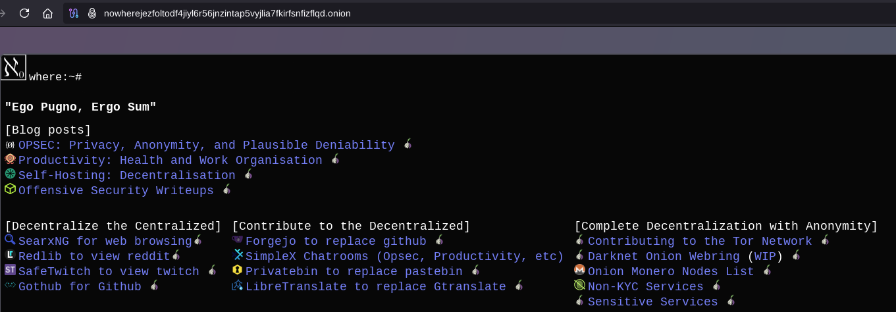
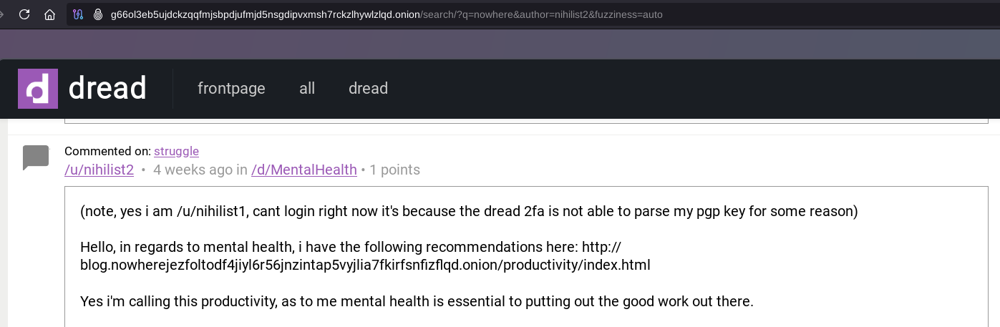

# How to explore the Darknet? (Visibility and Discoverability)

```
TLDR: bookmark onion websites, use link onion aggregators, gossip on forums / chatrooms about onion links, and use Darknet lantern to contribute to listing onion websites.
```


In this tutorial we're going to take a look at what are the differences between the clearnet and the darknet, and how you can explore the darknet using the lantern project. 


## **The difference between the Clearnet and the Darknet**

To help you visualize the differences between the 2 better, you can consider the clearnet to be like a city in open air (A city being the size of France in the world let's say)


Due to being like an open city, you can go in a plane, and potentially with enough bruteforcing power to check every IPV4 out there (if you're google.com, shodan.io, duckduckgo.com, bing.com, etc) you are able to list every clearnet website, AND you know where they are (since they are reachable via their ipv4 directly). 

The problem of the Clearnet is that you need to deanonymize yourself at some point to have a place there. You need to go through a Registrar and pay them to get a clearnet domain, you need to go through a cloud provider and pay them aswell to get a server (like a VPS), and by default you are not anonymous when accessing that website, and neither are your users.

Therefore, due to the nature of the clearnet itself, as we have explained [previously](../clearnetvsdarknet/index.md), every clearnet website has a very wide attack surface: 
    
    
    The Adversary can:
    - order your clearnet domain to be taken down by subphoenaing the registrar
    - order your VPS to be taken down by suphoenaing the cloud provider
    - harrass you directly as they can log who connected to the website
    - harass your users directly as they know who connected to the website.
    
    


On the other hand, the Darknet is fundamentally different. You can visualize it like being an IMMENSE dark forest that covers the entire earth:


you can't just go by plane to try and figure out where every website is, because 1) the dark forest spans the entire earth and 2) because your plane can't see if there's a valid destination to go to in between the trees. **The only way is to know which .onion destination is valid, is to be told where to go by other people that have been there.**

It is very unrealistic to try and bruteforce every valid onion vanity v3 addresses, because they are 56 characters long. And moreso it is not possible to bruteforce every hidden service out there because you don't even need to have a VPS with an exposed IPv4 address. **All you need is to have a device, with an internet connection and you can have an onion domain, for free, and you own it forever.**

Not to mention the benefits of running a hidden service, where even if the adversary visits your hidden service, they can't tell where it is located because they need to go through the Tor network to access it, as they can't access it via the IPv4 directly, you don't even need to expose an IPv4 address to have a hidden service. **by using Tor, Anonymity is there by default for both the client visiting the website, but also for the website itself.** The client can't know where the website is, and the website can't tell where the client is coming from.


The Darknet offers a drastically reduced attack surface, **Which means that if an adversary wants to take down your hidden service, they can't go bother a registrar to take down the domain, because there isn't any, they can't go bother a cloud provider to take down the server because there potentially isn't any either** , the only way for an adversary to figure out where the server potentially would be to figure out where it is located [by temporarily powering off the internet access.](..//high_availability/index.md) somewhere in the world.

In other words, the adversary has to go do some drastic guess work, **they have to go into the deep dark forest that spans the entire earth, in order to randomly stumble upon your server that runs your hidden website.** It's extremely expensive to try and deanonymize where a hidden service is, which is the whole point of using Tor. 

If you want to host your own onion website, check out [this tutorial](../torwebsite/index.md) i wrote on to know how to get your own custom vanity v3 .onion domain.

## **The elephant in the room: Visibility on the Clearnet**

Now let's address the elephant in the room, **Visibility.** As right now this is where the clearnet shines compared to the darknet.

If you want to know where to go on the clearnet, you have search engines like google, duckduckgo, qwant, bing, and a few others. The problem as you probably guessed, is that it's VERY expensive to run a search engine, especially on the diskspace side. These search engines are being ran by large businesses, and it is only those businesses that get to decide who gets visibility and who doesn't. And since the larger the business, the more likely they are acting on behalf of governments, you end up with **today's clearnet: a corrupt industry where a few businesses get to decide who gets to have a presence (and visibility) on the clearnet, who doesn't, and who even gets to be thrown into the meatgrinder** due to how vulnerable everyone is on the clearnet.

To try and do [Search Engine Optimisation (SEO)](https://developers.google.com/search/docs/fundamentals/seo-starter-guide) is to play into their twisted game with their twisted rules, it requires any number of steps that require you to deanonymize yourself fully, to add trackers on your website, implement analytics, link your website on social media where people put everything about their daily lives. **Everything about the clearnet is geared towards making yourself as vulnerable as possible to be able to have a bigger presence there.**


What you're looking at here is effectively a widespread public speech, public opinion, and public thinking control platform. **The clearnet is where those that don't fit the narrative get less visibility, and those that go against the narrative are made vulnerable, and ready to be thrown under the bus.**

I don't consider that ecosystem to be tolerated, nor endorsed. So the only option is to opt out like we did at Nowhere:


so you first get rid of your websites' clearnet presence by redirecting your audience to the darknet link of your website instead:



## **Darknet Visibility - Option A: Peer-to-Peer Gossip**

From there, what are your options to grow your website's visibility ? Truth is, right now there aren't that many options.

The most basic way you can do it is that you can go on popular forums and communities that have large audiences to let users know that you are running your onion website:



Don't hesitate to do so especially when you have value to add to a community that has been misled:


Going on communities' chatrooms is also a viable option to get that peer-to-peer organic visibility growing:


You don't need anyone's approval to post a link to your own website, you can always find discussions online to slip your onion link in there for the users, even if the administrators of said community don't like what you have to say, their audience probably does want to hear it regardless.

The use of Tor and the darknet doesn't need to be demonzied. You are simply allowing people to remain safe to view your content.

## **Darknet Visibility - Option B: Lists of Links**

Your other option for darknet visibility is to run your own lists of links like those websites do: [[1]](http://kycnotmezdiftahfmc34pqbpicxlnx3jbf5p7jypge7gdvduu7i6qjqd.onion/) [[2]](http://darkfailenbsdla5mal2mxn2uz66od5vtzd5qozslagrfzachha3f3id.onion/) [[3]](https://daunt.link) [[4]](http://tortaxi2dev6xjwbaydqzla77rrnth7yn2oqzjfmiuwn5h6vsk2a4syd.onion/)

   

This is a fundamental trait of the darknet, **you actually depend on those people running their own lists of darknet .onion links for their visibility, and your discoverability of those websites.** Currently this is the most popular way to get visibility on the darknet, people trust a few websites to run and maintain their own lists of links, and the more people trust them, the more visibility those websites get.

The problem is that **the visibility of the listed websites is limited to the size of each individual community.**


Let's say that you are Alice, with currently a small community of 100 people, and you want your lists of links to be visible to more people, you have to go ask Bob (and his 100k followers) or Charlie (and his 100M followers) to add a link to your community on their lists of links to be able to grow your visibility.

And here we i am being very optimistic, it's very unlikely that you'll find a darknet community with millions of followers. **It is much more likely that most darknet communities are only hundreds of followers big, and that there are thousands of small communities like that, that not even aware of each other.**

And that major problem is what has motivated me to create the Darknet Lantern project that i just officially released.

## **Darknet Visibility - Option C: The Darknet Lantern Webring**

So you are the average joe out there, you have your own darknet .onion website, but now you want visibility, now thanks to [the Darknet Lantern Proejct](http://gdatura24gtdy23lxd7ht3xzx6mi7mdlkabpvuefhrjn4t5jduviw5ad.onion/nihilist/darknet-lantern) you have a third option to solve that problem: **Participating in a Darknet Webring.**


The idea of participating in a Webring is that you are linking to other communities just like yours, **to make sure that these communities are not isolated from your community.** It depends on which point of view you are looking at it, if you are joining the webring as Charlie, you already have 100M followers so you don't really care about getting 100k followers more. **But if you are joining the webring as Dave, you only have 10 followers, and now you are potentially exposing yourself to a massive increase in visibility to up to 100 million potential followers** , thanks to charlie having the biggest community in the webring.


The Darknet Lantern project enables you to run and maintain your own list of onion links like the other websites we showed in the previous section. See for example my Darknet Lantern instance [here](http://lantern.nowherejezfoltodf4jiyl6r56jnzintap5vyjlia7fkirfsnfizflqd.onion/):


There are 2 main parts: the search feature, and the webring part at the bottom, where every webring participant is listed with their banner images. You can either search for links by typing a keyword in the searchbar, or simply click one of the categories at the top, as they are dynamically displayed:


In [the next tutorial](../darknetlantern/index.md) we're going to cover how you can setup your own Darknet Lantern Instance, how you can maintain your own list of onion links by using it, and how you can join the darknet webring aswell to exponentially increase your websites' visibility.

