# Introduction
To thrive in clandestinity over the long term requires strict OPSEC procedures and provisions.
To be resilient requires preparing for the worst and making sure that systemic threats are not existential
for your organization.
In this article we will discuss an old concept: the dead man's switch and present a modern implementation
based on the [SimpleX alerter](../simplexalerts/index.md).

## Dead man's switch: definition
A [dead man's switch](https://en.wikipedia.org/wiki/Dead_man%27s_switch) is a device designed to activate if its
operator is incapacitated. There are many examples in everyday life:

- On chainsaws and heavy machinery: unless a button is kept pressed, the machine shuts down to prevent injuries
- On strategic bombers ([SWESS](https://en.wikipedia.org/wiki/Special_Weapons_Emergency_Separation_System)) to prevent nuclear weapons from being appropriated by foreign entities shooting the plane down
- On the internet: release an encrypted document and prepare an automated system to publish the decryption key unless you regularly do a specific action

## Usage in clandestine orgs
In a clandestine organization, as covered at length on this blog, privacy and anonymity are paramount. If you don't have that, then environmental and systemic risks become existential issues that could
very easily result in your org being wiped (with or without any involvement from your adversary). An example of a systemic risk could be your [bus factor](https://en.wikipedia.org/wiki/Bus_factor): if anyone
in the org gets hit by a bus, what's the worst that could happen for the org at large?

**In a clandestine operation, should the main administrator be arrested the whole org is at least hobbled, without an inheritance procedure it becomes crippled. It is thus necessary for a secondary admin
to receive all the keys to the sensitive services infrastructure should the main admin get busted**

# Example Org

For the remainer of this article we will examine a fictional clandestine operation: the "Botanists, Ornithologists and Zoologists Operating on Subversion", BOZOs hereafter.
This is a small organization

## Assets
The BOZOs are very aware of opsec principles and operate on strict [need to know](https://en.wikipedia.org/wiki/Need_to_know) and [least privilege](https://en.wikipedia.org/wiki/Principle_of_least_privilege) principles.
Having read our fine blog, they communicate through [SimpleX](../simplexdeniablechats/index.md). To work together they have several assets:

- several dedicated anonymous servers with [non kyc providers](../anonymousremoteserver/index.md), [running](../privatesimplex-server/index.md) [hidden](../hiddenservice/index.md) [services](../anonsimplex-server/index.md) and [monitoring](../anonymous_server_monitoring/index.md)
  - managed by Alice
- a [shared](../multisig_wallets/index.md) [monero wallet](../monerowallet/index.md), (2 agreeing among Alice, Bob and Charlie required to move funds)
- encrypted [PGP](../pgp/index.md) keys
  - one PGP key for org communications, managed by Bob
- An org account on [dread](http://dreadytofatroptsdj6io7l3xptbet6onoyno2yv7jicoxknyazubrad.onion/) for recruitement of future BOZOs
  - managed by Charlie

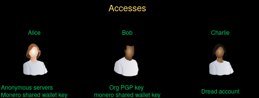

All those assets are critical for their org's mission:

- Without their dedicated servers
  - no communications
  - no coordination
  - no alerting against attacks
- Without their monero wallet
  - no funds enabling their operational capabilities
- Without their PGP key:
  - no way to authenticate communications to the outside world
- Without their dread account:
  - no way to recruit new BOZOs for the cause

### No dead man's switch

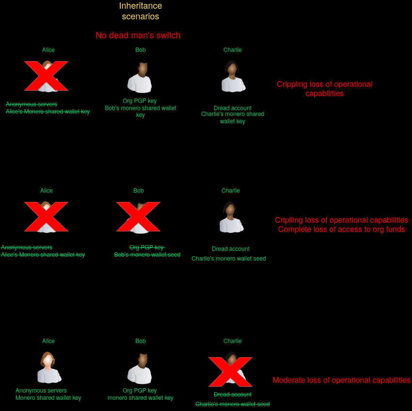

If any one of the team gets caught, the org is crippled:
- Alice gets caught: no access to their infrastructure, eventually payment will lapses and the servers get deleted
- Bob gets caught: no way to authenticate their communication to the outside world, claim the fame for their public actions
- Charlie gets caught: no way to recruit new BOZOs

If any two of the team get caught, on top of the previous issue, we **also** have the now inaccessible monero wallet to consider.

### With dead man's switch

If every member prepares a deadman's switch with the following items:
- their monero wallet seed
- a file with their credentials

then, if they get compromised or captured the remaining members can keep the organization running, because the dead man's swwitch will ensure that the critical accesses of the compromised member get forwarded to the member chosen to replace them, their heir.

#### Special security measures
For increased security, the dead man's switch file (DMS file hereafter) should be encrypted with the other participants PGP keys, so any of them could decrypt it and no one
but the intended recipients make use of it (if sent in a channels with members of different levels of clearance, this would be required).

Furthermore, survival in a critical phase (during the inheritance process) **hinges on the bot's availability**. As such it should fulfill the following requirements

- be hosted on a [VPS](../anonymousremoteserver/index.md) that is separate from the main infrastructure (different account, provider, location) as to not be taken down with the rest of the infra in case of a compromise
- be [monitored](../anonymous_server_monitoring/index.md) and supported with appropriate alerts in case it should become unavailable

## Algorithm Overview
Here is a [Drakon](https://en.wikipedia.org/wiki/DRAKON) diagram of the dead man's switch logic.

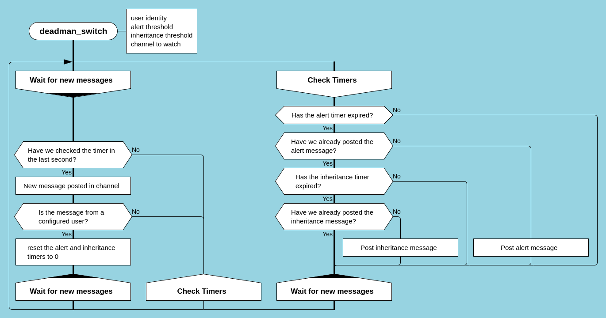

## Setup

### SimpleX
To get started, we are going to create a simpleX Group

### Preparing an inheritance file

We will prepare a dummy inheritance file for Alice, encrypted with Bob's and Charlie's public key so only them can decrypt it and take over operations:

~~~
[alice@alice-pc:~]$ mkdir inheritance_data                                                                                                                                                                    
                                                                                                                                                                                                                                            
[alice@alice-pc:~]$ cd inheritance_data/                                                                                                                                                                      
                                                           
[alice@alice-pc:~/inheritance_data]$ tr -dc 'A-Za-z0-9' < /dev/urandom | head -c 1024 > random.txt

[alice@alice-pc:~/inheritance_data]$ cat random.txt 
5Y6UeqXwMuDphVMGtvLlTuGm8jUS8SwyTf9bsjCmuL1k7PjmrHYdycwxVOQAooX9PsNsxAnPjuE6DS10Frfcnm05CPTBpixst5iEcHrmWxzlG89rKEQ6p9TVXrbSP2GlKbMVmy6tj4vp47CDZ7lHYyvcrPaDzVk3fsS0JMGSdXkb5ElKopb8nXCH70k5Z3k3KnaGqsxuHX8elvXUHL4CTJHzg7ttQfGEv4IUDXM6j5RE
vtSJaGp0gdi0OQJ7ju0arLVuBNBAqmTuvwslJtawYgi8wGyTAkq0kHxIGB5Gx3A6B7JuptZPvFNLRfQgCimWnPWSpDwrzbJJzgrHTK3T7HPi3MRs5vjyw7DhrLxEMm3AaejQZGvOwH55zFL75iwvEc3GfFlIrxvaAy6SPRzVh3GsV2Gd9CJP2sQVjBDM3tmFzMCg3T0MRWlZ9ugVSpQ2U2fmuyvmCsIRCLQ1QSvCUaBH
QbsvKyLkDH1PUSglpg783u9wsJFQFjJ0kAbQz36N5xlNIxqwTdXWfCZFxIxnf2kunacKezYlS9qQZt9qeYInqmsNnWoK3LMwPj3IE4SSqHJFAWfgLa0K7bO8tlx15YqU7aGr5wAjG5Eoisp4UqsFacD4TotRoKN6YtkH1aq5U50z3g8CbBWUSPhukL2jDBj7P8i9faQ7nim15J1H7jR4koj5qWKqZx3NzSVCPEYEDkBC
XqdE8Mo7n4xhWRVY0dqMV9AcSP0PxAxHTIjLLxz1Ow6oGGrlB0bvZL1GqVWnpFnkv1dwBvOI4IQI2LDz2y13dBDScAtwwJDfNvzDNq0L3ECgnLOo7XaJ5ACoyjTjFayNsa9P1a1Nx7jLts7v9rSptUWPOmPRfknGa6VGS32bTLFfstLQIxPtArCmcvAgToRnZtYPtBoZmglBS3gbdbiovPO2WFEAvwjIryZG2MmpJ7Mk
8y2NZTTmMqVpeSl3HXRe6z9noQucsRCOeiRrMtZn2AZ9Sb2ZEW8kxXXSWOzH28hQcYiWFLlq6MFxBDnj
[alice@alice-pc:~/inheritance_data]$ tr -dc 'A-Za-z0-9' < /dev/urandom | head -c 1024 > secret.txt

[alice@alice-pc:~/inheritance_data]$ cd ..

[alice@alice-pc:~]$ zip -r alice_secret_file.zip inheritance_data/
  adding: inheritance_data/ (stored 0%)
  adding: inheritance_data/random.txt (deflated 23%)
  adding: inheritance_data/secret.txt (deflated 23%)

[alice@alice-pc:~]$ gpg -r bob@bozos.onion -r charlie@bozos.onion --encrypt alice_secret_file.zip 
gpg: 7AE47[snip]: There is no assurance this key belongs to the named user

sub  cv25519/7A[snip] 2025-02-16 bob <bob@bozos.onion>
 Primary key fingerprint: [snip]
      Subkey fingerprint: [snip]

It is NOT certain that the key belongs to the person named
in the user ID.  If you *really* know what you are doing,
you may answer the next question with yes.

Use this key anyway? (y/N) y
gpg: AE39B[snip]: There is no assurance this key belongs to the named user

sub  cv25519/A[snip] 2025-02-06 bob <charlie@bozos.onion>
 Primary key fingerprint: [snip]
      Subkey fingerprint: [snip]

It is NOT certain that the key belongs to the person named
in the user ID.  If you *really* know what you are doing,
you may answer the next question with yes.

Use this key anyway? (y/N) y
[alice@alice-pc:~]$ ls
alice_secret_file.zip alice_secret_file.zip.gpg
~~~

#### What we did
1. create a folder for the data
2. create random content from /dev/random to simulate files such as keepassX vaults and so on
3. zip this folder and its contents in a single archive
4. encrypt this archive with both Bob's and Charlie's public keys so they can access it should the inheritance system get triggered

# Dead man's switch

## Overview of the inheritance process

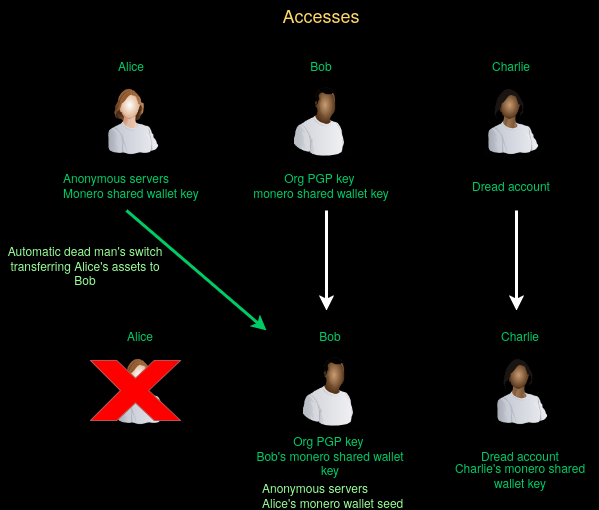

## Running the alerter

1. Clone the alerter [repository](http://gdatura24gtdy23lxd7ht3xzx6mi7mdlkabpvuefhrjn4t5jduviw5ad.onion/Midas/simplex-alerter):

~~~
[alice@deniably-rented-vps:~]$ git clone --config http.proxy="socks5h://127.0.0.1:9050" http://gdatura24gtdy23lxd7ht3xzx6mi7mdlkabpvuefhrjn4t5jduviw5ad.onion/Midas/simplex-alerter.git alerter
Cloning into 'alerter'...
remote: Enumerating objects: 1042, done.
remote: Counting objects: 100% (33/33), done.
remote: Compressing objects: 100% (30/30), done.
remote: Total 1042 (delta 7), reused 0 (delta 0), pack-reused 1009 (from 1)
Receiving objects: 100% (1042/1042), 186.63 KiB | 163.00 KiB/s, done.
Resolving deltas: 100% (625/625), done.
~~~

2. Create your build environment and build the alerter

~~~
[alice@deniably-rented-vps:~/alerter]$ cd alerter
[alice@deniably-rented-vps:~/alerter]$ docker build . -t builder
[...snip...]
[alice@deniably-rented-vps:~/alerter]$ docker run --rm -v $(pwd):/src builder
[...snip...]
[alice@deniably-rented-vps:~/alerter]$ docker load < simplex-alerter.tar.gz
~~~

3. Move your secret files to the current folder

~~~
[alice@deniably-rented-vps:~/alerter]$ mv ~/alice_secret_file.zip.gpg .
~~~

4. Create a simpleX room and invite Bob and Charlie

Click on the pen shaped button

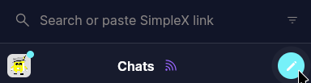

Click on create group

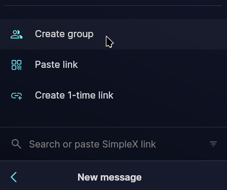

Name your group and then click on Create Group

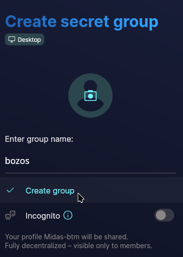

On the invite members tab that opens automatically, should which member should join the group at creation. In the present case, Alice is creating a dedicated Channel with Bob and Charlie so they can
inherit her accesses should she get busted

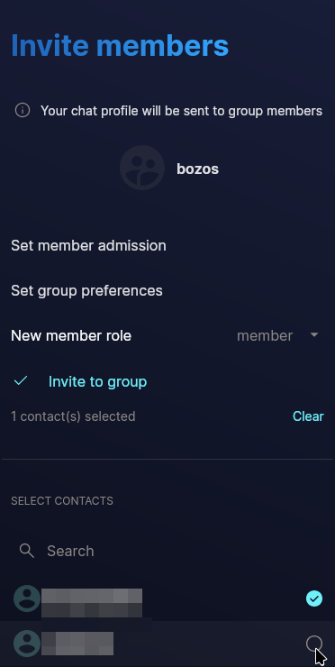

Click on the three dot menu at the bottom right corner

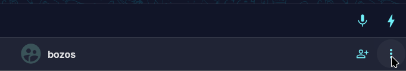

Click on create group link

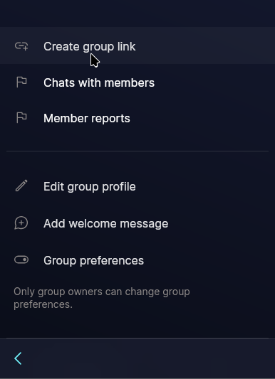

On the last step, click on "share link" and put it in the configuration file next to invite_link

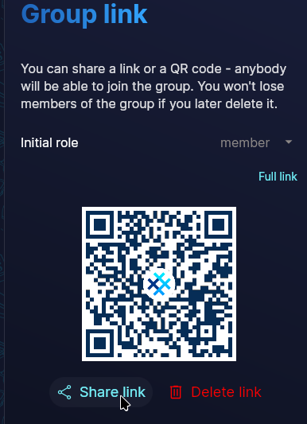

5. Create the config.yml file

The dead man's switch is a feature of the [SimpleX alerter](../simplexalerts/index.md). The setup is exactly the same as in the linked article **except for a new section in the configuration file: deadmans_switch**

~~~
[alice@deniably-rented-vps:~/alerter]$ vim config.yml
[alice@deniably-rented-vps:~/alerter]$ cat config.yml
alert_groups:
- invite_link: https://smp11.simplex.im/g#zPoErCgNgc__Yen[snip]
  endpoint_name: clandestineInfraAlerts
  group_name: "BOZO's base" #set this if the group name configured in simpleX is different from the endpoint name used for alerts
deadmans_switch:
  Alice:
    group: "BOZO's base" # same groupname as above
    alert_threshold_seconds: 604800 #alert on one week of inactivity
    alert_message: "Alice has been offline for a week, inheritance will happen if she remains offline for 3 weeks"
    trigger_threshold_seconds: 1814400 # trigger inheritance after 3 weeks of inactivity
    inheritance_filepath: "/alerterconfig/alice_secret_file.zip.gpg"
    inheritance_message: "Alice has been inactive for three weeks, here is the inheritance data she prepared. Godspeed to her."

[alice@deniably-rented-vps:~/alerter]$
~~~

5. Run the alerter
~~~
[alice@deniably-rented-vps:~/alerter]$ vi docker-compose.yml
[alice@deniably-rented-vps:~/alerter]$ cat docker-compose.yml
    services:
      alerter:
        image: simplex-alerter:latest
        container_name: alerter
        restart: unless-stopped
        ports:
         - '127.0.0.1:7897:7897'
        volumes:
          - /home/alice/alerter:/alerterconfig
 
[alice@deniably-rented-vps:~/alerter]$ docker compose -f docker-compose.yml up -d
~~~

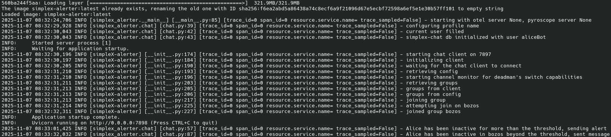

6. Now wait for the specified time in your group and watch the alerts and secret files get posted as the BOZOs are slowly and methodically annihilated by their adversaries

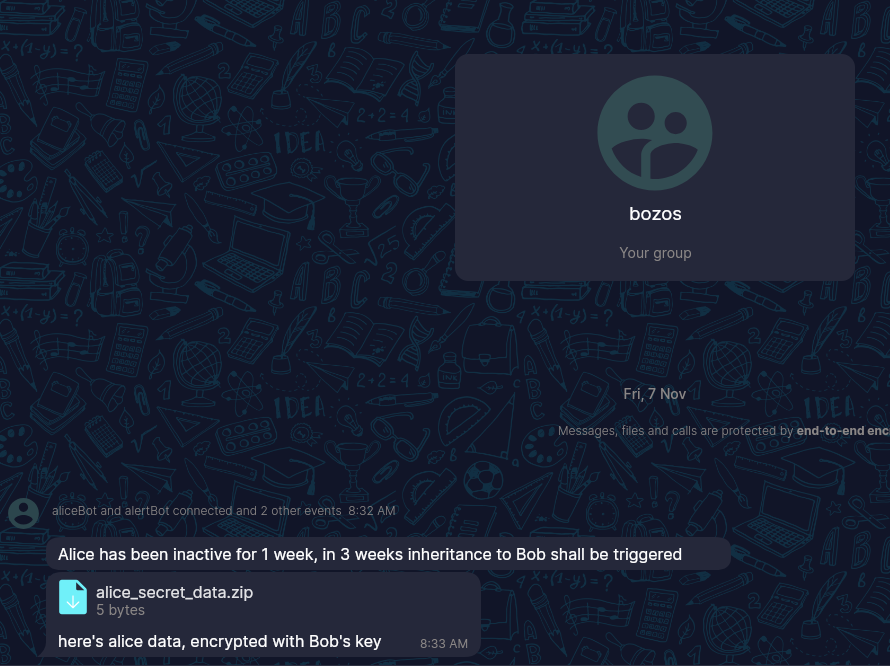

To download the file, click on it and SimpleX will prompt you for where to save it

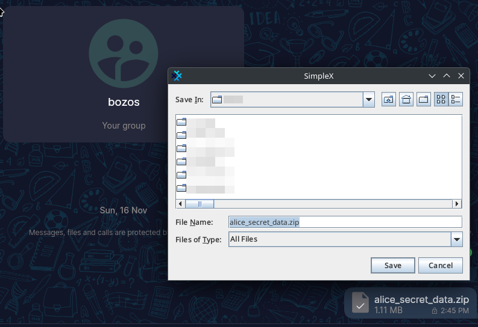

7. Bob or Charlie can now decrypt the data

~~~

[Bob@bobs-computer:~]$ gpg -d alice_secret_data.zip > decrypted.zip
gpg: encrypted with rsa4096 key, ID [*snip*], created 2013-11-25
      "Alice <Alice@bozos.onion>"

~~~

Afterwards, Bob can just open the zip file to find Alice's secret data and operator's Keepass stashed there so he can take over her responsibilities.

# Conclusion
As we've seen, inheritance and their adjacent domains (such as loss of contact procedures in clandestine cell systems) are fundamental to a risk-based approach for any clandestine operation's OPSEC management system.
The SimpleX alerter tool and its dead man's switch feature offers a clean, easy way to implement just that. Furthermore it is not limited to the one user and group: you can set it up for any number of groups and, by way of
gpg encryption, ensure the confidentiality of your inheritance files.
