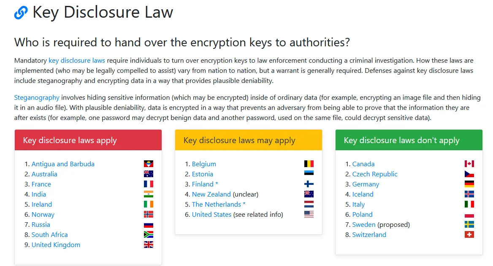

# What is Plausible Deniability ? Why is it Important ? 

```
TLDR: you need to also protect against the scenario where the adversary busts down your door and forces you to type a password. Need to make use of veracrypt's hidden volumes when that is the case, because you can deny that they even exist in the first place.
```


## **Encryption Provides Privacy**

Let's take our previous analogy to explain what Privacy is:
    
    
    Bob wants to talk to Alice, He wants the conversation to remain private, so he closes the door
    Jack can't spy on bob and alice's conversation, because the door is closed, 
    The door is closed, the conversation remains between Alice and Bob, their conversation is Private.
    	
    


For Alice and Bob to protect their conversation from being spied on by Jack, they encrypt their conversation for example by using [PGP](../pgp/index.md).


Here the most common usecase for encryption is for people to encrypt their system disk on their computers, because if someone (like jack) were to steal their computer, they don't want to read all of their data.


All in all, encryption is used to provide privacy. As long as the encrypted volumes are closed when Jack is trying to open them, Jack cannot read the contents of the volumes.

## **What happens when Bob is forced to give out his password ?**

Encryption however, cannot protect against everything.


In this case, Bob is legally, although questionably morally, forced to decrypt his encrypted system disk by the judge. Keep in mind that this is not a far fetched scenario, this has happened previously.

  1. in January 2012 ([source](https://www.wired.com/2012/01/judge-orders-laptop-decryption/))

  2. in Febuary 2009 ([source](https://www.cnet.com/tech/tech-industry/judge-orders-defendant-to-decrypt-pgp-protected-laptop/))


Now here there are multiple scenarios. Either you live in a country that doesn't respect human rights, and they torture you until you spit out the password, or the country you live in has to respect human rights, they throw you in jail for let's say 6 months, for contempt of court (arguing that you swore to tell the truth, and you lied about having forgotten your password), **which is also an attempt to break your will, to make you spit out the password.** the only problem is that they can't legally torture you any other way, so they have no other option than to do it like that.

If you are ever dragged into court, **the judge will appreciate much more if you actually hand over your laptop, and show that you are willing to cooperate with the authorities by providing your password to unlock it** , rather than starting to pretend you forgot your password (which can end badly like in [this court case](https://lawblog.legalmatch.com/2018/07/23/florida-man-jailed-allegedly-forgetting-password-on-cell-phones/), where the defendant was found to be in contempt of court, and thrown in jail for 6 months for it), 

When that is the case, simply encrypting the disk is not enough, as **all that is required is for the adversary to know of the existance of the encrypted drive, to be able to force Bob to open it**



As far as key encryption laws, the trend is that most developed countries are forcing their citizens to incriminate themselves and to surrender the encryption keys to authorities, when asked. In short,**If the encrypted volume is proven to exist, you can be forced to surrender the decryption key/password to open it.**

## **What if i destroy the evidence ?**

One common arguement that is being brought up is **"what if i destroy the data before the adversary can see it?"** lets see the following scenario:
    
    
    -You started doing sensitive actions on your [graphene OS phone](../graphene/index.md)
    -Somewhere you slipped up, and now the adversary is busting down your door and holding you at gunpoint, handcuffing you and taking you to the nearest station.
    -Now the adversary is telling you "by order of the judge, you are now going to unlock that phone."
    
    -But, you've got your ace up your sleeve, you configured **[a duress password](https://grapheneos.org/features#duress) on your graphene OS phone**, meaning that once you type that special password, the contents of your phone are irreversibly deleted, with no possible recovery.
    
    -You type the password, and the phone contents are getting deleted, right in front of the adversary. What now ? 
    
    

Now you are in a situation where the adversary knows that you intentionally destroyed the contents of your phone, **he knows that you do not intend to cooperate, and that on top of it you destroyed potential evidence**. Where do you think that get you in court ?

If you were just pretending to have forgotten your password, you'd be found to be in Contempt of Court (approx 6 months jailtime), But here from the point of view of the adversary, he's perceiving it as you knowingly and intentionally **[tampering with evidence](https://www.criminaldefenselawyer.com/crime-penalties/federal/Tampering-with-evidence.htm) which is way worse, as the sentences for that can go up to 20 years in prison.**

So in short, **you need it to look like you are cooperating with the adversary** , you must be able to give him a password, and when he unlocks the encrypted volume, he must find nothing incriminating about you, which is why we need deniable encryption.

## **Why is Deniable Encryption Vital?**

From a legal standpoint, the only way to be protected against that scenario where you're forced to decrypt your harddrive **is to be able to deny the existence of said encrypted volume (Plausible Deniability)** . If the encrypted volume does not exist, there is no password to be given for it.

So here we need a technology that can provide us Plausible Deniability. **That is what Veracrypt can do for us**.


In short, Veracrypt allows you to encrypt volumes, just like LUKS encryption does. **However it gives you the choice to hide another encrypted volume inside the same volume** , that is exactly what you can deny the existence of.

So you can hide some random meaningless data inside the decoy volume, while the real data that needs protection sits inside the hidden volume.

This means, when Jack forces Bob to open the vercrypt volume, Bob types Password A to open the decoy volume, Then, when asked by Jack, **Bob declares that there is no Hidden volume, and Jack has no way to prove the existence the Hidden Volume**.

To see how to implement Plausible Deniability protection with Veracrypt, check out this [tutorial](../veracrypt/index.md).

## **Live mode - Protecting your Deniability**

Now when there is an adversary busting down your door, running towards your computer to collect as much incriminating evidence as possible on you, you need to make sure that they are not finding anything incriminating on you. Thing is, if he were to seize your computer, there are many places he can check inside your computer for anything incriminating (system logs, kernel logs, non-standard log-files, the contents of the RAM, etc)

In the context of you using [deniable encryption](../veracrypt/index.md), **the adversary must not able to prove the existance of said encrypted volume** that you are trying to keep hidden. This is where using an operating system in live mode comes in the picture:


To make it short, if you start your operating system in live mode, **you are not writing anything on the system disk** , but rather **you are loading the entire operating system in the RAM**. Everthing that you write on the system drive while in live mode gets erased upon rebooting. 

The idea behind using live mode is that **every forensic trace regarding the hidden encrypted volume** that would normally be written into the system logs, kernel logs, and various other system files **(that we would normally need to manually clean up after closing the hidden volume)** will all be written into RAM instead of being written onto Disk, and then **will all be completely erased upon rebooting the computer.**

As you'll see in [this tutorial](../tailsqemuvm/index.md), we can make use of a VM's live mode to securely erase every trace of sensitive activity.

