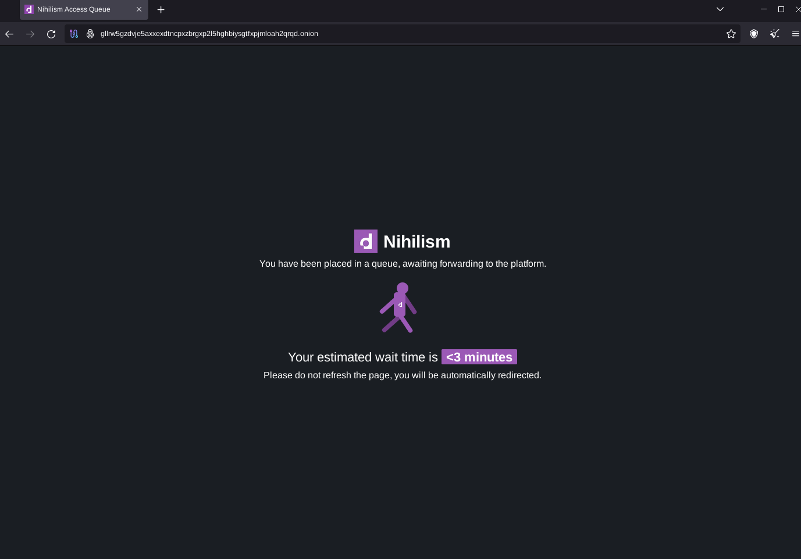
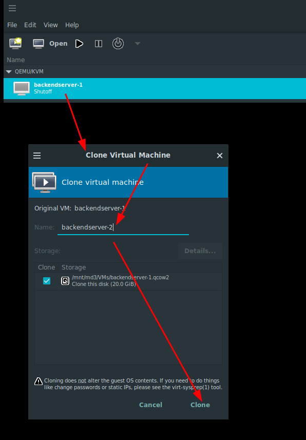
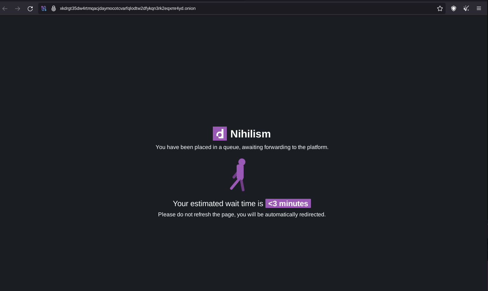
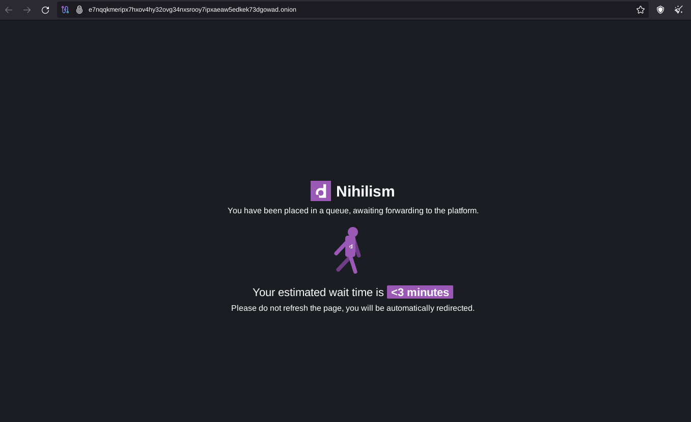
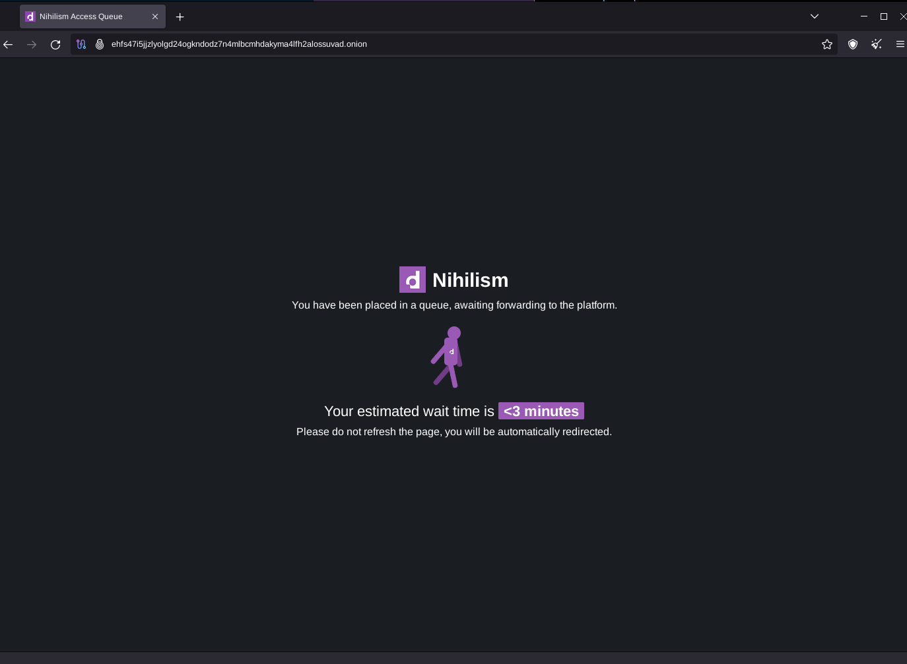
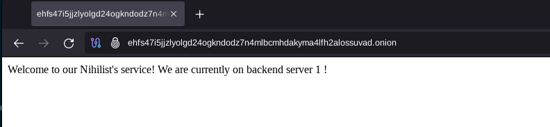
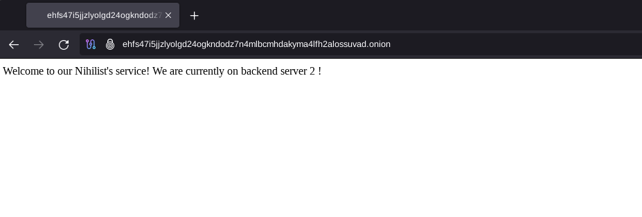

# EndGame V3 Setup 

```
TLDR: to protect against DDoS attacks against onion websites, you can setup Endgame as a shield to your onion websites, while also enable load-balancing to scale out the effort it takes to take your services down.
```


In this tutorial we're going to setup the EndGameV3 Anti DDOS / Load Balancer / WAF service popularized by Dread, it was originally built to block off the incessant [DDOS attacks](https://blog.torproject.org/tor-network-ddos-attack/) that onion services were facing. Because of that, EndGame was developed, along with the [Proof of Work (POW) Defense released by TorProject](https://blog.torproject.org/introducing-proof-of-work-defense-for-onion-services/) for more details you can click [here](https://community.torproject.org/onion-services/ecosystem/technology/pow/). 
    
    
    Endgame should be on a separate server to your backend server. It only proxies content from your backend to the user. You will still need to configure your backend to handle requests from the Endgame Front.
    
    This is the same system that anti-DDOS services like Cloudflare, Indusface, and Imperva use to protect websites from attacks. The difference is this is self-hosted and fully controlled by you for your own needs and made for darknet networks.
    
    

Now we'll first cover how to have a single Endgame V3 front, to redirect to 2 onion backends, but keep in mind that there is very high latency involved here. The ideal setup as we'll see later, is to have local redirection behind the Endgame front. And we'll also make use of the onionbalance technology to setup multiple Endgame fronts for the same Master Onion!


## **Prerequisites**

First of all you need at least 2 backend servers that are reachable via their .onion links. To set them up you can look at my tutorial [here](../torwebsite/index.md).

In this example we'll use my 2 main websites' onion links: 
    
    
    http://daturab6drmkhyeia4ch5gvfc2f3wgo6bhjrv3pz6n7kxmvoznlkq4yd.onion/
    http://nihilhfjmj55gfbleupwl2ub7lvbhq4kkoioatiopahfqwkcnglsawyd.onion/
    	
    

Obviously these are not the same service, but we'll pretend that they are. Now let's setup Endgame on a blank Debian 12 VM with internet access:

## **1 Endgame Front, 2 Backend Servers**

Let's first download the tar.gz file for endgamev3, and verify the sha256sum hash of the tar.gz file according to the original [post](http://dreadytofatroptsdj6io7l3xptbet6onoyno2yv7jicoxknyazubrad.onion/post/821adc377e813881ac74)'s recommendations. Here i downloaded it from the git mirror i host, but if you want the original URL you can get it from [here](http://gdatura24gtdy23lxd7ht3xzx6mi7mdlkabpvuefhrjn4t5jduviw5ad.onion/archive/EndGameV3/raw/branch/main/EndGameV3.tar.gz):
    
    
    root@debian:~# torsocks wget 'http://gdatura24gtdy23lxd7ht3xzx6mi7mdlkabpvuefhrjn4t5jduviw5ad.onion/archive/EndGameV3/raw/branch/main/EndGameV3.tar.gz'
    --2025-07-21 09:49:29--  http://gdatura24gtdy23lxd7ht3xzx6mi7mdlkabpvuefhrjn4t5jduviw5ad.onion/archive/EndGameV3/raw/branch/main/EndGameV3.tar.gz
    Resolving gdatura24gtdy23lxd7ht3xzx6mi7mdlkabpvuefhrjn4t5jduviw5ad.onion (gdatura24gtdy23lxd7ht3xzx6mi7mdlkabpvuefhrjn4t5jduviw5ad.onion)... 127.42.42.0
    Connecting to gdatura24gtdy23lxd7ht3xzx6mi7mdlkabpvuefhrjn4t5jduviw5ad.onion (gdatura24gtdy23lxd7ht3xzx6mi7mdlkabpvuefhrjn4t5jduviw5ad.onion)|127.42.42.0|:80... connected.
    HTTP request sent, awaiting response... 200 OK
    Length: 35340090 (34M) [application/octet-stream]
    Saving to: ‘EndGameV3.tar.gz’

    EndGameV3.tar.gz    100%[===================>]  33.70M  1.19MB/s    in 29s     

    2025-07-21 09:49:58 (1.15 MB/s) - ‘EndGameV3.tar.gz’ saved [35340090/35340090]
    
    root@debian:~# sha256sum EndGameV3.tar.gz
    89036a0ae8631aa1683bb370f357a4042b2e138eebeaea14bb35824f5d1f6bbb  EndGameV3.tar.gz
    	
    

As of 13/04/2024, the SHA256 Hash of EndGameV3.tar.gz is 89036a0ae8631aa1683bb370f357a4042b2e138eebeaea14bb35824f5d1f6bbb. let's unpack it:
    
    
    root@debian:~# neofetch
           _,met$$$$$gg.          root@debian
        ,g$$$$$$$$$$$$$$$P.       -----------
      ,g$$P"     """Y$$.".        OS: Debian GNU/Linux 12 (bookworm) x86_64
     ,$$P'              `$$$.     Host: KVM/QEMU (Standard PC (Q35 + ICH9, 2009) pc-q35-7.2)
    ',$$P       ,ggs.     `$$b:   Kernel: 6.1.0-13-amd64
    `d$$'     ,$P"'   .    $$$    Uptime: 1 hour, 19 mins
     $$P      d$'     ,    $$P    Packages: 447 (dpkg)
     $$:      $$.   -    ,d$$'    Shell: bash 5.2.15
     $$;      Y$b._   _,d$P'      Resolution: 1632x1684
     Y$$.    `.`"Y$$$$P"'         CPU: AMD Ryzen 7 5700X (2) @ 3.393GHz
     `$$b      "-.__              GPU: 00:01.0 Red Hat, Inc. Virtio 1.0 GPU
      `Y$$                        Memory: 140MiB / 1966MiB
       `Y$$.
         `$$b.
           `Y$$b.
              `"Y$b._
                  `"""
    
    root@debian:~# mkdir endgame
    
    root@debian:~# mv EndGameV3.tar.gz endgame/
    
    root@debian:~# cd endgame
    
    root@debian:~/endgame# tar -xzvf EndGameV3.tar.gz
    	
    root@debian:~/endgame# ls -lash
    total 34M
    4.0K drwxr-xr-x  8 root     root     4.0K Apr 13 13:54 .
    4.0K drwx------  5 root     root     4.0K Apr 13 13:54 ..
    4.0K -rw-r--r--  1 nihilist nihilist  178 Jul 11  2022 aptpreferences
    4.0K drwxr-xr-x 11 nihilist nihilist 4.0K Mar 18 18:50 dependencies
    8.0K -rw-r--r--  1 nihilist nihilist 6.1K Apr 10 05:10 endgame.config
     34M -rw-r--r--  1 root     root      34M Apr 13 12:48 EndGameV3.tar.gz
    4.0K -rwxr-xr-x  1 nihilist nihilist 1.1K Sep 16  2023 getdependencies.sh
     12K -rw-r--r--  1 nihilist nihilist 9.5K May  9  2023 i2pd.conf
    4.0K -rw-r--r--  1 nihilist nihilist  145 Mar 30  2023 jail.local
    4.0K -rw-r--r--  1 nihilist nihilist 2.0K Mar 30  2023 limits.conf
    4.0K drwxr-xr-x  2 nihilist nihilist 4.0K Apr  9 17:45 lua
    4.0K -rw-r--r--  1 nihilist nihilist  357 Nov  8 01:35 mentions.txt
    8.0K -rw-r--r--  1 nihilist nihilist 5.9K Jun 29  2022 naxsi_core.rules
    4.0K -rw-r--r--  1 nihilist nihilist  209 Jun 12  2023 naxsi_whitelist.rules
    4.0K -rw-r--r--  1 nihilist nihilist 2.0K Jul 18  2023 nginx.conf
    4.0K -rwxr-xr-x  1 nihilist nihilist 1.3K May  9  2023 nginx-update.sh
     12K -rw-r--r--  1 nihilist nihilist  11K Apr 10 04:00 README.md
    4.0K drwxr-xr-x  2 nihilist nihilist 4.0K Jun  1  2023 repokeys
    4.0K drwxr-xr-x  2 nihilist nihilist 4.0K Sep  7  2023 resty
     72K -rw-r--r--  1 nihilist nihilist  71K Apr 10 05:53 resty.tgz
     16K -rwxr-xr-x  1 nihilist nihilist  13K Apr 11 23:36 setup.sh
     12K -rw-r--r--  1 nihilist nihilist  12K Apr 10 04:50 site.conf
    4.0K drwxr-xr-x  4 nihilist nihilist 4.0K May  6  2023 sourcecode
    4.0K -rwxr-xr-x  1 nihilist nihilist  464 May 25  2023 startup.sh
    4.0K -rw-r--r--  1 nihilist nihilist 1.5K May 17  2023 sysctl.conf
    4.0K drwxr-xr-x  2 nihilist nihilist 4.0K Apr 10 05:32 tor-patch
    4.0K -rw-rw-rw-  1 nihilist nihilist 1.8K Apr 10 04:50 torrc
    4.0K -rw-r--r--  1 nihilist nihilist  157 Mar 29  2023 torrc2
    4.0K -rw-r--r--  1 nihilist nihilist  157 Mar 29  2023 torrc3
    4.0K -rw-r--r--  1 nihilist nihilist  179 May  5  2023 tunnels.conf
    
    

From there we can follow the steps as detailed in the [README.md](https://git.nowhere.moe/nihilist/EndGameV3/src/branch/main/README.md)

**Go to sourcecode/gobalance and build gobalance with go. Read the README.md about how to compile and generate the gobalance configuration. With that configuration you will be able to see your MASTERONION url. The starting before .key is your master onion address. You will use that as your MASTERONION in the EndGame.config ending it with '.onion'.**
    
    
    root@debian:~/endgame# cd sourcecode/gobalance/
    root@debian:~/endgame/sourcecode/gobalance# ls
    go.mod  go.sum  main.go  pkg  README.md  torrc  vendor
    root@debian:~/endgame/sourcecode/gobalance# cat README.md
    
    [...]
    
    # Compiling
    
    - `go get -u` - updates all dependencies
    - `go mod vendor` - stores the updates in the vendor folder
    - `go build -o gobalance main.go` - builds the gobalance application
    
    # Generate Configuration
    
    - `./gobalance g`
    
    or simply use your python onionbalance one! Drop in replacement support (no multisite)!
    
    # Running
    After you have configured your gobalance, you will need a tor process on your localhost. There is a provided torrc file. Run it with Tor like this:
    
    - `tor -f torrc`
    
    After that run gobalance
    
    - `./gobalance`
    
    If you need to run these in the background (in the event your server connection dies or drops) you can use `nohup` or a detached terminal session.
    I, /u/Paris, recommend just running it locally with geo redundancy to not need to worry about server crashes or compromises. Onion key safety is your absolute priority. When it's compromised your operation is done.
    
    

So as advised, let's compile gobalance using go:
    
    
    root@debian:~/endgame/sourcecode/gobalance# apt update -y ;  apt install golang -y
    
    root@debian:~/endgame/sourcecode/gobalance# go get -u
    go: downloading github.com/sirupsen/logrus v1.9.3
    go: downloading github.com/urfave/cli/v2 v2.27.1
    go: downloading golang.org/x/crypto v0.17.0
    go: downloading golang.org/x/crypto v0.22.0
    go: downloading github.com/urfave/cli v1.22.14
    go: downloading gopkg.in/yaml.v3 v3.0.1
    go: downloading golang.org/x/sys v0.15.0
    go: downloading golang.org/x/sys v0.19.0
    go: downloading maze.io/x/crypto v0.0.0-20190131090603-9b94c9afe066
    go: downloading github.com/cpuguy83/go-md2man/v2 v2.0.3
    go: downloading github.com/cpuguy83/go-md2man/v2 v2.0.4
    go: downloading github.com/cpuguy83/go-md2man v1.0.10
    go: downloading github.com/xrash/smetrics v0.0.0-20231213231151-1d8dd44e695e
    go: downloading github.com/xrash/smetrics v0.0.0-20240312152122-5f08fbb34913
    go: downloading github.com/russross/blackfriday/v2 v2.1.0
    go: downloading github.com/russross/blackfriday v1.6.0
    go: upgraded github.com/cpuguy83/go-md2man/v2 v2.0.3 => v2.0.4
    go: upgraded github.com/xrash/smetrics v0.0.0-20231213231151-1d8dd44e695e => v0.0.0-20240312152122-5f08fbb34913
    go: upgraded golang.org/x/crypto v0.17.0 => v0.22.0
    go: upgraded golang.org/x/sys v0.15.0 => v0.19.0
    
    root@debian:~/endgame/sourcecode/gobalance# go mod vendor
    go: downloading github.com/stretchr/testify v1.8.0
    go: downloading github.com/pmezard/go-difflib v1.0.0
    go: downloading github.com/davecgh/go-spew v1.1.1
    root@debian:~/endgame/sourcecode/gobalance# go build -o gobalance main.go
    
    root@debian:~/endgame/sourcecode/gobalance# ./gobalance g
    root@debian:~/endgame/sourcecode/gobalance# ls
    config.yaml  uyrpqcefaftpfq755fv4fe3noc6l3be4qehq3twcu3nfzvycdqko2yyd.key  gobalance  go.mod  go.sum  main.go  pkg  README.md  torrc  vendor
    
    root@debian:~/endgame/sourcecode/gobalance# cat torrc
    RunAsDaemon 0
    ControlPort 9051
    DataDirectory torfiles
    
    

So in this case our MASTERONION url is **uyrpqcefaftpfq755fv4fe3noc6l3be4qehq3twcu3nfzvycdqko2yyd.onion** Next step is to edit the endgame.config file:
    
    
    	
    root@debian:~/endgame/sourcecode/gobalance# cd ../..
    root@debian:~/endgame# vim endgame.config
    
    

To edit the file we follow the setup process from the README:
    
    
    Open up and **edit the endgame.config** , you will need to change your **TORAUTHPASSWORD. Change it to a random alphanumeric password of your choice**. This is just used for authentication on nginx's layer to send circuit kill commands.
    You have two options for how EndGame sends the traffic to your backend. You can **have it direct it to an onion address, or you can have it locally proxy to a server on the same network.**
    
        Tor Proxy: You will need to set both of the **BACKENDONION variables to your main onion service you want protected**. This means your origin application server needs to have tor running with its own onion service address. You put that onion address on the BACKENDONION(1/2). If you have multiple backends (highly recommended) you can put different backend addresses to have load balancing and fallover. It's easy to add in even more by customizing endgame for your needs.
        Local Proxy: Change LOCALPROXY to true and edit the PROXYPASSURL to the specific IP or hostname of your backend location. It will default to connect on port 80 via http but you can edit line 320 of the site.conf to change that to your specific needs.
    
    Enable I2PSETUP and/or TORSETUP by setting them to true. You can also enable TORINTRODEFENSE and TORPOWDEFENSE to provide more protection against introduction attacks on the Tor network.
    Edit KEY and SALT to a secure cookie value. PROTECT THESE VALUES. If they get leaked, an attacker could generate EndGame cookies and hurt your EndGame protection.
    
        **KEY: is your encryption key used for encryption. It should be to be between 68 and 128 random alphanumeric characters.
        SALT: is your salt for the encryption key. It must be exactly 8 alphanumeric characters.**
    
    Branding is important. EndGame makes it easy to use your own branding on it. By default, it will use dread's branding, but you should change it.
    
        **HEXCOLOR and HEXCOLORDARK** are for the specific colors used on the pages. Set **HEXCOLOR to your main site color and HEXCOLORDARK to just a slightly darker version of it.**
        **SITENAME, SITETAGLINE, SITESINCE is all information about your site. Self-explanatory.**
        **FAVICON is used as your site's favicon in base64.** This limits the amount of requests a browser may do when first loading the queue page. Make sure this value is set to something. Otherwise people's connections will get cut off from the queue when their browser makes a request to the favicon.ico.
        **SQUARELOGO** is used as the icon for the queue running man and the main splash logo on the captcha page. In base64 format.
        **NETWORKLOGO** is used as a bottom network icon for on the captcha page which allows different sites a part of the same organization to be shown. In base64 format.
    
    After you are done EndGame's configuration, you should archive everything except the sourcecode folder. Transfer the archive to a blank debian 12 system. As root, extract the archive and run setup.sh like './setup.sh'. At the end of the setup, it will export an onion address (and i2p if set but don't add that to gobalance) which you can provide to users or add to your gobalance configuration.
    	
    

Let's first generate our KEY (max 128chars) and SALT (8 chars):
    
    
    [ mainpc ] [ /dev/pts/6 ] [~/Nextcloud/blog]
    → sudo apt install pwgen -y
    
    [ mainpc ] [ /dev/pts/6 ] [~/Nextcloud/blog]
    → pwgen 8 1
    OotoNg0s
    
    [ mainpc ] [ /dev/pts/6 ] [~/Nextcloud/blog]
    → pwgen 127 1
    Ex6meeghah2Voo4iezeequieFoChieyoch2kuish8ubopheikux2hedu5ahng5Iwooquii3tuowi6quie1leeTaeN5ugh0Dooch1naexaetoya9hoh2Fohlu5oP5ohm
    	
    

So we have the following config:
    
    
    	
    root@debian:~/endgame# cat endgame.config
    #This area
    
    #OPTIONS!
    MASTERONION="uyrpqcefaftpfq755fv4fe3noc6l3be4qehq3twcu3nfzvycdqko2yyd.onion"
    TORAUTHPASSWORD="MYCOMPLEXPASSWORDTOREPLACE!!!"
    BACKENDONION1="daturab6drmkhyeia4ch5gvfc2f3wgo6bhjrv3pz6n7kxmvoznlkq4yd.onion"
    BACKENDONION2="nihilhfjmj55gfbleupwl2ub7lvbhq4kkoioatiopahfqwkcnglsawyd.onion"
    
    #set to true if you want to setup local proxy instead of proxy over Tor
    LOCALPROXY=false
    PROXYPASSURL="10.10.10.0"
    
    #Install the latest kernel from debian unstable. Recommended but may cause some issues on old systems.
    LATESTKERNEL=true
    
    #reboot after completion. Highly recommended to get the new kernel active.
    REBOOT=true
    
    #set to true if you want i2pd installed and setup
    I2PSETUP=false
    
    #set to true if you want tor installed and setup
    TORSETUP=true
    
    #enable Tor introduction defense. Keeps the Tor process from stalling but hurts reliability. Only recommended if running on low powered fronts.
    TORINTRODEFENSE=false
    
    #enable Tor POW introduction defense. This should be enabled!
    TORPOWDEFENSE=true
    
    #enable Tor minimum work patch. This builds a new tor binary locally.
    TORMINWORK=true
    
    #Shared Front Captcha Key. Key should be alphanumeric between 64-128. Salt needs to be exactly 8 chars.
    KEY="Ex6meeghah2Voo4iezeequieFoChieyoch2kuish8ubopheikux2hedu5ahng5Iwooquii3tuowi6quie1leeTaeN5ugh0Dooch1naexaetoya9hoh2Fohlu5oP5ohm"
    SALT="OotoNg0s"
    #session length is in seconds. Default is 12 hours.
    SESSION_LENGTH=43200
    
    #Rate Limits!
    #Make sure to set these to reasonable defaults! Having them too low for your site can cause lots of disconnections while having them too high can make endgame ineffective!
    #Set the request rate to the max requests on your largest page! (try to keep it below 10! The lower you go the better endgame's protection is!)
    #Keep the stream limit 1 to 2 higher than your request limit!
    REQUESTRATELIMIT=8
    STREAMRATELIMIT=10
    
    #CSS Branding
    
    HEXCOLOR="9b59b6"
    HEXCOLORDARK="713C86"
    SITENAME="Nihilism"
    SITETAGLINE="Until there is nothing left."
    SITESINCE="2024"
    FAVICON="data:image/x-icon;base64,AAABAAEAEBAAAAEAIABoBAAAFgAAACgAAAAQAAAAIAAAAAEAIAAAAAAAAAQAABMLAAATCwAAAAAAAAAAAACtRI7/rUSO/61Ejv+tRI7/rUSO/61Fjv+qPor/pzaG/6k7if+sQo3/qDiH/6g4h/+sQ43/rUSO/61Ejv+tRI7/rUSO/61Ejv+tRI7/rUSO/61Fjv+sQo3/uV6e/8iBs/+9aaT/sEyT/8V7r//Feq//sEqS/6xDjf+tRI7/rUSO/61Ejv+tRI7/rUSO/65Fj/+vR5D/rEGM/+fI3v///////fv8/+/a6f/+/f7/+vT4/7Zam/+rP4v/rkWP/61Ejv+tRI7/rUSO/61Fjv+sQYz/qTqI/6g4h//hudX/5sXc/+7Z6P////////7///ft9P+2WZr/q0CL/61Fj/+tRI7/rUSO/61Fj/+rQIv/uFyd/82Ou//Njrv/uWGf/6g6iP+uR5D/5sbc///////47vX/tlma/6s/i/+tRY//rUSO/61Ejv+uRo//qDqI/9aix///////69Hj/61Ejv+vSJD/qTqI/8BvqP//////+O/1/7ZZmv+rP4v/rUWP/61Ejv+tRI7/rkaP/6k8if/fttP//////9ekyP+oOIf/sEuS/6tAi/+7ZKH//vv9//nw9v+2WJr/qz+L/61Fj/+tRI7/rUSO/65Gj/+oOoj/1qHG///////pzeH/qj6K/6o8if+lMoP/0pjB///////47vX/tlma/6s/i/+tRY//rUSO/61Ejv+uRo//qj2K/7xmo//8+Pv//////+G61f+8ZqP/zpC8//v2+v//////+O/1/7ZZmv+rP4v/rUWP/61Ejv+tRI7/rUSO/65Gj/+pPIn/zo+7//79/v///////////////////v////////jw9v+2WZr/qz+L/61Fj/+tRI7/rUSO/61Ejv+tRI7/rUWP/6o9iv/Ab6j/37bT/+vR4//kwdr/16XI//36/P/58ff/tlma/6s/i/+tRY//rUSO/61Ejv+tRI7/rUSO/61Ejv+uRo//qj2K/6o9if+tRY7/qDmH/7VYmv/9+fv/+fH3/7ZYmv+rP4v/rUWP/61Ejv+tRI7/rUSO/61Ejv+tRI7/rUSO/65Gj/+uRo//rkaP/6s/i/+6Y6H//Pf6//ju9f+1WJr/q0CL/61Fj/+tRI7/rUSO/61Ejv+tRI7/rUSO/61Ejv+tRI7/rUSO/65Gj/+qPor/umOh//79/v/69Pj/tlqb/6s/i/+uRY//rUSO/61Ejv+tRI7/rUSO/61Ejv+tRI7/rUSO/61Ejv+tRI7/rEKN/7FNk//GfLD/xHmu/7BKkv+sQ43/rUSO/61Ejv+tRI7/rUSO/61Ejv+tRI7/rUSO/61Ejv+tRI7/rUSO/61Ejv+sQo3/qDiH/6g4h/+sQ43/rUSO/61Ejv+tRI7/AAAAAAAAAAAAAAAAAAAAAAAAAAAAAAAAAAAAAAAAAAAAAAAAAAAAAAAAAAAAAAAAAAAAAAAAAAAAAAAAAAAAAA=="
    SQUARELOGO="data:image/webp;base64,UklGRkwCAABXRUJQVlA4WAoAAAAQAAAATwAATwAAQUxQSC8AAAABH6CobRuIP9xev3ajERHxDWAqkg1PshdNnqeZJBfAR0T/J2ADngp0E/PbifAGPABWUDgg9gEAAFAMAJ0BKlAAUAA+bS6URiQioiEuGikggA2JQBoZQmgR/d8Cdib6gNsB5gPNy04Dej0a2NXoYw8XMJObQmvWHz52jkOgFebAO+W2C3pjVzORG7gs9ssx8qnjo3F96nSITr1LFsVBFyXhL7ywAP7cUf/iHNu+tvSh+rohhPqZvzMSRXtv7e8U/Dh5LwZIJHvcIx9GmDQsAejcJZBn+c5L63sC8fmQQAde+N776pYSR99TxW58l33OS2vwEbv0MLQQeKEkfOYxulikHr7tl/6ZwLnjENpEv6OnhDWVW53x32zxICdEDZ9TnGenzgbr1pGHJwZ3LX7o1h0RQkYVBag7IsYd+buU+m5wgCohMPbEwS+Vi02J7tVFAvUPVW5VfdjGFbzTfD5g/+nMoacT15PcUWxFNYCacgap7Zh5g0OaAa1rGJBuVbsFrGbbp5C85U3y+OuVTJcUt2wPNQJPA4lpjOyM5wGGRUxrjwy/+cOaOkfLlYc2ImOJLSmchU0u727olq8AMLRMZc/queUbr0E5ec/vKzZb9Z00D8dh5Hk6XNob6WDIFIusbW9UiKlnDFOz6ewFp4sONEBGGtI3gWG86cC+hmvHDzYlWupLMc2pRS9aO6FRiFAPmQXiJyK+lCZPtevTMxcUM4a6g3otDsiMGAOMbvIgAAA="
    NETWORKLOGO="data:image/webp;base64,UklGRpgFAABXRUJQVlA4WAoAAAAQAAAANgAAOwAAQUxQSCMFAAABoLBt2zE3HtddZhone8SubSt2bdu27a7rNqjtJlnvJqljJ7Xbqd1o0Ps4dt7v+6aTiIDgRpIiybnMu3cFb4DxaXs0+0hbmD4tbpO81cLkXLNJklmuptaLYnqa2kKJRaZVddJ9iQeTqppQRAKZK8glEyJMpdZeDdM6zhTM7phC7b66plB5/S1qFzqbFb5KYcqrQjOnOaW880P1bzYmi4xpDERz2VROWcoYoOFuMmfyt2n7z01m+KmAEP1d1TAON7urDwXMulyjLrmr8Vy2FjNjpB0AVTIXYCEXYj6v2QCwHaxmaZSnIisLAHaT1fz8swMAYBLzLLCcy2GRol0GALDf9ImvZtgDsLQSOUyJO9XHKaCAxfHNIMT9EfsBy7gMaDw5GGIaxxXzRqBTnzMJ0xwBuCaT1KVqXv8RDoh2MwrAAs4DKqlUlrbWlQEAYb+/0qTqSF5yQ41fKeRdf1SxEVI1sPRjHQvLauv4PTDq/Mlj5481h6WDjU0V9HlHIdvN/Z6KHsecSExKTExMunj4Lj+f/+vvcw+oDkY0STIM268lJiWdjH4kUgf0/kwxn3QUoiNZQjFzsfYryddtkCd8pE8Ufenrniyxwa1FSGhoWEDoQy4NCA4N9jvAs07YaPDGHx36h4a0cNsgcdkTAeI9VG9tAAAYW3IFQmZyGiTEF2ywVc23giAAkWkk74/N5ftYb6BJCTuI1nO9lOHjece+Y/bY+yRTIwEAAfr8ON0UxwU63p2NGEZD1HpRa2CD5MRs1V1yieMUfUK+PgCC+l8TPDOL66JuDHUF5QW1IZvVeoNOOETuq4d6xdk+CV/rS5oj0zGDF1RQtbtEFnkA3/XaGBMbtSsqemsmDdriwa0OKqjiOAvpbCFVaFOjgGMArODnXVXNRt4o+0pJJJ7FABjLAnPrAjkFLhjFO45o9FrbCxa7SVJBB2RqGsPpLsfAOV9BlctchyiuRvVYGsEPUYzCel6ppgxdy9UztU+8MY+C4luFahnBaPBaM1ut6QojYBvJGaj9WnCif22PTqufSgQBc0jugFFsiphcAxtpsBRC2tyRUSmRN62N9g/MrxschCQdiuXZwNgrjys3fEXySyNIc0xqLsntgFEPefHjf/AlyWvmMiZqZB4y65mmK4x6oQ0WIxBicNZSRv8vci+0zqgXGsW7jlAh3CBBzrBiuX8zxzsc/T/Ff+qxAOBfRvKOs4xVOvGf+mkMgDGSf2r5EopXwcbf1vsBSU6TUqVQdF8ooQuciXS2kC/Y+qhzhEOwPuPs6SvbbCWWayhXsPVRtzjLK15asIH6/Dj9NMf5WhaGQojNTz2rAnBfpiUV20N8nqQ9dE8n+XB8Dt/H+kBkls+dU8YuEopcvhnljnsgbUYh8q1PKl6u8pRan9jXA+B1Rb7RhgxuJfhdwWs/xUab7N73i1JbjwMAVbqCD10U2/rnXoFq0aNoYYhcX25QbXc55eOrOESe+FpsF73tK4wsRwsAgEXbrn6+XX39/f39fH0jQ2wUR9YvKrhdIqlL0bz+IwyS1J7YBEpRGpBJLgAcpyWc7uMYWMDiuKaiRq9e9gVG5Y8CeuSeMVcaxyfjJjsYO/yrzmGeBdZwDSxyuLqydPi/nGYPwMIKSnHbUcwXwqphJq4aizCfl8wlq0bJLncYnfb/aoxebLRJnU25Ri1hNNBwF5kzsaKWtgpaEStoITXp+vugQtZfAIsqZtkGelbUau+aJch0hanT4ibJG81h+rQ5kn2kDYwGAFZQOCBOAAAA0AQAnQEqNwA8AD5tLJJFpCKhmAQAQAbEtIAASD/dKxnoTlaUzRT/Q9kkRNlNuAAA/TH//9wDj/sFX/91UzfhNf+E8DE//4h3B/k1wAAA"
    
    

SIDENOTES FROM /u/Paris :
    
    
    If you are using the TORMINWORK=true setting generally you don't need gobalance at all. You can just have a single front handle the load. Gobalance can't handle POW at this time as there are tor control systems to really handle it at this time. When arti is finished with POW onionbalance will be finished in rust. We are waiting for that. Should be within the year.
    
    If you are running endgame and onionbalance on the same server are you doing it wrong. Onionbalance is designed to combine multiple fronts into a single descriptor for load balancing. One address with multiple fronts holding it up. If you only have a single server just run endgame and pass the ending address to others. No onionbalance needed at all.
    
    If you want to have a custom address created use a tool like mkp224o and generate a custom one. You can then transfer the custom one over to your front (replacing the /etc/tor/hidden_service files with the generated one). Then go into /etc/nginx/sites-enabled/site.conf and change out the onion address to your new one. After that reboot and your new custom address should be live on your front.
    
    

Now from here you can run the setup.sh file. However just in case if you messed up at any point up until now, i recommend you take a VM snapshot to revert to in case if something goes wrong.


Snapshot taken, now let's run setup.sh:
    
    
    root@debian:~/endgame# ./setup.sh
    Welcome To The End Game DDOS Prevention Setup...
    Proceeding to do the configuration and setup. This will take awhile.
    The system will reboot after finishing setup!
    Generating Master Key... should only take a second...
    Done. MASTER_KEY = 1DWWADWAAWAWDWDAWAAWWAWAD3121556778652
    
    [...]
    
    #let it run and reboot
    
    [..]
    
    
    User sessions running outdated binaries:
     nihilist @ session #1: bash[527], login[466], su[537]
     nihilist @ session #3: bash[669], sshd[661,668], su[672]
     nihilist @ user manager service: systemd[520]
    
    No VM guests are running outdated hypervisor (qemu) binaries on this host.
    **EndGame Setup Script Finished!
    TOR Hostname:
    gllrw5gzdvje5axxexdtncpxzbrgxp2l5hghbiysgtfxpjmloah2qrqd.onion
    The address it to your gobalance config.yaml file!
    This system will now reboot in 10 seconds!**
    
    root@debian:~/endgame# Connection to 10.99.99.216 closed by remote host.
    Connection to 10.99.99.216 closed.
    	
    

VM rebooted, so reconnect there:
    
    
    root@debian:~/endgame# Connection to 10.99.99.216 closed by remote host.
    Connection to 10.99.99.216 closed.
    
    [ LAN-Home ] [ /dev/pts/4 ] [~]
    → ssh nihilist@10.99.99.216
    nihilist@10.99.99.216's password:
    Linux debian 6.7.9-amd64 #1 SMP PREEMPT_DYNAMIC Debian 6.7.9-2 (2024-03-13) x86_64
    
    The programs included with the Debian GNU/Linux system are free software;
    the exact distribution terms for each program are described in the
    individual files in /usr/share/doc/*/copyright.
    
    Debian GNU/Linux comes with ABSOLUTELY NO WARRANTY, to the extent
    permitted by applicable law.
    You have mail.
    Last login: Sat Apr 13 12:38:34 2024 from 10.99.99.101
    nihilist@debian:~$ su -
    Password:
    
    root@debian:~# systemctl status endgame
    ● endgame.service - Endgame Startup Script Service
         Loaded: loaded (/etc/systemd/system/endgame.service; enabled; preset: enabled)
         Active: active (running) since Sat 2024-04-13 15:27:20 CEST; 1min 39s ago
        Process: 501 ExecStart=/startup.sh (code=exited, status=0/SUCCESS)
          Tasks: 8 (limit: 2323)
         Memory: 183.0M
            CPU: 1.245s
         CGroup: /system.slice/endgame.service
                 ├─521 tor -f /etc/tor/torrc2
                 ├─524 tor -f /etc/tor/torrc3
                 ├─525 socat UNIX-LISTEN:/run/tor_pass1.sock,fork,reuseaddr,unlink-early,user=www-data,group=www-data,mode=777 SOCKS4A:localhost:daturab6drmkhyeia4ch5gvfc2f3wgo6bhjrv3pz6n7kxmvoznlkq4yd.onion:80,socksport=9060
                 └─526 socat UNIX-LISTEN:/run/tor_pass2.sock,fork,reuseaddr,unlink-early,user=www-data,group=www-data,mode=777 SOCKS4A:localhost:nihilhfjmj55gfbleupwl2ub7lvbhq4kkoioatiopahfqwkcnglsawyd.onion:80,socksport=9070
    
    Apr 13 15:27:20 debian startup.sh[513]: Apr 13 15:27:20.586 [notice] Tor can't help you if you use it wrong! Learn how to be safe at https://support.torproject.org/faq/staying-anonymous/
    Apr 13 15:27:20 debian startup.sh[513]: Apr 13 15:27:20.594 [notice] Read configuration file "/etc/tor/torrc2".
    Apr 13 15:27:20 debian startup.sh[521]: Apr 13 15:27:20.596 [notice] Opening Socks listener on 127.0.0.1:9060
    Apr 13 15:27:20 debian startup.sh[521]: Apr 13 15:27:20.596 [notice] Opened Socks listener connection (ready) on 127.0.0.1:9060
    Apr 13 15:27:20 debian startup.sh[522]: Apr 13 15:27:20.610 [notice] Tor 0.4.8.11 running on Linux with Libevent 2.1.12-stable, OpenSSL 3.0.11, Zlib 1.2.13, Liblzma 5.4.1, Libzstd 1.5.4 and Glibc 2.36 as libc.
    Apr 13 15:27:20 debian startup.sh[522]: Apr 13 15:27:20.610 [notice] Tor can't help you if you use it wrong! Learn how to be safe at https://support.torproject.org/faq/staying-anonymous/
    Apr 13 15:27:20 debian startup.sh[522]: Apr 13 15:27:20.610 [notice] Read configuration file "/etc/tor/torrc3".
    Apr 13 15:27:20 debian startup.sh[524]: Apr 13 15:27:20.615 [notice] Opening Socks listener on 127.0.0.1:9070
    Apr 13 15:27:20 debian startup.sh[524]: Apr 13 15:27:20.615 [notice] Opened Socks listener connection (ready) on 127.0.0.1:9070
    Apr 13 15:27:20 debian systemd[1]: Started endgame.service - Endgame Startup Script Service.
    	
    

And here you can see that the endgame systemd service launched successfully, but as hinted above, we need to edit the **gobalance config.yaml** file:
    
    
    root@debian:~# vim endgame/sourcecode/gobalance/config.yaml
    root@debian:~# cat endgame/sourcecode/gobalance/config.yaml
    services:
        - key: uyrpqcefaftpfq755fv4fe3noc6l3be4qehq3twcu3nfzvycdqko2yyd.key
          instances:
            - address: gllrw5gzdvje5axxexdtncpxzbrgxp2l5hghbiysgtfxpjmloah2qrqd.onion
    
    root@debian:~/endgame# systemctl restart endgame
    root@debian:~/endgame# systemctl status endgame
    ● endgame.service - Endgame Startup Script Service
         Loaded: loaded (/etc/systemd/system/endgame.service; enabled; preset: enabled)
         Active: active (running) since Sat 2024-04-13 15:32:26 CEST; 5s ago
        Process: 1002 ExecStart=/startup.sh (code=exited, status=0/SUCCESS)
          Tasks: 8 (limit: 2323)
         Memory: 74.3M
            CPU: 867ms
         CGroup: /system.slice/endgame.service
                 ├─1006 tor -f /etc/tor/torrc2
                 ├─1009 tor -f /etc/tor/torrc3
                 ├─1010 socat UNIX-LISTEN:/run/tor_pass1.sock,fork,reuseaddr,unlink-early,user=www-data,group=www-data,mode=777 SOCKS4A:localhost:daturab6drmkhyeia4ch5gvfc2f3wgo6bhjrv3pz6n7kxmvoznlkq4yd.onion:80,socksport=9060
                 └─1011 socat UNIX-LISTEN:/run/tor_pass2.sock,fork,reuseaddr,unlink-early,user=www-data,group=www-data,mode=777 SOCKS4A:localhost:nihilhfjmj55gfbleupwl2ub7lvbhq4kkoioatiopahfqwkcnglsawyd.onion:80,socksport=9070
    
    Apr 13 15:32:26 debian startup.sh[1004]: Apr 13 15:32:26.730 [notice] Tor can't help you if you use it wrong! Learn how to be safe at https://support.torproject.org/faq/staying-anonymous/
    Apr 13 15:32:26 debian startup.sh[1004]: Apr 13 15:32:26.730 [notice] Read configuration file "/etc/tor/torrc2".
    Apr 13 15:32:26 debian startup.sh[1006]: Apr 13 15:32:26.731 [notice] Opening Socks listener on 127.0.0.1:9060
    Apr 13 15:32:26 debian startup.sh[1006]: Apr 13 15:32:26.732 [notice] Opened Socks listener connection (ready) on 127.0.0.1:9060
    Apr 13 15:32:26 debian startup.sh[1007]: Apr 13 15:32:26.740 [notice] Tor 0.4.8.11 running on Linux with Libevent 2.1.12-stable, OpenSSL 3.0.11, Zlib 1.2.13, Liblzma 5.4.1, Libzstd 1.5.4 and Glibc 2.36 as libc.
    Apr 13 15:32:26 debian startup.sh[1007]: Apr 13 15:32:26.740 [notice] Tor can't help you if you use it wrong! Learn how to be safe at https://support.torproject.org/faq/staying-anonymous/
    Apr 13 15:32:26 debian startup.sh[1007]: Apr 13 15:32:26.740 [notice] Read configuration file "/etc/tor/torrc3".
    Apr 13 15:32:26 debian startup.sh[1009]: Apr 13 15:32:26.742 [notice] Opening Socks listener on 127.0.0.1:9070
    Apr 13 15:32:26 debian startup.sh[1009]: Apr 13 15:32:26.742 [notice] Opened Socks listener connection (ready) on 127.0.0.1:9070
    Apr 13 15:32:26 debian systemd[1]: Started endgame.service - Endgame Startup Script Service.
    
    

Now before we continue, keep in mind that we will access the backend servers using the URL **http://gllrw5gzdvje5axxexdtncpxzbrgxp2l5hghbiysgtfxpjmloah2qrqd.onion/** , so we need to make sure that the nginx server there has that URL aliased:
    
    
    [ Belladona ] [ /dev/pts/18 ] [/srv/Binternet]
    → cat /etc/nginx/sites-available/nowhere.moe.conf
    server {
            listen 80;
            listen [::]:80;
            server_name nowhere.moe;
            return 301 https://$server_name$request_uri;
    }
    
    server {
            ######## TOR CHANGES ########
            listen 4445;
            listen [::]:4445;
            **server_name nihilhfjmj55gfbleupwl2ub7lvbhq4kkoioatiopahfqwkcnglsawyd.onion gllrw5gzdvje5axxexdtncpxzbrgxp2l5hghbiysgtfxpjmloah2qrqd.onion;**
            add_header Onion-Location "http://nihilhfjmj55gfbleupwl2ub7lvbhq4kkoioatiopahfqwkcnglsawyd.onion/onion.html" always;
            ######## TOR CHANGES ########
    
            listen 443 ssl http2;
            listen [::]:443 ssl http2;
            server_name nowhere.moe;
    [...]
    
    }
    
    #do the same on the other backend server!
    
    

Then after restarting the endgame service we check if it works as intended by accessing the main onion at the following URL **http://gllrw5gzdvje5axxexdtncpxzbrgxp2l5hghbiysgtfxpjmloah2qrqd.onion/** :



Here as you can see we're placed into a queue before being redirected to the captcha:


Then we fill in the captcha before getting redirected to one of the backend servers:


And that's it ! We have been redirected to one of the backend servers as intended. We can redo the whole process again by picking a new Identity in the tor browser to see if it redirects us to the other backend server as intended:


Now you can scale your hidden service operations over multiple backend servers, while still protecting against DDOS attacks.

## **2 Endgame Fronts, 2 Backend Servers**

**Problem 1: Latency**

Now there are 2 issues with that setup. First there are performance issues due to latency as in this current setup we have to go through Tor twice to get to the backend server, that's not ideal at all.

 **Problem 2: Not big enough!**

Second issue, why is there [onionbalance](https://blog.torproject.org/cooking-onions-finding-onionbalance/) in the mix and only one endgame frontend ?! As detailed in the article, onionbalance allows us to introduce high availability over a single onion service (like DNS Load balancing): 
    
    
    Onionbalance is software designed and written by Donncha O'Cearbhaill as part of Tor's Summer of Privacy 2015. It allows onion service operators to achieve the property of high availability by allowing multiple machines to handle requests for a single onion service. You can think of it as the onion service equivalent of load balancing using round-robin DNS.
    
    

The true goal here is to have multiple **Endgame fronts** spread across multiple servers, **under the same Master Onion Link!** So for this second part of the tutorial we have this following setup: 


So here we'll have 3 local backend servers for the same service, and we're going to have 2 Endgame servers, which will be under the same master subnet.

Let's first setup our 3 local backend servers, this time they will be 3 instances of the same service:
    
    
    root@backend1:~# apt install nginx vim -y
    
    root@backend1:~# vim /var/www/html/index.nginx-debian.html
    root@backend1:~# cat /var/www/html/index.nginx-debian.html
    Welcome to our Nihilist's service!
    
    We are currently on backend server 1 !
    
    

We clone that VM to the 2 other backend servers:



We edit the web page of the 2 backend servers to know on which backend server we land, and we have the following: 
    
    
    [ LAN-Home ] [ /dev/pts/3 ] [~]
    → curl 10.99.99.216
    Welcome to our Nihilist's service!
    
    We are currently on backend server 1 !
    
    [ LAN-Home ] [ /dev/pts/3 ] [~]
    → curl 10.99.99.219
    Welcome to our Nihilist's service!
    
    We are currently on backend server 2 !
    
    

Our backend servers are now be reachable locally at the local IPs **10.99.99.216, and 10.99.99.219 on port 80**

 

Now let's setup our 2 Endgame Fronts servers on 2 other VMs, this will be a repeat of what we went through above for our previous endgame setup:


So as advised, here we need to configure endgame once, and then archive everything except the sourcecode
    
    
    After you are done EndGame's configuration, you should archive everything except the sourcecode folder. Transfer the archive to a blank debian 12 system. As root, extract the archive and run setup.sh like './setup.sh'. At the end of the setup, it will export an onion address (and i2p if set but don't add that to gobalance) which you can provide to users or add to your gobalance configuration.
    
    

So on our Endgame front 1, we configure gobalance to generate the .key file: (not on Endgame front 2!)
    
    
    root@endgame1:~/endgame/sourcecode/gobalance# go get -u ; go mod vendor ; go build -o gobalance main.go ; ./gobalance g
    go: downloading github.com/sirupsen/logrus v1.9.3
    go: downloading github.com/urfave/cli/v2 v2.27.1
    go: downloading golang.org/x/crypto v0.17.0
    go: downloading golang.org/x/crypto v0.22.0
    go: downloading github.com/urfave/cli v1.22.14
    go: downloading gopkg.in/yaml.v3 v3.0.1
    go: downloading golang.org/x/sys v0.15.0
    go: downloading golang.org/x/sys v0.19.0
    go: downloading maze.io/x/crypto v0.0.0-20190131090603-9b94c9afe066
    go: downloading github.com/cpuguy83/go-md2man/v2 v2.0.3
    go: downloading github.com/cpuguy83/go-md2man v1.0.10
    go: downloading github.com/cpuguy83/go-md2man/v2 v2.0.4
    go: downloading github.com/xrash/smetrics v0.0.0-20231213231151-1d8dd44e695e
    go: downloading github.com/xrash/smetrics v0.0.0-20240312152122-5f08fbb34913
    go: downloading github.com/russross/blackfriday/v2 v2.1.0
    go: downloading github.com/russross/blackfriday v1.6.0
    go: upgraded github.com/cpuguy83/go-md2man/v2 v2.0.3 => v2.0.4
    go: upgraded github.com/xrash/smetrics v0.0.0-20231213231151-1d8dd44e695e => v0.0.0-20240312152122-5f08fbb34913
    go: upgraded golang.org/x/crypto v0.17.0 => v0.22.0
    go: upgraded golang.org/x/sys v0.15.0 => v0.19.0
    go: downloading github.com/stretchr/testify v1.8.0
    go: downloading github.com/pmezard/go-difflib v1.0.0
    go: downloading github.com/davecgh/go-spew v1.1.1
    root@endgame1:~/endgame/sourcecode/gobalance# ls
    config.yaml                                                   gobalance  go.sum   pkg        torrc
    ehfs47i5jjzlyolgd24ogkndodz7n4mlbcmhdakyma4lfh2alossuvad.key  go.mod     main.go  README.md  vendor
    
    

Here again i recommend making a snapshot of both VMs before continuing. Next we configure engame.config on the endgame front 1: 
    
    
    root@endgame1:~/endgame# vim endgame.config
    root@endgame1:~/endgame# cat endgame.config
    #This area
    
    #OPTIONS!
    **MASTERONION="ehfs47i5jjzlyolgd24ogkndodz7n4mlbcmhdakyma4lfh2alossuvad.onion"**
    TORAUTHPASSWORD="CHANGETHISPASSWORD!!!!"
    BACKENDONION1=""
    BACKENDONION2=""
    
    #set to true if you want to setup local proxy instead of proxy over Tor
    **LOCALPROXY=true
    PROXYPASSURL="10.99.99.216"**
    
    #Install the latest kernel from debian unstable. Recommended but may cause some issues on old systems.
    LATESTKERNEL=true
    
    #reboot after completion. Highly recommended to get the new kernel active.
    REBOOT=true
    
    #set to true if you want i2pd installed and setup
    I2PSETUP=false
    
    #set to true if you want tor installed and setup
    TORSETUP=true
    
    #enable Tor introduction defense. Keeps the Tor process from stalling but hurts reliability. Only recommended if running on low powered fronts.
    TORINTRODEFENSE=false
    
    **#enable Tor POW introduction defense. This should be enabled!
    TORPOWDEFENSE=false**
    
    **#enable Tor minimum work patch. This builds a new tor binary locally.
    TORMINWORK=false**
    
    #Shared Front Captcha Key. Key should be alphanumeric between 64-128. Salt needs to be exactly 8 chars.
    KEY="thoh1me2aemoonuo1eiNgaejahbeep5oe9eiZ3aezee5igae9faiv9sailoo1laath9vu7aeteeCh4ShaeVeidooy3see7Goong6gei3eePh6Ba5Leepee7zawooch3"
    SALT="agieLae8"
    #session length is in seconds. Default is 12 hours.
    SESSION_LENGTH=43200
    
    #Rate Limits!
    #Make sure to set these to reasonable defaults! Having them too low for your site can cause lots of disconnections while having them too high can make endgame ineffective!
    #Set the request rate to the max requests on your largest page! (try to keep it below 10! The lower you go the better endgame's protection is!)
    #Keep the stream limit 1 to 2 higher than your request limit!
    REQUESTRATELIMIT=8
    STREAMRATELIMIT=10
    
    #CSS Branding
    
    HEXCOLOR="9b59b6"
    HEXCOLORDARK="713C86"
    SITENAME="Nihilism"
    SITETAGLINE="Until there is nothing left."
    SITESINCE="2024"
    FAVICON="data:image/x-icon;base64,AAABAAEAEBAAAAEAIABoBAAAFgAAACgAAAAQAAAAIAAAAAEAIAAAAAAAAAQAABMLAAATCwAAAAAAAAAAAACtRI7/rUSO/61Ejv+tRI7/rUSO/61Fjv+qPor/pzaG/6k7if+sQo3/qDiH/6g4h/+sQ43/rUSO/61Ejv+tRI7/rUSO/61Ejv+tRI7/rUSO/61Fjv+sQo3/uV6e/8iBs/+9aaT/sEyT/8V7r//Feq//sEqS/6xDjf+tRI7/rUSO/61Ejv+tRI7/rUSO/65Fj/+vR5D/rEGM/+fI3v///////fv8/+/a6f/+/f7/+vT4/7Zam/+rP4v/rkWP/61Ejv+tRI7/rUSO/61Fjv+sQYz/qTqI/6g4h//hudX/5sXc/+7Z6P////////7///ft9P+2WZr/q0CL/61Fj/+tRI7/rUSO/61Fj/+rQIv/uFyd/82Ou//Njrv/uWGf/6g6iP+uR5D/5sbc///////47vX/tlma/6s/i/+tRY//rUSO/61Ejv+uRo//qDqI/9aix///////69Hj/61Ejv+vSJD/qTqI/8BvqP//////+O/1/7ZZmv+rP4v/rUWP/61Ejv+tRI7/rkaP/6k8if/fttP//////9ekyP+oOIf/sEuS/6tAi/+7ZKH//vv9//nw9v+2WJr/qz+L/61Fj/+tRI7/rUSO/65Gj/+oOoj/1qHG///////pzeH/qj6K/6o8if+lMoP/0pjB///////47vX/tlma/6s/i/+tRY//rUSO/61Ejv+uRo//qj2K/7xmo//8+Pv//////+G61f+8ZqP/zpC8//v2+v//////+O/1/7ZZmv+rP4v/rUWP/61Ejv+tRI7/rUSO/65Gj/+pPIn/zo+7//79/v///////////////////v////////jw9v+2WZr/qz+L/61Fj/+tRI7/rUSO/61Ejv+tRI7/rUWP/6o9iv/Ab6j/37bT/+vR4//kwdr/16XI//36/P/58ff/tlma/6s/i/+tRY//rUSO/61Ejv+tRI7/rUSO/61Ejv+uRo//qj2K/6o9if+tRY7/qDmH/7VYmv/9+fv/+fH3/7ZYmv+rP4v/rUWP/61Ejv+tRI7/rUSO/61Ejv+tRI7/rUSO/65Gj/+uRo//rkaP/6s/i/+6Y6H//Pf6//ju9f+1WJr/q0CL/61Fj/+tRI7/rUSO/61Ejv+tRI7/rUSO/61Ejv+tRI7/rUSO/65Gj/+qPor/umOh//79/v/69Pj/tlqb/6s/i/+uRY//rUSO/61Ejv+tRI7/rUSO/61Ejv+tRI7/rUSO/61Ejv+tRI7/rEKN/7FNk//GfLD/xHmu/7BKkv+sQ43/rUSO/61Ejv+tRI7/rUSO/61Ejv+tRI7/rUSO/61Ejv+tRI7/rUSO/61Ejv+sQo3/qDiH/6g4h/+sQ43/rUSO/61Ejv+tRI7/AAAAAAAAAAAAAAAAAAAAAAAAAAAAAAAAAAAAAAAAAAAAAAAAAAAAAAAAAAAAAAAAAAAAAAAAAAAAAAAAAAAAAA=="
    SQUARELOGO="data:image/webp;base64,UklGRkwCAABXRUJQVlA4WAoAAAAQAAAATwAATwAAQUxQSC8AAAABH6CobRuIP9xev3ajERHxDWAqkg1PshdNnqeZJBfAR0T/J2ADngp0E/PbifAGPABWUDgg9gEAAFAMAJ0BKlAAUAA+bS6URiQioiEuGikggA2JQBoZQmgR/d8Cdib6gNsB5gPNy04Dej0a2NXoYw8XMJObQmvWHz52jkOgFebAO+W2C3pjVzORG7gs9ssx8qnjo3F96nSITr1LFsVBFyXhL7ywAP7cUf/iHNu+tvSh+rohhPqZvzMSRXtv7e8U/Dh5LwZIJHvcIx9GmDQsAejcJZBn+c5L63sC8fmQQAde+N776pYSR99TxW58l33OS2vwEbv0MLQQeKEkfOYxulikHr7tl/6ZwLnjENpEv6OnhDWVW53x32zxICdEDZ9TnGenzgbr1pGHJwZ3LX7o1h0RQkYVBag7IsYd+buU+m5wgCohMPbEwS+Vi02J7tVFAvUPVW5VfdjGFbzTfD5g/+nMoacT15PcUWxFNYCacgap7Zh5g0OaAa1rGJBuVbsFrGbbp5C85U3y+OuVTJcUt2wPNQJPA4lpjOyM5wGGRUxrjwy/+cOaOkfLlYc2ImOJLSmchU0u727olq8AMLRMZc/queUbr0E5ec/vKzZb9Z00D8dh5Hk6XNob6WDIFIusbW9UiKlnDFOz6ewFp4sONEBGGtI3gWG86cC+hmvHDzYlWupLMc2pRS9aO6FRiFAPmQXiJyK+lCZPtevTMxcUM4a6g3otDsiMGAOMbvIgAAA="
    NETWORKLOGO="data:image/webp;base64,UklGRpgFAABXRUJQVlA4WAoAAAAQAAAANgAAOwAAQUxQSCMFAAABoLBt2zE3HtddZhone8SubSt2bdu27a7rNqjtJlnvJqljJ7Xbqd1o0Ps4dt7v+6aTiIDgRpIiybnMu3cFb4DxaXs0+0hbmD4tbpO81cLkXLNJklmuptaLYnqa2kKJRaZVddJ9iQeTqppQRAKZK8glEyJMpdZeDdM6zhTM7phC7b66plB5/S1qFzqbFb5KYcqrQjOnOaW880P1bzYmi4xpDERz2VROWcoYoOFuMmfyt2n7z01m+KmAEP1d1TAON7urDwXMulyjLrmr8Vy2FjNjpB0AVTIXYCEXYj6v2QCwHaxmaZSnIisLAHaT1fz8swMAYBLzLLCcy2GRol0GALDf9ImvZtgDsLQSOUyJO9XHKaCAxfHNIMT9EfsBy7gMaDw5GGIaxxXzRqBTnzMJ0xwBuCaT1KVqXv8RDoh2MwrAAs4DKqlUlrbWlQEAYb+/0qTqSF5yQ41fKeRdf1SxEVI1sPRjHQvLauv4PTDq/Mlj5481h6WDjU0V9HlHIdvN/Z6KHsecSExKTExMunj4Lj+f/+vvcw+oDkY0STIM268lJiWdjH4kUgf0/kwxn3QUoiNZQjFzsfYryddtkCd8pE8Ufenrniyxwa1FSGhoWEDoQy4NCA4N9jvAs07YaPDGHx36h4a0cNsgcdkTAeI9VG9tAAAYW3IFQmZyGiTEF2ywVc23giAAkWkk74/N5ftYb6BJCTuI1nO9lOHjece+Y/bY+yRTIwEAAfr8ON0UxwU63p2NGEZD1HpRa2CD5MRs1V1yieMUfUK+PgCC+l8TPDOL66JuDHUF5QW1IZvVeoNOOETuq4d6xdk+CV/rS5oj0zGDF1RQtbtEFnkA3/XaGBMbtSsqemsmDdriwa0OKqjiOAvpbCFVaFOjgGMArODnXVXNRt4o+0pJJJ7FABjLAnPrAjkFLhjFO45o9FrbCxa7SVJBB2RqGsPpLsfAOV9BlctchyiuRvVYGsEPUYzCel6ppgxdy9UztU+8MY+C4luFahnBaPBaM1ut6QojYBvJGaj9WnCif22PTqufSgQBc0jugFFsiphcAxtpsBRC2tyRUSmRN62N9g/MrxschCQdiuXZwNgrjys3fEXySyNIc0xqLsntgFEPefHjf/AlyWvmMiZqZB4y65mmK4x6oQ0WIxBicNZSRv8vci+0zqgXGsW7jlAh3CBBzrBiuX8zxzsc/T/Ff+qxAOBfRvKOs4xVOvGf+mkMgDGSf2r5EopXwcbf1vsBSU6TUqVQdF8ooQuciXS2kC/Y+qhzhEOwPuPs6SvbbCWWayhXsPVRtzjLK15asIH6/Dj9NMf5WhaGQojNTz2rAnBfpiUV20N8nqQ9dE8n+XB8Dt/H+kBkls+dU8YuEopcvhnljnsgbUYh8q1PKl6u8pRan9jXA+B1Rb7RhgxuJfhdwWs/xUab7N73i1JbjwMAVbqCD10U2/rnXoFq0aNoYYhcX25QbXc55eOrOESe+FpsF73tK4wsRwsAgEXbrn6+XX39/f39fH0jQ2wUR9YvKrhdIqlL0bz+IwyS1J7YBEpRGpBJLgAcpyWc7uMYWMDiuKaiRq9e9gVG5Y8CeuSeMVcaxyfjJjsYO/yrzmGeBdZwDSxyuLqydPi/nGYPwMIKSnHbUcwXwqphJq4aizCfl8wlq0bJLncYnfb/aoxebLRJnU25Ri1hNNBwF5kzsaKWtgpaEStoITXp+vugQtZfAIsqZtkGelbUau+aJch0hanT4ibJG81h+rQ5kn2kDYwGAFZQOCBOAAAA0AQAnQEqNwA8AD5tLJJFpCKhmAQAQAbEtIAASD/dKxnoTlaUzRT/Q9kkRNlNuAAA/TH//9wDj/sFX/91UzfhNf+E8DE//4h3B/k1wAAA"
    
    

Here notice that we set both TORPOWDEFENSE and TORMINWORK to false, this is due to not being supported by gobalance as gobalance does not handle POW and won't combine the descriptors correclty. We also left the BACKENDONIONs to empty strings, and instead changed the LOCALPROXY to true, with the PROXYPASSURL set to one of our local backend servers 10.99.99.216. as advised in the README:
    
    
    Local Proxy: Change LOCALPROXY to true and edit the PROXYPASSURL to the specific IP or hostname of your backend location. It will default to connect on port 80 via http but you can edit line 320 of the site.conf to change that to your specific needs.
    
    

Then here, we need to archive the entire endgame folder, and extract it to our endgame2 front before running setup.sh:
    
    
    root@endgame1:~/endgame# cd ..
    root@endgame1:~# tar -czvf EndgameV3-nihilism.tar.gz endgame >/dev/null
    root@endgame1:~# ls
    endgame  EndgameV3-nihilism.tar.gz  go
    
    

Now that the archive is created, let's transfer it to endgame2 and extract it: 
    
    
    [term1]
    root@endgame1:~# ip a | grep inet ; python3 -m http.server 9090
        inet 127.0.0.1/8 scope host lo
        inet6 ::1/128 scope host noprefixroute
        inet 10.99.99.221/24 brd 10.99.99.255 scope global dynamic enp1s0
        inet6 fe80::5054:ff:fe00:3bfa/64 scope link
    Serving HTTP on 0.0.0.0 port 9090 (http://0.0.0.0:9090/) ...
    
    [term2]
    root@endgame2:~/# wget http://10.99.99.221:9090/EndgameV3-nihilism.tar.gz
    --2024-04-14 13:42:20--  http://10.99.99.221:9090/EndgameV3-nihilism.tar.gz
    Connecting to 10.99.99.221:9090... connected.
    HTTP request sent, awaiting response... 200 OK
    Length: 75225067 (72M) [application/gzip]
    Saving to: ‘EndgameV3-nihilism.tar.gz’
    
    EndgameV3-nihilism.tar.gz 100%[====================================>]  71.74M  --.-KB/s    in 0.09s
    
    2024-04-14 13:42:20 (784 MB/s) - ‘EndgameV3-nihilism.tar.gz’ saved [75225067/75225067]
    root@endgame2:~# tar -xzvf EndgameV3-nihilism.tar.gz >/dev/null
    root@endgame2:~# ls
    endgame  EndgameV3-nihilism.tar.gz
    root@endgame2:~# ls endgame
    aptpreferences      i2pd.conf     naxsi_core.rules       repokeys   sourcecode   torrc2
    dependencies        jail.local    naxsi_whitelist.rules  resty      startup.sh   torrc3
    endgame.config      limits.conf   nginx.conf             resty.tgz  sysctl.conf  tunnels.conf
    EndGameV3.tar.gz    lua           nginx-update.sh        setup.sh   tor-patch
    getdependencies.sh  mentions.txt  README.md              site.conf  torrc
    
    

Now back to our endgame front 1: we run setup.sh:
    
    
    root@endgame1:~/endgame# ./setup.sh
    Welcome To The End Game DDOS Prevention Setup...
    Proceeding to do the configuration and setup. This will take awhile.
    The system will reboot after finishing setup!
    
    

Let it run and take note of the endgame front instance TOR hostname as displayed at the end, which will be our first endgame instance's .onion link:
    
    
    EndGame Setup Script Finished!
    TOR Hostname:
    **xkdrgt35dw4rtmqacjdaymocotcvarfqlodtw2dfykqn3rk2eqxmr4yd.onion**
    The address it to your gobalance config.yaml file!
    This system will now reboot in 10 seconds!
    root@endgame1:~/endgame# Connection to 10.99.99.221 closed by remote host.
    Connection to 10.99.99.221 closed.
    
    [ LAN-Home ] [ /dev/pts/6 ] [~]
    → ssh nihilist@10.99.99.221
    nihilist@10.99.99.221's password:
    Linux endgame1 6.7.9-amd64 #1 SMP PREEMPT_DYNAMIC Debian 6.7.9-2 (2024-03-13) x86_64
    
    The programs included with the Debian GNU/Linux system are free software;
    the exact distribution terms for each program are described in the
    individual files in /usr/share/doc/*/copyright.
    
    Debian GNU/Linux comes with ABSOLUTELY NO WARRANTY, to the extent
    permitted by applicable law.
    You have new mail.
    Last login: Sun Apr 14 14:09:56 2024 from 10.99.99.101
    nihilist@endgame1:~$ su -
    Password:
    root@endgame1:~#
    
    root@endgame1:~/endgame/sourcecode/gobalance# vim config.yaml
    root@endgame1:~/endgame/sourcecode/gobalance# cat config.yaml
    services:
        - key: ehfs47i5jjzlyolgd24ogkndodz7n4mlbcmhdakyma4lfh2alossuvad.key
          instances:
            - address: **xkdrgt35dw4rtmqacjdaymocotcvarfqlodtw2dfykqn3rk2eqxmr4yd.onion**
    
    root@endgame1:~/endgame/sourcecode/gobalance# reboot now
    
    

Now on the Endgame front 2 VM, edit the endgame.config file to make sure that i redirects to the second backend server:
    
    
    root@endgame2:~# cat endgame/endgame.config
    #This area
    
    #OPTIONS!
    **MASTERONION="ehfs47i5jjzlyolgd24ogkndodz7n4mlbcmhdakyma4lfh2alossuvad.onion"**
    TORAUTHPASSWORD="CHANGETHISPASSWORD!!!!"
    BACKENDONION1=""
    BACKENDONION2=""
    
    #set to true if you want to setup local proxy instead of proxy over Tor
    **LOCALPROXY=true
    PROXYPASSURL="10.99.99.219"**
    
    #Install the latest kernel from debian unstable. Recommended but may cause some issues on old systems.
    LATESTKERNEL=true
    
    #reboot after completion. Highly recommended to get the new kernel active.
    REBOOT=true
    
    #set to true if you want i2pd installed and setup
    I2PSETUP=false
    
    #set to true if you want tor installed and setup
    TORSETUP=true
    
    #enable Tor introduction defense. Keeps the Tor process from stalling but hurts reliability. Only recommended if running on low powered fronts.
    TORINTRODEFENSE=false
    
    **#enable Tor POW introduction defense. This should be enabled!
    TORPOWDEFENSE=false**
    
    **#enable Tor minimum work patch. This builds a new tor binary locally.
    TORMINWORK=false**
    
    #Shared Front Captcha Key. Key should be alphanumeric between 64-128. Salt needs to be exactly 8 chars.
    KEY="thoh1me2aemoonuo1eiNgaejahbeep5oe9eiZ3aezee5igae9faiv9sailoo1laath9vu7aeteeCh4ShaeVeidooy3see7Goong6gei3eePh6Ba5Leepee7zawooch3"
    SALT="agieLae8"
    #session length is in seconds. Default is 12 hours.
    SESSION_LENGTH=43200
    
    #Rate Limits!
    #Make sure to set these to reasonable defaults! Having them too low for your site can cause lots of disconnections while having them too high can make endgame ineffective!
    #Set the request rate to the max requests on your largest page! (try to keep it below 10! The lower you go the better endgame's protection is!)
    #Keep the stream limit 1 to 2 higher than your request limit!
    REQUESTRATELIMIT=8
    STREAMRATELIMIT=10
    
    #CSS Branding
    
    HEXCOLOR="9b59b6"
    HEXCOLORDARK="713C86"
    SITENAME="Nihilism"
    SITETAGLINE="Until there is nothing left."
    SITESINCE="2024"
    FAVICON="data:image/x-icon;base64,AAABAAEAEBAAAAEAIABoBAAAFgAAACgAAAAQAAAAIAAAAAEAIAAAAAAAAAQAABMLAAATCwAAAAAAAAAAAACtRI7/rUSO/61Ejv+tRI7/rUSO/61Fjv+qPor/pzaG/6k7if+sQo3/qDiH/6g4h/+sQ43/rUSO/61Ejv+tRI7/rUSO/61Ejv+tRI7/rUSO/61Fjv+sQo3/uV6e/8iBs/+9aaT/sEyT/8V7r//Feq//sEqS/6xDjf+tRI7/rUSO/61Ejv+tRI7/rUSO/65Fj/+vR5D/rEGM/+fI3v///////fv8/+/a6f/+/f7/+vT4/7Zam/+rP4v/rkWP/61Ejv+tRI7/rUSO/61Fjv+sQYz/qTqI/6g4h//hudX/5sXc/+7Z6P////////7///ft9P+2WZr/q0CL/61Fj/+tRI7/rUSO/61Fj/+rQIv/uFyd/82Ou//Njrv/uWGf/6g6iP+uR5D/5sbc///////47vX/tlma/6s/i/+tRY//rUSO/61Ejv+uRo//qDqI/9aix///////69Hj/61Ejv+vSJD/qTqI/8BvqP//////+O/1/7ZZmv+rP4v/rUWP/61Ejv+tRI7/rkaP/6k8if/fttP//////9ekyP+oOIf/sEuS/6tAi/+7ZKH//vv9//nw9v+2WJr/qz+L/61Fj/+tRI7/rUSO/65Gj/+oOoj/1qHG///////pzeH/qj6K/6o8if+lMoP/0pjB///////47vX/tlma/6s/i/+tRY//rUSO/61Ejv+uRo//qj2K/7xmo//8+Pv//////+G61f+8ZqP/zpC8//v2+v//////+O/1/7ZZmv+rP4v/rUWP/61Ejv+tRI7/rUSO/65Gj/+pPIn/zo+7//79/v///////////////////v////////jw9v+2WZr/qz+L/61Fj/+tRI7/rUSO/61Ejv+tRI7/rUWP/6o9iv/Ab6j/37bT/+vR4//kwdr/16XI//36/P/58ff/tlma/6s/i/+tRY//rUSO/61Ejv+tRI7/rUSO/61Ejv+uRo//qj2K/6o9if+tRY7/qDmH/7VYmv/9+fv/+fH3/7ZYmv+rP4v/rUWP/61Ejv+tRI7/rUSO/61Ejv+tRI7/rUSO/65Gj/+uRo//rkaP/6s/i/+6Y6H//Pf6//ju9f+1WJr/q0CL/61Fj/+tRI7/rUSO/61Ejv+tRI7/rUSO/61Ejv+tRI7/rUSO/65Gj/+qPor/umOh//79/v/69Pj/tlqb/6s/i/+uRY//rUSO/61Ejv+tRI7/rUSO/61Ejv+tRI7/rUSO/61Ejv+tRI7/rEKN/7FNk//GfLD/xHmu/7BKkv+sQ43/rUSO/61Ejv+tRI7/rUSO/61Ejv+tRI7/rUSO/61Ejv+tRI7/rUSO/61Ejv+sQo3/qDiH/6g4h/+sQ43/rUSO/61Ejv+tRI7/AAAAAAAAAAAAAAAAAAAAAAAAAAAAAAAAAAAAAAAAAAAAAAAAAAAAAAAAAAAAAAAAAAAAAAAAAAAAAAAAAAAAAA=="
    SQUARELOGO="data:image/webp;base64,UklGRkwCAABXRUJQVlA4WAoAAAAQAAAATwAATwAAQUxQSC8AAAABH6CobRuIP9xev3ajERHxDWAqkg1PshdNnqeZJBfAR0T/J2ADngp0E/PbifAGPABWUDgg9gEAAFAMAJ0BKlAAUAA+bS6URiQioiEuGikggA2JQBoZQmgR/d8Cdib6gNsB5gPNy04Dej0a2NXoYw8XMJObQmvWHz52jkOgFebAO+W2C3pjVzORG7gs9ssx8qnjo3F96nSITr1LFsVBFyXhL7ywAP7cUf/iHNu+tvSh+rohhPqZvzMSRXtv7e8U/Dh5LwZIJHvcIx9GmDQsAejcJZBn+c5L63sC8fmQQAde+N776pYSR99TxW58l33OS2vwEbv0MLQQeKEkfOYxulikHr7tl/6ZwLnjENpEv6OnhDWVW53x32zxICdEDZ9TnGenzgbr1pGHJwZ3LX7o1h0RQkYVBag7IsYd+buU+m5wgCohMPbEwS+Vi02J7tVFAvUPVW5VfdjGFbzTfD5g/+nMoacT15PcUWxFNYCacgap7Zh5g0OaAa1rGJBuVbsFrGbbp5C85U3y+OuVTJcUt2wPNQJPA4lpjOyM5wGGRUxrjwy/+cOaOkfLlYc2ImOJLSmchU0u727olq8AMLRMZc/queUbr0E5ec/vKzZb9Z00D8dh5Hk6XNob6WDIFIusbW9UiKlnDFOz6ewFp4sONEBGGtI3gWG86cC+hmvHDzYlWupLMc2pRS9aO6FRiFAPmQXiJyK+lCZPtevTMxcUM4a6g3otDsiMGAOMbvIgAAA="
    NETWORKLOGO="data:image/webp;base64,UklGRpgFAABXRUJQVlA4WAoAAAAQAAAANgAAOwAAQUxQSCMFAAABoLBt2zE3HtddZhone8SubSt2bdu27a7rNqjtJlnvJqljJ7Xbqd1o0Ps4dt7v+6aTiIDgRpIiybnMu3cFb4DxaXs0+0hbmD4tbpO81cLkXLNJklmuptaLYnqa2kKJRaZVddJ9iQeTqppQRAKZK8glEyJMpdZeDdM6zhTM7phC7b66plB5/S1qFzqbFb5KYcqrQjOnOaW880P1bzYmi4xpDERz2VROWcoYoOFuMmfyt2n7z01m+KmAEP1d1TAON7urDwXMulyjLrmr8Vy2FjNjpB0AVTIXYCEXYj6v2QCwHaxmaZSnIisLAHaT1fz8swMAYBLzLLCcy2GRol0GALDf9ImvZtgDsLQSOUyJO9XHKaCAxfHNIMT9EfsBy7gMaDw5GGIaxxXzRqBTnzMJ0xwBuCaT1KVqXv8RDoh2MwrAAs4DKqlUlrbWlQEAYb+/0qTqSF5yQ41fKeRdf1SxEVI1sPRjHQvLauv4PTDq/Mlj5481h6WDjU0V9HlHIdvN/Z6KHsecSExKTExMunj4Lj+f/+vvcw+oDkY0STIM268lJiWdjH4kUgf0/kwxn3QUoiNZQjFzsfYryddtkCd8pE8Ufenrniyxwa1FSGhoWEDoQy4NCA4N9jvAs07YaPDGHx36h4a0cNsgcdkTAeI9VG9tAAAYW3IFQmZyGiTEF2ywVc23giAAkWkk74/N5ftYb6BJCTuI1nO9lOHjece+Y/bY+yRTIwEAAfr8ON0UxwU63p2NGEZD1HpRa2CD5MRs1V1yieMUfUK+PgCC+l8TPDOL66JuDHUF5QW1IZvVeoNOOETuq4d6xdk+CV/rS5oj0zGDF1RQtbtEFnkA3/XaGBMbtSsqemsmDdriwa0OKqjiOAvpbCFVaFOjgGMArODnXVXNRt4o+0pJJJ7FABjLAnPrAjkFLhjFO45o9FrbCxa7SVJBB2RqGsPpLsfAOV9BlctchyiuRvVYGsEPUYzCel6ppgxdy9UztU+8MY+C4luFahnBaPBaM1ut6QojYBvJGaj9WnCif22PTqufSgQBc0jugFFsiphcAxtpsBRC2tyRUSmRN62N9g/MrxschCQdiuXZwNgrjys3fEXySyNIc0xqLsntgFEPefHjf/AlyWvmMiZqZB4y65mmK4x6oQ0WIxBicNZSRv8vci+0zqgXGsW7jlAh3CBBzrBiuX8zxzsc/T/Ff+qxAOBfRvKOs4xVOvGf+mkMgDGSf2r5EopXwcbf1vsBSU6TUqVQdF8ooQuciXS2kC/Y+qhzhEOwPuPs6SvbbCWWayhXsPVRtzjLK15asIH6/Dj9NMf5WhaGQojNTz2rAnBfpiUV20N8nqQ9dE8n+XB8Dt/H+kBkls+dU8YuEopcvhnljnsgbUYh8q1PKl6u8pRan9jXA+B1Rb7RhgxuJfhdwWs/xUab7N73i1JbjwMAVbqCD10U2/rnXoFq0aNoYYhcX25QbXc55eOrOESe+FpsF73tK4wsRwsAgEXbrn6+XX39/f39fH0jQ2wUR9YvKrhdIqlL0bz+IwyS1J7YBEpRGpBJLgAcpyWc7uMYWMDiuKaiRq9e9gVG5Y8CeuSeMVcaxyfjJjsYO/yrzmGeBdZwDSxyuLqydPi/nGYPwMIKSnHbUcwXwqphJq4aizCfl8wlq0bJLncYnfb/aoxebLRJnU25Ri1hNNBwF5kzsaKWtgpaEStoITXp+vugQtZfAIsqZtkGelbUau+aJch0hanT4ibJG81h+rQ5kn2kDYwGAFZQOCBOAAAA0AQAnQEqNwA8AD5tLJJFpCKhmAQAQAbEtIAASD/dKxnoTlaUzRT/Q9kkRNlNuAAA/TH//9wDj/sFX/91UzfhNf+E8DE//4h3B/k1wAAA"
    

Once that's done, we run setup.sh on the Endgame front 2 VM, here also let it run and take note of the endgame front instance TOR hostname as displayed at the end:
    
    
    root@endgame2:~/endgame# ./setup.sh
    Welcome To The End Game DDOS Prevention Setup...
    Proceeding to do the configuration and setup. This will take awhile.
    The system will reboot after finishing setup!
    
    [...]
    
    EndGame Setup Script Finished!
    TOR Hostname:
    **e7nqqkmeripx7hxov4hy32ovg34nxsrooy7ipxaeaw5edkek73dgowad.onion**
    The address it to your gobalance config.yaml file!
    This system will now reboot in 10 seconds!
    
    
    

So here we're going to mention the 2 endgame onion hostnames in the gobalance config file of both endgame fronts 1 and 2:
    
    
    [term1]
    root@endgame1:~/endgame# vim sourcecode/gobalance/config.yaml
    root@endgame1:~/endgame# cat sourcecode/gobalance/config.yaml
    services:
        - key: ehfs47i5jjzlyolgd24ogkndodz7n4mlbcmhdakyma4lfh2alossuvad.key
          instances:
            - address: xkdrgt35dw4rtmqacjdaymocotcvarfqlodtw2dfykqn3rk2eqxmr4yd.onion
            - address: e7nqqkmeripx7hxov4hy32ovg34nxsrooy7ipxaeaw5edkek73dgowad.onion
    
    

Then we test if both endgame fronts work starting with front 1 on the URL http://xkdrgt35dw4rtmqacjdaymocotcvarfqlodtw2dfykqn3rk2eqxmr4yd.onion :



and we test the other one on the URL http://e7nqqkmeripx7hxov4hy32ovg34nxsrooy7ipxaeaw5edkek73dgowad.onion :



And lastly we enable gobalance to make sure that the masteronion can redirect to either of the 2 after editing the config.yaml file: 
    
    
    root@endgame1:~/endgame/sourcecode/gobalance# cat config.yaml
    services:
        - key: ehfs47i5jjzlyolgd24ogkndodz7n4mlbcmhdakyma4lfh2alossuvad.key
          instances:
            - address: xkdrgt35dw4rtmqacjdaymocotcvarfqlodtw2dfykqn3rk2eqxmr4yd.onion
            - address: e7nqqkmeripx7hxov4hy32ovg34nxsrooy7ipxaeaw5edkek73dgowad.onion
    
    root@endgame1:~/endgame/sourcecode/gobalance# ./gobalance --torPassword 'CHANGETHISPASSWORD!!!!' -c config.yaml
    WARN[2024-04-14 19:26:24] Initializing gobalance (version: 1.0.0)...
    INFO[2024-04-14 19:26:24] Loaded the config file '/root/endgame/sourcecode/gobalance/config.yaml'.
    WARN[2024-04-14 19:26:24] Loaded onion ehfs47i5jjzlyolgd24ogkndodz7n4mlbcmhdakyma4lfh2alossuvad.onion from /root/endgame/sourcecode/gobalance/ehfs47i5jjzlyolgd24ogkndodz7n4mlbcmhdakyma4lfh2alossuvad.key
    WARN[2024-04-14 19:26:24] Loaded instance xkdrgt35dw4rtmqacjdaymocotcvarfqlodtw2dfykqn3rk2eqxmr4yd
    WARN[2024-04-14 19:26:24] Loaded instance e7nqqkmeripx7hxov4hy32ovg34nxsrooy7ipxaeaw5edkek73dgowad
    WARN[2024-04-14 19:26:24] OnionBalance initialized (tor version: 0.4.8.11-dev (git-caa2ddaa8dc1f4f3))!
    WARN[2024-04-14 19:26:24] ================================================================================
    INFO[2024-04-14 19:26:24] [ADAPTIVE] Waiting for 2 instance descriptors.
    INFO[2024-04-14 19:26:24] [*] FetchInstanceDescriptors() called [*]
    INFO[2024-04-14 19:26:24] Initiating fetch of descriptors for all service instances.
    INFO[2024-04-14 20:02:22] Successfully uploaded descriptor for xkdrgt35dw4rtmqacjdaymocotcvarfqlodtw2dfykqn3rk2eqxmr4yd to $5FAE28CF4D1C520341EE104BF72516F4308B9485~nuker
    INFO[2024-04-14 20:02:22] Successfully uploaded descriptor for xkdrgt35dw4rtmqacjdaymocotcvarfqlodtw2dfykqn3rk2eqxmr4yd to $778DCB9DB6CDD5FF2F1A85571308B492D6DFF962~TorHet
    INFO[2024-04-14 20:02:22] Successfully uploaded descriptor for xkdrgt35dw4rtmqacjdaymocotcvarfqlodtw2dfykqn3rk2eqxmr4yd to $B72663DDF48F7047003DE6E3927936994DA44152~Unnamed
    INFO[2024-04-14 20:02:22] Successfully uploaded descriptor for xkdrgt35dw4rtmqacjdaymocotcvarfqlodtw2dfykqn3rk2eqxmr4yd to $7AC2E7E67ADAC32F6F46AF607896637BBB455D64~mysocratesnote
    INFO[2024-04-14 20:02:23] Successfully uploaded descriptor for xkdrgt35dw4rtmqacjdaymocotcvarfqlodtw2dfykqn3rk2eqxmr4yd to $484F666C491BCDE22B45E0E19D1CEA5ACC5A9611~WinstonSmith
    INFO[2024-04-14 20:02:24] Successfully uploaded descriptor for xkdrgt35dw4rtmqacjdaymocotcvarfqlodtw2dfykqn3rk2eqxmr4yd to $3CA0D15567024D2E0B557DC0CF3E962B37999A79~QuintexAirVPN30
    INFO[2024-04-14 20:02:24] Successfully uploaded descriptor for xkdrgt35dw4rtmqacjdaymocotcvarfqlodtw2dfykqn3rk2eqxmr4yd to $846B3EAAF0C07FF72FC79AEBB11FA3ADC58F240F~dc6jgk5b
    INFO[2024-04-14 20:02:24] Successfully uploaded descriptor for xkdrgt35dw4rtmqacjdaymocotcvarfqlodtw2dfykqn3rk2eqxmr4yd to $455469D1C610E43498ECF88E83E29C0A694EF73B~whyza1
    INFO[2024-04-14 20:02:24] Successfully uploaded descriptor for xkdrgt35dw4rtmqacjdaymocotcvarfqlodtw2dfykqn3rk2eqxmr4yd to $65379EED488599B0A1512E80D4743BC9125CB306~BlueMold
    INFO[2024-04-14 20:02:25] Successfully uploaded descriptor for xkdrgt35dw4rtmqacjdaymocotcvarfqlodtw2dfykqn3rk2eqxmr4yd to $C111AC86B3719F0A2FB6254725CB5A7A62C9B451~LauchYT
    INFO[2024-04-14 20:02:25] Successfully uploaded descriptor for xkdrgt35dw4rtmqacjdaymocotcvarfqlodtw2dfykqn3rk2eqxmr4yd to $235396838BB8FC7AFA529042B19615DF9E2AF218~soP49mzpYUFEwVdiFN3
    INFO[2024-04-14 20:02:26] Successfully uploaded descriptor for xkdrgt35dw4rtmqacjdaymocotcvarfqlodtw2dfykqn3rk2eqxmr4yd to $4ADB08AFCF04657E0A0288AA230EEB74A96B1CEE~Lemminkainen
    INFO[2024-04-14 20:02:27] Successfully uploaded descriptor for xkdrgt35dw4rtmqacjdaymocotcvarfqlodtw2dfykqn3rk2eqxmr4yd to $961B9D86125A08FAA9F7E742B228307EF7E2E082~TorNodeCzech
    INFO[2024-04-14 20:02:28] Successfully uploaded descriptor for xkdrgt35dw4rtmqacjdaymocotcvarfqlodtw2dfykqn3rk2eqxmr4yd to $FBDE535D810756541B31C452C6694876C96A7FC1~BSDnodeAMS
    
    

And now we test if the masteronion **http://ehfs47i5jjzlyolgd24ogkndodz7n4mlbcmhdakyma4lfh2alossuvad.onion/** is reachable:

 

Here we see that we were on the endgame front 1 instance, which redirected us to the backend server 1:



Then we check if it still works after shutting down the endgame front 1:
    
    
    root@endgame1:~# shutdown now
    
    

As you can see it still works:

 

And as you can see here we're being redirected to the backend server 2 as intended:



