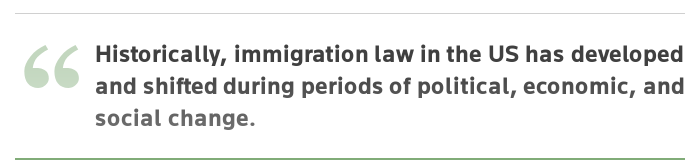

# **Everyone is a criminal**

```
TLDR: Because the law cannot entirely be known due to it's sheer amount of regulations. Everyone is a criminal, and laws are just selectively enforced based on who the state wants thrown in  jail.
```

## **Do you know the law?** 

Unless it's your job, and even then, I assume you still won't, you can't know the law perfectly. There's always something you might overlook, and that can be used against you. For example, if we look at U.S. federal laws, there are more than 20,000 statutes in the U.S. Code, not including the thousands of federal regulations. Similarly, in the European Union, there are over 20,000 legal acts, and on top of that, you have to consider the laws of each country within the EU.

Which leads us to a few questions: Who needs so many laws just to live? Who can possibly know all of them? And how can anyone avoid being a criminal when every one of these laws must be followed?

You know what? You can't use the excuse that there are too many laws to protect yourself, because the law says you're required to know the law.

Each year, more than 300 new laws are passed in the USA. In the European Union, at least 100 laws are passed annually. It would take more than a full-time job to analyze and understand each of these laws in order to truly 'know the law'.

Here is an example of how much laws number can explode when a specific topic is focused: 

Global Environmental Regulation and Legislation Over Time (Wordwide)


Just so you know, here is an example of how it is impossible to know the law: 


If you are interested in this topic and if you want to discuss about it, there is this [reddit](https://www.reddit.com/r/AskSocialScience/comments/1ha44y/how_are_people_supposed_to_know_the_law/?rdt=34232) thread that you could be interested in. 

*Interesting reading: “The Death of Common Sense: How Law Is Suffocating America” by Philip K. Howard. In this book, Howard explores how the increasing complexity of laws and regulations has made society harder to navigate. He argues that the law has become so bloated that even lawyers and lawmakers cannot keep up with it.*

## **Some real life examples**

To illustrate the point above, I'd like to share some of the most absurd laws that can turn ordinary people into criminals.

Stupid but quite funny ones: 

- In Georgia (U.S.A.), it’s illegal to eat fried chicken with a fork. This law is still technically in effect, and if a government official ever decided to make your life harder, they could use it against you.

- In Japan, it’s illegal to dance after midnight. This law was introduced in the 1940s to regulate behavior in nightclubs. Although it was relaxed in 2015, it’s still technically illegal to dance after midnight in some areas, meaning someone could find themselves in trouble just for dancing.

- In Switzerland, it’s illegal to flush the toilet after 10 p.m. in an apartment building. Imagine a law that prevents you from living in basic, healthy conditions.

- In Oklahoma (U.S.A.), it’s illegal to make faces at dogs. Essentially, you could be reported by a neighbor while playing with your dog and be charged for it.

- In the UK, it’s illegal to handle a salmon in suspicious circumstances. Someone could unknowingly get into trouble if they’re seen handling a salmon in a way that seems “suspicious” to authorities. And what exactly counts as "suspicious"? No one really knows.

- In Australia, it’s illegal to walk on the right side of the sidewalk. In many places, pedestrians just walk on whichever side is most convenient. But in some parts of Australia, you’re legally required to walk on the left side. So, if you happen to walk on the right side, you could technically be breaking the law.

Stupid but we should be worried about ones as it put people in trouble: 

- In Michigan (USA), a 10-year-old child was charged with criminal aggravated assault after throwing a ball in another kid’s face during a dodgeball game, injuring him. Although the charges were eventually dropped, it's still a troubling situation.

- In North Carolina (USA), a woman was charged with a misdemeanor for practicing or attempting veterinary medicine without a license because she was trying to save animals from a hurricane by sheltering them.

- In Denver (USA), a bar manager was jailed for three days for infusing vodka and selling it as a cocktail. In Denver, infusing vodka and selling it is a crime. To be clear, no one was harmed by the vodka, but a competitor who lacked the same level of creativity filed a complaint, and the sentence was handed down to appease him.

- In Kentucky (USA), a man was charged for giving away free eyeglasses to people who couldn’t afford them. It was prohibited because he didn’t follow the rules set by the established eyeglasses business.

Most of these laws are outdated and should have been repealed a long time ago. So, we can logically ask: why are these laws still in effect? Is it really that difficult to abolish a law? I don't think so, especially when it seems easy to vote in thousands of new laws each year. Perhaps governments keep these laws on the books in order to use them against people when needed. Maybe these laws aren’t repealed because they serve to maintain control over the population—ensuring that anyone can be turned into a criminal when necessary.

This [article](https://uclawreview.org/2021/12/10/ridiculous-laws-consequences-of-keeping-antiquated-and-unenforced-laws-on-the-books/) gives a great analysis of this situation and deserve to be read. 

Here is the introduction of the article: 


*Interesting reading: "Three Felonies a Day: How the Feds Target the Innocent" by Harvey Silverglate.  Silverglate explains how the broad scope of U.S. federal laws enables the government to prosecute individuals for actions that may not seem criminal at all. He argues that the average American unknowingly commits several felonies a day, simply because laws are so expansive.*

## Laws popularity

Another strange effect of laws is that they are subject to a popularity cycle, which influences how much attention they receive from governments. This is a clear indication that laws are not a constant truth and can be manipulated by governments whenever they see fit.

Here are a few examples of how the popularity of laws has led to major situations:

**In this examples we will look at context, popularity circles and manipulation examples*

1) The War on Drugs (U.S.A)

Context: From the 1980s through the 2000s, the U.S. government focused on the drug market, known as the "War on Drugs." Media and political campaigns fueled public fear of drug use, and the government leveraged this fear to enact stricter laws, including mandatory minimum sentences for drug offenses.

Popularity Cycle: During periods of rising public concern about drug use, the law became more prominent, and the U.S. government took action to demonstrate that they were in control of the situation. Later, as public opinion shifted toward criminal justice reform and the legalization of marijuana—largely driven by the media's changing focus—many of these laws were reworked and weakened.

Example of Manipulation: During this period, political leaders exploited public fear to emphasize certain drug laws in order to gain favor with voters. What started as a public security concern evolved into a powerful tool for securing political support.

If you want more detailed information about this topic, you can read the following [article](https://www.britannica.com/topic/war-on-drugs). 

Here is an extract of the article: 


2) Immigration Laws (Various Countries)

Context: The political climate and public opinion lead to major changes in immigration laws. For example, during periods of economic hardship, governments may pass immigration laws that limit the influx of foreign workers. In contrast, during times of labor shortages, restrictions are eased to attract more foreign workers.

Popularity Cycle: Public fears about immigration and national security, often fueled by media coverage, lead to tougher laws. However, when economic and humanitarian concerns arise, governments may weaken these laws to maintain public support.

Example of Manipulation: Governments may create or shift immigration policies based on political agendas or popular sentiment to maintain or gain support from certain voter bases.

The following [article](https://www.reuters.com/practical-law-the-journal/transactional/us-immigration-law-evolution-current-issues-2025-05-01/) covers major changes in immigration laws in US, based on centext. 

Here is a quote from this article: 



*Interesting reading: "The Authoritarian Dynamic" by Karen Stenner. This book analyzes how fear and anxiety, particularly regarding out-groups (such as immigrants or racial minorities), influence public opinion and, in turn, shape political behavior. Stenner connects these dynamics to the manipulation of laws and political policies.*

## When law serves power

Worldwide, most large companies have a vested interest in which laws are passed. Since they pay taxes in their respective countries, governments tend to enact laws that benefit these companies. The more taxes a company pays, the more the government will try to help them generate more revenue to increase tax contributions. 

When direct corruption is involved, some companies can eliminate their competition simply by pushing governments to pass specific laws that benefit them.

In contrast, small businesses and individuals have little to no influence on laws and must simply endure them. Many small businesses have disappeared over time due to laws that made it impossible for them to turn a profit.

Taking the European example, many small farmers have been forced to cease their activities over the past decades, as European regulations tend to favor large farms. These regulations are often too burdensome for small farmers to handle, leaving them in a position where they are unable to operate legally and cannot sell their products across Europe. Between 2005 and 2016, more than 3 million farms disappeared across the EU. According to Eurostat data, the number of farms in the EU has decreased by about 30% over the past 20 years, while the size of the average farm has increased significantly.

Can you imagine that governments are passing laws that affect the people who feed the population? That's exactly what they're doing, with the sole aim of supporting large companies.

As small farms disappear, rural areas are experiencing economic decline. In these areas, farming is not just an economic activity but a way of life, and its collapse leads to the creation of "ghost towns." In some countries, entire villages are up for sale, as people are forced to move to other regions in search of work, all due to the disappearance of small farms.

You can find [here](https://www.arc2020.eu/op-ed-time-for-a-rethink-to-reverse-the-rapid-decline-of-farming-in-europe/) an article that is describing this issue and that invite to rethink the system. 

I hope this article piques your interest:


On another note, some large companies, like Apple, do not have to pay taxes in Ireland, while smaller businesses are required to. The Irish government argues that this policy was implemented to create jobs in Cork. However, even though it has led to job creation, individuals and small businesses are left to bear the cost of what Apple doesn't pay. 

One might think that the Irish government has no interest in allowing such large companies to avoid paying taxes. However, at the end of the day, it’s all about tax competition. By offering lower taxes and attracting big companies, Ireland remains economically competitive. Additionally, politicians gain support from the public and investors by drawing high-profile companies that can boost the economy and generate media attention. In making these decisions, the impact on small businesses and individuals is often overlooked.

This [article](https://applescoop.org/story/how-does-apple-avoid-paying-billions-in-taxes-inside-irelands-secret-deal) describe Apple's strategy in Ireland. 


*Interesting reading: "The Corporate Tax Avoidance Trap" by Richard Murphy. This book delves into corporate tax avoidance and the mechanisms that large companies use to avoid taxes, such as shifting profits to low-tax jurisdictions like Ireland. Richard Murphy offers insights into how these practices affect both national economies and smaller businesses, urging for reform to close the loopholes that benefit big corporations.*

## Conclusion 

When it comes to laws, everyone is a criminal. No one knows the law perfectly, and some downright absurd laws still exist. Laws are enforced selectively by governments, and big companies hold significant influence over them. It’s almost impossible for any individual who wants to respect the law to do so fully. Laws are created to serve the interests of governments and large corporations, while controlling small businesses and individuals.

