# File Verification

```
TLDR: verify that what you download is as the project advertises it should be. The Binary's checksum should be as the project advertises it to be in their releases notes, otherwise that eitehr means that the project didnt implement reproducible builds or that someone meddled with the binary somewhere along the way.
```


Today we download files like it is nothing, multiple times a day, but we never wait and ask what have we just downloaded, how can i trust the file?, how will i know if its not a virus?

Small note: i will not provide any type of files during this post.

## **Why do we need file verification**
File verification comes to secure ourself through authenticating and checking the integrity of a file we want to install or use.

which means that we are making sure the file came from where it was intended to come and that is the same file we are expecting, this is really important because it protects us and our data.

## **What are the dangers in not verifying files**
- <b>Malware Injections</b> – Attackers may insert malicious code into legitimate files.

- <b>MITM Attacks</b> – During download, files can be intercepted and altered.

- <b>Tampering by Insiders</b> – An attacker with access to your system can alter existing files.


## **How can we protect ourself from altered files**
First of all we will need to understand two concepts in file verification:

### **File Integrity**
File Integrity is making sure that the file contents haven't been altered and how its done is by comparing a known safe hash to the local file's hash

This can be done using a tool named <b>shasum</b>.

For this example i will download <b>flameshot</b> and verify its hash.

When going into [flameshot's github](https://github.com/flameshot-org/flameshot/releases) repository you can find pair of files, each pair is devised of:

1. software files containing the software you want to download in this case its flameshot and the other.

2. sha256sum files which contain the hash, i have marked them in the picture below<br><br>


Now after you found your desired files and downloaded them we can start verifying the file, you can open the sha256sum and look at the hash(purple rectangle) of the software file and the path to the software file(green rectangle), it should look something like this<br><br>
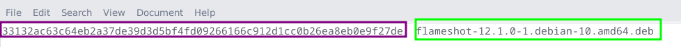

Now after having the 2 files and understanding what the sha256sum file is lets verify the file.

We can do this manually or automatically, sometimes you will only have the hash and not the sha256sum file, so it will require manual setup or manual comparison of hashes.

-----
Manually comparing hashes:
- Open the terminal and cd to the files directory

- Calculate the software file hash using the command(change flameshot-12.1.0-1.debian-10.amd64.deb to the name of the software file you are trying to verify)<br><br>
`shasum -a 256 flameshot-12.1.0-1.debian-10.amd64.deb` (software file)<br>
(-a stands for algorithm, here we are using 256bit)

- Then you should receive an output of the hash and the file name(same format like the sha256sum)<br><br>
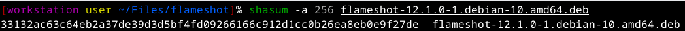

- Now take the hash and compare it to the hash you have copied from the source or from the sha256sum file

- If its the same you are ok to use the file, if its not the same, go back and check what was wrong(different version of file and hash, corrupted file, etc...)

-----
Automatically comparing hashes:
- I usually like to make sure both of my files are under the same directory

- Open the terminal and cd to the files directory

- Calculate the software file hash and compare it to the sha256sum file using the command<br><br>
`shasum -a 256 -c flameshot-12.1.0-1.debian-10.amd64.deb.sha256sum` (sha256sum file)

- Then you should receive an output saying if the hashes are the same with an OK message, for hashed that are different it will output a FAILED message<br><br>

    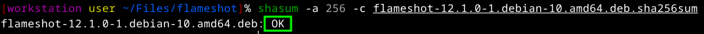
    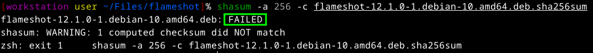

You now know how to verify your files integrity

-----
### **File Authenticity**

File Authenticity is basically making sure a file is originated from the one who wrote it and not someone else, for this we have both GUI and CLI tools.

I will be using Kleopatra(GUI) and gpg(CLI) and will demonstrate on Monero.

#### <b>Kleopatra - GUI</b>
1. First install Kleopatra.

2. Open Kleopatra and press the File > New OpenPGP Key Pair or press Ctrl + N

3. Enter a Name and an Email(can be disposable) + check passphrase protection checkbox which will add more protection.

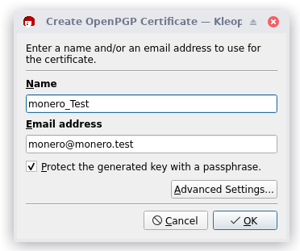

4. Go inside the advanced settings and change it according to the picture


5. Now you should be prompted with the passphrase, enter a good password you will need it each time you will use the pgp key.

6. Take the public key of monero creator/main dev
([Binaryfate.asc](https://raw.githubusercontent.com/monero-project/monero/master/utils/gpg_keys/binaryfate.asc) - monero creator pgp key)

7. Download the public key or create a text file put the key inside and change the file extension to .asc (in my case binaryfate.asc)

8. Now lets import the script using Kleopatra, in the nav bar you can see an import, press it.

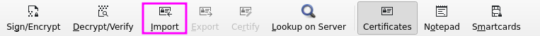

9. Choose your asc file that you downloaded/created in the last steps and open.


10. Next you will get the certification warning which will say that this public key has to be verified by the fingerprint(identification of pgp keys) of the author, in this scenario its 81AC 591F E9C4 B65C 5806 AFC3 F0AF 4D46 2A0B DF92.

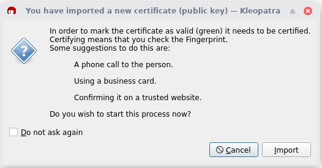

11. Now we will see the certification window, we will see the public pgp key fingerprint marked in green and the pgp key we want to certify the new public pgp key in red, for future uses (basically signing that the fingerprint is legit)


12. Now press certify and enter the passphrase for the specific pgp key that signs/certifies the new public key.

13. Last but not least part of the authenticity, verifying the origin of the sha256sums. 
for this we will need to download the [hashes.txt](https://www.getmonero.org/downloads/hashes.txt)

14. Now lets verify the hashes in the file, in the nav bar press the decrypt/verify.

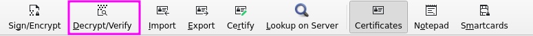

15. Choose the hashes file and open


16. Now you should see a report that says if the hashes are created by any of the pgp keys that are listed in kleopatra(in this case its binaryfate)


Now after this process you have ended with an hash that you authenticated, you can use this hash with the file verification process to finish and verify the origin of the file downloaded.

#### <b>GPG - CLI</b>
1. First install GnuPG(gpg).

2. Open a terminal and download the .asc file using.

    `wget -O binaryfate.asc https://raw.githubusercontent.com/monero-project/monero/master/utils/gpg_keys/binaryfate.asc`

3. Now we need to get the fingerprint from the .asc by using the next command, and you should have the answer in the terminal with the fingerprint.

    `gpg --keyid-format long --with-fingerprint binaryfate.asc`

    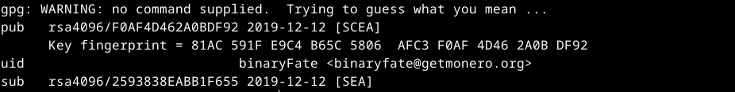

4. Importing the binaryfate.asc

    `gpg --import binaryfate.asc`

    if the public key is new and isn't saved you will get this output

    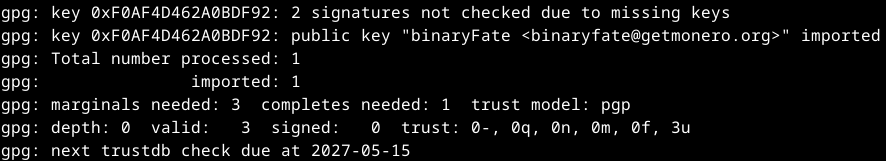

    if already exists:

    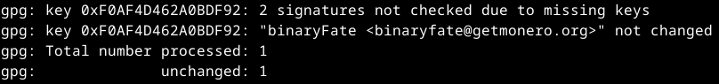

5. Download the file hashes using the next command

    `wget -O hashes.txt https://www.getmonero.org/downloads/hashes.txt`

6. Verify that the hashes are valid by running the next command

    `gpg --verify hashes.txt`

    if you have done the Kleopatra process before, especially step 6, binaryfate should already be certified and you will get this output

    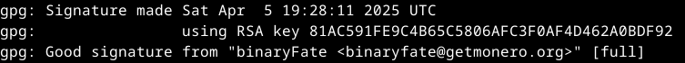

    if you only went through the gpg process you should get this output

    

Now after this process you have ended with an hash that you authenticated, you can use this hash with the file verification process to finish and verify the origin of the file downloaded.

#### Minisign (CLI)
For this example, we'll be showing both sides (the project maintainer and user)

Both sides must have Minisign installed

```bash
root@localhost:~# apt install minisign
```

##### Maintainer
1. The maintainer generates their own key-pair for signing releases. This may prompt for a password to encrypt the secret key.

    ```bash
    maintainer@localhost:~$ minisign -G
    Please enter a password to protect the secret key.

    Password: 
    Password (one more time): 
    Deriving a key from the password in order to encrypt the secret key... done

    The secret key was saved as /home/maintainer/.minisign/minisign.key - Keep it secret!
    The public key was saved as minisign.pub - That one can be public.

    Files signed using this key pair can be verified with the following command:

    minisign -Vm <file> -P RWQDhZjc3QZsu74vMEd2MGRi0eYv3PXIVQGMSx+lQL1iVptYFn7p2GeI
    ```

    The public key (which in this case is `RWQDhZjc3QZsu74vMEd2MGRi0eYv3PXIVQGMSx+lQL1iVptYFn7p2GeI`) can be shared with others on a site, or where-ever the downloads are hosted. It can even be shared as a QR code or on the phone thanks to how small it is.

    ```bash
    maintainer@localhost:~$ sudo apt install qrencode
    maintainer@localhost:~$ qrencode -o pubkey_qr.png RWQDhZjc3QZsu74vMEd2MGRi0eYv3PXIVQGMSx+lQL1iVptYFn7p2GeI
    ```

    

2. The maintainer generates a checksum file of the latest binary release, We'll be using SHA-512 for this.

    ```bash
    maintainer@localhost:~$ sha512sum program > SHA512SUMS
    ```

3. The maintainer signs the checksum file with their Minisign key.

    ```bash
    maintainer@localhost:~$ minisign -S -m SHA512SUMS 
    Password: 
    Deriving a key from the password and decrypting the secret key... done

    ```

##### User

1. The user downloads the program, the SHA512 checksum file, and the signature of that file.

2. The user verifies the Minisign signature with the public key.

    If it's a good signature, Minisign's output may be something like this:

    ```bash
    user@localhost:~$ minisign -Vm SHA512SUMS -P RWQDhZjc3QZsu74vMEd2MGRi0eYv3PXIVQGMSx+lQL1iVptYFn7p2GeI
    Signature and comment signature verified
    Trusted comment: timestamp:1750090525	file:SHA512SUMS	hashed
    ```

    However, if it's a **bad signature**, Minisign's output may be something like this instead:

    ```bash
    user@localhost:~$ minisign -Vm SHA512SUMS -P RWQDhZjc3QZsu74vMEd2MGRi0eYv3PXIVQGMSx+lQL1iVptYFn7p2GeI
    Signature verification failed
    ```

3. The user verifies the SHA-512 checksum file with the program, like normal

-----
### **Zero Trust Policy**
#### **!!! Important !!!** 
I wanted to say something about zero trust policy and pgp. its not full proof, its just giving you better chances to protect your privacy anonymity and safety.

In this game its all about who has the better chances, no such thing as 100%, the more chance to remain private and safe the better it is.

-----
### **Advanced Technologies/Measures**
- <b>The Updated Network (TUF)</b> - Adds more layers of defense especially multiple layers of encryption making it that decryption will require multiple keys and not one (used by docker, pypi, etc...).

- <b>in-toto</b> - Tracks the software through its development pipeline spotting any changes to the software in the pipeline process by outer sources.

- <b>Sigstore</b> - Automates signing of software for you, no need to manage keys forever.

- <b>SLSA</b> - Security checklist for a software's pipeline, improving audit and compliance and making sure you act and configure correctly.

- <b>Key Transparency</b> - This basically mean publishing your key so others will know exactly what key belongs to who, protects against social engineering, phishing, etc.

- <b>building projects</b> - Taking the source code and building your own program, this is completely the best zero trust policy existing for software(especially if you know programming languages).
check this [post](../compilation/index.md) to know more 
