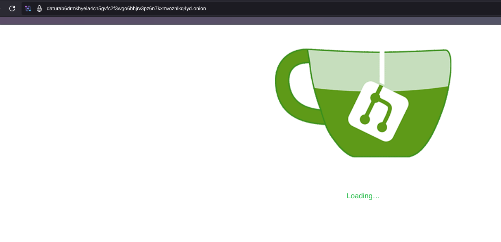
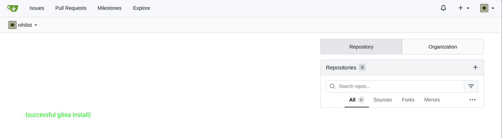
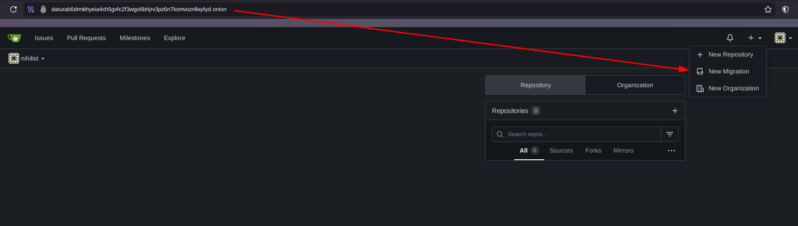
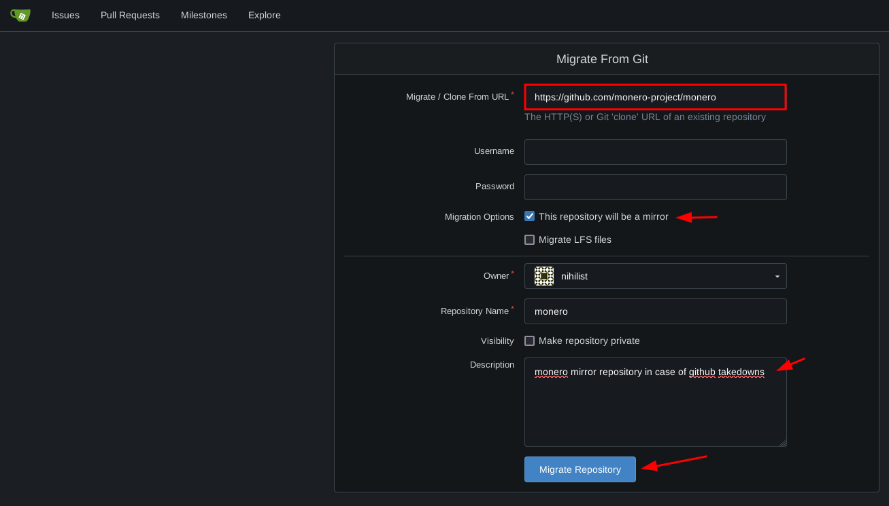
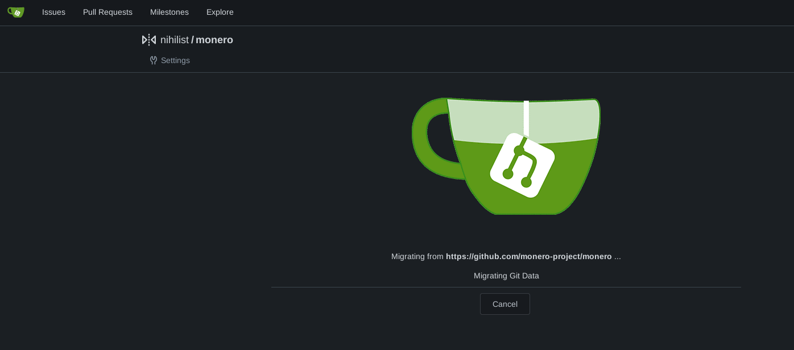
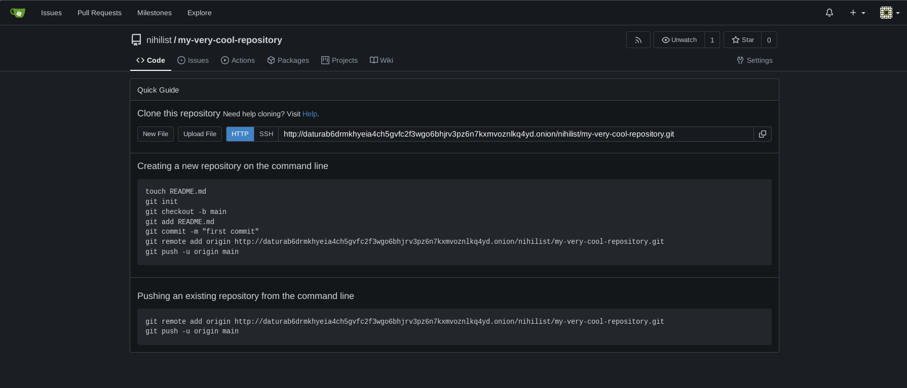
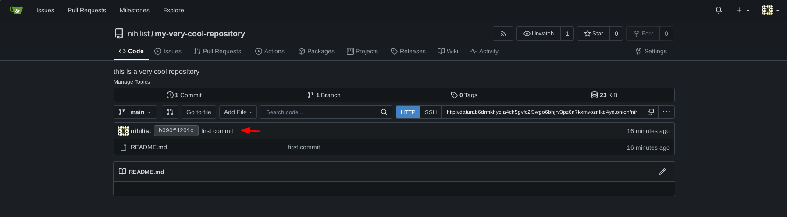
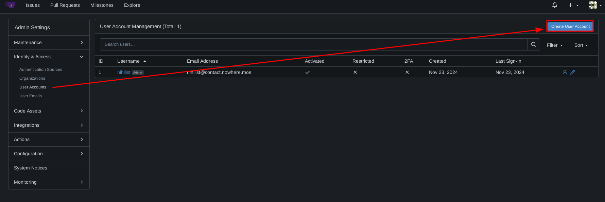
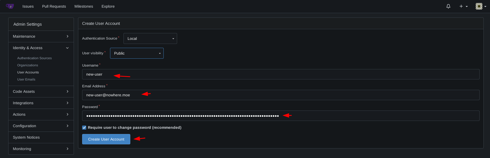
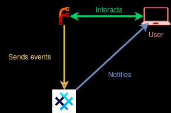

# Forgejo .onion Setup (Anonymous Code Repositories and Collaboration) 

```
TLDR: you can replace github (which is owned by microsoft) with an onion-only alternative called Forgejo, effectively enforcing anonymity for all it's users for anonymous project collaboration.
```


In this tutorial we're going to take a look at how you can setup an anonymous Forgejo instance ([which was previously known as Gitea before the hard fork](https://forgejo.org/compare-to-gitea/)) that is accessible over Tor, in order to be able to collaborate with people on projects, while maintaining everyone's anonymity. 
    
```hl_lines="3"
Notes on why you should use Forgejo instead of Gitea: 

Forgejo was created in October 2022 after a for profit company took over the Gitea project.
It exists under the umbrella of a non-profit organization, Codeberg e.V. and is developed in the interest of the general public. In the year that followed, this difference in governance led to choices that made Forgejo significantly and durably different from Gitea.
```
    

_Disclaimer:_ If you are a developer working on projects that aim to reduce governmental control, such as working on privacy-cryptocurrency projects (ie Monero, Haveno, Crypto Mixers, etc), **take some time to consider stopping maintaing/contributing to those projects under your public identity** , and rather shift to maintaining those projects under an anonymous identity (which is the aim of the following Forgejo setup). 

**You never know when your tyrannical government is going to snap and decide to make an example out of you, just like what happened to [Tornado Cash](https://www.coindesk.com/policy/2024/05/14/tornado-cash-developer-alexey-pertsev-found-guilty-of-money-laundering/)**. It is a matter of [adapting your OPSEC to the intended internet use](../internetsegmentation/index.md). Don't paint a target on your back and give any ammunition to the adversary, because they're going to shoot you with everything you give them (your IRL name, what you contributed on the project, taking things you said out of context, etc). **Tyrants don't care, even if it they have to step on your freedom of speech** (as that's what developing code is) to keep their control over the masses, they will do anything to keep their control intact.


## **Why is this relevant?**

First of all, Git is a distributed version control system that tracks versions of files. It is often used to control source code by programmers who are developing software collaboratively. It is especially popular in the FOSS community as it allows anyone to contribute to projects.

The place where you can find the most repositories online is [Github](https://github.com/trending), but the problem is that Github has been purchased by Microsoft.


Now the problem with trusting a business to host your code repositories that reduces governmental control (such as [Tornado Cash](https://decrypt.co/107053/it-doesnt-change-anything-says-tornado-cash-code-disappears-github)) is that those governments can use any company (such as Microsoft in particular) to do their bidding, **such as infringing on your freedom of speech, censoring you and deleting your work from the platform.**

The source code for crypto transaction mixer Tornado Cash has disappeared from Github **barely 24 hours after the US Treasury Department added the privacy tool to its sanctions list.** Highlighting how Microsoft is a proxy that the US Government uses (more often than you think) to persecute anyone they don't like. 


**That is why Github should not be relied on to host any code repository that threaten governmental control**, we need an alternative that we can host ourselves, to break free from that governmental control. Which is where Forgejo comes in the picture.

Forgejo is a painless, self-hosted, all-in-one software development service. It includes Git hosting, code review, team collaboration, package registry, and CI/CD. It is similar to GitHub, Bitbucket and GitLab. The most important part being that it can be self-hosted.**


Now let's suppose you setup your potentially sensitive repositories on a clearnet forgejo instance (meaning the server can be reached directly by a domain name, to it's public IP address. **What is stopping the tyrannical government from ordering the VPS provider to shut down the server ?** They know where it is located, what server it is on, so they can order it to be taken down all the same, as they will simply force another business to comply with their demands, and this time it will be the server itself that will be taken down.

## _OPSEC RECOMMENDATIONS:_


This is why the Forgejo instance needs to be setup behind Tor, as a [.onion hidden service](../torwebsite/index.md). Now you have a few options as to where to host the the Forgejo service. It can be on a [remote VPS that you acquired anonymously](../anonymousremoteserver/index.md) (where the cost will be the renting of that VPS, such as 5 euros per month):


Or it can simply be on a server that is running at your own home, at the cost of your own elecricity consumption, and internet connection:


## **Forgejo instance Setup**

Now that we laid out the justifications for this setup, let's set it up on our server using [Docker](https://docker.com). If you don't have docker installed already, follow the steps from [this tutorial](../docker-intro/index.md#installation).

Then you can create a new directory under `/srv` for our docker compose stack:

```
[ Datura ] [ /dev/pts/13 ] [/srv]
→ cd /srv

[ Datura ] [ /dev/pts/13 ] [/srv]
→ mkdir forgejo_onion

[ Datura ] [ /dev/pts/13 ] [/srv]
→ cd forgejo_onion

[ Datura ] [ /dev/pts/13 ] [/srv]
→ cat docker-compose.yml
services:
  server:
    image: codeberg.org/forgejo/forgejo:12
    container_name: forgejo
    environment:
      - USER_UID=1000
      - USER_GID=1000
    restart: unless-stopped
    networks:
      - forgejo
      - tor-forgejo
    volumes:
      - ./forgejo:/data
      - /etc/timezone:/etc/timezone:ro
      - /etc/localtime:/etc/localtime:ro
    ports:
      - "127.0.0.1:3009:3000"
      - "127.0.0.1:2222:22"
    # prevent dns leaks by setting dns server to a bogus address like localhost
    dns:
      - 127.0.0.1

  tor-forgejo:
    image: osminogin/tor-simple
    restart: unless-stopped
    container_name: tor-forgejo
    volumes:
      - ./tor-data:/var/lib/tor
      - ./tor-data/torrc:/etc/tor
    networks:
      - tor-forgejo

networks:
  tor-forgejo:
  forgejo:
    external: false
```


Now let's setup a docker Tor daemon and the folder it needs to have, as we'll later need Forgejo to connect elsewhere through Tor:
    
    
    [ Datura ] [ /dev/pts/13 ] [/srv/forgejo_onion]
    → mkdir -p tor-data/torrc
    
    [ Datura ] [ /dev/pts/13 ] [/srv/forgejo_onion]
    → vim tor-data/torrc/torrc
    
    [ Datura ] [ /dev/pts/13 ] [/srv/forgejo_onion]
    → cat tor-data/torrc/torrc
    SOCKSPort 0.0.0.0:9050
    
    [ Datura ] [ /dev/pts/13 ] [/srv/forgejo_onion]
    → chown -R 100:65533 tor-data/
    
    [ Datura ] [ /dev/pts/13 ] [/srv/forgejo_onion]
    → chmod 700 tor-data


Make sure you have Tor deamon installed by running `apt install tor`.
We will now create an entry for forgejo hidden service inside your `/etc/tor/torrc` **on the host**.
(Not in the Tor docker instance - that will only be used to access external repositories anonymously.)

> If you want to have a custom vanity domain, you should follow [this tutorial](../torwebsite/index.md) and copy the keys to `/var/lib/tor/forgejo_srv/`.
> ```
> [ Datura ] [ /dev/pts/13 ] [/srv/mkp224o]
> → ls /var/lib/tor/forgejo_srv
> authorized_clients  hostname  hs_ed25519_public_key  hs_ed25519_secret_key
> ```
> Make sure the `/var/lib/tor/forgejo_srv` directory is accessible by Tor deamon (`debian-tor` user) and has correct permissions.

```
[ Datura ] [ /dev/pts/13 ] [/srv/forgejo_onion]
→ cat /etc/tor/torrc | tail -n 5
HiddenServiceDir /var/lib/tor/forgejo_srv/
HiddenServicePort 80 127.0.0.1:3009
HiddenServicePort 2222 127.0.0.1:2222

[ Datura ] [ /dev/pts/13 ] [/srv/forgejo_onion]
→ systemctl restart tor@default
```

If you didn't use your custom vanity domain, your onion url should now be generated under `/var/lib/tor/forgejo_srv/hostname`:

```
[ Datura ] [ /dev/pts/13 ] [/srv/forgejo_onion]
→ cat /var/lib/tor/forgejo_srv/hostname
daturab6drmkhyeia4ch5gvfc2f3wgo6bhjrv3pz6n7kxmvoznlkq4yd.onion
```

If the file isn't there, check for the Tor logs using `journalctl -xe`.

Now we have the hidden service ready, we launch Forgejo with `docker-compose`:
    
    [ Datura ] [ /dev/pts/13 ] [/srv/forgejo_onion]
    → docker compose up -d && docker compose logs -f
    Creating forgejo-onion ... done
    Attaching to forgejo-onion
    forgejo-onion | Generating /data/ssh/ssh_host_ed25519_key...
    forgejo-onion | Generating /data/ssh/ssh_host_rsa_key...
    forgejo-onion | Generating /data/ssh/ssh_host_ecdsa_key...
    forgejo-onion | Server listening on :: port 22.
    forgejo-onion | Server listening on 0.0.0.0 port 22.
    forgejo-onion | 2024/11/23 16:37:01 cmd/web.go:242:runWeb() [I] Starting Forgejo on PID: 15
    forgejo-onion | 2024/11/23 16:37:01 cmd/web.go:111:showWebStartupMessage() [I] Forgejo version: 1.22.3 built with GNU Make 4.4.1, go1.22.8 : bindata, timetzdata, sqlite, sqlite_unlock_notify
    forgejo-onion | 2024/11/23 16:37:01 cmd/web.go:112:showWebStartupMessage() [I] * RunMode: prod
    forgejo-onion | 2024/11/23 16:37:01 cmd/web.go:113:showWebStartupMessage() [I] * AppPath: /usr/local/bin/gitea
    forgejo-onion | 2024/11/23 16:37:01 cmd/web.go:114:showWebStartupMessage() [I] * WorkPath: /data/gitea
    forgejo-onion | 2024/11/23 16:37:01 cmd/web.go:115:showWebStartupMessage() [I] * CustomPath: /data/gitea
    forgejo-onion | 2024/11/23 16:37:01 cmd/web.go:116:showWebStartupMessage() [I] * ConfigFile: /data/gitea/conf/app.ini
    forgejo-onion | 2024/11/23 16:37:01 cmd/web.go:117:showWebStartupMessage() [I] Prepare to run install page
    forgejo-onion | 2024/11/23 16:37:01 cmd/web.go:304:listen() [I] Listen: http://0.0.0.0:3000
    forgejo-onion | 2024/11/23 16:37:01 cmd/web.go:308:listen() [I] AppURL(ROOT_URL): http://localhost:3000/
    forgejo-onion | 2024/11/23 16:37:01 ...s/graceful/server.go:50:NewServer() [I] Starting new Web server: tcp:0.0.0.0:3000 on PID: 15


Now that's done, let's access our Forgejo instance from the tor browser at the `.onion domain`, to setup the initial configuration:


Take note that you can leave everything as it is by default here, except if you want to change the Site Title, take note that there is no need for https in the URL, it is normal for it to remain http. And lastly let's disable registrations, **as users won't be using emails to register since we're not going to use the clearnet at all.**


Lastly don't forget to create the administrator account at the bottom, and click "Install Forgejo":



Wait a bit for the Forgejo instance to finish setup, and you're done!



Now we need to tweak the instance a bit, so let's edit the app.ini file that is located in `/srv/forgejo_onion/gitea/gitea/conf/app.ini`:
    
    
    [ Datura ] [ /dev/pts/6 ] [/srv/forgejo_onion]
    → ls
    docker-compose.yml  gitea
    
    [ Datura ] [ /dev/pts/6 ] [/srv/forgejo_onion]
    → cd gitea
    
    [ Datura ] [ /dev/pts/6 ] [/srv/forgejo_onion/gitea]
    → ls
    git  gitea  ssh
    
    [ Datura ] [ /dev/pts/6 ] [/srv/forgejo_onion/gitea]
    → cd gitea
    
    [ Datura ] [ /dev/pts/6 ] [forgejo_onion/gitea/gitea]
    → ls
    actions_artifacts  attachments  conf      home      jwt  packages  repo-archive  sessions
    actions_log        avatars      gitea.db  indexers  log  queues    repo-avatars  tmp
    
    [ Datura ] [ /dev/pts/6 ] [forgejo_onion/gitea/gitea]
    → cd conf
    
    [ Datura ] [ /dev/pts/6 ] [gitea/gitea/conf]
    → ls
    app.ini
    
    [ Datura ] [ /dev/pts/6 ] [gitea/gitea/conf]
    → vim app.ini
    	
    

now the first thing i like to do here is to set the default gitea theme to `gitea-dark` by adding the `[ui]` section at the bottom:
    
    
    [ Datura ] [ /dev/pts/6 ] [gitea/gitea/conf]
    → cat app.ini | tail -n 3
    
    [ui]
    DEFAULT_THEME = gitea-dark
    
    

don't forget to restart the gitea docker everytime you edit the app.ini config file:
    
    
    [ Datura ] [ /dev/pts/13 ] [/srv/forgejo_onion]
    → docker compose down ; docker compose up -d
    Stopping forgejo-onion ... done
    Removing forgejo-onion ... done
    Removing network forgejo_onion_gitea
    Creating network "forgejo_onion_gitea" with the default driver
    Creating forgejo-onion ... done

then on the webpage, hit "Ctrl+F5" to refresh the page and see the new theme:


## **Forgejo mirroring**

Repository mirrors allow you to download remote repositories onto your storage. This way you don't need to pull or clone from the remote every time. This helps to back up projects that may get taken down some time in the future.

### **Github/clearnet repositories through Tor**

Now in order to make sure our Forgejo instance is able to mirror external git repositories from other websites such as github, we need to make sure it goes through Tor to do so, so we need to make sure the gitea container can reach the docker Tor daemon. We have to make sure it uses it by adding the `[proxy]` section in the app.ini config file.

The Forgejo container will know that `tor-forgejo` hostname refers to the tor docker container:
    
```
[ Datura ] [ /dev/pts/13 ] [/srv/forgejo_onion]
→ vim gitea/gitea/conf/app.ini

[ Datura ] [ /dev/pts/13 ] [/srv/forgejo_onion]
→ cat gitea/gitea/conf/app.ini | tail -n 4
[proxy]
PROXY_ENABLED = true
PROXY_URL = "socks5://tor-forgejo:9050"
PROXY_HOSTS = *

[migrations]
ALLOW_LOCALNETWORKS = true
SKIP_TLS_VERIFY = true
ALLOWED_DOMAINS = *
BLOCKED_DOMAINS = 

[git.timeout]
DEFAULT = 7200
MIGRATE = 7200
MIRROR = 7200

[ Datura ] [ /dev/pts/13 ] [/srv/forgejo_onion]
→ docker compose down ; docker compose up -d
```
    

And now from there, we should be able to mirror external repositories on gitea by making the traffic go through Tor aswell. As an example, let's create a git mirror of the official [Monero](../monero2024/index.md) repository that currently sits on [Github](https://github.com/monero-project/monero):

  

Now be aware that it's going to take longer than it usually would to get the repository due to the low bandwidth that Tor has, so be be patient and wait until it finishes:

 

And there you go! you just managed to mirror a github repository while still making sure the connections go through Tor.

### **Mirroring onion-only repository**

In newer `curl` versions, onion domains [are not resolved](https://github.com/curl/curl/issues/17363) unless handled via proxy (`h` in `socks5h` means proxying DNS queries). It's a deliberate design meant to prevent DNS leaks of onion domains, described in [RFC7686](https://www.rfc-editor.org/rfc/rfc7686):

> Name Resolution APIs and Libraries: Resolvers MUST either respond
> to requests for .onion names by resolving them according to
> [tor-rendezvous] or by responding with NXDOMAIN [RFC1035].

To enable cloning onion-only repositories, you need to set proxy for git as well. This will make sure to forward DNS queries over proxy as well.

Add those lines at the end of `gitea/gitea/conf/app.ini`:

```
[git.config]
http.proxy = "socks5h://tor-forgejo:9050"
https.proxy = "socks5h://tor-forgejo:9050"
```

> During our testing, despite the `socks5h` proxy being set in Forgejo for mirroring, there were still some queries going to the DNS server of host machine.
>
> This `tcpdump` capture was made when mirroring Github repository first and then onion-only repo.
>
> ```
> $ tcpdump -nnni ens18 port 53
> tcpdump: verbose output suppressed, use -v[v]... for full protocol decode
> listening on ens18, link-type EN10MB (Ethernet), snapshot length 262144 bytes
> 16:xx:xx.xxxxxx IP xx.xx.xx.xx.50500 > z.z.z.z.53: 58270+ [1au] AAAA? github.com. (39)
> 16:xx:xx.xxxxxx IP xx.xx.xx.xx.35487 > z.z.z.z.53: 43847+ [1au] A? github.com. (39)
> 16:xx:xx.xxxxxx IP z.z.z.z.53 > xx.xx.xx.xx.50500: 58270 0/0/1 (39)
> 16:xx:xx.xxxxxx IP z.z.z.z.53 > xx.xx.xx.xx.35487: 43847 1/0/1 A 20.205.243.166 (55)
> 16:xx:xx.xxxxxx IP xx.xx.xx.xx.47141 > z.z.z.z.53: 1766+ [1au] AAAA? github.com. (39)
> 16:xx:xx.xxxxxx IP xx.xx.xx.xx.48873 > z.z.z.z.53: 39574+ [1au] A? github.com. (39)
> 16:xx:xx.xxxxxx IP z.z.z.z.53 > xx.xx.xx.xx.47141: 1766 0/0/1 (39)
> 16:xx:xx.xxxxxx IP z.z.z.z.53 > xx.xx.xx.xx.48873: 39574 1/0/1 A 20.205.243.166 (55)
> 16:xx:xx.xxxxxx IP xx.xx.xx.xx.49575 > z.z.z.z.53: 32918+ [1au] AAAA? github.com. (39)
> 16:xx:xx.xxxxxx IP xx.xx.xx.xx.59271 > z.z.z.z.53: 48720+ [1au] A? github.com. (39)
> 16:xx:xx.xxxxxx IP z.z.z.z.53 > xx.xx.xx.xx.49575: 32918 0/0/1 (39)
> 16:xx:xx.xxxxxx IP z.z.z.z.53 > xx.xx.xx.xx.59271: 48720 1/0/1 A 20.205.243.166 (55)
> 16:xx:xx.xxxxxx IP xx.xx.xx.xx.43661 > z.z.z.z.53: 29943+ [1au] AAAA? gdatura24gtdy23lxd7ht3xzx6mi7mdlkabpvuefhrjn4t5jduviw5ad.onion.localdomain. (100)
> 16:xx:xx.xxxxxx IP xx.xx.xx.xx.39848 > z.z.z.z.53: 55341+ [1au] A? gdatura24gtdy23lxd7ht3xzx6mi7mdlkabpvuefhrjn4t5jduviw5ad.onion.localdomain. (100)
> 16:xx:xx.xxxxxx IP z.z.z.z.53 > xx.xx.xx.xx.39848: 55341 NXDomain 0/0/1 (100)
> 16:xx:xx.xxxxxx IP z.z.z.z.53 > xx.xx.xx.xx.43661: 29943 NXDomain 0/0/1 (100)
> 16:xx:xx.xxxxxx IP xx.xx.xx.xx.46653 > z.z.z.z.53: 61710+ [1au] AAAA? gdatura24gtdy23lxd7ht3xzx6mi7mdlkabpvuefhrjn4t5jduviw5ad.onion.localdomain. (100)
> 16:xx:xx.xxxxxx IP xx.xx.xx.xx.47056 > z.z.z.z.53: 57433+ [1au] A? gdatura24gtdy23lxd7ht3xzx6mi7mdlkabpvuefhrjn4t5jduviw5ad.onion.localdomain. (100)
> 16:xx:xx.xxxxxx IP z.z.z.z.53 > xx.xx.xx.xx.46653: 61710 NXDomain 0/0/1 (100)
> 16:xx:xx.xxxxxx IP z.z.z.z.53 > xx.xx.xx.xx.47056: 57433 NXDomain 0/0/1 (100)
> 16:xx:xx.xxxxxx IP xx.xx.xx.xx.56952 > z.z.z.z.53: 54418+ [1au] AAAA? gdatura24gtdy23lxd7ht3xzx6mi7mdlkabpvuefhrjn4t5jduviw5ad.onion.localdomain. (100)
> 16:xx:xx.xxxxxx IP xx.xx.xx.xx.44551 > z.z.z.z.53: 55675+ [1au] A? gdatura24gtdy23lxd7ht3xzx6mi7mdlkabpvuefhrjn4t5jduviw5ad.onion.localdomain. (100)
> ```

> To mitigate this, DNS was intentionally disabled for the Forgejo container (in `docker-compose.yml` file):
> 
> ```yaml
>     # prevent dns leaks by setting dns server to a bogus address like localhost
>     dns:
>       - 127.0.0.1
> ```
>
> It may cause issues if you need internet access in the conatiner but since we should be mirroring everything over Tor (and using DNS server of an exit node), it should be all good.

After adding `[git.config]` block to the config, restart the docker container stack:

```shell
[ Datura ] [ /dev/pts/13 ] [/srv/forgejo_onion]
→ docker compose down && docker compose up -d
```

Head to the Forgejo url and mirror an onion repository, just like we did in previous step:


If you got to this point, this means onion-only repo mirroring works as intended. After it's done, you will be redirected to the repository with `.onion` git upstream:


### **Changing mirroring interval**

By default, mirrors in Forgejo are synchronized every 8 hours. If you want to change it, head over to setting of mirrored repo and change it to desired value:


## **Handling Forgejo repositories through Tor**

So now let's create our first Forgejo repository from the web interface:

 

Now that the repository has been created, we need to push our first commit there so let's follow the instructions: 
    
    
    [ mainpc ] [ /dev/pts/9 ] [~/Documents]
    → mkdir my-very-cool-repository
    
    [ mainpc ] [ /dev/pts/9 ] [~/Documents]
    → cd my-very-cool-repository
    	
    [ mainpc ] [ /dev/pts/9 ] [~/Documents/my-very-cool-repository]
    → touch README.md
    
    [ mainpc ] [ /dev/pts/9 ] [~/Documents/my-very-cool-repository]
    → git init
    hint: Using 'master' as the name for the initial branch. This default branch name
    hint: is subject to change. To configure the initial branch name to use in all
    hint: of your new repositories, which will suppress this warning, call:
    hint:
    hint:   git config --global init.defaultBranch 
    hint:
    hint: Names commonly chosen instead of 'master' are 'main', 'trunk' and
    hint: 'development'. The just-created branch can be renamed via this command:
    hint:
    hint:   git branch -m 
    Initialized empty Git repository in /home/nihilist/Documents/my-very-cool-repository/.git/
    
    [ mainpc ] [ /dev/pts/9 ] [~/Documents/my-very-cool-repository]
    → git checkout -b main
    Switched to a new branch 'main'
    
    [ mainpc ] [ /dev/pts/9 ] [~/Documents/my-very-cool-repository]
    → git add README.md
    
    [ mainpc ] [ /dev/pts/9 ] [~/Documents/my-very-cool-repository]
    → git commit -m "first commit"
    [main (root-commit) b090f42] first commit
     1 file changed, 0 insertions(+), 0 deletions(-)
     create mode 100644 README.md
    
    

Then we can proceed with the rest of the instructions to push the commit to the repository via the .onion Forgejo domain, with the exception of the **git push** command, where we need to use the **torsocks** in front of it, because otherwise it won't be able to resolve the .onion domain:
    
    
    [ mainpc ] [ /dev/pts/9 ] [~/Documents/my-very-cool-repository]
    → git remote add origin http://daturab6drmkhyeia4ch5gvfc2f3wgo6bhjrv3pz6n7kxmvoznlkq4yd.onion/nihilist/my-very-cool-repository.git
    
    [ mainpc ] [ /dev/pts/9 ] [~/Documents/my-very-cool-repository]
    → torsocks git push -u origin main
    Username for 'http://daturab6drmkhyeia4ch5gvfc2f3wgo6bhjrv3pz6n7kxmvoznlkq4yd.onion': nihilist
    Password for 'http://nihilist@daturab6drmkhyeia4ch5gvfc2f3wgo6bhjrv3pz6n7kxmvoznlkq4yd.onion':
    Enumerating objects: 3, done.
    Counting objects: 100% (3/3), done.
    Writing objects: 100% (3/3), 212 bytes | 16.00 KiB/s, done.
    Total 3 (delta 0), reused 0 (delta 0), pack-reused 0
    remote: . Processing 1 references
    remote: Processed 1 references in total
    To http://daturab6drmkhyeia4ch5gvfc2f3wgo6bhjrv3pz6n7kxmvoznlkq4yd.onion/nihilist/my-very-cool-repository.git
     * [new branch]      main -> main
    branch 'main' set up to track 'origin/main'.
    
    

And that's it! You managed to do your first git commit via Tor !



_Sidenote:_ in the same way you also need to use torsocks to git clone repositories that are on .onion domains:
    
    
    [ mainpc ] [ /dev/pts/9 ] [~/Documents]
    → torsocks git clone http://daturab6drmkhyeia4ch5gvfc2f3wgo6bhjrv3pz6n7kxmvoznlkq4yd.onion/nihilist/my-very-cool-repository
    Cloning into 'my-very-cool-repository'...
    remote: Enumerating objects: 3, done.
    remote: Counting objects: 100% (3/3), done.
    remote: Total 3 (delta 0), reused 0 (delta 0), pack-reused 0 (from 0)
    Receiving objects: 100% (3/3), done.
    
    

Next, if you want other people to contribute to your Forgejo projects, you'll have to do manual registrations as they can't use email to register new accounts:

   

Once created, simply send the credentials to login to the user that needs them in a private chat (see our recommendation to use [SimpleX chat](../anonsimplex/index.md)).

## **BONUS: adding notifications**
As there is no way to send emails in a secure, anonymous way ForgeJo can be configured to send alerts via [simpleX](../simplexalerts/index.md).


### Target architecture



### Prerequisites

- Using the [simpleX](../simplexalerts/index.md) alerter tutorial, set up an instance listening on localhost:7897, configured with a group to receive your alerts. For the next part
of this tutorial we will be using a group called "forgejotest"


#### Important warnings

- **The default socks configuration in app.ini WILL prevent the forgejo instance from accessing the alerter, please change it to:**
  - `*.github.com`
- the config file should be called config.yml
- Group names in the config file should be the same as the ones used by final webhooks and also be the exact group names corresponding to the invite links (else your db will get corrupted on restats)


#### Docker compose configuration

Update you docker compose file:

```
services:
  server:
    image: codeberg.org/forgejo/forgejo:12
    container_name: forgejo
    environment:
      - USER_UID=1000
      - USER_GID=1000
      - FORGEJO__webhook__ALLOWED_HOST_LIST="alerter" # add this to enable the alerter
    restart: unless-stopped
    networks:
      - forgejo
      - tor-forgejo
    volumes:
      - ./forgejo:/data
      - /etc/timezone:/etc/timezone:ro
      - /etc/localtime:/etc/localtime:ro
    ports:
      - "127.0.0.1:3009:3000"
      - "127.0.0.1:2222:22"
    # prevent dns leaks by setting dns server to a bogus address like localhost
    dns:
      - 127.0.0.1

  alerter:
    image: simplex-alerter:latest
    restart: unless-stopped
    volumes:
      - /my/alerter/data/folder:/alerterconfig
    networks:
      - forgejo
  tor-forgejo:
    image: osminogin/tor-simple
    restart: unless-stopped
    container_name: tor-forgejo
    volumes:
      - ./tor-data:/var/lib/tor
      - ./tor-data/torrc:/etc/tor
    networks:
      - tor-forgejo

networks:
  tor-forgejo:
  forgejo:
    external: false
```

now deploy it:

```
[user@devnode:~/forgejo-project]$ docker compose -f docker-compose.yml up
2025/06/24 20:47:24 internal_logging.go:50: "msg"="parse url" "error"="parse \"127.0.0.1:4318\": first path segment in URL cannot contain colon" "input"="127.0.0.1:4318"
[+] Running 3/3
 ✔ Container tor-forgejo             Created                                                                                                                                                                                           0.0s 
 ✔ Container forgejo                 Created                                                                                                                                                                                           0.0s 
 ✔ Container forgejo-anon-alerter-1  Recreated                                                                                                                                                                                         0.1s 
Attaching to forgejo, alerter-1, tor-forgejo
tor-forgejo  | Jun 24 18:47:24.538 [notice] Tor 0.4.8.16 running on Linux with Libevent 2.1.12-stable, OpenSSL 3.3.2, Zlib 1.3.1, Liblzma 5.6.4, Libzstd 1.5.7 and Unknown N/A as libc.
tor-forgejo  | Jun 24 18:47:24.538 [notice] Tor can't help you if you use it wrong! Learn how to be safe at https://support.torproject.org/faq/staying-anonymous/
tor-forgejo  | Jun 24 18:47:24.538 [notice] Configuration file "/etc/tor/torrc" not present, using reasonable defaults.
tor-forgejo  | Jun 24 18:47:24.543 [notice] Opening Socks listener on 127.0.0.1:9050
tor-forgejo  | Jun 24 18:47:24.543 [notice] Opened Socks listener connection (ready) on 127.0.0.1:9050
tor-forgejo  | Jun 24 18:47:24.543 [warn] Error creating directory /var/lib/tor/.tor: Permission denied
tor-forgejo  | Jun 24 18:47:24.543 [notice] Closing partially-constructed Socks listener connection (ready) on 127.0.0.1:9050
tor-forgejo  | Jun 24 18:47:24.543 [warn] Failed to parse/validate config: Couldn't create private data directory "/var/lib/tor/.tor"
tor-forgejo  | Jun 24 18:47:24.543 [err] Reading config failed--see warnings above.
tor-forgejo exited with code 1
forgejo      | 2025/06/24 20:47:24 ...nvironment-to-ini.go:103:runEnvironmentToIni() [I] Settings saved to: "/data/gitea/conf/app.ini"
forgejo      | Server listening on :: port 22.
forgejo      | Server listening on 0.0.0.0 port 22.
forgejo      | 2025/06/24 20:47:25 cmd/web.go:242:runWeb() [I] Starting Forgejo on PID: 17
forgejo      | 2025/06/24 20:47:25 cmd/web.go:111:showWebStartupMessage() [I] Forgejo version: 9.0.3+gitea-1.22.0 built with GNU Make 4.4.1, go1.23.4 : bindata, timetzdata, sqlite, sqlite_unlock_notify
forgejo      | 2025/06/24 20:47:25 cmd/web.go:112:showWebStartupMessage() [I] * RunMode: prod
forgejo      | 2025/06/24 20:47:25 cmd/web.go:113:showWebStartupMessage() [I] * AppPath: /usr/local/bin/gitea
forgejo      | 2025/06/24 20:47:25 cmd/web.go:114:showWebStartupMessage() [I] * WorkPath: /data/gitea
forgejo      | 2025/06/24 20:47:25 cmd/web.go:115:showWebStartupMessage() [I] * CustomPath: /data/gitea
forgejo      | 2025/06/24 20:47:25 cmd/web.go:116:showWebStartupMessage() [I] * ConfigFile: /data/gitea/conf/app.ini
forgejo      | 2025/06/24 20:47:25 cmd/web.go:117:showWebStartupMessage() [I] Prepare to run install page
forgejo      | 2025/06/24 20:47:25 cmd/web.go:304:listen() [I] Listen: http://0.0.0.0:3000
forgejo      | 2025/06/24 20:47:25 cmd/web.go:308:listen() [I] AppURL(ROOT_URL): http://localhost:3000/
forgejo      | 2025/06/24 20:47:25 ...s/graceful/server.go:50:NewServer() [I] Starting new Web server: tcp:0.0.0.0:3000 on PID: 17
alerter-1    | INFO:     Started server process [15]
alerter-1    | INFO:     Waiting for application startup.
alerter-1    | 2025-06-24 18:47:42,434 INFO [simpleX-alerter] [__init__.py:89] [trace_id=0 span_id=0 resource.service.name= trace_sampled=False] - initializing client
alerter-1    | 2025-06-24 18:47:42,463 INFO [simpleX-alerter] [__init__.py:99] [trace_id=0 span_id=0 resource.service.name= trace_sampled=False] - joining group
```

### Forgejo Configuration


First, brows to the repository you want to activate notification for, then go to settings:


Now click on the webhook in the left-hand side menu then "Add Webhook" and choose "Forgejo"


Now configure your webhook address (here http://localhost:7897/forgejotest where the simpleX Alerter listens).

Here we will configure all the alerts to go to the same channel. To have some alerts go to some channels and not others you can simply create the same webhook but configure different events as we will see.


We will now configure all events currently supported by the alerter (as of 2025-06-11):


Now, make sure the webhook is switched on and activate it.


### Sample alerts


## **BONUS: Customizing Forgejo's appearance**

Now if you want to customize your Forgejo instance like i did at [nowhere git](http://gdatura24gtdy23lxd7ht3xzx6mi7mdlkabpvuefhrjn4t5jduviw5ad.onion) you'll can first create the templates folder to change the homepage:
    
    
    [ Datura ] [ /dev/pts/13 ] [/srv/forgejo_onion]
    → cd gitea/gitea
    
    [ Datura ] [ /dev/pts/13 ] [forgejo_onion/gitea/gitea]
    → mkdir templates
    
    [ Datura ] [ /dev/pts/13 ] [forgejo_onion/gitea/gitea]
    → cd templates
    
    [ Datura ] [ /dev/pts/6 ] [gitea/gitea/templates]
    → wget http://gdatura24gtdy23lxd7ht3xzx6mi7mdlkabpvuefhrjn4t5jduviw5ad.onion/nihilist/Datura-Network/raw/branch/main/2-Decentralization/gitea/gitea/gitea/templates/home.toml -O home.tmpl
    
    [ Datura ] [ /dev/pts/13 ] [gitea/gitea/templates]
    → vim home.tmpl
    
    [ Datura ] [ /dev/pts/13 ] [gitea/gitea/templates]
    → cat home.tmpl | grep pain
                                    
    
    ## A painful, self-inflicted Nightmare 
    
    
    
    [ Datura ] [ /dev/pts/13 ] [gitea/gitea/templates]
    → cd /srv/forgejo_onion
    
    [ Datura ] [ /dev/pts/13 ] [/srv/forgejo_onion]
    → docker compose down ; docker compose up -d
    
    


then to change the logo you can drop your own custom logos in the `/srv/forgejo_onion/gitea/gitea/public/assets/img/` directory:
    
    
    [ Datura ] [ /dev/pts/6 ] [forgejo_onion/gitea/gitea]
    → mkdir public/assets/img
    
    [ Datura ] [ /dev/pts/6 ] [forgejo_onion/gitea/gitea]
    → cd public/assets/img
    
    [ Datura ] [ /dev/pts/6 ] [public/assets/img]
    → ls
    apple-touch-icon.png  favicon.png  gitea-192.png  gitea-lg.png      gitea-sm.png  img.tar
    favicon.ico           favicon.svg  gitea-512.png  gitea-safari.svg  gitea.svg     logo.svg
    	
    [ Datura ] [ /dev/pts/6 ] [public/assets/img]
    → cd /srv/forgejo_onion
    
    [ Datura ] [ /dev/pts/6 ] [/srv/forgejo_onion]
    →  docker compose down ; docker compose up -d
    
    

Then, simply refresh the page to see the changes:


Next, if you want a custom CSS theme like the one i have, **first be aware that as Forgejo continues to be updated, the CSS theme may break depending on the breaking changes that gitea introduces, it is safer to keep using the default `gitea-dark` theme.** If that's not a problem for you, you can download it from [here](http://gdatura24gtdy23lxd7ht3xzx6mi7mdlkabpvuefhrjn4t5jduviw5ad.onion/nihilist/Datura-Network/raw/branch/main/2-Decentralization/gitea/gitea/gitea/public/assets/css/theme-space.css) and put it in the `/srv/forgejo_onion/gitea/gitea/public/assets/css/` directory:
    
    
    [ Datura ] [ /dev/pts/6 ] [/srv/forgejo_onion]
    → cd gitea/gitea/public/assets
    
    [ Datura ] [ /dev/pts/6 ] [gitea/public/assets]
    → mkdir css
    
    [ Datura ] [ /dev/pts/6 ] [gitea/public/assets]
    → cd css
    
    [ Datura ] [ /dev/pts/6 ] [public/assets/css]
    → torsocks wget http://gdatura24gtdy23lxd7ht3xzx6mi7mdlkabpvuefhrjn4t5jduviw5ad.onion/nihilist/Datura-Network/raw/branch/main/2-Decentralization/gitea/gitea/gitea/public/assets/css/theme-space.css
    --2024-11-23 20:25:50--  http://gdatura24gtdy23lxd7ht3xzx6mi7mdlkabpvuefhrjn4t5jduviw5ad.onion/nihilist/Datura-Network/raw/branch/main/2-Decentralization/gitea/gitea/gitea/public/assets/css/theme-space.css
       
    theme-space.css                100%[=================================================>]  22.22K  --.-KB/s    in 0s
    
    2024-11-23 20:25:50 (310 MB/s) - ‘theme-space.css’ saved [22754/22754]
    
    	
    

Then make sure this is the default theme that is used, from the app.ini config file, and restart the Forgejo instance to refresh the configuration:
    
```hl_lines="17 18 19"
[ Datura ] [ /dev/pts/6 ] [public/assets/css]
→ cd ../../../

[ Datura ] [ /dev/pts/6 ] [forgejo_onion/gitea/gitea]
→ cd conf

[ Datura ] [ /dev/pts/6 ] [gitea/gitea/conf]
→ ls
app.ini

[ Datura ] [ /dev/pts/6 ] [gitea/gitea/conf]
→ vim app.ini

[ Datura ] [ /dev/pts/6 ] [gitea/gitea/conf]
→ cat app.ini  | tail -n 9

[ui]
DEFAULT_THEME = space
THEMES = space, gitea-dark

[ Datura ] [ /dev/pts/6 ] [gitea/gitea/conf]
→ cd ../../..

[ Datura ] [ /dev/pts/6 ] [/srv/forgejo_onion]
→ docker compose down ; docker compose up -d
```


And that's it! You managed to get a customized .onion-only Forgejo instance, effectively forcing whoever that wants to use it to remain anonymous, if they want to deanonymize themselves, it will be out of their own accord later on.

