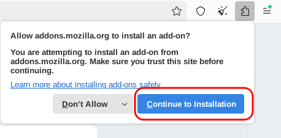
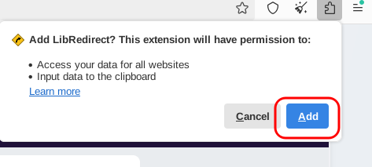
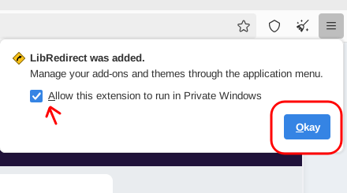
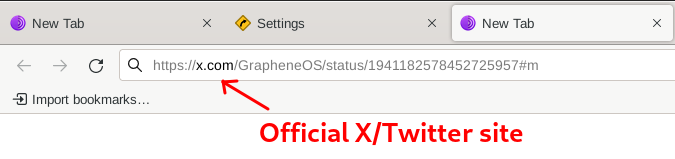
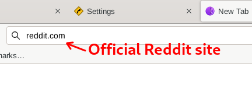

# Privacy Frontends - Avoiding Centralized Tracking

```
TLDR: by using privacy front-ends (ex: invidious, redlib, etc), you can use centralised services without all of their trackers
```

In this post we will show you how to avoid tracking from your favorite online services and use them privately.

## **The problem with using online services and media**

We use a lot of various services from day to day like Youtube, Twitter/X, Reddit, Google Translation, Twitch, etc. The problem with these services is that they are not friendly to people who want to have some privacy while using them. They want to track you and collect as much data as possible

They will often make things very difficult for you, trying to force you to make an account and login, denying you access if you happen to use a VPN or privacy browser, and generally collecting as much metadata on you as possible just by connecting to their site/app.


## **The Solution? Privacy Frontends**

What is a Privacy Frontend?

Put simply, a Privacy Frontend is a proxy that acts as an access point between you and the service you want to access. For example, instead of conneting to YouTube directly, you connect to the privacy frontend, which in turn connects to YouTube directly for you, to get the video you want

Besides giving you a seamless connection to your favorite service, a privacy frontend also acts as an anonymizer, as many people are going to be using the same frontend server to connect to YouTube or other service. That service will see the frontend server as a single user, or if they know that it's a privacy frontend, they won't know how many people are using it or who those people are.


Additionally, a privacy frontend will usually offer you an alternative UI that is much more lightweight, less cluttered, and having more option to customize how you like.

## **Popular Examples of Privacy Frontends**

 - [Invidious](https://invidious.io/) for YouTube
 - [Redlib](https://github.com/redlib-org/redlib) for Reddit
 - [Nitter](https://github.com/zedeus/nitter) for Twitter/X


## What is the best method to using them ?

[LibRedirect](https://libredirect.github.io/) is a browser extension and the best tool to automatically redirect you to the appropriate privacy frontend corresponding to a particular service. For example if you open a reddit link in your browser, LibRedirect will automatically forward you to a Redlib server to view the Reddit post from there.

It has support for many many services, which you can see on their homepage. The extension includes support for redirecting to TOR onion instances of privacy frontends as well! So you can install this in your TOR Browser. 

Note: One thing you will often hear is to not install any extensions into your TOR Browser. This is only partially true. The reason why this is said is because many extensions manipulate the webpages you are browsing and can therefore cause you to have a unique fingerprint. But as LibRedirect is merely performing a URL redirect, you can safely install it into TOR Browser.

## **How to install (Firefox-based Browsers and TOR Browser):**

1) For Firefox based browsers, this simply means going to the [Firefox addon page](https://addons.mozilla.org/firefox/addon/libredirect/) and "Add to Firefox":


2) Click through the pop up dialogues and make sure to allow in Private Windows:





## **How to install (Chromium-based Browsers):**

1) For Chromium, you must go to this [github link](https://github.com/libredirect/browser_extension/releases/latest) to the latest version release and download the .crx file under Assets


2) Open your browser and navigate to `chrome://extensions/` in the address bar, then enable Developer Mode.

3) Open your file manager next to your browser and navigate to where you saved your .crx then drag and drop the file into your browser window in order to install it


## **Post-install setup:**

1) Get into the LibRedirect settings by clicking the pop-out:


2) Now go to "Services" to choose and enable the services you want to proxy. You can ping all the available instances to see which ones work. If there are multiple frontends for a particular service, like YouTube, then it's up to you to explore which one you like best and go with that.


## **A couple examples in practice:**

First I'm going to try to access a tweet from GrapheneOS. Here you can see I enter the link to the tweet in my address bar:


Once I press Enter, I am automatically redirected to a Nitter instance, in this case, XCancel:


As another example, I will try to go to Reddit's official site:


Once I press Enter, I am now redirected to a Redlib instance:


## Conclusion

That's all you need to start using privacy frontends!

