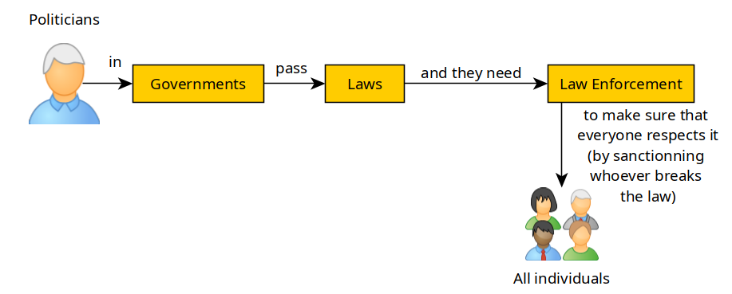
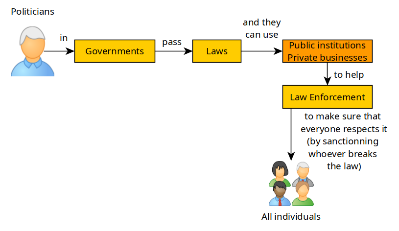

# Governments, Centralisation, and Law Enforcement

```
TLDR: Governments push centralisation, surveillance and deanonymization through busineses because it enables law enforcement to go complain to these centralised services to snitch on their users, to help them enforce the law.
```

In this tutorial we're going to cover and explain what are governments, and why they are trying to force us into mass surveillance and KYC procedures.


## **Governments and their laws**
    
    
    A government is the system or group of people governing an organized community, generally a state.
    
    

Their primary focus is to maintain their control over the country/state, no matter the cost, they will do everything possible to remain in power for as long as possible

They are the ones who write the rules, the laws by which everyone in the country must must follow for society to remain in order (wheter the subjected people accept it or not), according to them. 

Governments pass Laws and to make sure that their laws is respected, they need Law enforcement (LE) to be able to apply sanctions on whoever breaks their laws.



Governments nowadays almost always use bogus reasons to use to pass abusive laws (the typical "it's to fight the boogeymen!" type of reasons) , in order to either make more money, or to enforce surveillance better, or to straight up take away power from businesses and individuals. 

## **Businesses and Centralisation**

One thing that governments genuinely care about is how modern and economically mature their country is. Hence their close relationships with businesses that generate the most wealth in their country. 

These same businesses are often a tool of Centralisation, to extend the government's reach of power, the most common trait there is surveillance, and identifying who did what (ex: with KYC procedures).

Each business is closely regulated, the bigger the business, the higher up the priority list it is to be audited for regulation compliance checks. The exception being with International Banks (ex: [see the HSBC scandal](https://iv.nowhere.moe/watch?v=WwXPZohTJ4w)) due to everyone's innate greed to get richer even if it means breaking the law.



Businesses are centralised entities just like governments, they ALL can act as proxies to help law enforcement, wheter they want to or not.

## **Law enforcement**
    
    
    Law enforcement is the activity of some members of government who act in an organized manner to enforce the law by discovering, deterring, rehabilitating, or punishing people who violate the rules and norms governing that society.
    
    

For the Law to be enforceable the authorities need to know 2 things: 

  1. What happened ? (lack of Privacy)

  2. Who did it ? (lack of Anonymity)


Of course, the law must not be ignored by anyone, and to make sure that everyone is kept in line, they need to show everyone that the law is effectively enforced onto those that behaved badly, very often they brag about catching criminals to let everyone know that they are the good guys protecting everyone from the bad guys.

That is the basis of this whole Privacy and Anonymity talk. In short, For the law to be enforceable, they need to know both what happened, and who perpetrated the act to be able to apply sanctions on the individual / group of individuals that committed the crime.

Modern governments know this very well, and some go to extreme lengths to make sure that every citizen is under surveillance.

  1. USA: [Edward Snowden's Revelations](https://youtube.com/watch?v=9g_sqKH2z4I)

  2. China: [the Surveillance State](https://youtube.com/watch?v=Np_C8647mK8) \- [See what it can lead to](https://youtube.com/watch?v=v7AYyUqrMuQ)


A very common practice for Law enforcement is also to either bribe or force legitimate businesses to give the data they possess of their users, to know if a crime has been commited or not. See the USA's recent [FISA 702](https://www.dni.gov/files/icotr/Section702-Basics-Infographic.pdf), good news is they're not lying about it anymore, the intention is clear and out in the open. The general idea is that this bill is meant for the government to be able to force anyone (individual or business) to conduct spying activities for the governments, with or without their consent, with a gag order. 

In short, the US government grants itself the right to force you or your business to do anything to further their agenda. This world's biggest democracies are all turning into dictatorships in the name of national security.

Anyway you get the idea. Anonymity is more relevant than ever, we're headed for that surveillance dystopia China has currently established.

