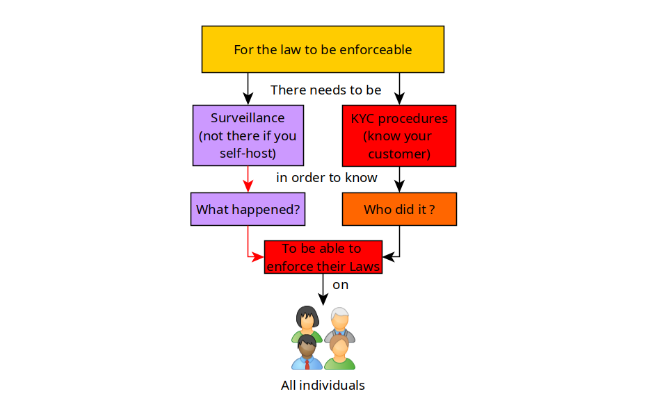
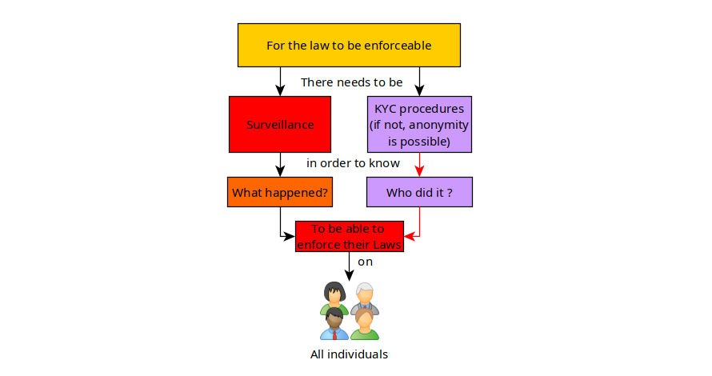

# Governments fear Decentralisation and Anonymity 

In this tutorial we're going to explain why Decentralisation and Anonymity are essential in reducing the power of the government over it's citizens. 

```
TLDR:  Governments are afraid of:
- Decentralisation because they can't go complain to a central authority to snitch and censor their users.
- Privacy because they can't have irrefutable proof of what the users did
- Anonymity because they can't know who did what
Because of these 3, Governments can't enforce their laws onto everyone.
```

## **Governments and Decentralisation**

As we have discussed previously, governments love centralisation. It's an easy way for them to extend their power to directly affect users of said centralised businesses. Take for example how the [US government uses banks to impose financial sanctions](https://home.treasury.gov/news/press-releases/jy0608) onto whoever they consider as a threat to them.

They have largely succeeded in keeping their population hooked onto centralisation, for example you want to watch videos you think youtube, you want to browse the web you think google, social - facebook, twitter, and so on. It's become a natural reflex for most people, hence most people flock to these centralised platforms, and as we have explained [previously](../governments/index.md); governments use them as proxies to spy or enforce censorship onto it's citizens.


It's convenient for them; you own a large service, which attracts millions of people to use it, and so governments would love to have access to that data you own, to be able to know what's happening. (remember [FISA 702](https://www.dni.gov/files/icotr/Section702-Basics-Infographic.pdf))

If the masses were to completely change their habits and embrace decentralisation, like i am trying to promote on [nowhere.moe](https://nowhere.moe) for example using peertube to replace youtube, matrix to replace discord, mastodon to replace twitter, etc, it would seriously limit the reach of the power they try to have on the population. They wouldn't be able to censor and try to control the public opinion of the people [ like they did through twitter](https://en.wikipedia.org/wiki/Twitter_Files) for example. 


The key difference here is that the INDIVIDUALS are the ones controlling the service, and they're making the overall decentralised ecosystem grow larger and larger as they keep federating together. 



So in this case, **you are taking out the first pillar that is required for law enforcement ; Surveillance** , the government would have to knock on your door, and FORCE you to give them the data of your users.

I encourage everyone that's fed up with the arbitrary administration of centralised services to start using their decentralised alternatives, see what the [Fediverse](https://fedidb.org/) has to offer for more details.

## **Governments and Anonymity**

That's an easy one. as we discussed in my previous blogpost, for the law to be respected, it needs to be feared by the population, to make sure it remains feared, it needs to be enforced by authorities (law enforcement or LE for short). To do so they need to know what happened, and they need to know who did what.

That's why they go to such extreme lengths to implement surveillance wherever they can. (see [China's surveillance state](https://iv.nowhere.moe/watch?v=v7AYyUqrMuQ), the USA's [FISA 702](https://iv.nowhere.moe/watch?v=uRS-TzjhMKg), and the [EU trying to pass anti encryption laws](https://iv.nowhere.moe/watch?v=LNVo6EfmhyQ))

Anonymity is a great thing to look for if you care about privacy. It's the perfect way to know if a service intends to respect your privacy or not.



The reason being, that if you use a service anonymously, **you are taking out the other pillar that is required for the law to be enforceable, making sure that they cannot know it was you who used the service**

### **The Anonymity Test**

If you want to know if a service intends to respect your privacy or not, **access it, and use it anonymously**. (use the **Tor browser** to access it, and see if it accepts **monero as payments)**. Check out my tutorial on [OPSEC (Operational Security)](../opsec/index.md) to understand the full reasoning.

You will see that you can already rule out Google, youtube, twitter, instagram, snapchat, Facebook, Baidu, Whatsapp, etc. All of those services sell the data they collect about you to each other, including to governments [(see the cambridge analytica scandal)](https://iv.nowhere.moe/watch?v=FXdYSQ6nu-M)

Stop using services that treat you as a product to sell, regain your lost dignity and defend it.

