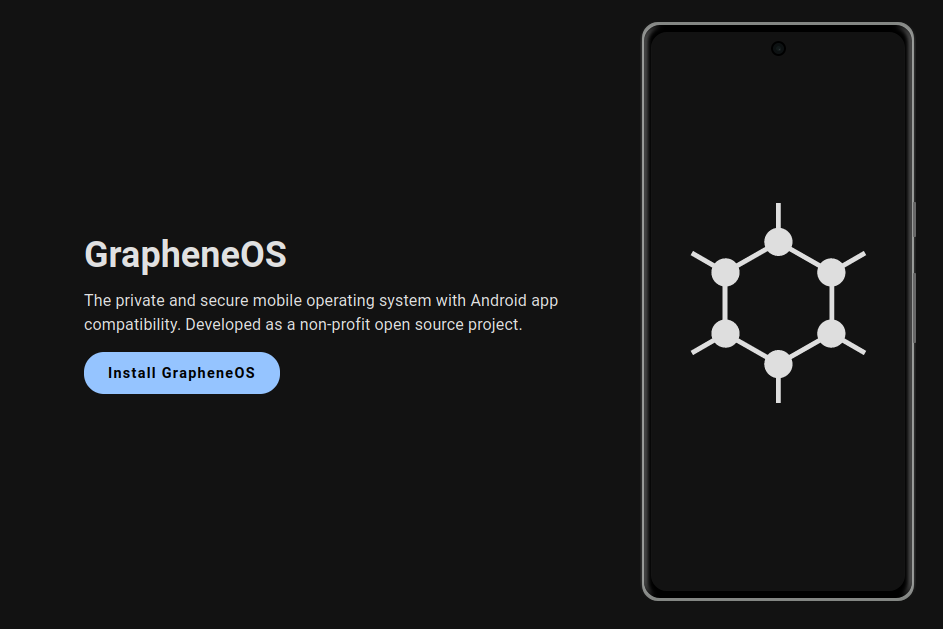
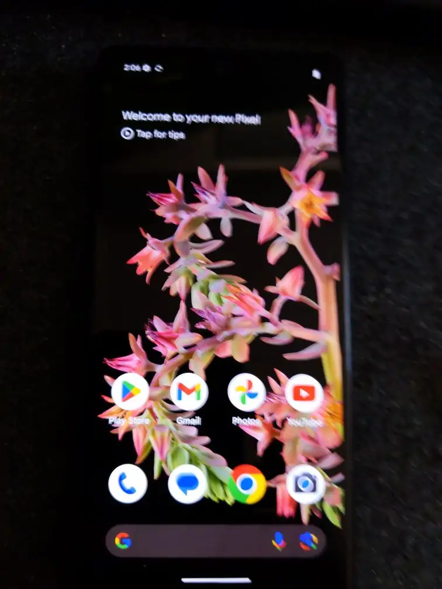
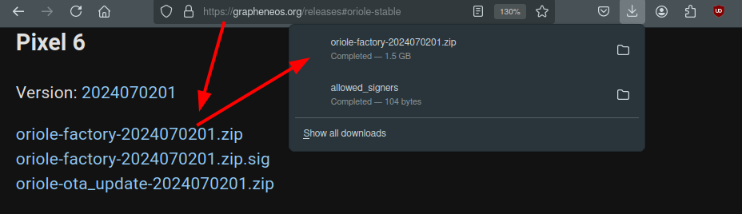

# How to have Privacy on your Phone (GrapheneOS) 

```
TLDR: by using GrapheneOS you can have privacy on your phone. (If you use stock android, you're being spied on by default).
```



In this tutorial we're going to setup graphene OS, an open source android operating system for google pixel phones. (Yes google phones, if you don't like it then you'll have to wait for functional [open hardware](../openhardware/index.md) alternatives to arrive on the market.) Currently GrapheneOS is one of the most privacy-focused mobile operating systems given that it's fully [open source](https://grapheneos.org/source). and that they refuse to implement google services by default, unlike their competitors like LineageOS.

_DISCLAIMER:_ yes the quality of the photos taken are garbage :)

## _OPSEC Recommendations:_

  1. Hardware : (Phone (google Pixel model))


I recommend using this setup for [Private use](../privacy/index.md), as per the [4 basic OPSEC levels](../opsec4levels/index.md).


## **Requirements**

First step is go acquire a Google pixel phone, and a model [that supports grapheneOS](https://grapheneos.org/faq#supported-devices). In my case, i purchased a Pixel 6 model. Then on the host OS on your computer, install the required packages:
    
    
    
    [ nowhere ] [ /dev/pts/11 ] [~]
    → sudo pacman -Syy android-tools
    [sudo] password for nihilist:
    resolving dependencies...
    looking for conflicting packages...
    
    Packages (4) android-udev-20240221-1  libmtp-1.1.21-1  protobuf-25.3-4
                 android-tools-35.0.1-1
    
    Total Download Size:    4.84 MiB
    Total Installed Size:  22.07 MiB
    
    :: Proceed with installation? [Y/n] y
    
    

Here on the phone, we need to enable developer settings, to be able to enable the "OEM Unlocking" option:

    

Then reboot the phone by holding the power and volume down to enter fastboot mode:


Then, connect the device via usb to your computer:
    
    
    [ nowhere ] [ /dev/pts/11 ] [~]
    → lsusb | grep Google
    Bus 001 Device 098: ID 18d1:4ee0 Google Inc. Nexus/Pixel Device (fastboot)
    
    [ nowhere ] [ /dev/pts/11 ] [~]
    → fastboot --version
    fastboot version 35.0.1-android-tools
    Installed as /usr/bin/fastboot
    
    [ nowhere ] [ /dev/pts/11 ] [~]
    → fastboot devices
    no permissions; see [http://developer.android.com/tools/device.html]     fastboot
    
    [ nowhere ] [ /dev/pts/11 ] [~]
    → sudo -i
    nowhere# fastboot devices
    SN   fastboot
    
    nowhere# fastboot flashing unlock
    OKAY [  0.043s]
    Finished. Total time: 0.043s
    
    

  

Next, as i have a google pixel 6 model, i need to download the correct graphene os image


    
    
    nowhere# mv /home/nihilist/Downloads/oriole-factory-2024070201.zip .
    nowhere# unzip oriole-factory-2024070201.zip
    Archive:  oriole-factory-2024070201.zip
       creating: oriole-factory-2024070201/
     extracting: oriole-factory-2024070201/image-oriole-2024070201.zip
      inflating: oriole-factory-2024070201/bootloader-oriole-slider-14.5-11677881.img
      inflating: oriole-factory-2024070201/radio-oriole-g5123b-135085-240517-b-11857288.img
     extracting: oriole-factory-2024070201/avb_pkmd.bin
      inflating: oriole-factory-2024070201/flash-all.sh
      inflating: oriole-factory-2024070201/flash-all.bat
    
    nowhere# cd oriole-factory-2024070201
    
    nowhere# ls
    avb_pkmd.bin                                flash-all.sh
    bootloader-oriole-slider-14.5-11677881.img  image-oriole-2024070201.zip
    flash-all.bat                               radio-oriole-g5123b-135085-240517-b-11857288.img
    
    nowhere# chmod +x ./flash-all.sh
    nowhere# ./flash-all.sh
    
    

Then let the bashscript run, it can take a few minutes:
    
    
    nowhere# ./flash-all.sh
    Warning: skip copying bootloader_a image avb footer (bootloader_a partition size: 0, bootloader_a image size: 14125140).
    Sending 'bootloader_a' (13794 KB)                  OKAY [  0.364s]
    Writing 'bootloader_a'                             (bootloader) Flashing pack version slider-14.5-11677881
    (bootloader) flashing platform gs101
    (bootloader) Validating partition ufs
    (bootloader) Validating partition partition:0
    (bootloader) Validating partition partition:1
    (bootloader) Validating partition partition:2
    (bootloader) Validating partition partition:3
    (bootloader) Validating partition bl1_a
    (bootloader) Validating partition pbl_a
    (bootloader) Validating partition bl2_a
    (bootloader) Validating partition abl_a
    (bootloader) Validating partition bl31_a
    (bootloader) Validating partition tzsw_a
    (bootloader) Validating partition gsa_a
    (bootloader) Validating partition ldfw_a
    (bootloader) Flashing partition ufs
    (bootloader) Flashing partition partition:0
    (bootloader) Flashing partition partition:1
    (bootloader) Flashing partition partition:2
    (bootloader) Flashing partition partition:3
    (bootloader) Flashing partition bl1_a
    (bootloader) Flashing partition pbl_a
    (bootloader) Flashing partition bl2_a
    (bootloader) Flashing partition abl_a
    (bootloader) Flashing partition bl31_a
    (bootloader) Flashing partition tzsw_a
    (bootloader) Flashing partition gsa_a
    (bootloader) Flashing partition ldfw_a
    (bootloader) Loading sideload ufsfwupdate
    OKAY [  3.089s]
    Finished. Total time: 3.454s
    Setting current slot to 'a'                        OKAY [  0.058s]
    Finished. Total time: 0.059s
    Rebooting into bootloader                          OKAY [  0.000s]
    
    [...]
    
    Sending sparse 'super' 11/13 (254972 KB)           OKAY [  6.618s]
    Writing 'super'                                    OKAY [  0.950s]
    Sending sparse 'super' 12/13 (254972 KB)           OKAY [  6.621s]
    Writing 'super'                                    OKAY [  0.935s]
    Sending sparse 'super' 13/13 (46284 KB)            OKAY [  1.216s]
    Writing 'super'                                    OKAY [  0.204s]
    Erasing 'userdata'                                 OKAY [  0.390s]
    Erase successful, but not automatically formatting.
    File system type raw not supported.
    wipe task partition not found: cache
    Erasing 'metadata'                                 OKAY [  0.007s]
    Erase successful, but not automatically formatting.
    File system type raw not supported.
    Finished. Total time: 105.929s
    Rebooting into bootloader                          OKAY [  0.000s]
    Finished. Total time: 0.150s
    nowhere#
    
    
    

  

then lock the bootloader:
    
    
    nowhere# fastboot devices
    SN   fastboot
    
    nowhere# fastboot flashing lock
    OKAY [  0.276s]
    Finished. Total time: 0.276s
    	
    

      

And that's it! we managed to flash grapheneOS on the pixel phone.

## **Setting up multiple Profiles (for Public, and for Private use)**

As we have seen [previously](../internetsegmentation/index.md), it's always a good opsec practice to separate public use from private use. This can also apply on your phone, In this case we'll create a profile specifically for public usage, while we keep the main one for private usage.

  

Now in there, we can keep the closed-source applications in the public usage profile, while we keep the FOSS applications in the default private usage profile. 

## **Setting up package managers**

Now that's done, we use the private usage profile to install f-droid, in order to install FOSS applications

   

And here we can go into our public usage profile to setup the Aurora store to install closed-source applications like so:

      

And from there, we can install all non-FOSS applications in the public usage profile.

