# Haveno Decentralised Exchange Dispute resolution (Fiat -> XMR) 

```
TLDR: Using Haveno, thanks to the 2of3 mutlisig arbitration feature, if a scam were to happen, a given haveno network arbitrator can resolve disputes by deciding if either Alice or Bob should get the security deposit. Neither party has incentives to scam because of the security deposit, they both have something to lose.
```


In this tutorial we're going to cover how the Haveno DEX handles trade disputes, which can happen as, after all it's decentralised, and anonymous by default.

Check out [this tutorial](../haveno-client-f2f/index.md) if you want to know how to install Haveno DEX on your device.

## _OPSEC Recommendations:_

  1. Hardware : (Personal Computer / Laptop)

  2. Host OS: [Linux](../linux/index.md)

  3. Hypervisor: [libvirtd QEMU/KVM](../hypervisorsetup/index.md)

  4. Virtual Machine: [Linux](../hypervisorsetup/index.md) or [Whonix](../whonixqemuvms/index.md) or [Tails](../tailsqemuvm/index.md)

  5. Application: [Haveno DEX Setup](../hypervisorsetup/index.md)


I recommend using this setup into one of the above mentionned VMs, either for [Private use](../privacy/index.md), or [Anonymous use](../anonymityexplained/index.md), as per the [4 basic OPSEC levels](../opsec4levels/index.md). (Note that Deanonymization will happen during the Fiat transaction, but it is minimized as you're revealing your identity to an other peer, rather than to a centralised exchange)


## **What protects the Buyer or the Seller ?**

Back on localmonero, what was at stake was the reputation of the Buyer or the Seller, because if any of their trades go wrong, their reputation would not be a clean 100% successful trades anymore. Problem is, on the Haveno DEX, where there is no centralisation to keep everyone's reputation in check, it could be very easy to give yourself a ton of positive reputation points, by spinning up 2 haveno dex instances, to simulate trades with yourself.

So there was this need to have something else at stake to prevent people from scamming each other. That is **the Security deposit system** that we described in the [previous tutorial](../haveno-client-f2f/index.md).


In short, **both Bob and Alice need to put some XMR into the trade initially, so that if they try to scam each other, they will loose something in the process.**

In this example, The trade will go wrong as **Bob will try to scam Alice with an invalid Amazon giftcard code**.

## **What happens when there's a scammer?**


Here, in this case we're Alice, and we want to sell our XMR for an amazon giftcard (which is typically just a code you need to redeem). So here Alice creates her amazon egift card haveno account to be able to trade just that, she needs to mention her email and the country (because a german amazon giftcard code doesnt work on the french amazon website!) 

 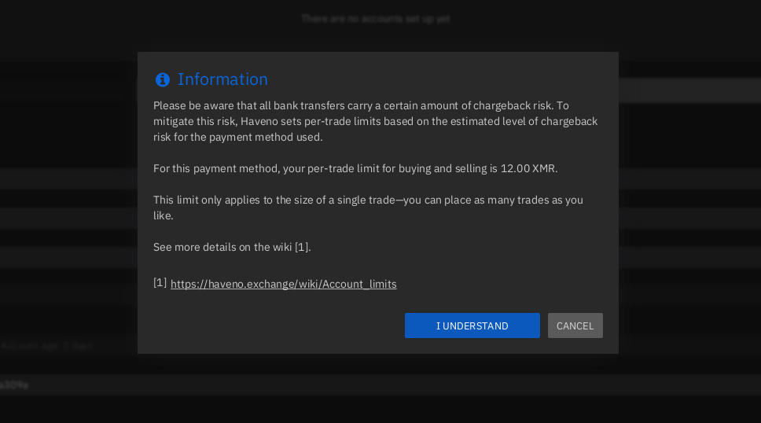 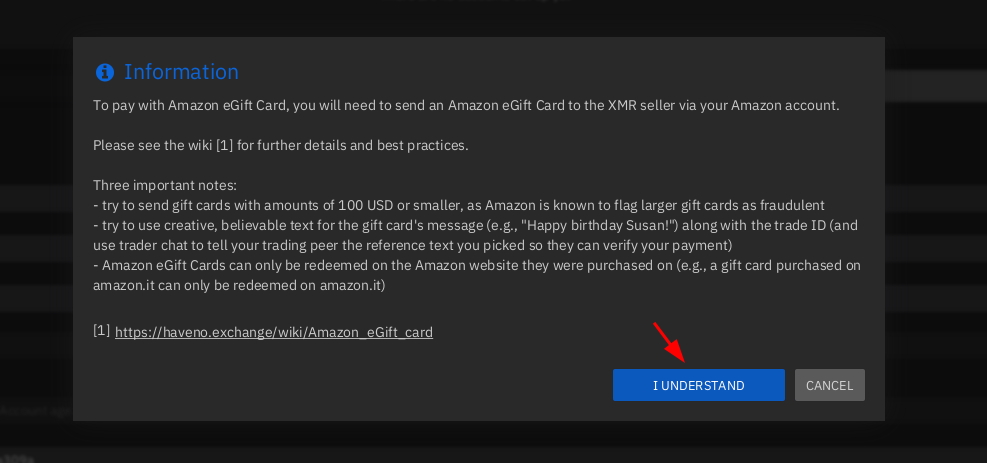

Read carefully what exchanging an Amazon egift card to XMR implies then click "I understand"


Then create a selling offer like so:


Mention the amount of XMR you want to sell, and the % above the market price you want to sell it for, currently 0.2018 XMR at market price will give you 25 euros. **Then you need to fund your offer with the additional 0.101009 XMR security deposit. Meaning you need to put in 0.302809 XMR total**


Once funded, wait for the funds to appear as available balance on your haveno client (can take 20 minutes)

 

Then click Place offer to sell monero:


and then click confirm offer to sell monero.

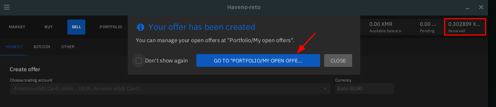 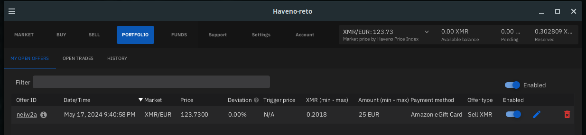

Here you can see that your offer is enabled from the portfolio tab, and people can see it appear on the Buy tab:

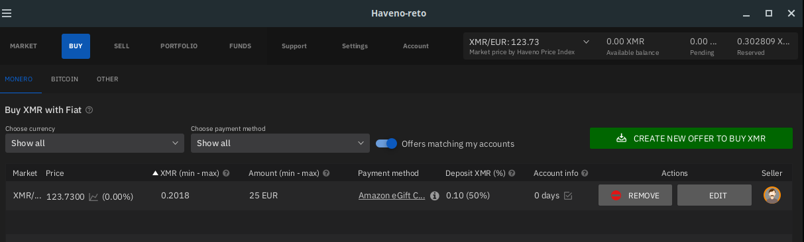 

Now let's switch sides. We're now Bob the scammer, we want to scam Alice. We see her offer on the buy tab, and we take the offer:


Then, just like Alice did, we also fund the offer with the monero security deposit:

 

Wait for it to show up as available in your haveno balance:

 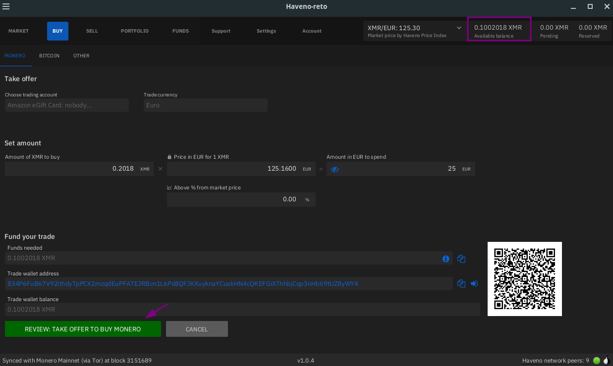

Then click confirm to take the offer to buy Monero:

 

Back to Alice's perspective, the trade will initiate and can be viewed when going to the portfolio tab:

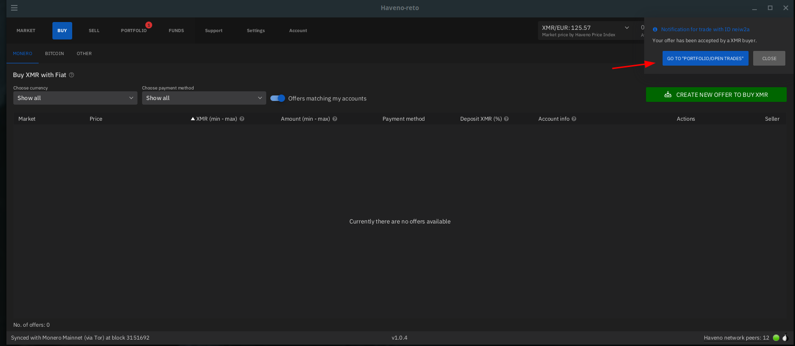

When opening the trade window, Alice sees that **Bob not only does not respect the trade protocol of sending the gift card by mail by just sending the code over chat, but the code is also invalid!**

  

Alice sees that she cannot redeem the code as it is invalid. **In short, she didn't get paid!**


Back to Bob's perspesctive as we are one kind of an asshole, we don't care that Alice didn't get paid and declare that we sent payment anyway.

  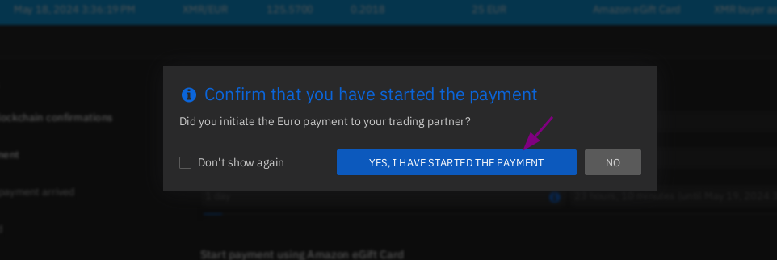 

Back to Alice's perspective, Now the ball is in her park, what does she do ? 

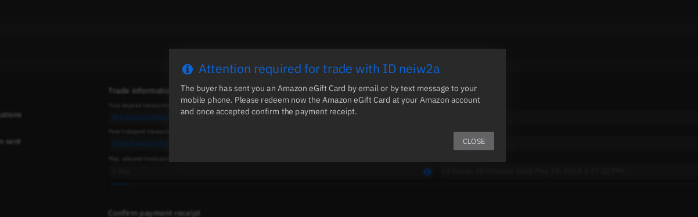 

Since she never received payment,**she does not confirm that she received it, and waits until the trade expires**

 

In this case, the trade should not take more than 24 hours, so she waits until the next day, and when it expires, she'll be able to open up a dispute.

## **Arbitrator Resolution**

Now that the trade time expired (24hrs), Alice can now open up a dispute, for the Arbitrator to step in:


Here, Alice clicks on "open support ticket", and she goes to the support tab to view her support ticket: 

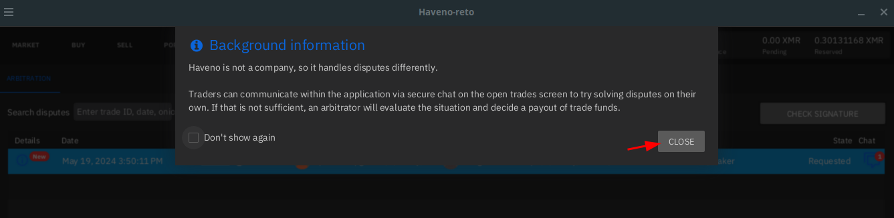 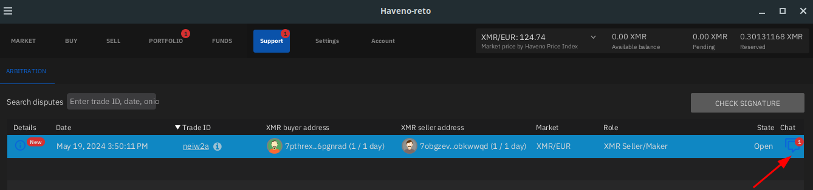 

Then the Arbitrator reviews the exchange from Alice's point of view:

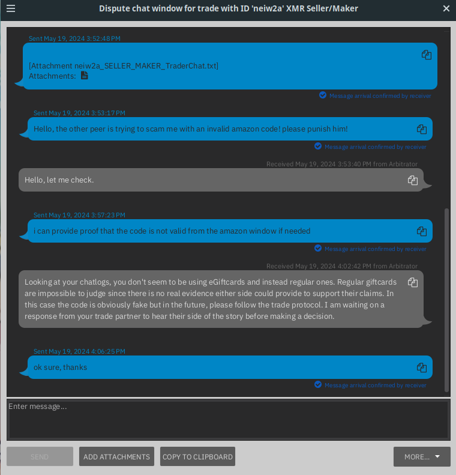

Here the arbitrator sees that the trade protocol has not been respected, both parties need to make sure they follow the trade protocol for said payment option correctly for the trade to be considered as valid from the arbitrator's point of view.


Then the Arbitrator sees the exchange from Bob's point of view too:


Obviously, Bob explains that he got his very legit amazon giftcard code from his hat, and he naively thinks that the arbitrator will rule in his favor. 


And finally, back to Alice's POV: the Arbitrator decides that it is Alice who's in the Right, and therefore Bob does not get his Monero security deposit back, hence he's loosing 0.101009 XMR in the process.

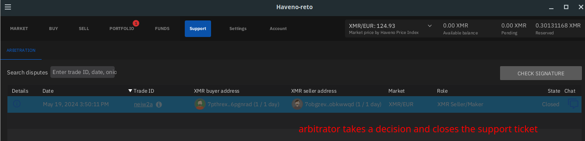

So here, Bob just lost some XMR, and Alice is getting her 0.2018 XMR back, she gets her security deposit back (0.101009 XMR) but also she gets Bob's security deposit (0.101009 XMR), **so in total she gets 0.40011456 XMR back (0.101009 XMR more than when she started using Haveno)**. In the end, it is Bob that ended up giving her some monero against his will.

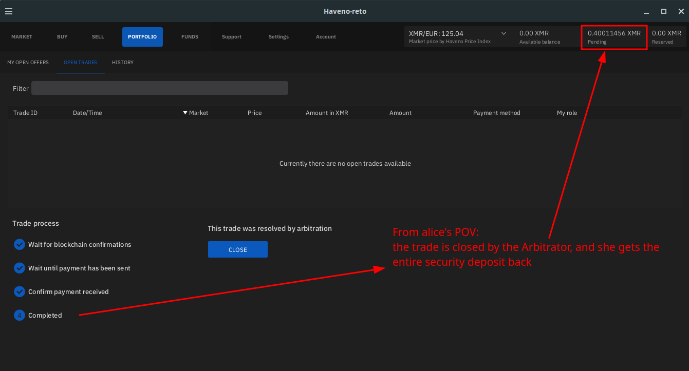

Now keep in mind that not all payment options are safe, some can come with easy chargebacks (ex: paypal), and some are just next to impossible for an arbitrator to decide who's in the right or wrong (face-to-face trades for instance). Be very careful to know the risks associated with each payment option, along with what precautions need to be taken. 

Check out my other tutorials on Decentralised Finances below:

  1. [✅ How to setup your Monero wallet ](../monero2024/index.md)
  2. [✅ Why can't I trust Centralised Exchanges, and random Monero nodes ?](../chainalysisattempts/index.md)
  3. [✅ Haveno Decentralised Exchange direct Fiat -> XMR transaction ⭐](../haveno-client-f2f/index.md)
  4. [**✅ Haveno DEX Dispute resolution (Fiat -> XMR)**](../haveno-arbitrator/index.md)
  5. [✅ Haveno DEX Bank Transfer (ex: SEPA) -> XMR transaction ](../haveno-sepa/index.md)
  6. [✅ Haveno DEX Cash By Mail -> XMR transaction ⭐](../haveno-cashbymail/index.md)


