# Haveno DEX Cash by Mail -> XMR transaction 

```
TLDR: that's the most private way of trading fiat for XMR, you can send an envelope with cash inside to a remote peer through the postal system, and once they recieve it, they release the monero from the escrow. Take note however that those types of trades can take weeks to complete because of how slow the postal system is.
```


In this tutorial we're going to cover how to buy Monero, for cash by mail on the Haveno Decentralised Exchange. This was the most popular payment method back on LocalMonero, due to being an improvement over [bank transfers (like SEPA in the EU)](../haveno-sepa/index.md) when it comes to trading larger volumes in the long run, as **Cash cannot easily be traced by adversaries unlike bank transfers** , making Cash by Mail one of the most private ways to exchange real world money for Monero.


## _OPSEC Recommendations:_

  1. Hardware : (Personal Computer / Laptop)

  2. Host OS: [Linux](../linux/index.md)

  3. Hypervisor: [libvirtd QEMU/KVM](../hypervisorsetup/index.md)

  4. Virtual Machine: [Linux](../hypervisorsetup/index.md) or [Whonix](../whonixqemuvms/index.md) or [Tails](../tailsqemuvm/index.md)

  5. Application: [Haveno DEX Setup](../hypervisorsetup/index.md)


I recommend using this setup into one of the above mentionned VMs, either for [Private use](../privacy/index.md), or [Anonymous use](../anonymityexplained/index.md), as per the [4 basic OPSEC levels](../opsec4levels/index.md). (Note that Deanonymization will happen during the Fiat transaction, but it is minimized as you're revealing your identity to an other peer, rather than to a centralised exchange)


## **Initiating the trade**


Here, we're Bob, we create our account on Haveno for Pay by Mail transactions, mentioning our real name, postal address, city and country.


Then we hit "save new account":

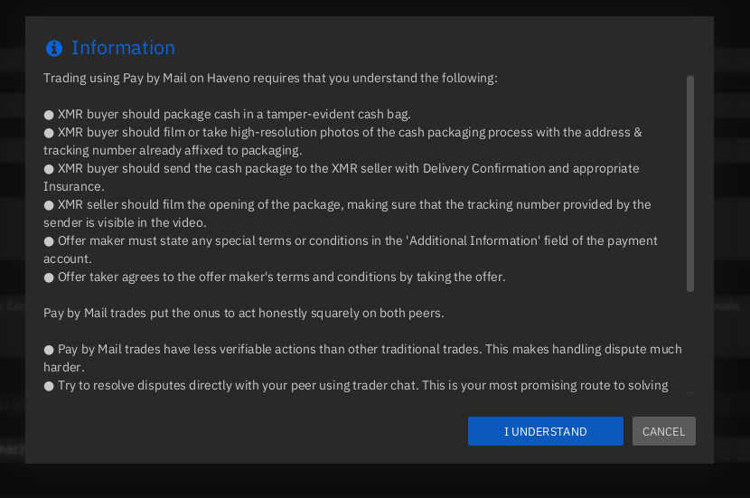 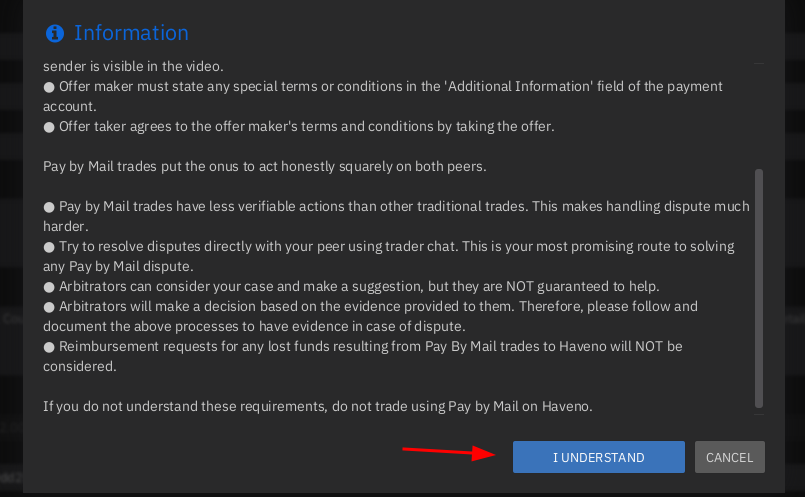

Make sure you understand the risks that cash by mail transactions have, then click "I understand": 


Then, we can create a buying offer by going into the Buy section:

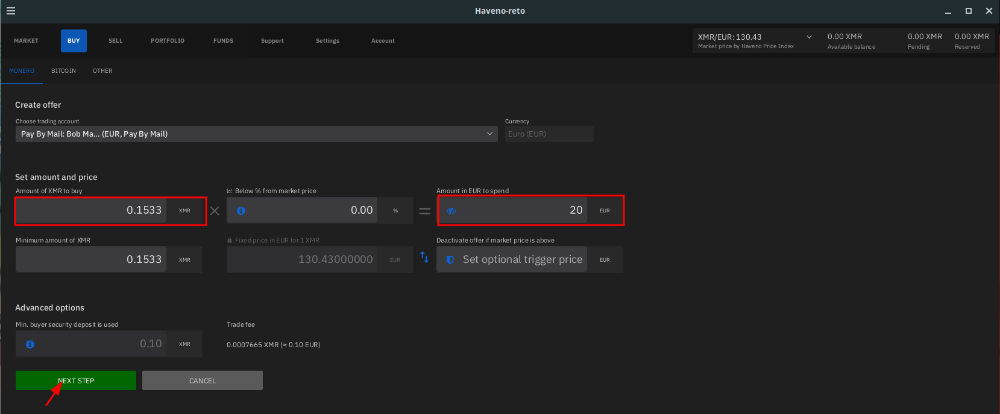

Here we want to purchase 20 euros worth of Monero, at the current market price, for 0.1533 XMR:


THen we fund the offer, and when the funds show up in our Haveno client, we hit "Review: Place offer to buy Monero"

 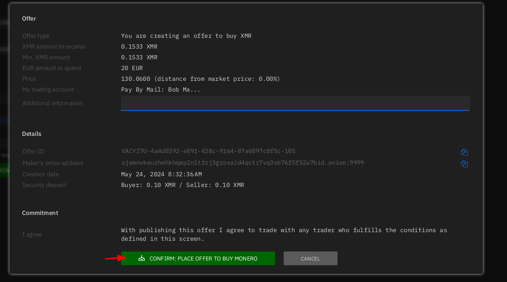

Once the offer is confirmed, we can view it on the Portfolie page:

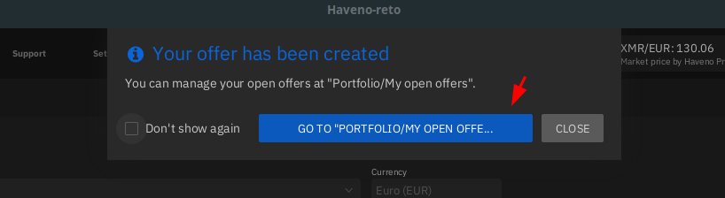 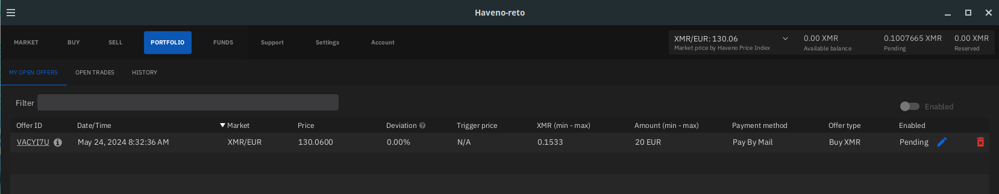

Here we wait approx 20 minutes for the monero transaction to be validated by the network, then the offer will appear as enabled:

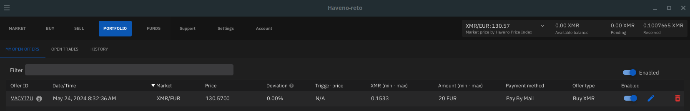

And from there, other peers will be able to see Bob's offer into the "Sell Monero" section.


Now let's switch over to Alice's side, we also create an account to be able to do Cash by mail transactions:


Then we go into the "Sell monero" section and we take Bob's offer:

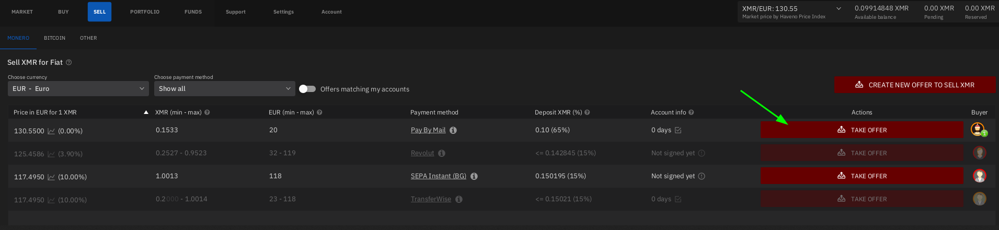

Once the offer is taken we fund the offer:

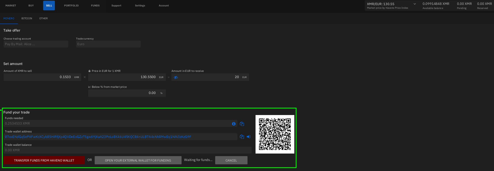

There we send the monero to the address as shown for both the security deposit and the actual monero we want to sell:

 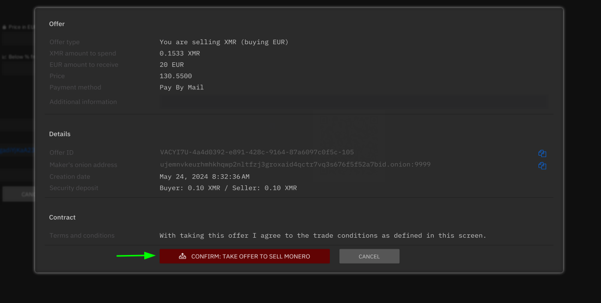  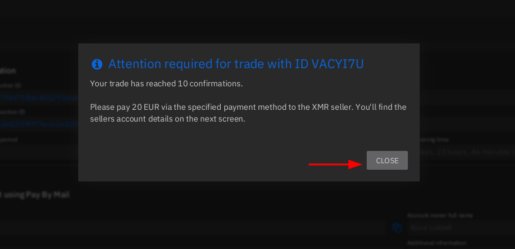

Now that the trade has been initiated, let's review the correct trade protocol for Cash By Mail transactions:

## **Cash By Mail: the trade protocol**

To remain safe with cash by mail transactions, there are a number of steps that Bob need to be take in order to ensure that there is no possibility of being scammed as explained by the following LocalMonero article:
    
    
    Staying Safe With Cash by Mail (originally from LocalMonero)
    
    If you're buying...
    
    If you stick to high reputation sellers it's very unlikely that you'll encounter any issues while buying with cash by mail, however the following tips will help you prove your payment in a dispute should it arise. The most important thing to do is to make a video recording of your payment. Here are the guidelines:
    Your video should be filmed within a single take, without cuts
    
    You can put the cash in the envelope at home or in the car, and you can put your phone with the video turned on in your front shirt pocket and it'll record the whole process without much extra work from you apart from making sure that you do everything in front of where the camera's pointing. If you have something like a GoPro or the latest iPhone which has a camera with a wider viewing angle it's going to be even easier. Keep the footage in case of a dispute for 180 days.
    
    Put custom markings inside the envelope
    Use some sort of a custom chop/stamp/seal, or a signature or just random movements with a sharpie inside the envelope, covering all surfaces. This will help establish wheter the seller is actually opening the envelope you've sent or a fake one. Make sure the mark is visible on the video.
    
    Try to disguise the cash
    To mitigate a (potential, but very rare) case of postal theft en route, try to conceal the fact that the package contains cash. You may put the cash in a magazine, mylar bag or some other container. Vacuum sealing the cash also works.
    
    Place envelopes inside of envelopes
    Instead of simply placing the cash into the envelope, use multiple nested envelopes for your package. Place the cash into the smallest envelope (or simply fold a bigger envelope as necessary), seal it, and place it into another envelope. Repeat this process until you have at least 3 nested envelopes. This helps ensure that if the receiving party tries to tamper with your package they will have a much harder time resealing it all in a way that would be undetectable when inspected by the dispute mediator.
    
    Send with tracking
    Packages sent without tracking may get lost with and without tracking it could be all but impossible to locate it. Having tracking also allows the receiving end to have peace of mind that the package is en route in case it's taking longer than expected.
    
    Conclusion
    As we've mentioned before, with established traders the risk for a buyer is very low. Very low doesn't mean zero though, so make sure to follow these rules to be prepared for a dispute situation.
    
    

And there are also a few steps that the monero seller (Alice) has to follow in order to make sure the trade is conducted in a secure manner:
    
    
    If you're selling...
    
    Make a video of receiving and opening the package
    Record yourself receiving the package from the postal worker, the postal worker weighing it, record the label, all the outer sides of the package; open the package while filming with the camera pointed into it, run the cash through a counter and counterfeit scanner. Make sure everything is filmed in one take. Always keep the package in view of the camera. Keep the footage in case of a dispute for 180 days.
    
    Under no circumstances finalize a trade early
    The key thing to remember (and we put disclaimers about this on every step of the way) is to NEVER finalize a trade UNTIL you have the money and you are absolutely confident that everything is in order. A legitimate buyer won't pressure you into early finalize.
    
    Have a buyer put a note with their username and trade ID
    This will help you distinguish packages coming from different buyers and avoid confusion. This also will help in preventing man-in-the-middle attacks, where a scammer interposes themselves in-between the buyer and the seller, pretending to be the seller when talking to the buyer and pretending to be the buyer when talking to the seller.	
    
    

To recap the recommendations we have the following graph:


Here bob puts the cash into a mylar bag (to disguise the cash), which gets put into a tamper proof bag (that way, if alice tries to open it, it'll be easy to see), then bob puts it into at least 3 envelope layers with custom markings inside each layer (again, as anti tampering measures), and then putting it inside the tracking envelope. 

Also very important, Bob needs to record himself from the moment he wraps the cash into the mylar bag, all the way to when he places the letter in the letterbox. and Alice needs to do the same from her letterbox, all the way to unpacking the cash from the mylar bag. That way in case if there is a dispute, the arbitrator will be able to see who's at fault if there are any steps along the way that have not been respected.

In total per cash by mail transaction (assuming the final envelope weighs less than 100grams), the cost involved for the seller should be around 2 euros in France (including tracking), assuming the seller sends the envelope within the same country, and that he buys enevlopes, mylar bags and tamper proof bags in bulk.

## **Finishing the Transaction**


Bob of course makes sure that the envelope is sent to Alice's address as it is showcased within the trade window:


And once he followed the trade protocol to send the envelope to Alice, he can declare that he has sent the payment:

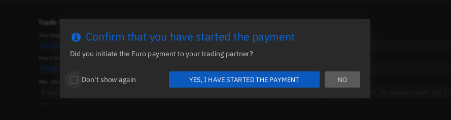

And then, both Alice and Bob will have to wait for the postal service to take the letter to it's destination. Bob also sent Alice the tracking link so that she can pinpoint where the envelope is in case if there is an issue along the way.


Back to Alice's side, we get the following notification:

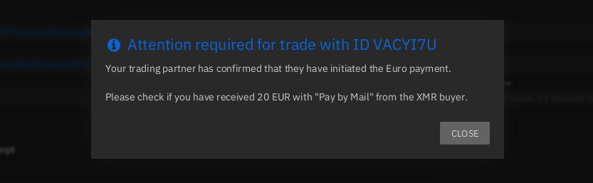

There, the delay depends on the postal service. But she receives the envelope 5 days later, she records herself from the point of retrieving, to the unpacking of the cash inside. and then if all is ok on her side, she confirms that she has received payment to release the monero funds to Bob:

 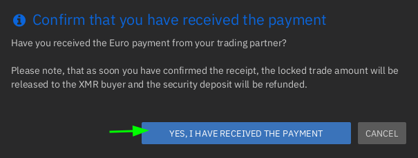 

And lastly, Bob sees that the funds are arriving on his Haveno client, and now he closes the trade.


And there, Bob can withdraw his funds from his Haveno monero wallet to another wallet if he chooses so inside the "Funds" tab, as we detailed in our previous tutorial [here](../haveno-client-f2f/index.md).

Check out my other tutorials on Decentralised Finances below:

  1. [✅ How to setup your Monero wallet ](../monero2024/index.md)
  2. [✅ Why can't I trust Centralised Exchanges, and random Monero nodes ?](../chainalysisattempts/index.md)
  3. [✅ Haveno Decentralised Exchange direct Fiat -> XMR transaction ⭐](../haveno-client-f2f/index.md)
  4. [✅ Haveno DEX Dispute resolution (Fiat -> XMR) ](../haveno-arbitrator/index.md)
  5. [✅ Haveno DEX Bank Transfer (ex: SEPA) -> XMR transaction ](../haveno-sepa/index.md)
  6. [**✅ Haveno DEX Cash By Mail -> XMR transaction ⭐**](../haveno-cashbymail/index.md)


