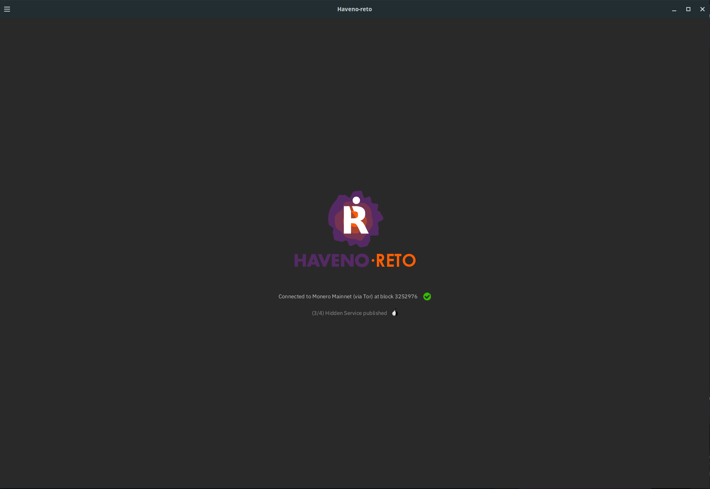
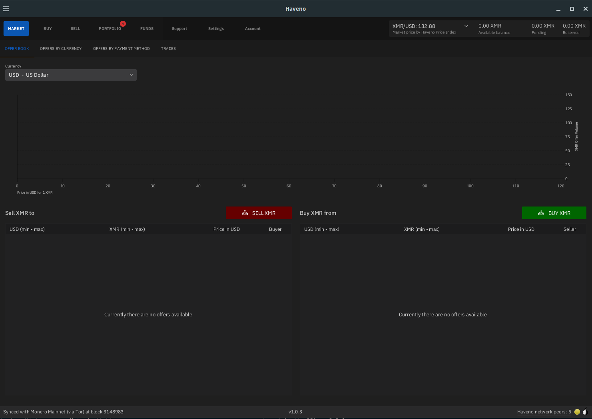
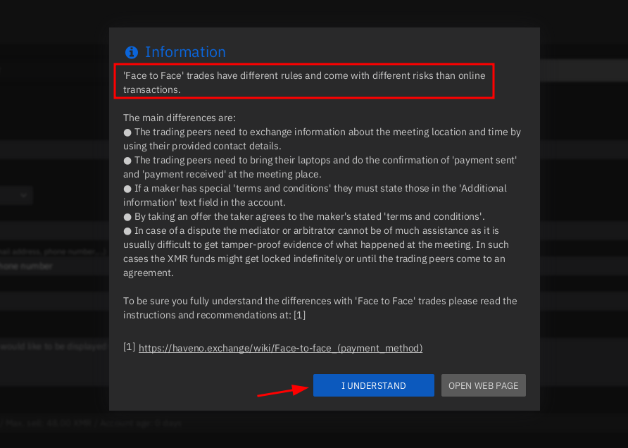
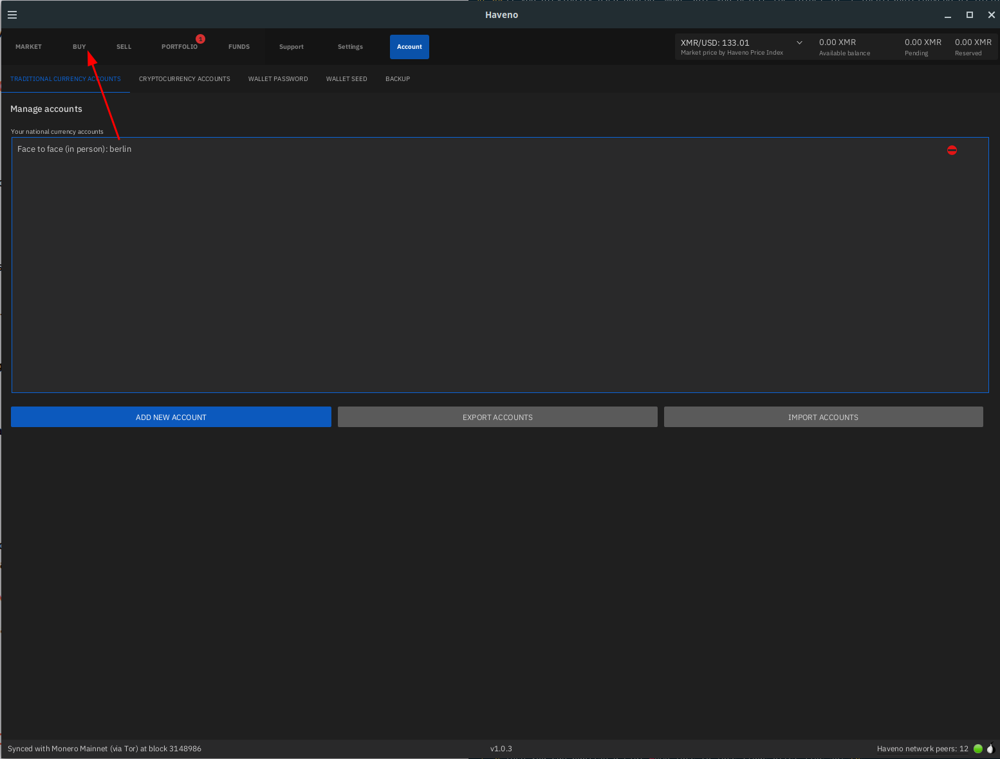
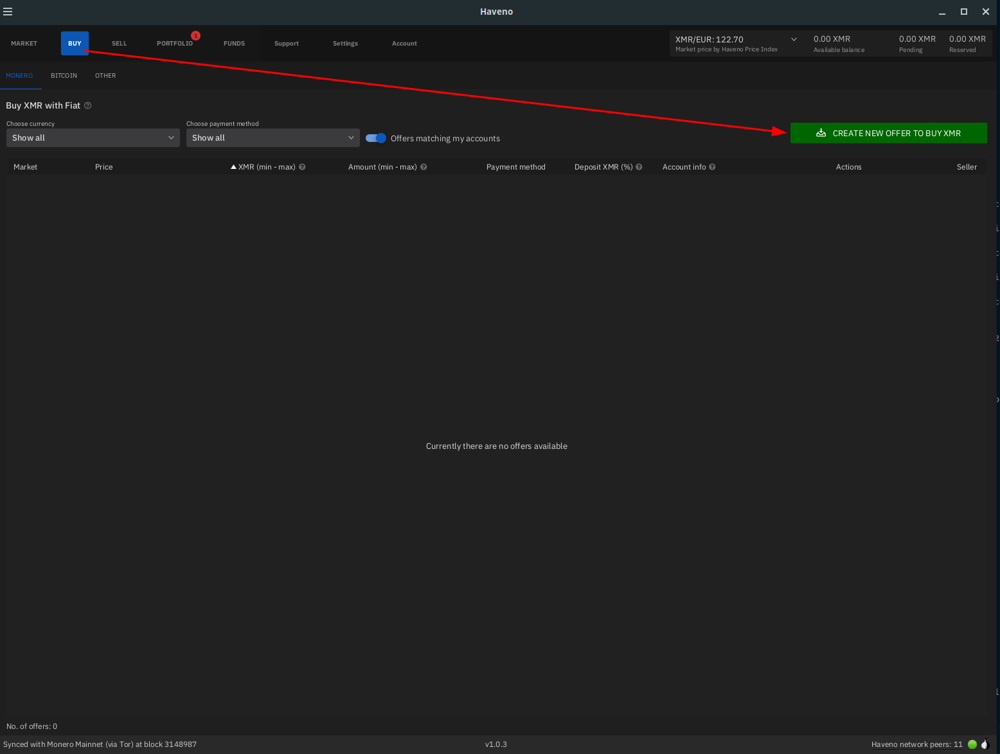
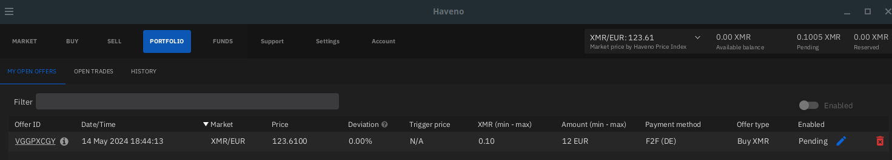
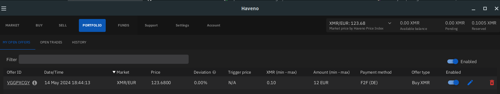
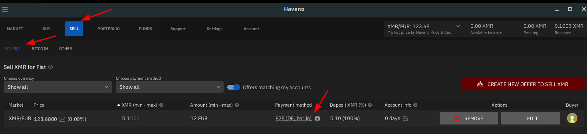
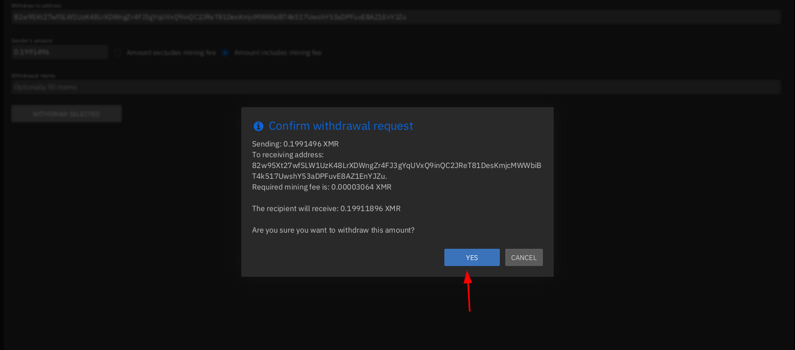

# Haveno DEX Direct Fiat to Monero transactions

```
TLDR: Because you can't trust centralised exchanges, you can use Haveno since it's a decentralised exchange (whose service and administrators are Anonymous), meaning that they cannot be forced to comply to any financial regulation unlike centralised exchanges. All you need is to install the FOSS app on your laptop to be able to transact FIAT <-> XMR with other peers, Peer to Peer.
```


In this tutorial we're going to cover how to do a Fiat to Monero trade from the brand new (and long awaited!) **Haveno Decentralised Exchange** , using the Face-to-Face (F2F) payment method.


_Sidenote_ : i don't recommend face-to-face as a payment option of choice, this is just to try out how a basic trade Haveno DEX works!

Before reading through this tutorial, **make sure you understand why Decentralised Exchanges are the next step in Decentralised Finances** in this [blogpost](../truecrypto/index.md) i previously made, so that you have all the context.

As we are covering a DEX (Decentralised Exchange), **it means we are not covering how to use a website onto which you are purchasing monero** (like the now defunct Localmonero (RIP)), **we are covering a software that you install on your computer** (hence the Decentralisation in "DEX"), **to trade Peer to Peer (P2P) with the other users.**


The resilliency of Haveno is on multiple levels: First of all the more Seed nodes there are, the harder to take down the Haveno network is. The anonymity provided by the Tor network of Haveno for all nodes (which is on by default), also adds up to the resiliency.

Clientside, the more peers (users) there are, the more diverse and bigger the exchange will be, and so will the decentralised market be at large. **The sooner the Monero market moves to Decentralised Exchanges, the more unstoppable it will become.**

Lastly if the Haveno network is completely taken down (let's say if all the seed nodes are taken down somehow), all that's left is for another administrator to spin up a new haveno network since the code is all open source, to repeat the cycle again. 

You can check out my quick coverage of Haveno DEX on Monero Topia [here](https://iv.nowhere.moe/watch?v=hWcwin8bDpc&t=1h9m11s). (Definitely check out MoneroTopia for the latest news in the Monero world, awesome show!)

**DISCLAIMER: THERE ARE NO OFFICIAL HAVENO NETWORK INSTANCES, THERE ARE ONLY THIRD PARTY HAVENO NETWORKS LIKE[HAVENO RETO](https://monero.town/post/3143272). **

**IF YOU SEE A HAVENO CLAIM TO BE THE OFFICIAL NETWORK[LIKE THIS ONE](https://monero.town/post/3260716), DONT FALL FOR THEIR SCAM!**

You can check out the Reto team over at their official website at <https://haveno-reto.com>

## _OPSEC Recommendations:_

  1. Hardware : (Personal Computer / Laptop)

  2. Host OS: [Linux](../linux/index.md)

  3. Hypervisor: [libvirtd QEMU/KVM](../hypervisorsetup/index.md)

  4. Virtual Machine: [Linux](../hypervisorsetup/index.md) or [Whonix](../whonixqemuvms/index.md) or [Tails](../tailsqemuvm/index.md)


I recommend using this setup into one of the above mentionned VMs, either for [Private use](../privacy/index.md), or [Anonymous use](../anonymityexplained/index.md), as per the [4 basic OPSEC levels](../opsec4levels/index.md). (Note that Deanonymization will happen during the Fiat transaction, but it is minimized as you're revealing your identity to an other peer, rather than to a centralised exchange)


## **How to install Haveno ?**

First, we need to find a Haveno Network, [Haveno Reto](https://monero.town/post/3143272) being one of the first ones to show up, we're going to try them out:

Let's get the Haveno binaries from [Reto's github repository](https://github.com/retoaccess1/haveno-reto/releases), (which was forked from the [original Haveno repository](https://github.com/haveno-dex/haveno), maintained by [Woodser](https://github.com/woodser))

## **For Debian Users**

Here, we are on a debian machine, so we download the "haveno_amd64_deb-latest.zip" package (which contains the .deb file)


Then unpack the zipfile wherever you want:
    
    
    [ mainpc ] [ /dev/pts/5 ] [~]
    → apt install unzip -y 
    
    [ mainpc ] [ /dev/pts/17 ] [~/.mullvad-browser/Downloads]
    → ls
    haveno_amd64_deb-latest.zip
    
    [ mainpc ] [ /dev/pts/17 ] [~/.mullvad-browser/Downloads]
    → unzip haveno_amd64_deb-latest.zip
    Archive:  haveno_amd64_deb-latest.zip
      inflating: haveno_1.0.11-1_amd64.deb
    
    [ mainpc ] [ /dev/pts/17 ] [~/.mullvad-browser/Downloads]
    → sudo dpkg -i haveno_1.0.11-1_amd64.deb
    [sudo] password for nihilist:
    (Reading database ... 226388 files and directories currently installed.)
    Preparing to unpack haveno_1.0.11-1_amd64.deb ...
    Unpacking haveno (1.0.11-1) over (1.0.10-1) ...
    Setting up haveno (1.0.11-1) ...
    
    #if it fails, run "apt install -f" to install the missing dependencies and then dpkg -i haveno.deb again.
    
    

Haveno then creates dotfiles in **~/.local/share/Haveno-reto** containing your wallet infos, along with the .onion data. **You shouldn't need to remove that folder accross haveno updates** , unless if instructed to do so by the developers or the network owners themselves.
    
    
    [ mainpc ] [ /dev/pts/17 ] [.local/share/Haveno-reto]
    → ls -lash ~/.local/share/Haveno-reto
    total 74M
    4.0K drwxr-xr-x  3 nihilist nihilist 4.0K Aug  4 10:04 .
    4.0K drwx------ 26 nihilist nihilist 4.0K Oct  6 09:32 ..
     11M -rw-r--r--  1 nihilist nihilist  11M Aug  4 09:57 haveno_1.log
    3.1M -rw-r--r--  1 nihilist nihilist 3.1M Oct  4 21:06 haveno.log
    4.0K -rw-r--r--  1 nihilist nihilist   56 Oct  2 19:35 haveno.properties
     25M -rwxr--r--  1 nihilist nihilist  25M Jul  9 21:17 monerod
     30M -rwxr--r--  1 nihilist nihilist  30M Jul  9 21:17 monero-wallet-rpc
    6.3M -rw-------  1 nihilist nihilist 6.3M Oct  4 21:06 monero-wallet-rpc.log
    4.0K -rw-r--r--  1 nihilist nihilist    6 Oct  2 19:34 version
    4.0K drwxr-xr-x  6 nihilist nihilist 4.0K May 20 18:21 xmr_mainnet
    
    

if you want to see the haveno logs from the CLI as you use it, you can do as follows:
    
    
    [ mainpc ] [ /dev/pts/6 ] [.local/share/Haveno-reto]
    → tail -f haveno.log
    May-29 20:55:23.829 [pool-16-thread-5] INFO  h.c.t.TaskRunner: Run task: SendOfferAvailabilityRequest
    May-29 20:55:23.830 [pool-16-thread-5] INFO  h.c.o.a.t.SendOfferAvailabilityRequest: Send OfferAvailabilityRequest with offerId mqbtqDh-1ec9fa64-e5e7-4766-9936-519951bc5f36-106 and uid d85caa9c-840c-45eb-8642-4cb12828fc93 to peer rlrsc6nfqbvqhly3qjcb36qzvw44xnxqhcht3nqndy324ewg4dut4iqd.onion:9999
    May-29 20:55:23.930 [JavaFX Application Thread] INFO  h.c.o.a.t.SendOfferAvailabilityRequest: OfferAvailabilityRequest arrived at peer: offerId=mqbtqDh-1ec9fa64-e5e7-4766-9936-519951bc5f36-106; uid=d85caa9c-840c-45eb-8642-4cb12828fc93
    May-29 20:55:25.292 [JavaFX Application Thread] INFO  h.d.c.c.c.PopOver: hide:200.0 ms
    May-29 20:55:25.903 [pool-48-thread-1] INFO  h.c.o.a.OfferAvailabilityProtocol: Received OfferAvailabilityResponse from rlrsc6nfqbvqhly3qjcb36qzvw44xnxqhcht3nqndy324ewg4dut4iqd.onion:9999 with offerId mqbtqDh-1ec9fa64-e5e7-4766-9936-519951bc5f36-106 and uid 986ee04a-47d2-4303-a9fc-12d18cc158ce
    May-29 20:55:25.905 [pool-48-thread-1] INFO  h.c.t.TaskRunner: Run task: ProcessOfferAvailabilityResponse
    May-29 20:55:25.905 [pool-48-thread-1] INFO  h.c.o.a.OfferAvailabilityProtocol: Send AckMessage for OfferAvailabilityResponse to peer rlrsc6nfqbvqhly3qjcb36qzvw44xnxqhcht3nqndy324ewg4dut4iqd.onion:9999 with offerId mqbtqDh-1ec9fa64-e5e7-4766-9936-519951bc5f36-106 and sourceUid 986ee04a-47d2-4303-a9fc-12d18cc158ce
    May-29 20:55:25.907 [JavaFX Application Thread] INFO  h.c.o.a.OfferAvailabilityProtocol: AckMessage for OfferAvailabilityResponse arrived at makersNodeAddress rlrsc6nfqbvqhly3qjcb36qzvw44xnxqhcht3nqndy324ewg4dut4iqd.onion:9999. offerId=mqbtqDh-1ec9fa64-e5e7-4766-9936-519951bc5f36-106, sourceUid=986ee04a-47d2-4303-a9fc-12d18cc158ce
    May-29 20:55:26.108 [pool-48-thread-1] INFO  h.c.o.OpenOfferManager: Received AckMessage for OfferAvailabilityRequest with offerId mqbtqDh-1ec9fa64-e5e7-4766-9936-519951bc5f36-106 and uid d85caa9c-840c-45eb-8642-4cb12828fc93
    May-29 20:55:27.427 [JavaFX Application Thread] INFO  h.d.c.c.c.PopOver: hide:200.0 ms
    
    

next just launch Haveno as it should have been added to your system:


## **For Whonix Users: use tor bridges to make Haveno connect!**

Next, haveno is going to connect to Tor. WHONIX USERS: If it is facing issues connecting wait for the client to ask you to set the tor settings:



then just get a torbridge from torproject.org:


and add them inside haveno, and restart it:


Then it should connect just fine:


you may need to wait a bit for your haveno node to sync up initially: (probably 1-2 minutes)

and once it finishes synchronising, you're in Haveno!



## **For Arch Linux Users**

You can either extract the .rpm (which is originally intended for Fedora users) package and run the haveno binary yourself, or use the [AUR package maintained by duje](https://aur.archlinux.org/packages/haveno-reto)

## **For Windows Users**

If you are a windows user (know that windows cant be trusted as [it's not an open source operating system](../closedsource/index.md), so [install linux](../linux/index.md) instead): 

## **For Tails OS Users: (as of 3rd November 2024)**

If you want to have a TailsOS VM running, check out my latest tutorial on it [here](../tailsqemuvm/index.md).

Then make sure you have the admin password enabled:


Then make sure you have the persistant storage enabled, with the dotfiles enabled:


Then, to install it at the current latest version (as of the 6th of october 2024, version 1.0.12) you need to run the following commands:
    
    
    amnesia@amnesia:~$ curl -x socks5h://127.0.0.1:9050 -fsSLO https://github.com/haveno-dex/haveno/raw/master/scripts/install_tails/haveno-install.sh  && bash haveno-install.sh https://github.com/retoaccess1/haveno-reto/releases/download/v1.0.12/haveno-linux-deb.zip DAA24D878B8D36C90120A897CA02DAC12DAE2D0F
    
    amnesia@amnesia:~$ ./Persistent/haveno/App/utils/exec.sh 
    
    

`  

## **Fiat for Monero, Face to Face Trade**

First step is to setup your account for Face to Face Trades:


Here we specify that we want to do face to face trades in Berlin (Germany) as an example, we will use our FIAT currency, Euros (in cash), you can also specify alternative ways to get contacted if you don't like the built in chat in Haveno DEX, such as email or phone number, etc. Then hit the "save new account" button:



Make sure you read carefully what a face-to-face fiat->XMR trade is, and what are it's risks, if you're fine with it, click "i understand". Now that your account is created, head over to the "Buy" section, as you want to buy monero:

 

Then you can publish a Fiat->XMR face to face trade offer like so:


So here we want to purchase 0.10 XMR, for the current market price, which amounts to 12 euros. then hit next step:

Now here is when we get introduced to the [trade protocol](https://github.com/haveno-dex/haveno/blob/master/docs/trade_protocol/trade-protocol.pdf)'s security deposit system as [detailed in the Haveno FAQ](https://haveno.exchange/faq/#what-are-the-differences-in-the-trade-protocol). I'll make a simple diagram to explain the situation:
    
    
    Quote from Haveno's FAQ: (https://haveno.exchange/faq/#what-are-the-differences-in-the-trade-protocol) 
    
    [...]
    
    Bisq recently adopted a protocol based on 2/2 multisig, while Haveno will use their previous protocol: 2/3 multisignature. In a 2/3 multisignature trade, each trader owns one key; this key will be paired with the key of the other trader and will be used to unlock funds and deposits. It’s a 2 of 3 (2/3) protocol because you need only two out of three keys to move funds from the multisignature wallet.
    
    If everything goes fine, the two traders will use their keys to complete the transfer process. If something goes wrong, one of the two parties won’t use their key to complete the transaction, and this is where the arbitrator comes to action.
    
    Arbitrators are inherited from Bisq’s 2/3 protocol. They are a trusted role and have the duty of releasing the funds to one of the two parties in case of a conflict. To do so, they use the third key of the 2/3 multisig protocol.
    
    [...]
    
    

` 

To make it short, you (Bob) in this case, want to trade Fiat, for Alice's XMR, in person. **BOTH you and Alice need to put in some monero into the trade, as a security deposit.** That is so in case if you try to scam Alice, you will loose something in the process, preventing you from trying to repeatedly scam people, and vice versa.


_Sidenote:_ **if you want to get your first monero** and you don't have any crypto / fiat to start with, **check out the["earn XMR"](https://xmrbazaar.com/search/earn-xmr/) section in xmrbazaar.com.** For example, i offer monero to whoever contributes new blogposts to the OPSEC section of my blog in this offer [here](https://xmrbazaar.com/listing/UsWA/).

Due to the 2/3 multisig nature of the trade, **there needs to be at least 2 agreeing parties to complete the trade**. If all goes well, you and Alice agree on the trade, and the security deposit monero is released. If not, the Arbitrator will step in to punish the wrongdoer (by not giving him the security deposit back), and give the security deposit to the honest party.

The following example will cover a successful trade between you and Alice. If you want to see a trade dispute, check out [this tutorial](../haveno-arbitrator/index.md).


So here, you need to send the security deposit to be able to post your buying offer, just send it from your monero wallet like so:


Once you've sent the monero to your haveno trade for the security deposit, you need to wait approx 20 minutes for the transaction to be confirmed by the network



Approx 20 mins later, the trade shows up as enabled:

**Bob: puts 0.1005 XMR into the trade for the security deposit,** 

You (and the other haveno peers) can see it from the Sell tab:



Here you just need to wait for someone to accept the trade. Once they do, they will need to send their share of the security deposit too just like we previously did. Once they do it will show up on your end as an initiated trade:

**Alice puts 0.1005 XMR into the trade for the security deposit. Then the trade is secured** 

Same as before, you need to wait for the security deposit to be validated by the network (approx 20 mins again). In the meantime you can chat with the trader by clicking the "Open Trader Chat" button.


Once the security deposit has been validated by the network for the other party, you will get a notification that the trade can begin:


Next step is for you to go and give the 12 Euros to Alice, and once you do, you confirm that the Payment has been sent like so:


Then, you wait for Alice to confirm that she has recieved the 12 Euros (it will show up as "Peer confirmed message receipt"):

 **Alice can then send the 0.10 XMR to Bob, after Bob Pays her in Euros.**

Then here, you just wait for the Monero to arrive in your Haveno monero wallet, it will first show up as Pending on the top right corner:


Wait another 20 minutes for the transaction to be validated by the network, and it will show up in your Haveno monero wallet as Available balance:

**The trade is successful, the security deposit is now released, Bob gets his 0.1005 XMR back, and Alice too. (minus the transcation fees and arbitrator fees)** 

And that's it, you can now pop the Champagne as you completed your first Fiat -> XMR transaction on a Decentralised exchange! 🥂

## **Withdrawing your Monero from Haveno to another Wallet**

Now all that's left is to withdraw your monero from your Haveno monero wallet to your other Monero Wallet:


Head over to Funds > send funds, tick the "Amounts includes mining fee" option, and select the amount of monero you want to withdraw, in this case i'm withdrawing all of it.



Then confirm that you want to withdraw the funds, and check your monero wallet for the incoming transaction:


And that's it! you just withdrew your funds to your other monero wallet!

Check out my other tutorials on Decentralised Finances below:

  1. [✅ How to setup your Monero wallet ](../monero2024/index.md)
  2. [✅ Why can't I trust Centralised Exchanges, and random Monero nodes ?](../chainalysisattempts/index.md)
  3. [**✅ Haveno Decentralised Exchange direct Fiat -> XMR transaction ⭐**](../haveno-client-f2f/index.md)
  4. [✅ Haveno DEX Dispute resolution (Fiat -> XMR) ](../haveno-arbitrator/index.md)
  5. [✅ Haveno DEX Bank Transfer (ex: SEPA) -> XMR transaction ](../haveno-sepa/index.md)
  6. [✅ Haveno DEX Cash By Mail -> XMR transaction ⭐](../haveno-cashbymail/index.md)


