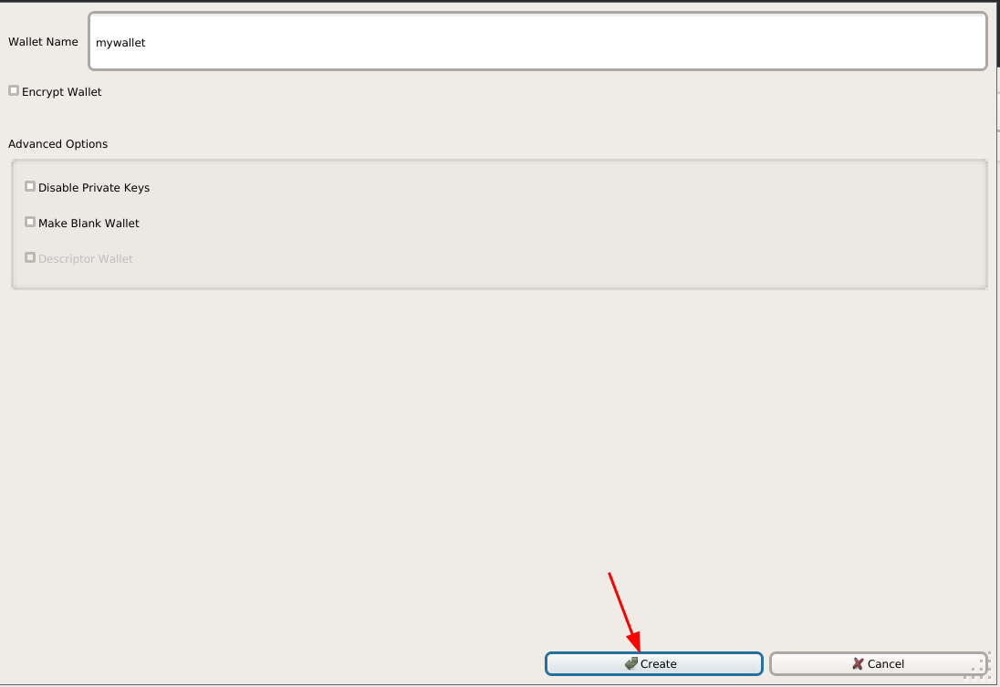

# Convert Monero into other Cryptocurrencies Anonymously (XMR -> LTC) 

```
TLDR: By using Haveno, you can obtain other cryptocurrencies (like LTC) anonymously, by trading them for XMR.
```


In this tutorial we're going to cover how you can anonymously obtain another cryptocurrency (in this case litecoin), using XMR and Haveno. 


Context warning: we're doing the following steps from inside our [Anonymous use whonix workstation VM](../whonixqemuvms/index.md)!


## **Why is this important?**

On your cryptocurrency journey, you may stumble upon the usecase that you want to pay someone anonymously, but for some reason they don't accept Monero (XMR), so you have to figure out a way to pay them anonymously using another cryptocurrency. Let's say You want to buy something from Bob anonymously, but he only accepts Litecoin instead of XMR.

**We're obviously not going to buy that litecoin on a centralised exchange where we may be forced to KYC ourselves, that's why we stick to Haveno to keep our attack surface as small as possible.**

If you followed our previous tutorials on Haveno, you should already have monero, **therefore, from our Whonix Workstation VM with Haveno installed, we're going to first install a[litecoin wallet](https://litecoin.org/):**


    
    
    [ localhost ] [ /dev/pts/5 ] [~]
    → mv ~/.tb/tor-browser/Browser/Downloads/litecoin-0.21.4-x86_64-linux-gnu.tar.gz ~/Desktop
    
    [ localhost ] [ /dev/pts/5 ] [~]
    → cd Desktop
    
    [ localhost ] [ /dev/pts/5 ] [~/Desktop]
    → tar -xvf litecoin-0.21.4-x86_64-linux-gnu.tar.gz
    litecoin-0.21.4/
    litecoin-0.21.4/bin/
    litecoin-0.21.4/bin/litecoin-cli
    litecoin-0.21.4/bin/litecoind
    litecoin-0.21.4/bin/litecoin-qt
    litecoin-0.21.4/bin/litecoin-tx
    litecoin-0.21.4/bin/litecoin-wallet
    litecoin-0.21.4/bin/test_litecoin
    litecoin-0.21.4/README.md
    litecoin-0.21.4/share/
    litecoin-0.21.4/share/man/
    litecoin-0.21.4/share/man/man1/
    litecoin-0.21.4/share/man/man1/litecoin-cli.1
    litecoin-0.21.4/share/man/man1/litecoind.1
    litecoin-0.21.4/share/man/man1/litecoin-qt.1
    litecoin-0.21.4/share/man/man1/litecoin-tx.1
    litecoin-0.21.4/share/man/man1/litecoin-wallet.1
    
    [ localhost ] [ /dev/pts/5 ] [~/Desktop]
    → ./litecoin-0.21.4/bin/litecoin-qt     
    
    


Be warned however, that locally synchronizing the litecoin blockchain is going to require 40GB of diskspace approximately


While the wallet syncs the blockchain, let's create a new wallet:

 

Now that the wallet is created, lets create a recieving address:

 

Now that the LTC recieving address is created, we can create the cryptocurrency account on Haveno: 


And now that the LTC account is created in Haveno, we can start to sell XMR for some Litecoin:


Looking at the offers, we see a few XMR selling offers for us to take (meaning we have to send XMR to be able to buy some LTC)

## **Taking the XMR -> LTC Trade**


Once selecting an offer, we first need to fund the security deposit:

    

Once the security deposit funded and the trade initiated, we wait for the other peer to send their Litecoin to us:


Once they correctly send their litecoin our way, we check if we indeed recieved the payment, and if we did, we click "Confirm payment receipt"


And doing so releases the monero to the party buying our XMR, which finishes the trade, and releases the extra monero we put in the security deposit:


And now we can close the trade as it's been completed.

## **Conclusion**


And thats it! you can now send your litecoin anonymously wherever you want (for example Torproject.org accepts litecoin donations), **because you acquired it anonymously, and now since you're sending it from your whonix VM, you can't get deanonymized on the IP layer either, thanks to whonix's built-in tor transparent proxying.**

