# Haveno DEX Bank Transfer (ex: SEPA) -> XMR transaction 

```
TLDR: you can conveniently obtain XMR in exchange of a SEPA bank transfer if you're in the EU. (That's the most convenient way of trading fiat for XMR IMO)
```


In this tutorial we're going to cover an instant SEPA transfer (which is a bank transfer) transaction for monero, this is one of the most popular payment options in the EU region. (for more details on how SEPA works, check out this, [video](https://iv.nowhere.moe/watch?v=hsb0GOgIfds)). Instant SEPA was a personal favorite of mine back on the now defunct Localmonero, **due to the speed of the transanction** , the only requirement being that the other peer has a bank account that supports instant SEPA transfers. 


If you want to install Haveno DEX (on the Haveno Reto network) check out [this tutorial](../haveno-client-f2f/index.md) i previously made.

**WARNING: SEPA transactions become risky when it starts to become large transactions and volumes over time:**
    
    
    For SEPA, if you do big volume, also expect interrogation from KYC/Compliance department
    From request for SoF/PoI to full on phonecall interrogation, asking about specific groups of transactions
    Varies according to bank: some will ban, others will let you continue
    Once again, with EMIs and online banks they are less lenient, whereas with physical banks you have wiggle-room
    If you do get banned from an EMI/online bank, it is not uncommon to have IBANs associated with your name to be blacklisted (cannot receive from those EMIs/online banks)
    If you get banned from a physical bank, they may put your name on a fraud registry
    
    

In short, keep in mind that this may not be a reliable way to purchase monero in the long run especially if you do large transactions each time. (thanks xmrfamily for the infos)

## _OPSEC Recommendations:_

  1. Hardware : (Personal Computer / Laptop)

  2. Host OS: [Linux](../linux/index.md)

  3. Hypervisor: [libvirtd QEMU/KVM](../hypervisorsetup/index.md)

  4. Virtual Machine: [Linux](../hypervisorsetup/index.md) or [Whonix](../whonixqemuvms/index.md) or [Tails](../tailsqemuvm/index.md)

  5. Application: [Haveno DEX Setup](../hypervisorsetup/index.md)


I recommend using this setup into one of the above mentionned VMs, either for [Private use](../privacy/index.md), or [Anonymous use](../anonymityexplained/index.md), as per the [4 basic OPSEC levels](../opsec4levels/index.md). (Note that Deanonymization will happen during the Fiat transaction, but it is minimized as you're revealing your identity to an other peer, rather than to a centralised exchange)


## **Bob and Alice create their accounts**


First step, you need to create your account in the application, in the account:


Then hit "Save account", and make sure you read carefully the trade protocol for SEPA bank transfers:


Currently we're limited to 3 XMR, but gradually over time we're going to be able to do up to 12 XMR trades at once after 60 days signing. This is to reduce chargebacks risks. One thing to note here is that we are able to create multiple sepa for xmr trades, unlike in our previous examples.


Here, Alice creates her account for sepa instant payments on her Haveno DEX, but in contrast to Bob, she wants to only allow payments from her own country (France), as for her, that reduces risks of having to transact to a bank that can't do Instant SEPA transfers:


## **Instant SEPA bank transfer -> XMR Trade**

Then Alice creates the new Offer to sell her XMR:


Here **Alice wants to sell 0.1014 XMR at current market price (which amounts to 13 euros)** , and to fund her offer in total she needs to put in 0.201907 XMR **as it includes her side of the security deposit**.

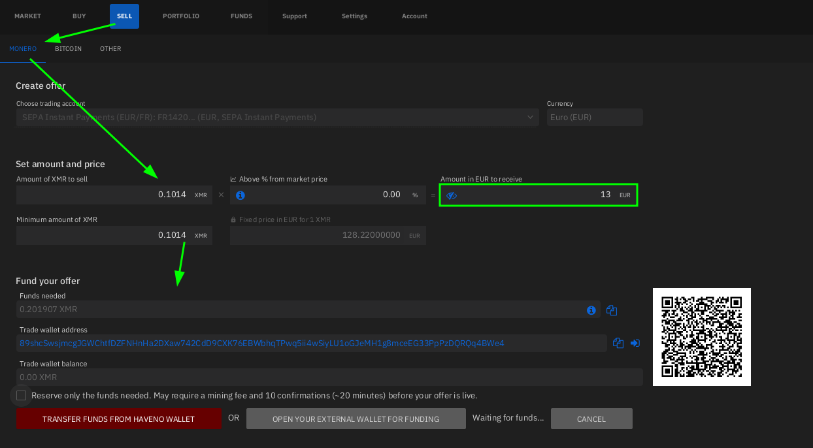

Alice uses her monero wallet to fund the offer, and then it shows as pending on her Haveno DEX as Pending:

 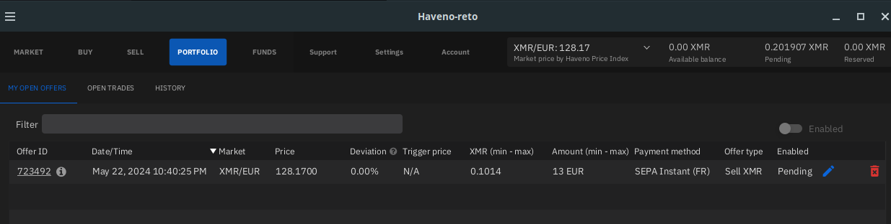

Then once the offer is funded, the offer is enabled, and other peers can see Alice's offer on the Buy section:

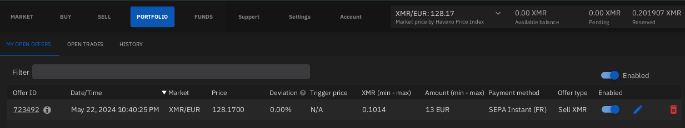


Now from Bob's point of view, we see Alice's offer here, and we take the offer:

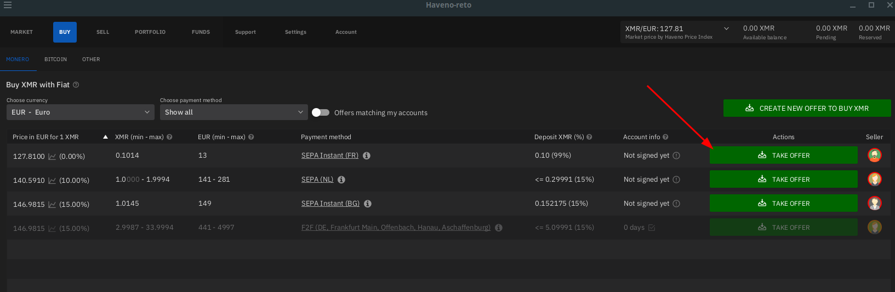

Bob also funds the offer as we explained [here](../haveno-client-f2f/index.md):

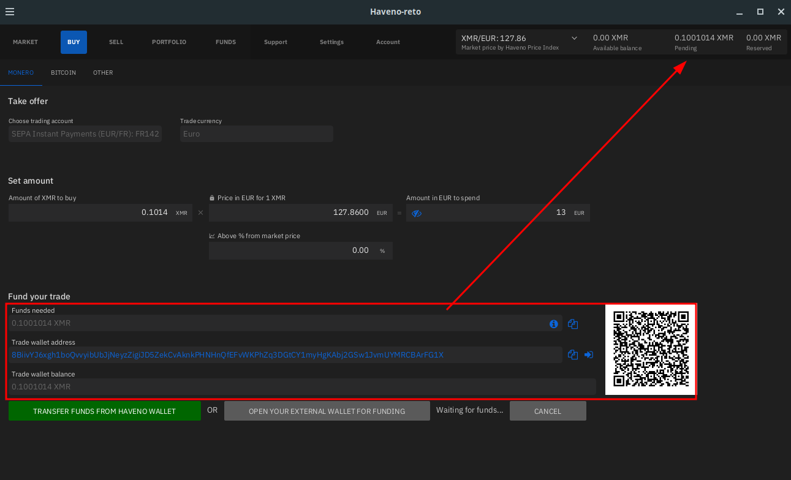

Bob confirms he want to buy monero:

 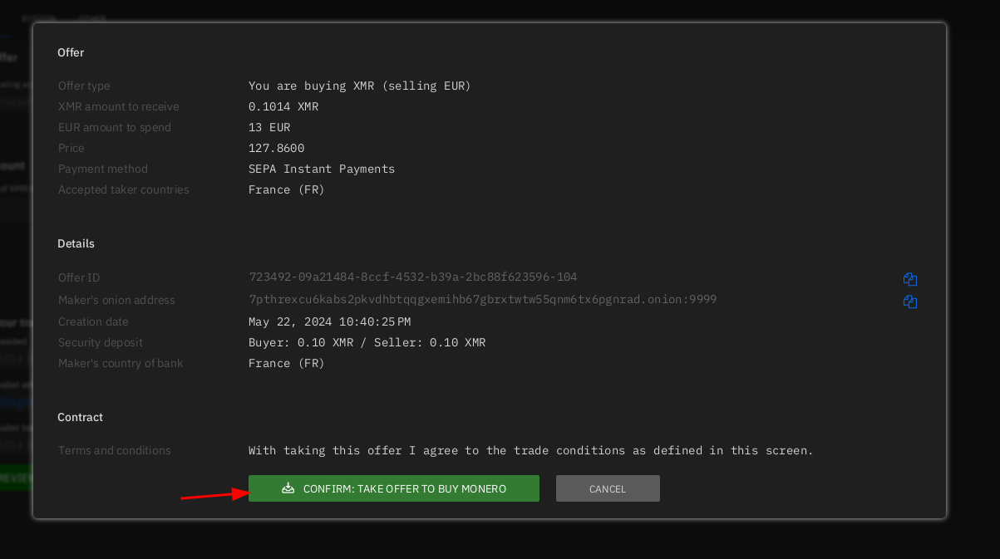 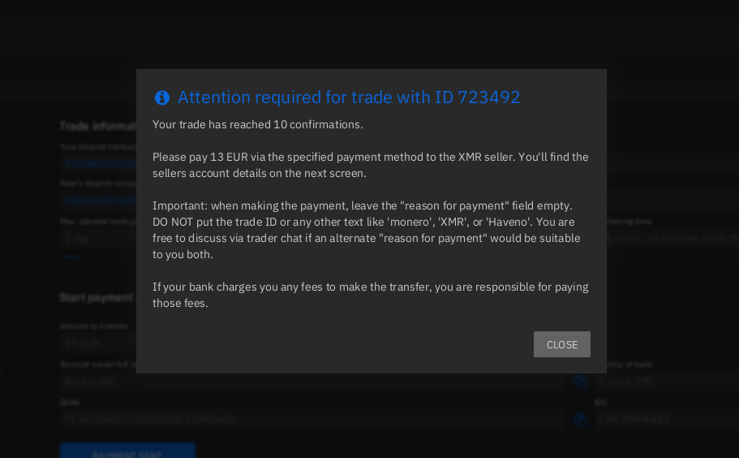

Next, Bob has to pay 13 Euros to the Alice, via a bank transfer (SEPA instant) as he can now see her bank information:


_Sidenote:_ Tying back to my [explanation](../truecrypto/index.md) on why Decentralised exchanges are going to be very costly to an adversary that wants to deanonymize users, **the adversary would have to massively fund offers in monero, and loose their side of the security deposit each time, in an attempt to try and regulate the end user directly** , that's way harder than just knocking on a centralised exchange owner's door to ask him to / force him to deanonymize his entire userbase for the adversary. This is where the Haveno DEX multiplies potential adversaries' efforts manyfold compared to centralised exchanges.

So here Bob can follow [this procedure to do the sepa instant transfer](https://iv.nowhere.moe/watch?v=77uw4rkcRsY); he goes on his banking application to add Alice Liddell as a third-party account using **her IBAN** (see example IBANs per country in the EU [here](https://developer.readyremit.com/docs/ibans)), and then he sends her the 13 euros as a transaction between private individuals, using the instant transaction feature provided by his Bank.

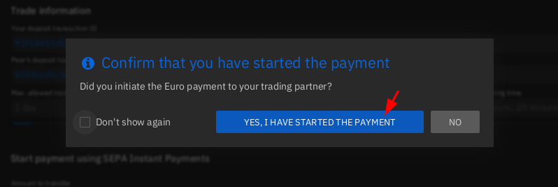

Once completed, Bob declares that he has sent payment. and in case if Alice tries to deny that she received payment, Bob can take a screenshot to prove that he has sent the payment, from his bank account by clicking on viewing more details on his transaction (checking the receipt). That way, in case if there is a [dispute](../haveno-arbitrator/index.md), (meaning if Alice tries to scam Bob), he will be on the right side of arbitration, and the Arbitrator will favor him.


Back to Alice's side, we see that the trade has been initiated:

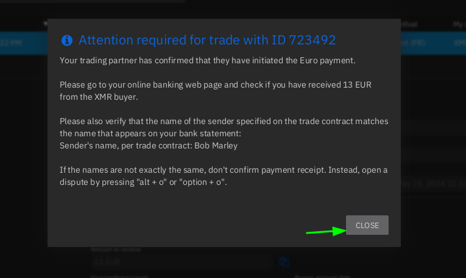

So here Alice checks if she received payment on her account from the bank account of Bob (whose name just got revealed as "Bob Marley" with a specific IBAN) **As a Buyer (like Bob), don't try to use a fake IBAN and name because the infos you use are going to be required by the XMR seller (Alice) to verify from whom the payment came from. The Arbitrators are likely to favor Alice if you use false banking information.**


Alice just checked her banking application, she received payment from Bob Marley, and she clicks "Confirm payment Receipt" to complete the trade.

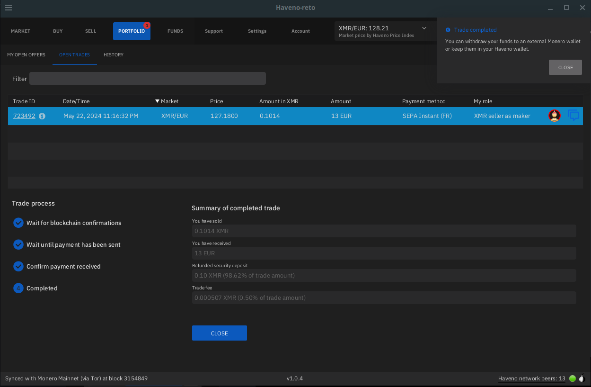 

And lastly, Bob gets his Monero without any issue (he needs to wait 20 minutes for the monero to be spendable from his haveno monero wallet):

 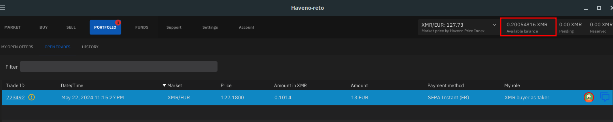

## **Withdrawing your funds**

And then he can also withdraw his monero from his Haveno DEX to his other monero wallet like so:

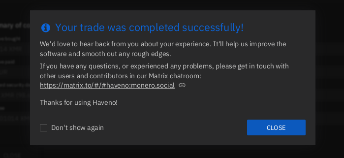  

And that's it! We now covered one of the fastest and easiest way people can purchase and sell Monero in the EU region. Coming up next we'll cover how to do the most popular option there was on LocalMonero: [Cash by Mail](../haveno-cashbymail/index.md), it is the best option if you intend to exchange in large quantities.

Check out my other tutorials on Decentralised Finances below:

  1. [✅ How to setup your Monero wallet ](../monero2024/index.md)
  2. [✅ Why can't I trust Centralised Exchanges, and random Monero nodes ?](../chainalysisattempts/index.md)
  3. [✅ Haveno Decentralised Exchange direct Fiat -> XMR transaction ⭐](../haveno-client-f2f/index.md)
  4. [✅ Haveno DEX Dispute resolution (Fiat -> XMR) ](../haveno-arbitrator/index.md)
  5. [**✅ Haveno DEX Bank Transfer (ex: SEPA) -> XMR transaction**](../haveno-sepa/index.md)
  6. [✅ Haveno DEX Cash By Mail -> XMR transaction ⭐](../haveno-cashbymail/index.md)


