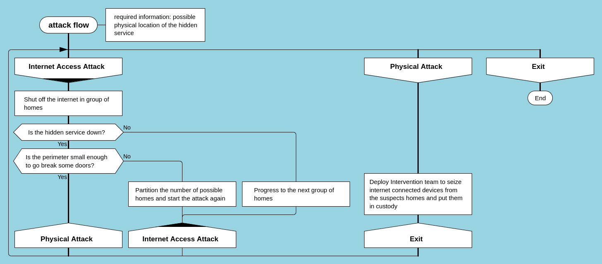
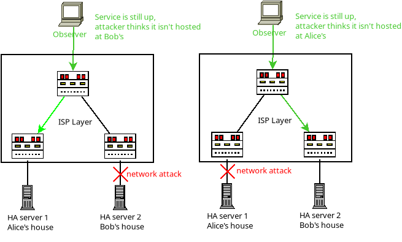

#  Why is High Availability Important for Deniability ? 

```
TLDR: if you host a sensitive service at home, and if by temporarily shutting down your internet access the adversary gets to see that the sensitive service is offline, they are able to determine that you're behind that sensitive service. 

That means your sensitive service must be able to survive multiple server takedowns (it must be highly avaialble), to be able to preserve deniability.
```

The concept of high availability is omnipresent in centralized services. One expects their ISP to provide internet access, their email provider to give them 100% uptime whenever they want to send an email and so on.  
  
**High-availability, the ability to provide high-uptime infrastructure, also has far-reaching implications for OPSEC practitioners.**   
  
When an adversary wants to collect information such as physical location behind a hidden service, depending on their power they will use downtime as an indicator in order to progressively narrow the pool of potential service location until they can act decisively against the remaining suspects.   
  
**Anonymity IS a requirement for deniability**  
Being able to plausibly deny being the operator of, or a downstream service supplier to a hidden service is a significant boon to personal protection. 


##  **Threat model**

In order to understand how high availability, or lack thereof, impacts our security posture **me must first define the skills and abilities of our adversary**. For this tutorial the adversary has the following attributes:   
  


  * Ability to monitor the hidden service status and know rapidly if it goes offline
  * Ability to directly tamper with either the power grid or the internet infrastructure with high granularity (DSLAM level, which could be a small town or a group of city blocks)
  * Ability to monitor the effects of tampering or incidents impacting the power grid or the internet infrastructure

A concrete example of such an adversary would be **law enforcement and government agencies**. 

##  **Attack Scenario**

The adversary has identified a probable city of residence for the administrator of a hidden service. In order to narrow down their search perimeter they will do the following:   


  1. Target 1 group of city block and send someone to the internet backbone for this city block to cut it off from the internet
  2. Check wheter the onion service **is still up**
  3. If it goes down, add it to the suspect pool


##  **How can high availability help?**

In the above scenario if the onion service operator had setup a **redundant, highly available server then connections would have been seamlessly sent to another server** in the redundancy pool, thus preventing the adversary from extracting location information based on their operation. This works best with a server in a **different country or region** , making a coordinated attack by several adversaries a requirement in order to use this method for deanonymization. 

##  **Adversary Attack Flow**

Below is a chart depicting an adversary attack flow. As shown, high availability will prevent the adversary from progressing beyond their initial step of uptime-based target acquisition.   
  
   
As you can see the adversarie's playbook is quite simple:   
  


  1. Identify a list of potential suspects
  2. Cut them off the internet
  3. Check wheter this action made the hidden service unreachable

Those actions are easily perpetrated by law enforcement as they only require:   


  * DSLAM level access to the internet backbone used by the suspects (impacting a perimeter like a city block)
  * City block level access to the power grid in order to run disruptive actions

  
Both of those are trival to obtain for LEOs (law enforcement officers).   
  
   
This Diagram shows where the attack takes place and how a redundant setup prevent such attacks from confirming the physical location of the hidden service.   
  
**In conclusion, your hidden service is one downtime away from having its location disclosed to an adversary, so you need to make sure it has High Availability**

