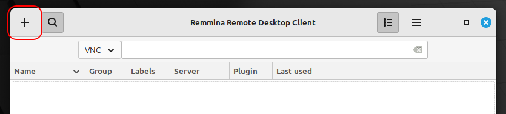
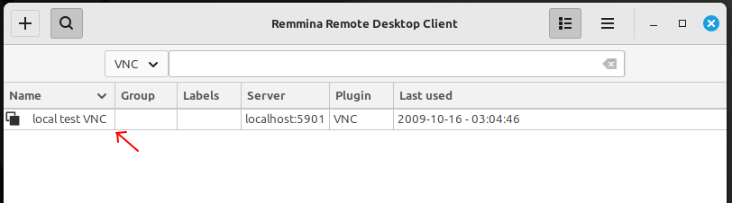
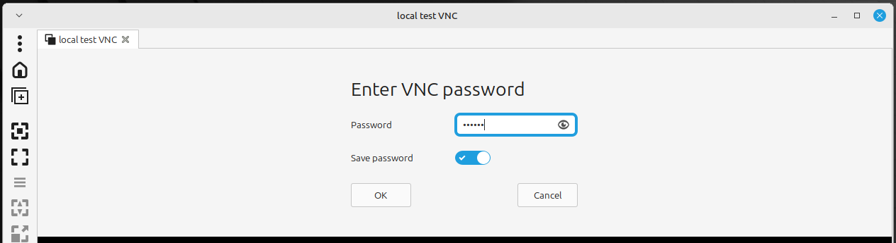

# Making Your Home Server Reachable via a Hidden Service (SSH + Cockpit + VNC via Tor)

```
TLDR: you can access (via CLI, and GUI) your home server (even behind a NAT), if you configure it to have it's SSH, Cockpit and VNC services accessible via a Hidden service.
```

In this tutorial we're going to explain how to access and manage your Home Server by using different methods, all of which we'll access over Tor onions

## Why is this important?

You want to remotely access your home server or one of your other machines, but you want to do it privately, not exposing access publicly, and without a load of configuration and security measures like TLS certs, domains, port forwarding, etc. And no need to rent a VPS to preserve our locational anonymity.


By using the Tor Network's onion services, we can establish a connection between the client and the home server that is hosting the onion service. This connection is End-to-End Encrypted and secure by design of the Tor protocol, no third party certs.

We can leverage this natural security and easy permissionless setup as a perfect way to connect to our home server from anywhere in the world where we have access to a Tor connection.

## Pre-requisites and Notes

Throughout this terminal we'll be using commands meant for Debian-based distributions along with XFCE Desktop Environment for our server. Some packages may be named different for your distro.

Be sure you have these packages installed on both your client and server. If you already have them, make sure you at least update your package repos:
```
sudo apt update # pull package repos
sudo apt install tor torsocks ssh
```
Also be sure you have the Tor Browser ([Clearweb](https://www.torproject.org/) | [Onion](http://2gzyxa5ihm7nsggfxnu52rck2vv4rvmdlkiu3zzui5du4xyclen53wid.onion/index.html)) and another standard browser like Mullvad browser ([Clearweb](https://mullvad.net/en/browser) | [Onion](http://o54hon2e2vj6c7m3aqqu6uyece65by3vgoxxhlqlsvkmacw6a7m7kiad.onion/en/browser))  or Ungoogled Chromium ([Clearweb](https://github.com/ungoogled-software/ungoogled-chromium)) installed on both server and client as well.

Throughout this tutorial in commands and scripts, we'll be referring to our username on our homeserver, `user`, but be sure to replace this with your own username.

Finally, many screenshots will feature blocked-out portions, this is to preserve the author's privacy.

## Method 1: SSH over Onion on Command Line

First we're going to use a basic method to control our server's command line through the command line on our client.

On your server, edit your Tor configuration file:
```
sudo nano /etc/tor/torrc
```
Then add these lines to the end of the file, then use Ctrl+S to Save and Ctrl+X to exit nano:
```
# SSH over Tor
HiddenServiceDir /var/lib/tor/ssh
HiddenServicePort 22 127.0.0.1:22
```
Let's explain what these lines do. The first line tells Tor where to store the configuration files for our new hidden onion service we're creating. The second line tells us that we can access whatever is at 127.0.0.1:22 (localhost port 22, which is our ssh entry), by connecting to ournewonionaddress.onion at port 22.

To make this take effect an generate the new onion service, we must restart the TOR service, to re-read the config file we just edited:
```
sudo systemctl restart tor
```

This will create a random onion address for us. We view this like so:
```
% sudo cat /var/lib/tor/ssh/hostname
mynewonionaddress.onion # outputs the address
```
(If you instead want a vanity address for your onion, you can check out [this guide](../torwebsite/index.md#generate-vanity-onion-v3-url))

From our client, we can now establish the ssh connection, over our onion service. If you're using a Tor-enabled Whonix VM, you don't need `torsocks`. Otherwise you can preface the ssh command with `torsocks`.
```
torsocks ssh root@mynewonionaddress.onion
# type in your password afterward
```


When you're done, just execute the **`exit`** command if you want to close the connection.

### Android Client

You can also do this from Android. First we need to download Termux from F-Droid ([Clearweb](https://f-droid.org/en/packages/com.termux/) | [Onion](http://fdroidorg6cooksyluodepej4erfctzk7rrjpjbbr6wx24jh3lqyfwyd.onion/en/packages/com.termux/)). This app will give us a Linux terminal that we can run on our phone.

Start Termux and install the following packages:
```
pkg update
pkg install openssh tor torsocks
```
Now we will spin up a temporary Tor daemon by simply executing `tor`. Eventually you'll see that it 100% built the circuit successfully.

Then we'll swipe from the left on our screen and open a new terminal window. Now simply do the exact same thing as you did from your other client:
```
torsocks ssh root@mynewonionaddress.onion
# type in your password afterward
```


## Method 2: Cockpit Web UI Management

Cockpit is a server management tool that can be accessed through a Web UI. You can see their website [**here**](https://cockpit-project.org/)

Setting up is very easy. On your server, you should only have to install the package:
```
sudo apt install cockpit
```

Once you install, open up a browser (not Tor Browser), and navigate to `localhost:9090`. You may get an HTTPS cert warning, just dismiss it. Then type in your Linux username and password. Here you can see me doing it in Mullvad Browser:


By this, we know that it works. Now let's expose it over a Tor onion. We'll once again edit our Tor configuration file:
```
sudo nano /etc/tor/torrc
```
And add these lines to the end of it to define our Onion service for our Cockpit app:
```
# Cockpit UI over Tor
HiddenServiceDir /var/lib/tor/cockpit
HiddenServicePort 9090 127.0.0.1:9090
```
Then we we'll restart our Tor daemon so the service is created: 
```
sudo systemctl restart tor
```

Again, this will create a random onion address for us. We view this like so:
```
sudo cat /var/lib/tor/cockpit/hostname
mynewonionaddress.onion # outputs the address
```

Now from your client, open Tor Browser and navigate to **`mynewonionaddress.onion:9090`**. Login and see your dashbord:


Now you can use the management UI remotely with this onion and port.

There is one issue, and that's that the Terminal function of the Web UI doesn't work in Tor Browser (or Mullvad Browser). It will execute commands but the viewport won't scroll down. If you want to use the Terminal, it's best just to login over SSH as in Method 1, but if you really want to use it in the Web UI, you could use [Brave Browser's](https://brave.com) Tor Window feature. 

(Note: We absolutely do not recommend this as a normal tool for browsing, but you can use it for your self-served web UIs because you alone control the server, so it's fine for this)


## Method 3: TightVNC Server

### Installing the Server

Our final method is to spin up a VNC (Virtual Network Computing) server on our home server. When we connect from our client, it will give us a graphical desktop environment from which we can control our server.

We'll be using XFCE to give ourselves a desktop environment when we access the VNC server. Technically this can be any desktop environment but for this tutorial we're using XFCE since it's lightweight.

If your server doesn't already have XFCE, you can install it like so:

```
sudo apt install -y xfce4 xfce4-goodies dbus-x11
```

Regardless, we'll be installing TightVNC:
```
sudo apt install tightvncserver
```

We'll execute the `vncserver` command for the first time, to set a **VNC password that we will need to use whenever we access the VNC server**.
```
$ vncserver 

You will require a password to access your desktops.

Password: 

Verify:   

Would you like to enter a view-only password (y/n)? n

New 'X' desktop is homeserver:1

Creating default startup script /home/user/.vnc/xstartup
Starting applications specified in /home/user/.vnc/xstartup
Log file is /home/user/.vnc/homeserver:1.log
```

This will also create a default startup script for us and spin up a new VNC server. By default this will be running at port `5901`. If we execute the command again, it will spin up a second VNC instance alongside the first one: "`New 'X' desktop is homeserver:2`". This one will be running at port `5902`. The pattern continues.

If you want to kill a VNC, you can use use the `-kill` option:
```
vncserver -kill :1  #kill the VNC at slot 1
```

You can see all your running instances by searching for them among your system processes using `ps -ef | grep Xtightvnc`:


### Accessing the Server via Remmina Desktop Viewer

Assuming your VNC server is currently running, now it's time to actually use our VNC server and desktop environment.

To do this we need to install [Remmina](https://remmina.org/). This allows to connect to our VNC server. Let's install this on **both our home server and our client machines:**
```
sudo apt install remmina
```
On our Home Server, open Remmina and click the + button to add a new connection. We'll use the VNC plugin, and connect to `localhost:5901`, also using our Linux username and password.





Click Save then double click on the new entry. After typing in your VNC server password (**NOT your linux password**), you should now see a new desktop environment you can interact with just like your native one. If you see garbled static or weird video output, go to the [troubleshooting](#troubleshooting) section at the end of this Method's section.




Okay we know this works now. Now we'll test this on our client machine.

One limitation of the Remmina client is that it does not have the ability to route connections through a Socks5 proxy. In fact there is no open source VNC client that does that, sadly. Ideally we would route our connection through our local Tor proxy so that we can access the onion. So we'll have to get a little creative.

Run the below command on your client machine:
```
torsocks ssh -L 3309:localhost:5901 user@my-ssh-service.onion
```

This command says, "*login to my SSH onion service address with my `user` account. While logged into my homeserver, anything that happens locally on port `5901` of the homeserver, should get bound to my client machine's local port of `3309`. Run everything through Tor (torsocks)*". So essentially we're routing everything from our VNC server on our homeserver, into a designated local port on our client machine.

Once you run the command and type in your homeserver user password it should log you in to an SSH session. If you want to close the connection, then execute `exit` command.

Still on our client machine, we open Remmina and add a VNC connection, this time at port `3309` and with no user/password. You can also set the depth to 16 to match our server (which we'll setup later).

Save, then double click on the new entry. When we connect and input our VNC server password we should eventually see our desktop environment.


### Accessing the Server via noVNC Web UI

Let's try another way of accessing the VNC, this time through a Web-served viewport, using the [**noVNC project**](https://github.com/novnc/noVNC). Once we set it up, we can access our VNC server by simply pasting a link into our Tor Browser.

On the server, first we need to install `git`, then, clone the repository:

```
sudo apt install git
cd ~
git clone https://github.com/novnc/noVNC
cd noVNC
```

Assuming you have a VNC server running, bind a port for the Web UI and have it listen on the VNC server's port:
```
./utils/novnc_proxy --vnc localhost:5901 --listen localhost:6081
```

It will tell you to go to an address, `http://localhost:6081/vnc.html`. Go there with your browser (not Tor), and Connect and type in your VNC server password.


(By the way, you will need to allow canvas data extraction and reload the page, if you're using Mullvad Browser, in order to make the mouse cursor look correct. Remember this when you access remotely on Tor Browser later as well)

Now we know it works. So we'll expose it over Tor onion. The process is the same as the others to add these lines in your Tor config file: `sudo nano /etc/tor/torrc`
```
## noVNC 
HiddenServiceDir /var/lib/tor/novnc
HiddenServicePort 6081 127.0.0.1:6081
```

Restart your Tor daemon: `sudo systemctl restart tor`

Get your new onion address: `sudo cat /var/lib/tor/novnc/hostname`

On your client machine, navigate to `http://my-novnc-onion-address:6081/vnc.html` replacing the example onion address with your own of course.


### Creating VNC Server Startup Service

Now that we have set up our VNC, we definitely want the VNC server to be automatically started when our server boots up.

We'll create a service script for it: `sudo nano /etc/systemd/system/vncserver@.service` then paste the below text into the script (be sure to replace `user` with your own username):
```
[Unit]
Description=Start VNC server at startup
After=syslog.target network.target

[Service]
Type=forking
User=user
Group=user
WorkingDirectory=/home/user

PIDFile=/home/user/.vnc/%H:%i.pid
ExecStartPre=-/usr/bin/vncserver -kill :%i > /dev/null 2>&1
ExecStart=/usr/bin/vncserver -localhost -depth 16 -geometry 1280x720  :%i
ExecStop=/usr/bin/vncserver -kill :%i

[Install]
WantedBy=multi-user.target
```

Before you exit the editor, pay attention to this line: `ExecStart=/usr/bin/vncserver -localhost -depth 16 -geometry 1280x720  :%i`, the `16` is our color depth, which we're setting to 16 bit color to help reduce latency. We're setting the resolution to `1280x720` but you can increase this later if you like, as long as it doesn't affect your latency too much. Finally, in case you're running on a VPS, which can be port-scanned, `-localhost` exposes the VNC port only to the the local host, as we won't be directly connecting to this port remotely.

`Ctrl+S` and `Ctrl+X` to save and exit nano. Now kill the currently running VNC server(s), and enable the new service for startup, then start the service manually:

```
vncserver -kill :*
sudo systemctl enable vncserver@1
sudo systemctl start vncserver@1
```

Try to access your VNC locally on Remmina or through noVNC to confirm that the service started the VNC server properly. Restart your machine and test again to be sure that the service starts on boot.

### Creating noVNC Web UI Startup Service

Now we'll do the same with noVNC Web UI so that we can simply input our onion link into an Tor to access our VNC without any manual setup when our server boots up.

Create the service script: `sudo nano /etc/systemd/system/novnc@:1.service`

```
[Unit]
Description = start noVNC service
After=syslog.target network.target

[Service]
Type=simple
User=user
ExecStart = /home/user/noVNC/utils/novnc_proxy --vnc localhost:5901 --listen localhost:6081

[Install]
WantedBy=multi-user.target
```

Kill any noVNC instance you have currently running, then enable and start the service:
```
sudo systemctl enable novnc@:1
sudo systemctl start novnc@:1
```

Test in your browser to make sure you can access the UI.

Now you'll restart your home server, and after it boots, you should be able to go to your noVNC view through the onion by using the TOR browser on your client machine.

### Troubleshooting

If you access the VNC server and it shows a garbled or otherwise incorrect output, you may need to add these lines to end of your startup script: `nano ~/.vnc/xstartup`
```
unset SESSION_MANAGER
unset DBUS_SESSION_BUS_ADDRESS
startxfce4 &
```
Then kill the server and restart it. If that still doesn't work, backup the script and replace the entire file with just these 3 lines.

## Conclusion

You can now access your homeserver through 3 different methods, all remotely and anonymously


