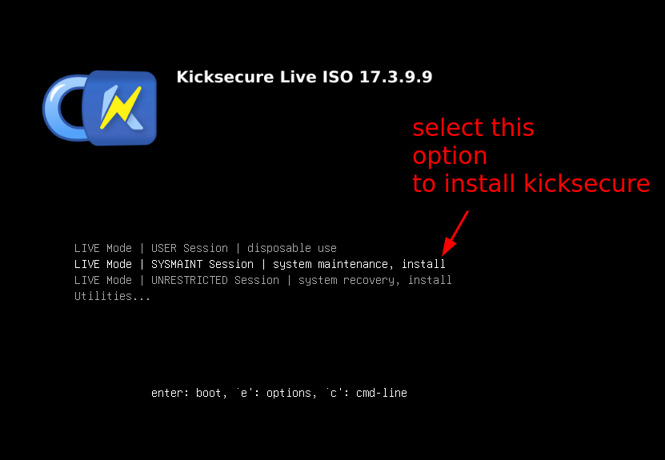

# How to Self-Host a server at Home

```
Serverside privacy is not a thing when you rent servers that you don't own. So the solution is to host services at home, on servers that you are the only one to have physical access to.
```

## Why should I have a Homeserver ?

As we explained [previously](../selfhosting/index.md), whenever you use a service running on a server that you don't own, everything that happens on said server is visible from the cloud provider (which is likely to be the adversary):


so the point here is that you should run a server at home, that way you become the only one that can see what is being done on it, achieving serverside privacy, without having to resort to end to end encryption.


## What do I need to make my own Homeserver ?

Hardware-wise, it is exactly the same as with building a regular desktop computer, except that you're going to let it run 24/7 while remaining plugged in to the internet.


Just like a regular desktop, you'll need:

- **a case** (which can be a regular PC case)
- **a motherboard** (make sure it supports your RAM/DISK/GPU/CPU requirements)
- **CPU** (make sure it has enough cores to run multiple VMs at once, and it is powerful enough for your cpu intensive tasks)
- **RAM** (i recommend at least 32Gb)
- **GPU** (no particular requirement unless if you want to run LLMs, where you'll need alot of VRAM)
- **Disks:** i recommend a NVME SSD for the host OS, and get as many HDDs as you can for non-system storage, as it'll be very handy for large storage requirements.


## Why not a traditional enterprise-grade server ?


For example if you want to order a Dell poweredge server, you can get refurbished ones like the Poweredge R420 (that are mostly cheap due to their old and slow cpus), 


Or you can get recent ones like the R470 with a hell of a CPU for ultra high-end performance tasks:


**But the main problem is the noise of those servers**, from my own experience, having a poweredge R420 next to you is unbearable, it would have to sit in a separate room altogether. If you don't have a house yet, you may not have the luxury to put that server elsewhere, where it doesn't bother you nor your neighbors.


When the damn thing boots at first, it sounds like a jet engine going off, and when it finishes booting, the noise of the fans will depend on how much heat it is currently generating. However expect the noise to be a major nuisance.

I put up with the noise of a poweredge R420 next to my bed for 3 months, before moving it at the other side of the room, and even there it was still bothering me. So before you decide to go with an enterprise-grade server, take into account the noise it's going to make!

## Design your home server to be SILENT!

Since then i sold my poweredge R420 and i decided to setup my new homeserver to be as silent as possible, i chose to build it using bequiet components:


for instance i can vouch for those quiet fans, you almost don't hear them at all.


Same goes for the CPU heatsink with fans of the same brand, very convenient to have them be nearly silent.

The next source of noise coming from the home server is the harddrives:


Expect those harddrives to make some clicking sounds whenever you  perform read/write operations on them, but frankly due to not being a constant sound to hear in the background, i find it to be way more bearable than having noisy fans. IMO that's tolerable noise-wise even if the server sits next to your bed.

## Setting up the Host OS

Assemble the beast, power it on, and boot on a USB stick that has the kicksecure OS just like we showcased in the [Clientside kicksecure host OS tutorial](../linux/index.md)



We intend to have privacy on that homeserver, therefore we're going to stick to our FOSS-software only rule. Do not install any closed-source software on your home server.


When you install the home server kicksecure Host OS on the NVME SSD System drive, take note that if you setup the host OS to have LUKS full disk encryption (FDE), you're going to require to be physically next to the server to unlock it:


Once you finish setting up the server, reboot the server and remove the USB key to boot onto the Host OS you just installed:

From there you can follow the [post-install steps of the tutorial](../linux/index.md) to:

- remove the split between the user and the sysmaint user
- set a password on the "user" user and disable autologin for the main user, to be able to make sure nobody can just physically log in without having the password


## Reserving the homeserver local IP via DHCP

once the host OS install is finished, make sure that the home server is connected to the internet. If it is too far away from the router, you can make the ethernet connection go over the power sockets using a ethernet over powerline kit:


Those are fairly easy to setup and use, and are handy if you dont want to plug in a 20 meter long ethernet cable from the router all the way to your home server.

Once the ethernet cable is plugged in onto the home server, make sure that it has it's local IP reserved via DHCP from your home router, that way you can always access it via the same IP address:

```sh
[ Wonderland ] [ /dev/pts/3 ] [~]
→ ip a

2: eth0: <BROADCAST,MULTICAST,UP,LOWER_UP> mtu 1500 qdisc mq state UP group default qlen 1000
    link/ether f7:09:56:43:95:f2 brd ff:ff:ff:ff:ff:ff
    inet 192.168.1.100/24 brd 192.168.1.255 scope global noprefixroute eth0
       valid_lft forever preferred_lft forever
    inet6 2a01:cb10:17:ff00:8484:acb5:d6a9:8379/64 scope global dynamic noprefixroute
       valid_lft 1789sec preferred_lft 589sec
    inet6 fe80::4aaf:6cec:3b44:845f/64 scope link noprefixroute
```

For instance here from the home router interface, i use the home server's mac address **f7:09:56:43:95:f2** to make sure that it always gets the same IP address even after rebooting. That'll be useful later on to keep accessing it easily.


Once the homeserver's local IP address is reserved via DHCP, you can setup the CLI access via SSH:

## Setting up local access via SSH

```sh
sudo apt update -y ; sudo apt install openssh-server
```
Once done, on the clientside you can create a ssh key:

```sh
[ localhost ] [ /dev/pts/5 ] [~]
→ ssh-keygen -t ed25519
Generating public/private ed25519 key pair.
Enter file in which to save the key (/home/user/.ssh/id_ed25519):
Enter passphrase (empty for no passphrase):
Enter same passphrase again:
Your identification has been saved in /home/user/.ssh/id_ed25519
Your public key has been saved in /home/user/.ssh/id_ed25519.pub
The key fingerprint is:
SHA256:675cLCE5iENsBFCQ/hREnz4KFG5pfkRiaOYFInTd9Cs user@localhost
The key's randomart image is:
+--[ED25519 256]--+
|X@*=. o.         |
|B=*o.....        |
|=*=..o   .       |
|==.o.. .  .      |
| o=..o+ES.       |
|  oo. .o.+       |
|   .    o o      |
|       o o       |
|       .=.       |
+----[SHA256]-----+

[ localhost ] [ /dev/pts/5 ] [~]
→ cat ~/.ssh/id_ed25519.pub
ssh-ed25519 AAAAC3NzaC1lZDI1NTE5AAAAIEK2ZKdUEiY1V4uY2jWsl7brgCqSjI+qfQ39e/p/sj33 user@localhost
```

Now that's done you can copy the public key on the home server:

```sh
user@wonderland:~% mkdir ~/.ssh/
user@wonderland:~% vim ~/.ssh/authorized_keys
user@wonderland:~% cat ~/.ssh/authorized_keys
ssh-ed25519 AAAAC3NzaC1lZDI1NTE5AAAAIEK2ZKdUEiY1V4uY2jWsl7brgCqSjI+qfQ39e/p/sj33 user@localhost
```

And now with this, you can login onto the server via SSH like so:

```sh
[ localhost ] [ /dev/pts/5 ] [~]
→ vim ~/.ssh/config

# wonderland server
host wonderland
    hostname 192.168.1.100
    user root
    IdentityFile ~/.ssh/id_ed25519


[ localhost ] [ /dev/pts/5 ] [~]
→ ssh wonderland
Linux wonderland 6.1.0-37-amd64 #1 SMP PREEMPT_DYNAMIC Debian 6.1.140-1 (2025-05-22) x86_64
Welcome to Kicksecure (TM)!
https://www.kicksecure.com

Kicksecure Copyright (C) 2012 - 2025 ENCRYPTED SUPPORT LLC
Kicksecure is Freedom Software, and you are welcome to redistribute it under
certain conditions; type "kicksecure-license" <enter> for details.
Kicksecure is a compilation of software packages, each under its own copyright and
license. The exact license terms for each program are described in the
individual files in /usr/share/doc/*/copyright.

Kicksecure GNU/Linux comes with ABSOLUTELY NO WARRANTY, to the extent
permitted by applicable law; for details type "kicksecure-disclaimer" <enter>.

Kicksecure is a derivative of Debian GNU/Linux.

Kicksecure is a research project.

default user account: user
default password: No password required. (Passwordless login.)

Type: "kicksecure" <enter> for help.
Web console: https://wonderland:9090/ or https://10.145.64.173:9090/

Last login: Fri May 30 14:14:12 2025 from 192.168.1.67

user@wonderland:~% id
uid=1001(user) gid=1001(user) groups=1001(user),139(console)

```
And that's it ! we are now logged in via SSH, meaning that we can now access the home server locally with a CLI interface.

## Setting up local access via RDP

If you need to interact with the server's GUI applications, you're going to need a GUI access aswell. To do so you can install XRDP on the server, to make it possible to connect via the RDP protocol onto the home server:
```sh
[ Wonderland ] [ /dev/pts/4 ] [~]
→ sudo apt install xrdp -y

[ Wonderland ] [ /dev/pts/4 ] [~]
→ sudo systemctl enable --now xrdp

[ Wonderland ] [ /dev/pts/4 ] [~]
→ netstat -alntup | grep 3389                                                            
tcp6       0      0 :::3389                 :::*                    LISTEN      1533/xrdp      
```

then from the clientside, you can install the Remmina RDP Client:
```sh
[ localhost ] [ /dev/pts/6 ] [~]
→ sudo apt install remmina freerdp2-x11

[ localhost ] [ /dev/pts/6 ] [~]
→ remmina
```
Once in remmina, use the homeserver local IP to connect to it via RDP:


then login using the user credentials:


if you want, you can also save the RDP destination by clicking here, just mention the IP and the credentials in the opened window:


And that's it! you now have a local GUI access to the homeserver, without having to connect a keyboard, mouse and display to it.
