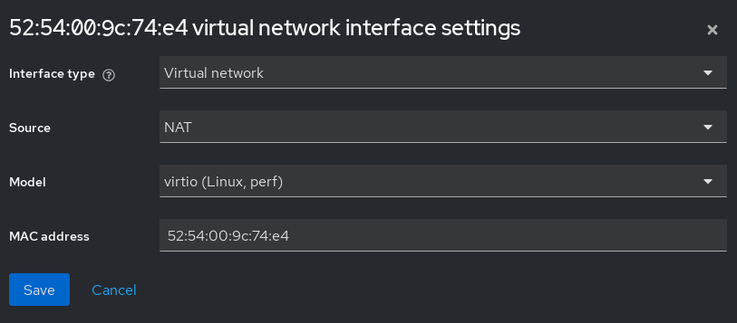
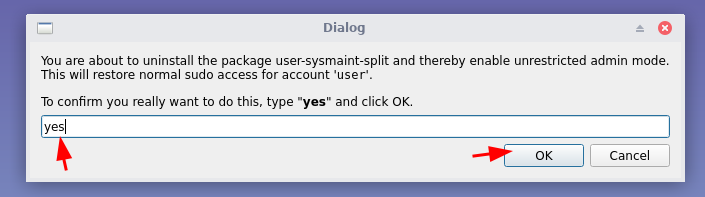
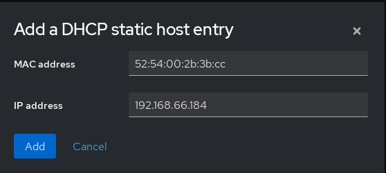
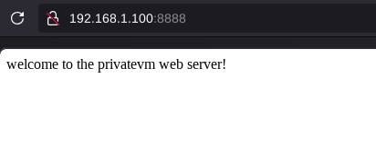

# Self-Hosting a Hypervisor on your Home Server

```
TLDR: you can run virtual machines on your homeserver, by setting up the Libvirtd QEMU/KVM hypervisor.
```

**Sidenote:** this setup depends on the previous setup we showcased in [this tutorial](../homeserver/index.md) as we need the homeserver to have the host OS setup, with both SSH and RDP access.


## Setting up libvirtd QEMU/KVM on the host OS

Via SSH we connect to the homeserver to setup the libvirtd QEMU hypervisor, in order to be able to virtualize machines and segment the intended uses accordingly, just like on the clientside.


```sh
[ localhost ] [ /dev/pts/5 ] [~]
→ ssh wonderland
Enter passphrase for key '/home/user/.ssh/torified':
Linux wonderland 6.1.0-37-amd64 #1 SMP PREEMPT_DYNAMIC Debian 6.1.140-1 (2025-05-22) x86_64
Welcome to Kicksecure (TM)!
https://www.kicksecure.com

Kicksecure Copyright (C) 2012 - 2025 ENCRYPTED SUPPORT LLC
Kicksecure is Freedom Software, and you are welcome to redistribute it under
certain conditions; type "kicksecure-license" <enter> for details.
Kicksecure is a compilation of software packages, each under its own copyright and
license. The exact license terms for each program are described in the
individual files in /usr/share/doc/*/copyright.

Kicksecure GNU/Linux comes with ABSOLUTELY NO WARRANTY, to the extent
permitted by applicable law; for details type "kicksecure-disclaimer" <enter>.

Kicksecure is a derivative of Debian GNU/Linux.

Kicksecure is a research project.

default user account: user
default password: No password required. (Passwordless login.)

Type: "kicksecure" <enter> for help.
Web console: https://wonderland:9090/ or https://10.145.64.173:9090/

Last login: Fri May 30 15:19:00 2025 from 192.168.1.67

[ Wonderland ] [ /dev/pts/4 ] [~]
→ sudo -i

```
From there we can install the following packages to setup the hypervisor just like we previously did in the [clientside hypervisor tutorial](../hypervisorsetup/index.md):

```sh
[user ~]%:~# sudo apt install libvirt0 virt-manager dnsmasq bridge-utils
    
[user ~]%:~# sudo systemctl enable --now libvirtd
[user ~]%:~# sudo systemctl disable --now dnsmasq

[user ~]%:~# sudo usermod -a -G libvirt user
[user ~]%:~# sudo usermod -a -G kvm user

[user ~]%:~# sudo vim /etc/libvirt/libvirtd.conf 
    
unix_sock_group = "libvirt"
unix_sock_rw_perms = "0770"

:wq
    
[user ~]%:~# sudo vim /etc/libvirt/qemu.conf 
    
group = "libvirt"
user = "user"
    
:wq
    
[user ~]%:~# systemctl restart libvirtd.service
    
[user ~]%:~# virt-manager
    
[user ~]%:~$ mkdir ISOs
[user ~]%:~$ mkdir VMs
    
[user ~]%:~$ sudo chmod 770 -R VMs  
[user ~]%:~$ sudo chmod 770 -R ISOs  
    	
[user ~]%:~$ sudo chown user:libvirt -R VMs
[user ~]%:~$ sudo chown user:libvirt -R ISOs
```

once done, you can connect via RDP to open up virt-manager and manage your VMs from the GUI environment directly


## Setting up the cockpit web interface to manage the hypervisor remotely

```sh
[ Wonderland ] [ /dev/pts/8 ] [~]
→ sudo -i

[ Wonderland ] [ /dev/pts/8 ] [~]
→ . /etc/os-release
echo "deb http://deb.debian.org/debian ${VERSION_CODENAME}-backports main" > \
    /etc/apt/sources.list.d/backports.list
apt update

[ Wonderland ] [ /dev/pts/8 ] [~]
→ apt install -t ${VERSION_CODENAME}-backports cockpit

[ Wonderland ] [ /dev/pts/8 ] [~]
→ systemctl enable --now cockpit

[ Wonderland ] [ /dev/pts/8 ] [~]
→ systemctl status cockpit
● cockpit.service - Cockpit Web Service
     Loaded: loaded (/lib/systemd/system/cockpit.service; static)
     Active: active (running) since Sat 2025-05-31 14:13:33 CEST; 2s ago
TriggeredBy: ● cockpit.socket
       Docs: man:cockpit-ws(8)
    Process: 3579228 ExecStartPre=/usr/lib/cockpit/cockpit-certificate-ensure --for-cockpit-tls (code=exited, status=0/SUCCESS)
   Main PID: 3579229 (cockpit-tls)
      Tasks: 1 (limit: 76961)
     Memory: 900.0K
        CPU: 81ms
     CGroup: /system.slice/cockpit.service
             └─3579229 /usr/lib/cockpit/cockpit-tls

May 31 14:13:33 wonderland systemd[1]: Starting cockpit.service - Cockpit Web Service...
May 31 14:13:33 wonderland systemd[1]: Started cockpit.service - Cockpit Web Service.
```

Now that cockpit is installed and enabled via systemd, you can access it on port 9090:


Here simply click accept risk and continue, as the cockpit service is protected using a self-signed certificate:


## Setting up a private VM using cockpit

Before we continue, we need to ensure that the storage pools are created for the VMs and ISOs directories, as otherwise we can't use them to retrieve the ISOs and store our VMs:


(make sure you select the path to be wherever you created the VMs and ISOs directories)

In the ISOs directory, make sure you download the latest kicksecure ISO:

```sh
[ Wonderland ] [ /dev/pts/6 ] [~]
→ cd ISOs

[ Wonderland ] [ /dev/pts/6 ] [~/ISOs]
→ wget https://www.kicksecure.com/download/iso/17.3.9.9/Kicksecure-Xfce-17.3.9.9.Intel_AMD64.iso
--2025-06-01 10:40:26--  https://www.kicksecure.com/download/iso/17.3.9.9/Kicksecure-Xfce-17.3.9.9.Intel_AMD64.iso
Resolving www.kicksecure.com (www.kicksecure.com)... 95.216.66.124
Connecting to www.kicksecure.com (www.kicksecure.com)|95.216.66.124|:443... connected.
HTTP request sent, awaiting response... 200 OK
Length: 1186336768 (1.1G) [application/octet-stream]
Saving to: 'Kicksecure-Xfce-17.3.9.9.Intel_AMD64.iso'

                           K  29%[============>                               ] 335.80M  3.06MB/s    eta 3m 51s
```


Once the ISO finishes downloading we make sure that there is a NAT network created for us to connect our VM to the internet:


Now that both the storage pools and network are created we click "Create VM" to create a Kicksecure VM:


Once created, you need to edit the network interface to match an existing network:





once the vm starts, we can begin the usual installation of kicksecure by going into the "SYSMAINT Session" boot option:


Then let the installer finish and reboot into the installed kicksecure guest OS, into the remove user-sysmaint split boot option:




Once the user-sysmaint split is removed, reboot into the regular user boot option to finish setting up the guest OS:


First we set a password to the main user:


Then we disable autologin:


## Reserving the Private VM's IP to make sure it remains the same

Once that's done, you as you can see the VM has the following local IP:


So in order to make sure that this IP stays reserved for that VM's mac address (52:54:00:2b:3b:cc), we reserve it in the virtual networks section:





## Setting up remote access on the Private VM (SSH)

Now if you want to keep access to your VM via the commandline like me, you'll need to setup SSH access just like we did for the Host OS [previously](../homeserver/index.md):

```sh
sudo apt update -y ; sudo apt install openssh-server -y 
```

Then copy your public ssh key in the private VM aswell:

```sh
user@localhost:~% mkdir ~/.ssh/
user@localhost:~% vim ~/.ssh/authorized_keys
user@localhost:~% cat ~/.ssh/authorized_keys
ssh-ed25519 AAAAC3NzaC1lZDI1NTE5AAAAIEK2ZKdUEiY1V4uY2jWsl7brgCqSjI+qfQ39e/p/sj33 user@localhost
```
and then from the clientside you can ssh into the home server, then to the private VM via a proxyjump:


Here to avoid running the SSH command twice we use the ProxyJump parameter in our SSH alias:

```sh
host privatevm
    hostname 192.168.66.184
    user user
    ProxyJump wonderland
    IdentityFile ~/.ssh/torified

host wonderland
    hostname 192.168.1.100
    user root
    IdentityFile ~/.ssh/torified
```

Then we try out the ssh command via the SSH alias we just configured:

```sh
[ localhost ] [ /dev/pts/11 ] [~]
→ ssh privatevm
Enter passphrase for key '/home/user/.ssh/torified':
Enter passphrase for key '/home/user/.ssh/torified':
Linux localhost 6.1.0-34-amd64 #1 SMP PREEMPT_DYNAMIC Debian 6.1.135-1 (2025-04-25) x86_64
Welcome to Kicksecure (TM)!
https://www.kicksecure.com

Kicksecure Copyright (C) 2012 - 2025 ENCRYPTED SUPPORT LLC
Kicksecure is Freedom Software, and you are welcome to redistribute it under
certain conditions; type "kicksecure-license" <enter> for details.
Kicksecure is a compilation of software packages, each under its own copyright and
license. The exact license terms for each program are described in the
individual files in /usr/share/doc/*/copyright.

Kicksecure GNU/Linux comes with ABSOLUTELY NO WARRANTY, to the extent
permitted by applicable law; for details type "kicksecure-disclaimer" <enter>.

Kicksecure is a derivative of Debian GNU/Linux.

Kicksecure is a research project.

default user account: user
default password: No password required. (Passwordless login.)

Type: "kicksecure" <enter> for help.
Last login: Sun Jun  1 17:41:06 2025 from 192.168.66.1
user@localhost:~% 
```
And thats it! we managed to directly connect to the private VM via SSH as intended.

## Setting up a basic web service on the private VM

Now let's setup a basic nginx web server on the private VM:

```sh
user@localhost:~% sudo apt install nginx -y
user@localhost:~% cd /etc/nginx/
user@localhost:/etc/nginx% sudo rm sites-*/default
user@localhost:/etc/nginx% vim sites-available/web.conf
user@localhost:/etc/nginx% cat sites-available/web.conf

server {
        listen 80;
        root /srv/www/;
}

user@localhost:/etc/nginx% sudo ln -s /etc/nginx/sites-available/web.conf /etc/nginx/sites-enabled

user@localhost:/etc/nginx% sudo nginx -t
nginx: the configuration file /etc/nginx/nginx.conf syntax is ok
nginx: configuration file /etc/nginx/nginx.conf test is successful

user@localhost:/etc/nginx% sudo nginx -s reload
2025/06/01 18:37:40 [notice] 23824#23824: signal process started

user@localhost:/etc/nginx% sudo mkdir -p /srv/www/
user@localhost:/etc/nginx% sudo vim /srv/www/index.html
user@localhost:/etc/nginx% cat /srv/www/index.html
welcome to the privatevm web server!

user@localhost:/etc/nginx% curl 127.0.0.1
welcome to the privatevm web server!
```

And on the home server we can setup a reverse nginx proxy on the host OS to make it easier to access our private VM website inside the household (since currently the webserver is accessible only from within the NAT):


```sh
[ Wonderland ] [ /dev/pts/6 ] [/etc/nginx/sites-available]
→ vim www.conf

[ Wonderland ] [ /dev/pts/6 ] [/etc/nginx/sites-available]
→ cat www.conf
server {
        listen 8888;

        location / {
                proxy_pass      http://192.168.66.184:80/;
        }
}

[ Wonderland ] [ /dev/pts/6 ] [/etc/nginx/sites-available]
→ ln -s /etc/nginx/sites-available/www.conf /etc/nginx/sites-enabled

[ Wonderland ] [ /dev/pts/6 ] [/etc/nginx/sites-available]
→ nginx -t  
nginx: the configuration file /etc/nginx/nginx.conf syntax is ok
nginx: configuration file /etc/nginx/nginx.conf test is successful

[ Wonderland ] [ /dev/pts/6 ] [/etc/nginx/sites-available]
→ nginx -s reload
```



And here as you can see we can access the PrivateVM webserver via the reverse nginx proxy as intended.


