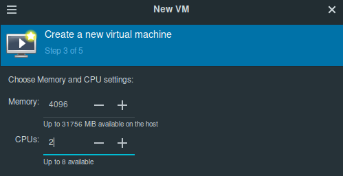
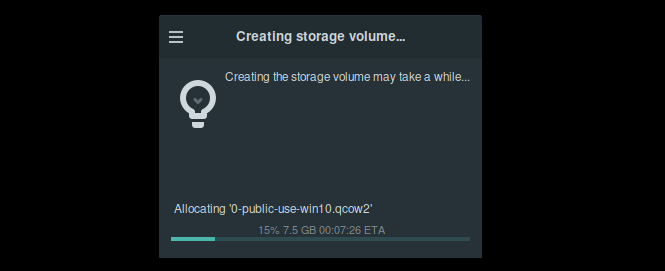
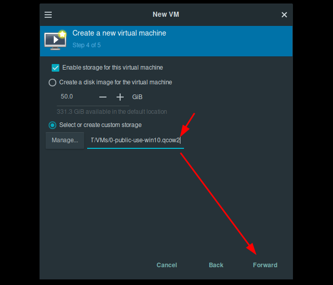
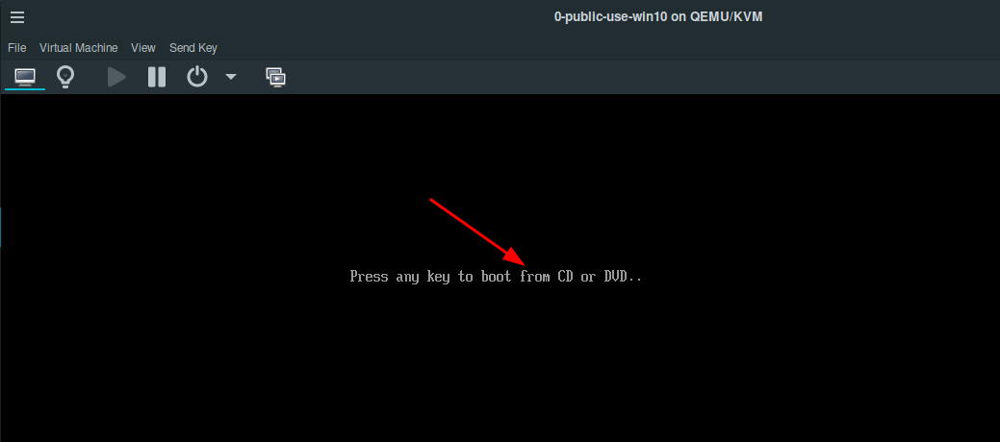
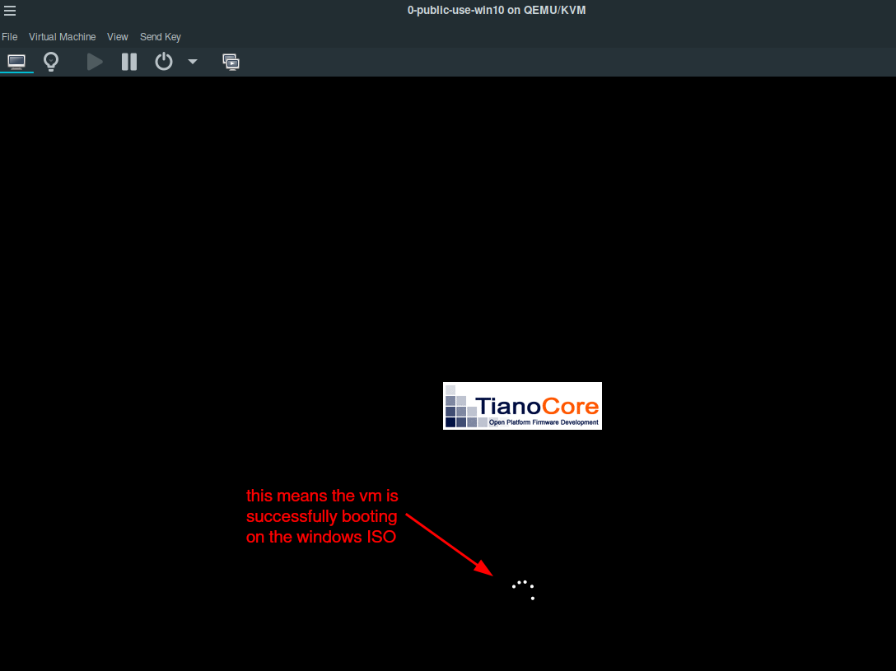

# Linux Hypervisor Setup (QEMU/KVM virtualisation) 

```
TLDR: you can run virtual machines on your computer by installing the libvirtd QEMU/KVM Hypervisor.
```


In this tutorial we're going to cover how to setup the open source hypervisor QEMU/KVM in [Linux](../linux/index.md) host OS, using the libvirt technology.

## _OPSEC Recommendations:_

  1. Hardware : PC / Laptop / Homeserver / Remote Server

  2. Host OS : [Linux](../linux/index.md)


I recommend using this setup first of all to **isolate your Public use** , and to **segment it from the other Uses** such as [Private use](../privacy/index.md), but it can later be used for [Anonymous use](../anonymityexplained/index.md), and also [Sensitive Use](../deniability/index.md), as per the [4 basic OPSEC levels](../opsec4levels/index.md).


## **Why should Bob use an open-source hypervisor ?**

Bob has a problem, he wants to use his laptop for 4 different internet uses:


But currently, he has only one laptop with linux as the host OS.


So the idea basically is that Bob does not need to purchase 4 laptops each for a different usage, he just needs to virtualise those machines using a Hypervisor:


Bob is going to use a QEMU/KVM hypervisor to virtualize 4 VMs, each for a specific use. The windows VM will be for public use, the debian VM will be for the private use, the Whonix VM will be for Anonymous use, and the other whonix VMs in the veracrypt hidden volume be used for sensitive uses.

## **Virtualisation setup**

Next **we do not virtualize anything using closed-source software** like VMWare Workstation or else. **We use QEMU/KVM with virt-manager, which is an open source hypervisor** :
    
    
    [user ~]%:~# sudo apt install libvirt0 virt-manager dnsmasq bridge-utils
    
    sudo systemctl enable --now libvirtd
    sudo systemctl disable --now dnsmasq
    
    [user ~]%:~# sudo usermod -a -G libvirt user
    [user ~]%:~# sudo usermod -a -G kvm user
    
    

Next we're going to use vim (which is a terminal-based text editor) to edit the libvirtd config files, that is to make sure that we can create and edit vms without requiring to type the admin password every time. **From inside vim you need to press i to enter insert mode (to be able to actually edit the file contents)** , then you can edit the mentionned lines to mention the libvirt group and the "user" username, **then press ESC to exit insert mode, and then type :wq to save your edits and exit the config files:**
    
    
    [user ~]%:~# sudo vim /etc/libvirt/libvirtd.conf 
    
    unix_sock_group = "libvirt"
    unix_sock_rw_perms = "0770"
    
    :wq
    
    [user ~]%:~# sudo vim /etc/libvirt/qemu.conf 
    
    group = "libvirt"
    user = "user"
    
    :wq
    
    [user ~]%:~# systemctl restart libvirtd.service
    
    [user ~]%:~# virt-manager
    	
    

Next just make sure that the NAT network is created, and that the ISOs and VMs folders are with the correct permissions:


And also create another NAT network so that we can put all the untrusted VMs such as Windows into:


That way, the adversary that can normally see what's going on in the network attached to the Windows VM can no longer see as it is being put in a different network altogether. 
    
    
    [user ~]%:~$ mkdir ISOs
    [user ~]%:~$ mkdir VMs
    
    [user ~]%:~$ sudo chmod 770 -R VMs  
    [user ~]%:~$ sudo chmod 770 -R ISOs  
    	
    [user ~]%:~$ sudo chown user:libvirt -R VMs
    [user ~]%:~$ sudo chown user:libvirt -R ISOs
    
    

Then you can add the file directories in virt-manager like so:

 

And now you're all set to start making VMs while maintaining the open-source requirement. If you still want to use a closed-source OS, you can do so in a QEMU VM from virt-manager. **always remember that closed-source OSes like Windows belong in a VM, never out of one.**

Additional notes: you can prevent an adversary to tamper with your laptop, by using glitter polish as shown in mullvad's [tutorial](https://mullvad.net/en/blog/how-tamper-protect-laptop-nail-polish), and also make sure that your phone does not have a closed-source host OS by using [ Graphene OS](https://grapheneos.org/install/cli).

## **How to setup the Public use VM**

Next, Bob needs to use VMs for 2 basic needs: Public internet usage, and Private internet usage. He first needs to download the [Windows ISO](https://www.microsoft.com/en-us/software-download/windows10ISO) file, and the [debian iso](https://www.debian.org/distrib/netinst) file too:

First he creates the windows VM like so:

       

Then before we begin the installation, we make sure that the windows VM uses the untrusted NAT network to make sure it remains isolated:


Then we hit Apply, and then we click on begin installation

  

Then in the windows VM he installs the OS on the virtual disk:

 

Then Bob can launch the windows VM (make sure that the VM boots onto the disk instead of the iso in the boot settings):

 

Then Bob can use the windows VM for his public usage (such as KYC services, and closed-source software). **Keep in mind that the windows VM is the place where the big eye of sauron can see what you are doing. NEVER do anything sensitive from this VM, because you will never have any privacy in it.**

## **How to setup the Private use VM**

To setup the Private use VM, we'll download the Kicksecure ISO just like we previously did in the host OS tutorial, except this time we'll directly attach it to a new VM:

      

From there you can repeat the steps that we took [to install kicksecure on the host OS](../linux/index.md), to install it:


And from there, Bob installs linux as per his needs:


    

Once here, we reboot the VM, and upon rebooting we unlock the encrypted system drive:

 

And from here we have our private VM setup! **Warning: You only have privacy in this VM, as long as you do not install any closed-source software (ex: no discord, no google chrome, etc) in it!** Make sure that you ONLY install FOSS software in the private VM. **Any closed-source software you want to install needs to be installed in the Public VM instead.**


Next, Bob can setup a [VPN](../vpn/index.md) by default into his kicksecure VM to prevent his ISP from spying on what he is doing.


## BONUS: speeding up the host OS shutdown in case if vms are still active and blocking the shutdown sequence

Now from my personal experience i know libvirtd can slow down the shutdown process if there are still vms that aren't shutdown yet: 


So let's make sure it speeds up massively by changing the default timeout of 300 seconds to 1 second by editing the libvirt-guests.sh script where the timeout value is defined:

```sh
root@localhost:/etc/libvirt# cat /usr/lib/libvirt/libvirt-guests.sh | grep TIMEOUT
SHUTDOWN_TIMEOUT=300
# was successfully shutdown or the timeout defined by $SHUTDOWN_TIMEOUT expired.
root@localhost:/etc/libvirt# vim /usr/lib/libvirt/libvirt-guests.sh
root@localhost:/etc/libvirt# cat /usr/lib/libvirt/libvirt-guests.sh | grep TIMEOUT
SHUTDOWN_TIMEOUT=1
# was successfully shutdown or the timeout defined by $SHUTDOWN_TIMEOUT expired.
```