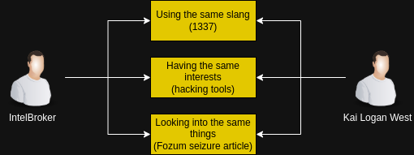

# The Downfall of IntelBroker

```
TLDR: Don't use bitcoin, and especially not on centralised exchanges where you're forced to KYC yourself.
```

## Who was IntelBroker?

Intelbroker, whose real name is **Kai Logan West**, is a notable figure in the cybercrime landscape. Initially claiming to be of Serbian descent and residing in Russia, he is, in fact, a hacker originating from **Great Britain**. Over the course of his illicit career, Intelbroker has been involved in approximately **80 sales and leaks** of **compromised data**, showcasing his significant impact on cybersecurity breaches.

His activities include infiltrating victim computer networks, stealing sensitive data, and subsequently selling this information. In **2023**, he joined the hacking group known as **CyberNiggers**, further solidifying his presence in the hacking community. By **2024**, Intelbroker had ascended to a position of prominence as the **owner of BreachForums**, a well-known platform for cybercriminals to exchange information and services. Although he **resigned from this role in 2025**.


## What were the OpSec mistakes that IntelBroker made?

This section outlines how law enforcement pursued him and the operational security (OPSEC) mistakes that led to IntelBroker's arrest.

### 1. Overusing his alias

Claiming responsibility for various breaches and selling the data while also becoming the owner of BreachForums under the same name made him a prime target for law enforcement.


### 2. Using Bitcoin

IntelBroker offered an API key for $250 in Monero. Law enforcement, operating undercover, contacted him to purchase the key but wanted to pay in Bitcoin instead of Monero. IntelBroker agreed, which led to the authorities obtaining one of his Bitcoin addresses.


### 3. Using KYC Exchanges

After obtaining the Bitcoin address, law enforcement examined its transaction history. Upon reviewing previous transactions, they observed that the wallet received 0.00036551 BTC from a wallet created with a ramp account where Kai Logan West had completed the Know Your Customer (KYC) process. In addition to other information such as his name and address, they also found his email and ID. With this information, they located another account on Coinbase where he used the same info including email and ID. The name of the Coinbase account was Kyle Northern.


### 4. Email

When obtaining his email, law enforcement examined it for further evidence. They discovered that he had received an email from kyle.northern1337@icould.com(which was also his), which included a photograph of Kai Logan West's ID. The number combination “1337” is slang used in online hacker communities, representing “Leet” (what 1337 appears to be when held upside down) and is short for “elite.”

Upon reviewing the Kyle.Northern1337 email account, they found several items stored in a cloud-based server associated with that account. Among other things, there was an image of an article discussing the seizure of BreachForums and videos of a command-line tool called “GPRS Smash,” which is networking software that would be of interest to cybercriminals such as IntelBroker.



### 5. Same IPs

Investigating accounts tied to his personal email, they found a Microsoft account. Inspecting its logs, they discovered that the account had been accessed from an IP address that was also one of the attacker IPs of one of IntelBroker's victims.

Additionally, they found that the same IP address that created IntelBroker's Twitter account also accessed Kai Logan West's email account 22 times.


### 6. Behavioral Correlations

While logged into YouTube with his personal email account, West watched several videos that IntelBroker shared after West viewed them.

1. On July 11, 2023, beginning at 12:06 UTC through 12:08 UTC, West watched the video “Kobo Requested the Ara Ara ctto:@nvcnouu.” At 12:09 UTC, IntelBroker posted the same video on BreachForums.

2. From January 28, 2024, through February 5, 2024, West viewed a video titled “CHCL SOUP – DARKSIDE” 12 times, including on February 5, 2024, at 13:14 UTC. The same day, at 13:15 UTC, IntelBroker posted that video on BreachForums.

3. From April 5, 2024, at 23:38:50 UTC, to April 6, 2024, at 05:17 UTC, West watched the video “ROY BEE – Kiss Me Again” three times. On April 6, 2024, at 05:18 UTC, IntelBroker posted the same video on BreachForums.


### 7. Watching Himself

In addition to watching videos and subsequently sharing them as IntelBroker, West also viewed videos discussing the breaches made by IntelBroker, including an interview with IntelBroker.

### 8. Sentence

It is not clear what the defendant will ultimately serve in prison. However, based on the charges, it can be speculated that the potential sentence could amount to approximately 50 years. Of course, this may differ, as the final sentencing will be determined by a judge. Regardless, it is evident that engaging in such activities is not worth the risk, and individuals considering similar actions should take their OPSEC more seriously.


## What should IntelBroker have done differently?

To avoid being a high target from the outset, it is advisable to claim breaches under different names. This approach may come at the expense of not building a reputation, but it is worthwhile if one values freedom more than reputation. Alternatively, one could claim breaches under a single name and, as explained in our article on [OPSEC over ego](../opsecoverego/index.md), switch identities after a while so that past mistakes are only tied to previous identities.

He made the right decision by asking for Monero but then erred by accepting Bitcoin. Instead, he should [directly price items in Monero](../priceinxmr/index.md) and only accept Monero. This would have already prevented law enforcement from easily tracking his previous transactions. This does not imply that he can use KYC exchanges since the feds can't see his transaction history as he did. One should never utilize such KYC services and should instead refer to our guide on how to acquire Monero using Haveno, either through [Direct Fiat to Monero transactions](../haveno-client-f2f/index.md) or via [Cash by Mail](../haveno-cashbymail/index.md).

The issue with email is somewhat resolved by avoiding KYC and using retoswap, but it is still beneficial to read [why the email protocol is fundamentally flawed](../mail-problem/index.md) and should not be used. If one must use a email, it is best to utilize a temporary email from a random temporary mail site or [create an email through Tor](../anonemail/index.md) if long-term access is required. It is also important not to reuse emails to avoid linking activities or identities together.

The same identity separation applies to the IP problem. Everything should be kept separate between two identities. To better understand this, it is recommended to read our [article on identity segmentation](../segmentationfails-email-name-pass/index.md). This concept not only pertains to email and IP separation but also to behaviors. Therefore, watching or sharing the same videos as a different identity, or even viewing videos related to a different identity, should be avoided.
