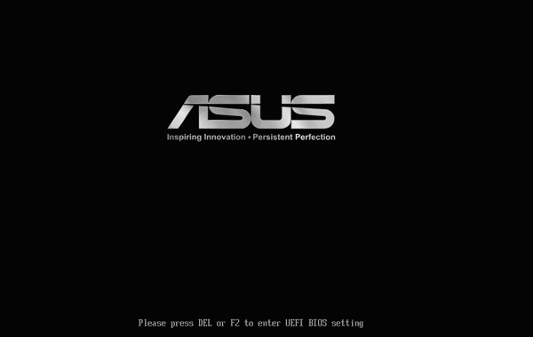
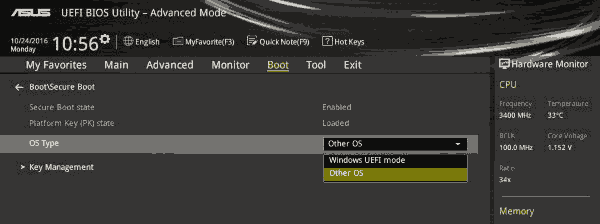
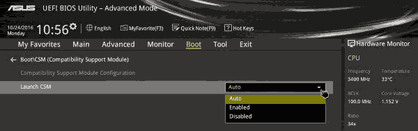
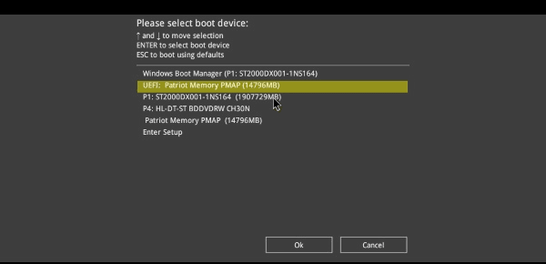
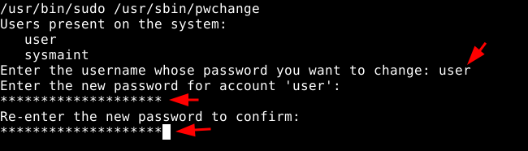

# How to have Privacy on your Computer (Kicksecure Host OS) 

```
TLDR: you don't have privacy on Windows / MacOS, that's why you need Linux as a Host OS. (and in this case we go for Kicksecure because we need it for the deniability section of the opsec bible).
```


In this tutorial, we're going to look at the first and foremost thing anyone can do to remove surveillance from their digital lives, by installing a free and open source software (FOSS) host operating system: Linux, in this case we're going to setup the latest Kicksecure host OS, since it is a secure-by-default linux distribution.

## _OPSEC Recommendations:_

  1. Hardware : (Personal Computer / Laptop)


I recommend using this setup on your main PC, laptop, but also as a home server or a remote server. For [Privacy use](../privacy/index.md), and potentially [Anonymous use](../anonymityexplained/index.md) if you implement the correct technology for it later on, as per the [4 basic OPSEC levels](../opsec4levels/index.md).


## **Why should Bob install Linux?**

So here we are Bob, and we have decided that having an entire crowd watching what we were doing with out computer was no longer acceptable. What can we do from here ?


Bob, after searching for a while on the web, Bob realized that Windows was the problem here. Because it is closed-source (meaning the source code is not available) he couldn't know what Windows was doing in the background. Because that is so, Bob is now certain that his Operating System could be used for surveillance, without him being aware of it.

"What the hell can I do on Windows privately then ?", Bob thought for a while.


"... Nothing!", He realized. While he was using windows, he would never have any privacy with his digital life.

_Allegory:_ You have a house, and you have an annoying neighbor (Jack) that wants to know everything you do in your House. **If you have windows installed on your computer as a host OS, it is the same as leaving the front door wide open for Jack to enter and watch what you're doing in your house, no matter how much you try to barricade the windows, or the doors.** It makes more sense to try and barricade the front door first, before trying to barricade the windows and other rooms in your house, isn't it ?

So Bob looked for an open source operating system to replace Windows, and [he found the Linux sourcecode](https://github.com/torvalds/linux), he read the entire code and found no spyware in it. Then he decided that he would use that instead of using Windows.


**Because it is through Windows, that Microsoft employees are able to spy on what Bob was doing so far!** By removing windows from the equation, he is also removing Microsoft's surveillance from his digital life!

Bob has decided that he would use Linux from now on, because he is no longer tolerating being watched by an entire crowd, without his consent.

## **How to create a Linux USB installer from Windows?**

First step is to go on the web to find a secure linux distribution such as Kicksecure:

 

So we're going to install [Kicksecure](https://www.kicksecure.com/wiki/download). **(Disclaimer: if you use closed-source hardware, like 99.9999999999% of people out there, you will invariably have to use non-free firmware too** [[1]](https://www.kicksecure.org/vote/2022/vote_003) [[2]](https://forums.kicksecure.net/viewtopic.php?t=158876) [[3])](https://forums.debian.net/viewtopic.php?t=154837). If you want a purely FOSS host OS, and you are willing to not have firmware for your CPU, GPU, Motherboard, Ethernet/wifi, check out the OSes recommended by the Free Software Foundation [[4]](https://www.gnu.org/distros/free-distros.en.html) (but it will be at the expense of having your peripherals not working [[5]](https://forums.puri.sm/t/non-free-firmware-for-pureos/20053)). **The status of Open source Hardware is not even competitive in this closed-source hardware domination of the market.** , hopefully this will change in the future, but for now that's how it is. _TLDR:_ If you don't want to install proprietary firmware, check out [PureOS](https://pureos.net/download/) instead of Kicksecure.


Let it download and then we have the Kicksecure ISO image.


But now we need to put that ISO image on a USB stick. To do so we can use [Rufus](https://rufus.ie/en/):

 

next we install Rufus and plug in a usb stick in the computer **(Warning: the usb stick should be at least 2 GB big)** :


And once the kicksecure iso image finishes downloading, we use it from inside rufus by clicking the "select" button:


And lastly we click "start" to 

   

Then we wait a few minutes, and now we have a USB stick with the latest Kicksecure OS on it:


And now we will be able **to use it to install Linux and replace Windows with it.**

## **How to use the kicksecure USB stick to overwrite Windows ?**

This is where it gets a bit technical for Bob. But here are the steps he needs to do:

  1. He needs to plug his USB stick in his computer

  2. He needs to restart his computer

  3. As his computer restarts, **he needs to repeatedly press the F1 or F2 or DEL or F10 key in order to enter his computer's BIOS** (depending on which brand his computer is)

  4. once he is in the BIOS, he then needs to boot on his USB stick that has the kicksecure image

  5. Then once he boots on his USB stick, he can install kicksecure on his computer


The key that we need to press to enter his computer's BIOS depends on what brand his computer is (see [this blogpost](https://www.tenorshare.com/faq/bios-settings-for-windows-boot.html) for examples).

Now Bob restarts his computer:


And now, as he has an ASUS motherboard, **he repeatedly presses the F2 key** to enter his computer's BIOS:



and from there, Bob needs to navigate the BIOS to boot on his USB key. **Be aware that the Steps may vary, feel free to research how to change the boot options of your computer's BIOS settings**. In Bob's example below, he is on an ASUS computer/motherboard, so he has these specific BIOS steps to do:

Boot > OS Type > Other OS



Boot > CSM settings > Launch CSM Auto



Boot device Selection > **his USB stick**



Once we selects his USB Stick, Bob can now boot from it, and he is greeted by kicksecure's welcome screen:


And from there, Bob installs linux as per his needs:


    

And there, we finished the kicksecure installation, we can unplug the USB stick, and click done to reboot the computer, into the newly installed kicksecure Host OS:


As we reboot the computer, we're greeted by the kicksecure boot screen, and then we type the password to unlock the encrypted system drive:


And now that we are logged, we're in our brand new kicksecure operating system, with the XFCE window manager, You now have a secure-by-default linux host OS, and now it's all open source! **This means that you no longer have windows's countless cameras spying on what you were doing. You now have privacy on your computer.**


And that's it! Bob has managed to get privacy from Microsoft's constant surveillance by replacing Windows with a Linux distribution.


## Making sure that the main user has sudo rights

Kicksecure by default separates the regular user and the admin user on the boot option level, however for the clientside Host OS I don't think we need that separation, so we select the "remove user-sysmaint-split" boot option, to enable [the unrestricted admin mode](http://www.w5j6stm77zs6652pgsij4awcjeel3eco7kvipheu6mtr623eyyehj4yd.onion/wiki/Unrestricted_admin_mode):


Once in that boot option, we type "yes" to confirm that we want the change:


Here we close the terminal window once it confirms us that we can close the window:


Then it'll automatically reboot and enter the default user session, except that this time the user will have sudo rights by default.


once back in the Kicksecure Host OS, we now setup a password for the user:




Once the sudo password is set for the user, we close the window:


And then we disable the autologin aswell:


That way, you'll be able to lock your computer whenever you're not next to it, and require to type a password to get back into it.

