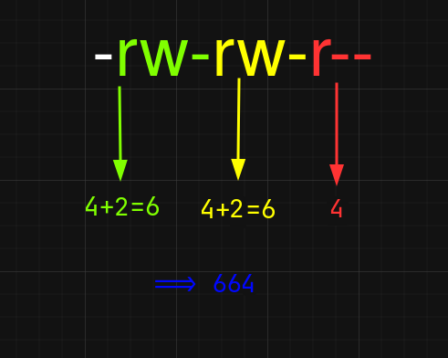

# Linux Basics

```
TLDR: one tutorial to explain you what you need to know for 90% of the tasks you'll need to do 99% of the time on Linux.
```

In this guide, you will learn everything you need to know about linux. Starting from simple things like shells and terminals to slightly harder topics like SSH. These will be the most important things you learn about linux which will stay with you till the end.

## Why Linux?

Because these are the tools and concepts you'll return to every day.
Whether you're installing software, fixing a broken service or simply exploring the system, understanding shells, the filesystem, permissions, service management, remote access and process monitoring gives you both power and confidence.

## Why Debian?

Because [Debian](https://debian.org) is one of the most widely used distros.

- [TAILS](https://tails.net) is based on Debian.
- [Whonix](https://www.whonix.org) is based on Kicksecure, which is based on Debian.
- [QubesOS](https://qubes-os.org) ships with Debian templates.

---

## What Is a Shell?

A **shell** is the program that reads your input, runs commands and shows you output.

- **Terminal emulator**: the window application (e.g. GNOME Terminal, xterm) where you type commands.
    - **Bash**: A widely-used default interactive shell in most distros. Has some features like autocompletion and history.
    - **Fish**: It's like bash, but more feature-complete. Better autocomplete, prompts, and a better experience in general.

If you launch a terminal, you will see a line which probably looks like this:

```
user@debian:~$
```

This is called a **prompt**.

This is where you type commands such as `ls`, `cd`, `apt update`, which the **shell** interprets.

> When a prompt ends in '$', it is a user-level prompt.
>
> When a prompt ends in '#', it is an administrator (sudo) prompt.


---

## The Linux Filesystem

Debian follows the **Filesystem Hierarchy Standard** (FHS). 
Key directories:

| Path         | Description                                                   | Examples                                                   |
|--------------|---------------------------------------------------------------|------------------------------------------------------------|
| `/`          | **Root** of the filesystem tree                               |                                                            |
| `/bin`       | Essential **system binaries**                                 | `cd`, `ls`                                                 |
| `/sbin`      | System **binaries requiring root privileges**                 | `iptables`, `fsck`                                         |
| `/etc`       | Configuration files                                           | `/etc/ssh/sshd_config`, `/etc/fstab`                       |
| `/usr`       | Shareable, read-only data                                     |                                                            |
| `/usr/bin`   | **User-installed binaries**                                   | `python`, `rust`                                           |
| `/usr/lib`   | Libraries and modules                                         |                                                            |
| `/var`       | Variable data                                                 | Logs (`/var/log/`), mail spools, package cache             |
| `/home`      | User home directories                                         |                                                            |
| `/home/user` | Current user's home directory                                 | `/home/user` is the same as `~/` if logged in as `user`    |
| `~/.config`  | Per-user application configuration files (XDG compliant)      | `~/.config/emacs` `~/config/gnome-terminal`                |
| `~/.cache`   | Per-user application cache files                              |                                                            |
| `~/.local`   | Per-user application data, state, and user-installed binaries |                                                            |
| `~/.icons`   | Per-user icon packs                                           |                                                            |
| `~/.themes`  | Per-user theme files                                          |                                                            |
| `/opt`       | Add-on application packages                                   |                                                            |
| `/dev`       | Device files                                                  | Disks, pendrives, and other storage devices. (`/dev/sda1`) |
| `/proc`      | Virtual filesystem exposing process and kernel information    |                                                            |
| `/sys`       | Virtual filesystem exposing system and kernel interfaces      |                                                            |


### How to navigate using the terminal

Now that you know what terminals, shells, and important directories on your system are, let's see how you can actually move around using your terminal.

_"But why should I use a terminal when I can just use \<insert graphical file manager\>?"_

- Typing is faster.
- You can automate tasks by writing scripts.
- Terminal programs use low resources and have smaller or no dependencies.
- When connecting to remote servers, using SSH for example, there is no GUI. Only a terminal.
- CLI (Command Line Interface) programs are reproducible. For example, a UI update could change where a certain option was, and it becomes annoying to figure out where they moved it. This problem literally doesn't exist in CLI programs.

The command you'll use the most is `cd`. With this, you can change your current working directory.
```bash
user@debian:~$ cd Documents/
user@debian:~/Documents/$ 
```

The next command is `ls`. This is to list files in the current directory.
```bash
user@debian:~/Documents/$ ls
important.pdf project Passwords.kdbx
user@debian:~/Documents/$
```

But this doesn't really give us much information. There is a better way to view the files.
It is by passing the `-l` flag.
```bash
user@debian:~/Documents/$ ls -l
-rw-r--r-- 1 user users   22 Jun 26 22:05 important.pdf
-rw-r--r-- 1 root root  1234 Jun 29 09:15 notes.txt
-rw-r--r-- 1 user users   22 Jun 26 20:12 Passwords.kdbx
drwxr-xr-x 5 user users 4096 Apr 12 10:23 projects
user@debian:~/Documents/$
```

There. That looks way better.

You might not understand it yet, but there is a lot of information from just that output. Let's see what each part of the output means in the next chapter.

### Where to go from here
You now know all the different kinds of files are present in different locations across the system and how you can get to them.
I will leave a list of more useful commands below.

1. `nano`: A terminal-based text editor.
2. `mousepad`: GUI-based text editor.
   - While `nano` and `mousepad` might be comfortable to use, you should consider learning `vim`/`neovim`. Once you learn it, it becomes a million times faster to write anything, as you will not need to use a mouse anymore.
   - Once you've mastered `vim`, try `doomemacs`. It is an `emacs` configuration that works with `vim` keybindings by default.
   - These two are infinitely better ways of writing — code or otherwise.
3. `man`: Manual pages for commands. (use `man nano` for example.)
4. `touch`: Create an empty file. (`touch notes.txt`)
5. `pwd`: Print Working Directory.
6. `ls`: List files in the current directory.
7. `rm`: Remove (delete) files. (`rm -rf` to delete a folder.) **`rm` deletes files permanently. It doesn't go to any recycle bin or trash.**
7. `cp`: Copy files (`cp file1 copy_file1`)
8. `mv`: Move files (`mv file1 ~/Documents/`)
9. `tldr`: A shorter manual page listing common/useful commands. Usually not included out-of-the-box in most distros.
10. `sudo passwd`: Change current user's password.
11. `kill -9 $(pidof firefox)`: Kill firefox if it isn't responding. Replace firefox with whatever program you want to kill.

I just can't recommend enough that you read manpages. This is the linux way. You won't find youtube tutorials of every program you want to use, but you will find manuals. So get in the habit of reading manpages and documentation early on. It'll save you a lot of headache in the future.

## VIM Basics

### History
- VIM Stands for VI Improved.
- `Vi` is an ancient text editor made in the 1970s. That's older than most of you.
- `vim` is an advanced, modern version of `vi`.
- There's also `nvim` (neovim) which further improves `vim`, with additions such as plugins and plugin managers.
- All of these are simply terminal text editors.

### Basic Commands
*Note: Everything below this will be the same for both `vim` and `nvim` (neovim)*

- There are three main modes in which you edit text: Normal, Insert, and Visual.

1. **Normal Mode**: In this mode, almost every key on your keyboard is a shortcut for something. This might be overwhelming at first, but you don't need to remember all the shortcuts.
2. **Insert Mode**: This is the mode that lets you type things, just like in any other text editor.
3. **Visual Mode**: This mode is for selecting text. Instead of using the mouse, you only use your keyboard for everything. This makes writing (and editing) a lot faster.

When you open `vim` for the first time, you are greeted with the following page:


If you tried typing something in, it won't work because you are in **Normal Mode** by default when you start `vim`. So, to switch to **Insert Mode**, you can simply press `i`.
You will see in the bottom left of the screen which mode you are in. It should say `-- INSERT --` now that you pressed `i`.

*When you press `:`, you can see that your cursor jumped to the bottom of your screen. This is where you type in commands, like the following for example:*
    - Once you type something in, you can save the file by going back into **Normal Mode** by pressing `<ESC>`, then typing `:w <filename>` (you only have to type the filename once). 
    If you just opened a file with `vim <filename>` instead, typing `:w` would be enough.

- To move around the file, you must be in normal mode.
    - `h` to go left
    - `j` to go down
    - `k` to go up
    - `l` to go right
    - You can also press `w` to move word-by-word.

- To delete a word, press `dw`, again, in **Normal Mode**.
    - `cw` to delete a word and immediately switch to insert mode. (say, `cw` stands for "Change Word"
- `D` to delete from current position to end of line.
- `dd` to delete the entire line.

- To undo, press `u` from **Normal Mode**.
- To redo, press `ctrl+r` from **Normal Mode**.
- To enter visual mode, press `v` from **Normal Mode**.
- To quit `vim`, you can type 
    - `:q!` to quit without saving *(Or just `ZQ` from **Normal Mode**)*
    - `:wq` to save (write) and then quit  *(Or just `ZZ` from **Normal Mode**)*

As you might've noticed, there are lots of different ways to do the same thing in `vim`.

These are some of the most used commands, and from here, you can learn more by typing `:vimtutor` if you're using `neovim`.
If you aren't, you probably should. `nvim` has better extensibility and more features. You will be in for a whole new world of plugins and themes.

**Reminder: Do not overwhelm yourself. You might be slower at first, but once you get the hang of it, you can write and edit as fast as you think. I recommend you force yourself to use `vim` all the time instead of whatever text editor you were using previously, so you get more practice.**

---

## APT

APT (Advanced Package Tool) is a front-end for `dpkg` that handles package retrieval, dependency resolution, and installation.

**1. Updating Package Lists**
Always refresh your local cache before installing or upgrading by doing:

```bash
sudo apt update
```

- Fetches the latest package metadata from all repositories defined in `/etc/apt/sources.list` and `/etc/apt/sources.list.d/`.
- Doesn't change any installed packages.

**2. Installing Packages**

```bash
sudo apt install <package1> [<package2> ...]
```

- Installs the specified packages and any missing dependencies.
- Example:

    ```bash
    sudo apt install curl git build-essential
    ```

**3. Removing and Purging**

- **Remove** (keeps configuration files):

    ```bash
    sudo apt remove <package>
    ```

- **Purge** (removes package **and** its configuration files):

    ```bash
    sudo apt purge <package>
    ```

**4. Upgrading Packages**

- **Upgrade**: Installs available updates for installed packages, but never removes or installs new packages:

    ```bash
    sudo apt upgrade
    ```

- **Full Upgrade** (formerly "dist‐upgrade")—can add or remove packages to satisfy dependencies:

    ```bash
    sudo apt full-upgrade
    ```

**5. Cleaning Up**

- Remove packages no longer required (e.g. old dependencies):

    ```bash
    sudo apt autoremove
    ```

- Clear out downloaded `.deb` files from the cache:

    ```bash
    sudo apt autoclean
    sudo apt clean
    ```

**6. Searching for Packages**

```bash
apt search <keyword>
```

- Matches package names and short descriptions.

**7. Showing Package Details**

```bash
apt show <package>
```

- Displays version, dependencies, installed size, repository origin, description, etc.

### Working with Sources

1. `/etc/apt/sources.list`

Lines take the form:

```
deb http://deb.debian.org/debian buster main contrib non-free
deb-src http://deb.debian.org/debian buster main
```

- **deb** = binary packages
- **deb-src** = source packages

- **Components**:
    - `main` – free software
    - `contrib` – free but depends on non-free software
    - `non-free` – non-free licenses

### Troubleshooting

- **Broken dependencies**:

    ```bash
    sudo apt --fix-broken install
    ```

- **Corrupt package cache**:

    ```bash
    sudo rm -rf /var/lib/apt/lists/*
    sudo apt update
    ```

- **Held packages** (prevent upgrade):

    ```bash
    apt-mark showhold
    sudo apt-mark unhold <package>
    ```

- **Inspect logs**:

    - `/var/log/apt/history.log`: what APT has done
    - `/var/log/apt/term.log`: detailed terminal output


### Best Practices

1. **Regularly `update` before any install/upgrade.**
2. **Use `full-upgrade`**.
3. **Limit `recommends`** if disk space is tight:

```bash
sudo apt install --no-install-recommends <package>
```

---

## File Permissions

Every file and directory on linux has 3 permission groups:

1. **Owner**: Permissions for who owns the file/directory.
2. **Group**: Permissions that apply for the group assigned to the file/directory.
3. **Others**: Permissions that all the other users have.

All you need to remember is:

- `d` = is a **directory**.
- `r` = can **read** the file.
- `w` = can **write** to the file or modify directory contents.
- `x` = can be **executed** a file or access/traverse a directory.
- `-` = permission not granted.

```
drwxr-x--- 2 user users 4096 Jun 30 12:00 projects
```

The first part of the output, `drwxr-x---` can be broken down as follows:


1. It is a directory.
2. The owner can read, write, and execute.
3. The users in the 'users' group can read and execute, but not write.
4. Other users can't read, write, or execute.

**Note: The directory has execute permissions so that files inside it can be listed. Do not get this confused with executables.**
_This also means that if you remove execute permissions on a directory, `ls` will not work in it, but you can still read files if you know the filename._

Another example:
```
-rw-r--r-- 1 root root 1234 Jun 29 09:15 notes.txt
```

1. Owned by root
2. root can read and write but not execute.
3. Users in the group 'root' can only read the file.
4. Everyone else can only read the file.

To change the permissions of a file or a directory, use the following commands:

1. `chown` to change the owner and/or group.
```bash
bleak@debian:~/Documents/$ ls -l
drwxr-x--- 2 user users 4096 Jun 30 12:00 projects
bleak@debian:~/Documents/$ sudo chown bleak projects/
bleak@debian:~/Documents/$ ls -l
drwxr-x--- 2 bleak users 4096 Jun 30 12:00 projects

bleak@debian:~/Documents/$ sudo chown bleak:contributors projects/
bleak@debian:~/Documents/$ ls -l
drwxr-x--- 2 bleak contributors 4096 Jun 30 12:00 projects
```

2. `chmod` change the permissions using the Linux Scoring System.
Before you learn how to use this, you should know some basic math (and the following values).
The arithmetic value of read, write, and execute are as follows.

    - `r` = 4
    - `w` = 2
    - `x` = 1

Let me illustrate this with an example:
The permissions `-rw-rw-r--` would be equal to `664`. Here's how.



From here, if you wanted to add execute privilege for the owner (green) and group (yellow), we add 1 to the first two digits.

- `rwx` = 4+2+1 = 7
- `rwx` = 4+2+1 = 7
- `r--` = 4+0+0 = 4

So, the final permissions, `-rwx-rwx-r--` would be the same as `774`.

This is how you would use `chmod`.
```bash
user@debian:~/Documents/$ ls -l
-rw-rw-r-- 2 user users 30 Jun 30 12:00 notes.txt
user@debian:~/Documents/$ sudo chmod 774 notes.txt
user@debian:~/Documents/$ ls -l
-rwxrwxr-- 2 user users 30 Jun 30 12:00 notes.txt
```

**In case you accidentally mess up file permissions, here are the base permissions:**

- For files, 644.
- For directories, 755.
- For key-pairs, 400.

This method is called the **numeric** or **octal** mode. There's another way to use `chmod`, and it is the **text** or **symbolic** mode.
The basic format is as follows:
```bash
chmod [who][operator][permission] [file]
```

Below are the same example commands in both the formats. I hope it helps you put things in to perspective easily. The key is to learn this intuitively instead of memorizing it. It's easy once you get the hang of it.

1. **Text/Symbolic mode**
```bash
chmod u+x script.sh    # Add execute for user
chmod go-w file.txt    # Remove write from group and others
chmod a=r file.txt     # Set read-only for all
chmod u=rwx,go= file   # Full for user, none for group/others
```

2. **Numeric/Octal mode**
```bash
chmod 755 script.sh    # rwxr-xr-x
chmod 644 file.txt     # rw-r--r--
chmod 700 secret.txt   # rwx------
chmod 000 noaccess.txt # ----------
```

---

## Systemd

Before you understand what `systemd` is, you need to understand what an init system is.

In simple terms, it is the first process the kernel starts on boot. (So always a PID of 1 + Highest privilege)
Its job is to:

1. **Bring the system up**
   - Mount filesystems
   - Start essential kernel services
   - Configure networking
2. **Launch and supervise services (Daemons)**
   - Start Apache webserver
   - Start tor
   - Start the login manager
   - Monitor and restart services whenever required
3. **Handle shutdown and reboot**
   - Stop services in the correct order
   - Unmount filesystems cleanly
   - Tell the kernel to poweroff or reboot.

In the early days, Unix-like systems used a simple "SysV init" approach: a single script (/etc/init.d/...) invoked by numbered runlevels (/etc/rc#.d/...) in serial order. Over time that model showed limitations:

1. **Serial Startup**: Services could start only one after another, slowing boot times.
2. **Limited automation**: If a service failed, you'd have to troubleshoot it manually. There was no built-in restart.

So, then came `systemd`. A modern, fully integrated service-management system.

- Declarative `.service`, `.socket`, `.mount`, `.target` files instead of shell scripts.
- Built-in dependency resolution. (`After=` `Requires=`)
- Journald, a centralized logging system with indexing and structed metadata.
- Easier on-demand operations. (Like locking your system automatically before sleep)

Debian uses **systemd** as its init system. It handles:

- **Units**: service (`.service`), mount (`.mount`), target (`.target`) files in `/lib/systemd/system/` or `/etc/systemd/system/`.
- **Dependencies**: units declare when they start relative to others.
- **Logging**: `journalctl` lets you read the system journal.

Common commands:

```bash
sudo systemctl start apache2.service   # start a service now
sudo systemctl stop  apache2.service   # stop it
sudo systemctl enable apache2.service  # always start at boot
sudo systemctl status apache2.service  # view current status
journalctl -u apache2.service          # view its logs
```

Systemd's parallel startup and on-demand activation make boot faster and services more reliable.

### Controversy
You might have heard that some people absolutely hate systemd, and that's not without good reason.

1. A major issue for some people is that it violates the Unix philosophy of "do one thing and do it well." As you've read above, `systemd` handles a lot of things than just starting and stopping services. Managing network configuration, locales and even hostnames make it "bloated".
2. Rather than a suite of small, interchangeable tools (like GNU coreutils), systemd is a single, large codebase. This makes replacing parts a lot harder.
3. For most people, it's just a philosophical debate between minimal software and ease of use.

But for the average person, `systemd` is good enough. It just works and is easy to configure and learn.

---

## `sudo` and the `/etc/sudoers` file
**Sudo stands for 'Superuser Do'. It allows a permitted user to execute a command as the superuser (root) or another user, as specified by the security policy.**
`sudo` is primarily used for:

- **Privilege escalation**: Running commands as the root user without having to log out and log back in as the root user.
- **Administrative tasks**: Performing system administration, like creating a new user, installing packages, modifying configuration, etc.
- **Security**: Providing a way to grant limited administrative access to users while maintaining a secure environment.

For example, 
```bash
user@debian:~$ sudo apt update
```
In the above line, the command `apt update` is being run with root permissions. 
(This is required for `apt update` so it can create and use lock files, which prevent multiple instances of `apt` from running at the same time.)

`/etc/sudoers` is a configuration file for `sudo`.

1. **Defines permissions**: Which users or groups can run which commands. The syntax is as follows:
```
user  host = (runas) command
```
2. **Defaults**: Global settings that apply to all users.
3. **Comments**: Lines starting with `#` are comments and are ignored by the parser.
4. **Included Files**: You can include other files for modular configuration (instead of everything in one file), often found in `/etc/sudoers.d/`.

Example:
```
alice ALL=(ALL) NOPASSWD: /usr/bin/systemctl restart apache2
```
The above entry allows the user `alice` to run the command `systemctl restart sshd`, which requires a root password without having to enter a password. (Because we defined it with `NOPASSWD:`)

---

## Creating a new user

1. **Create a new user with a password**
```bash
user@debian:~$ sudo useradd -m bob # -m creates bob's home dir automatically
user@debian:~$ sudo passwd bob     # to set a password.
New password: 
Retype new password: 
passwd: password updated successfully
```

2. **Give the new user sudo rights**
```bash
user@debian:~$ sudo usermod -aG sudo bob
```

3. **Switch into the new user**
```bash
user@debian:~$ su --login bob # you can also use '-' instead of '--login'
Password:
bob@debian:~$ whoami
bob
```

4. **Deleting a user**
Before you delete a user, make sure you aren't logged in as that user. (You can't delete a user that's logged in.)
```bash
user@debian:~$ sudo userdel bob
```

---
## Processes, PIDs and Htop

A **process** is any running program; each has a unique **PID** (process ID). To see them:

- `ps aux` lists all processes.
- `top` shows an interactive, updating view.

On Debian you can install **htop** or **btop** for a friendlier interface:

```bash
htop
```

You will see a window that looks as follows.
The top part is mostly self-explanatory, but here are the main things.


Now press the `t` or `F5` key to toggle between tree mode.


You can scroll down using your arrow keys.
A few common shortcuts are listed below.

| Shortcut        | Action                                                                |
|-----------------|-----------------------------------------------------------------------|
| **F1** / **h**  | Open help screen (list all keybindings)                               |
| **F2** / **F6** | Open **Setup** (customize meters, columns, colors, header)            |
| **F3** / **/**  | **Search** for a process by name or PID                               |
| **F4** / **\\** | **Filter** processes (show only those matching a pattern)             |
| **F5** / **t**  | Toggle **Tree View** (show parent-child process hierarchy)            |
| **F6** / **s**  | **Sort by** a different column (choose `%CPU`, `%MEM`, `TIME+`, etc.) |
| **F7** / **←**  | **Nice –**: decrease priority (make process more "nice")              |
| **F8** / **→**  | **Nice +**: increase priority (make process less "nice")              |
| **F9** / **k**  | **Kill** a process (select signal to send, default SIGTERM)           |
| **F10** / **q** | **Quit** htop                                                         |
| **Space**       | **Tag/untag** a process (for batch operations, e.g. killing multiple) |
| **U**           | **Untag all** processes                                               |
| **L**           | Toggle display of **load average** and **uptime** in header           |
| **M**           | Sort by **memory usage**                                              |
| **P**           | Sort by **CPU usage**                                                 |
| **T**           | Sort by **time+** (cumulative CPU time)                               |

---

## Logging (`dmesg` and `journalctl`)

1. `dmesg`: Kernel messages like hardware events and driver messages can be read using `dmesg`.
2. `journalctl`: Like you've read above, it is managed by systemd and it contains the logs of systemd services (and some kernel messages).

**Why is it important to understand logs?**

- If your system breaks, the logs are your only way to fixing it. You won't always get an error message telling you what broke, but there will always be logs for that.

### `journalctl`

With that out of the way, run `journalctl` on your terminal.
You will see a long list of lines, and in the beginning you'll see the date and time of the log. You can scroll down to the newer logs using your arrow keys.

```bash
user@debian:~$ journalctl
Jun 29 15:01:04 debian systemd-journald[22]: Journal started
Jun 29 15:01:04 debian systemd-journald[22]: Runtime Journal (/run/log/journal/e349af82dd4849b9a5ec02e1bd6a1d2f) is 8M, max 158.7M, 150.7M free.
Jun 29 15:01:04 debian systemd[1]: Finished Remount Root and Kernel File Systems.
Jun 29 15:01:04 debian systemd[1]: Finished Load udev Rules from Credentials.
Jun 29 15:01:04 debian systemd[1]: Rebuild Hardware Database was skipped because no trigger condition checks were met.
Jun 29 15:01:04 debian systemd[1]: Starting Flush Journal to Persistent Storage...
Jun 29 15:01:04 debian systemd[1]: Load/Save OS Random Seed was skipped because of an unmet condition check (ConditionVirtualization=!container).
Jun 29 15:01:04 debian systemd[1]: TPM SRK Setup was skipped because of an unmet condition check (ConditionSecurity=measured-uki).
Jun 29 15:01:04 debian systemd[1]: Starting User Database Manager...
Jun 29 15:01:04 debian systemd-journald[22]: Time spent on flushing to /var/log/journal/e349af82dd4849b9a5ec02e1bd6a1d2f is 2.414ms for 9 entries.
Jun 29 15:01:04 debian systemd-journald[22]: System Journal (/var/log/journal/e349af82dd4849b9a5ec02e1bd6a1d2f) is 8M, max 1.8G, 1.8G free.
Jun 29 15:01:04 debian systemd[1]: Started User Database Manager.
Jun 29 15:01:04 debian systemd[1]: Finished Flush Journal to Persistent Storage.
Jun 29 15:01:04 debian systemd[1]: Finished Create Static Device Nodes in /dev gracefully.
Jun 29 15:01:04 debian systemd[1]: Starting Create System Users...
[...]
```

These logs are actually located in `/var/log/journal`. Logs of other programs are in `/var/log`.
But looking at so many lines at once is redundant. You can limit how many logs are displayed by using the following commands.

```bash
# Show only logs from the current boot (to check if something broke, for example)
journalctl -b

# Show logs from previous boots; '-b -1' is the last boot, '-b -2' two boots ago, etc.
journalctl -b -1

# The output updates in realtime. (follow)
journalctl -f

# Print the last 50 lines and then follow.
journalctl -n 50 -f

# Show only entries from a specific systemd unit.
journalctl -u sshd.service

# Show only errors and above.
journalctl -p err

# Combine: errors from sshd only.
journalctl -u sshd.service -p err

# Only entries since a given time:
journalctl --since "2025-06-28 14:00" --until "2025-06-28 16:00"

# Relative times also work:
journalctl --since "2 hours ago"
```

*Tip: You can also output the logs in `json` format by adding the flag `-o json` or `-o json-pretty` to any of the commands above.*

### `dmesg`

To use `dmesg`, you need sudo previlages. Simply run `sudo dmesg` to dump all the kernel messages. These can be very long but you can't scroll through the output by default. So, you should use pipe the output into a pager like `less`.

```bash
user@debian:~$ sudo dmesg | less
```

`dmesg` also has a 'follow' mode like journalctl.
```bash
dmesg --follow
# or
dmesg -w
```

Below is a table illustrating when to use which program.

| Aspect          | `journalctl`                                 | `dmesg`                                               |
|-----------------|----------------------------------------------|-------------------------------------------------------|
| **Source**      | systemd-journal (services & kernel messages) | kernel ring buffer                                    |
| **Persistence** | Binary on disk (if enabled)                  | In-memory, lost on reboot                             |
| **Granularity** | Structured fields, metadata, per-unit tags   | Kernel-only, raw buffer                               |
| **Filtering**   | Rich (units, priorities, fields, time)       | Basic (level, timestamp, follow)                      |
| **Use case**    | Service failures, audit, long-term analysis  | Early boot/hardware debugging, ring buffer inspection |

### How to clear logs
Firstly, let me start this part by saying, you should (generally) **never delete your logs this way**. 
**If you're paranoid about having logs, you should use a live system like TAILS or Kicksecure.**

You should never delete all your logs because:

1. You won't be able to troubleshoot if something went wrong.
2. Some services or daemons assume access to historical logs for features like rate-limiting, correlation, or state tracking.
   - For example, `journald` might misbehave if its logging directory suddenly got nuked.
   - Some security daemons might throw errors too.

But, if you absolutely NEED to, then below is a simple bash script you can run.
Make sure you give it executable permissions and run it as root or with `sudo`.

```bash
#!/usr/bin/env bash
#
# WARNING: This will irreversibly delete your logs.

set -euo pipefail

# Ensure running as root
if [[ $EUID -ne 0 ]]; then
  echo "This script must be run as root. Use sudo." >&2
  exit 1
fi

echo "==== Clearing systemd journal logs ===="
# Rotate and vacuum to remove everything
journalctl --rotate
# Vacuum everything (keep only entries newer than 1 second ago = effectively none)
journalctl --vacuum-time=1s

# If persistent journals exist, remove them
if [[ -d /var/log/journal ]]; then
  rm -rf /var/log/journal/*
  echo "Removed /var/log/journal/*"
fi

echo "==== Clearing kernel ring buffer (dmesg) ===="
dmesg -C

echo "==== Truncating /var/log/*.log and subdirectories ===="
# Find all .log files under /var/log and zero them
find /var/log -type f -name '*.log' -print0 \
  | xargs -0 --no-run-if-empty truncate --size 0

echo "==== Truncating wtmp, btmp, lastlog ===="
for f in /var/log/{wtmp,btmp,lastlog}; do
  if [[ -f $f ]]; then
    truncate --size 0 "$f"
    echo "Truncated $f"
  fi
done

echo "==== Clearing audit logs (if present) ===="
if [[ -d /var/log/audit ]]; then
  find /var/log/audit -type f -name '*.log' -print0 \
    | xargs -0 --no-run-if-empty truncate --size 0
  echo "Truncated audit logs"
fi

echo "==== All logs cleared ===="
```

---

## SSH (Secure Shell)

SSH is a program for securely logging into a remote machine and execute commands on that machine. It provides a secure and encrypted communication between two **untrusted** hosts over an **untrusted** network.
*Note: 'untrusted' here means that `ssh` always assumes the network (and the endpoints) may be hostile—i.e. that an attacker can eavesdrop on, modify, or inject packets at will. SSH therefore provides mutual authentication, confidentiality, and integrity protection to defend against passive and active network attacks.*

**Below is a quick overview on how SSH works.**


- **Client**: Your system from which you want to connect to the server.
- **Server**: The remote machine on which SSH is running and listening.

*Note: If you want to authenticate using key-pairs, the server should know your public key. We will see how to set it up below.*

1. When you connect to the server, it sends a random message to you (the client).
2. The client encrypts the same message with the **secret key** and sends it back.
3. The server decrypts it with the **public key**.
4. After decrypting, it checks if it is the same message as it sent in step 2.
5. If yes, it authenticates the client and a random **session key** is generated.
6. This key is used to **symmetrically** encrypt everything from this point.

**Symmetric Encryption**: This is a kind of encryption where instead of using keys, a password is used to encrypt data.
   - E.g. RSA.


**Authentication**:

   - **Password** (less secure).
   - **Key pair** (public/private)
   
SSH encrypts all traffic, including passwords, and can forward ports, run commands remotely and tunnel GUI applications.

### Setting things up

To follow this tutorial step by step, you need at least two machines. A server and a client. If you do not have an extra device, try setting up a [Virtual Machine](../hypervisorsetup/index.md) (VM). The steps will be the same regardless of what you do.

1. Setting up the **SERVER**.

    - Go to the other device or a VM and do the following:

    ```bash
    server@debian:~$ sudo systemctl start sshd  # start ssh if it isn't running
    server@debian:~$ sudo systemctl status sshd # check ssh status
    ● sshd.service - OpenSSH Daemon
         Loaded: loaded (/usr/lib/systemd/system/sshd.service; disabled; preset: disabled)
         Active: active (running) since Tue 2025-07-01 **:**:** UTC; 47min ago
     Invocation: e924ae7e07404b9ba1d5122eaed675d1
       Main PID: 751 (sshd)
          Tasks: 1 (limit: 9501)
         Memory: 4.7M (peak: 22.7M)
            CPU: 254ms
         CGroup: /system.slice/sshd.service
                 └─751 "sshd: /usr/bin/sshd -D [listener] 0 of 10-100 startups"

    Jul 01 **:**:** debian systemd[1]: Starting OpenSSH Daemon...
    Jul 01 **:**:** debian sshd[1089]: Server listening on 0.0.0.0 port 22.
    Jul 01 **:**:** debian sshd[1089]: Server listening on :: port 22.
    Jul 01 **:**:** debian systemd[1]: Started OpenSSH Daemon.
    ```

    - As you can see, our SSH server is listening on the default port 22.
    - Now you need to find out the server's ip address.

    ```bash
    server@debian:~$ ip a
    1: lo: <LOOPBACK,UP,LOWER_UP> mtu 65536 qdisc noqueue state UNKNOWN group default qlen 1000
        link/loopback 00:00:00:00:00:00 brd 00:00:00:00:00:00
        inet 127.0.0.1/8 scope host lo
           valid_lft forever preferred_lft forever
        inet6 ::1/128 scope host noprefixroute 
           valid_lft forever preferred_lft forever
    2: enp1s0: <BROADCAST,MULTICAST,UP,LOWER_UP> mtu 1500 qdisc fq_codel state UP group default qlen 1000
        link/ether 52:54:00:0b:52:4e brd ff:ff:ff:ff:ff:ff
        altname enx5254000b524e
        inet 192.168.1.156/24 metric 1024 brd 192.168.122.255 scope global dynamic enp1s0 # <---- this line has the ip address we need.
           valid_lft 3552sec preferred_lft 3552sec
        inet6 fe80::5054:ff:fe0b:524e/64 scope link proto kernel_ll 
           valid_lft forever preferred_lft forever
    ```

    - The ip we have is `192.168.1.156`. Keep that in mind for later.

2. **CLIENT**

    - In order to have maximum security, we should generate a key-pair. Fortunately, the process is simple and straightforward.
    - Keep the defaults, and DEFINITELY USE A PASSWORD.

    ```bash
    client@debian:~$ ssh-keygen 
    Generating public/private ed25519 key pair.
    Enter file in which to save the key (/home/client/.ssh/id_ed25519): 
    Enter passphrase for "/home/client/.ssh/id_ed25519" (empty for no passphrase): 
    Enter same passphrase again: 
    Your identification has been saved in /home/client/.ssh/id_ed25519
    Your public key has been saved in /home/client/.ssh/id_ed25519.pub
    The key fingerprint is:
    SHA256:7CUFvhY1/RqeZf/9+27iQS9MsQncVGxoPDNy4dHqRI0 client@debian
    The key's randomart image is:
    +--[ED25519 256]--+
    |        . o. .+O.|
    |       . o oo+E.=|
    |        o . o*+* |
    |       . +  ..*+ |
    |        S .. O=. |
    |       o o  ++...|
    |        .     + +|
    |              .o+|
    |             ..=B|
    +----[SHA256]-----+
    ```

    - Now we have our keys. The only thing left to do is send the public key to the server. This is also quite simple.
    - We can use `ssh-copy-id` to copy the public key. No need of any mental gymnastics like copying it over from a pendrive or cloud.

    ```bash
    client@debian:~$ ssh-copy-id -i ~/.ssh/id_ed25519.pub server@192.168.1.156
    bin/ssh-copy-id: INFO: Source of key(s) to be installed: "/home/client/.ssh/id_ed25519.pub"
    bin/ssh-copy-id: INFO: attempting to log in with the new key(s), to filter out any that are already installed
    bin/ssh-copy-id: INFO: 1 key(s) remain to be installed -- if you are prompted now it is to install the new keys
    server@192.168.1.156's password:   # <--- enter the user's password.

    Number of key(s) added: 1

    Now try logging into the machine, with: "ssh -i /home/client/.ssh/id_ed25519 'server@192.168.1.156'"
    and check to make sure that only the key(s) you wanted were added.
    ```

    - Now you are asked to enter the user's password in the server. The username in my example is 'server'.
    - All the setup is now finished. We can finally login.

    ```bash
    client@debian:~$ ssh server@192.168.1.156
    Enter passphrase for key '/home/client/.ssh/id_ed25519':  # <--- the password you created for the key
    [server@debian:~$] whoami
    server
    ```

    See? It's as simple as that. It is as if you opened at terminal on the server. You can now run any commands on it like usual.

    **Setting up aliases:**

    - Instead of typing out the username and ip address (or hostname) every time, you can set up an alias. Here's how open your client's `~/.ssh/config` in `vim` or your preferred text editor and add the following lines and save the file. Customize the values as you like.:
    ```
    Host customhostname
        User host
        HostName 192.168.1.156
    ```
    - And that's it. You can now use 'customhostname' instead of 'server@192.168.1.156'.
    ```bash
    client@debian:~$ ssh customhostname
    Enter passphrase for key '/home/client/.ssh/id_ed25519':  # <--- the password you created for the key
    [server@debian:~$] whoami
    server
    ```

Now let's see how to use `rsync`, an amazing tool to copy or sync files, mainly used over SSH.

## Rsync

**Why `rsync` instead of `cp` or `mv`?**

- There are two really useful features that `rsync` has which neither of the two coreutils tools have:

    1. **Delta Transfers**: Basically sync. It copies over **only those files that have been changed**.
    2. **Partial Transfers**: **Splits files into chunks** instead of transfering full files. This helps if you have a faulty cable which keeps disconnecting. If you used `cp` or `mv`, you'd have to start over if the cable disconnected. Very annoying when dealing with large files.
  
**Basic commands:**

1. To simply copy a file from the client to the server,
```bash
client@debian:~$ rsync important.org server@ip
```

2. General flags to use (almost) all the time:

| Flag           | Description                                                                                                                            |
|----------------|----------------------------------------------------------------------------------------------------------------------------------------|
| `--progress`   | Show progress during transfer (bytes transferred, transfer rate, ETA)                                                                  |
| `--stats`      | Give a detailed set of statistics on the file transfer                                                                                 |
| `--partial`    | Uses partial transfer as explained above                                                                                               |
| `-v`           | Verbose mode; show detailed file-transfer information                                                                                  |
| `-P`           | Equivalent to `--partial --progress`; keeps partially transferred files and shows progress                                             |
| `-r`           | Recursive; copy directories and their contents                                                                                         |
| `-u`           | Update; skip files that are newer on the destination                                                                                   |
| `-h`           | Human-readable; output numbers in a human-friendly format (e.g. "1.1M" instead of "1100000")                                           |
| `-a`           | Archive mode; equals `-rlptgoD` (recursively copy files. links, perms, times, group, owner and devices information will be preserved.) |
| `-z`           | Compress file data during transfer                                                                                                     |
| `--delete`     | Delete extraneous files from destination dirs (those not present in the source)                                                        |
| `-e <ssh_cmd>` | Specify remote shell to use, e.g. `-e "ssh -p 2222"`                                                                                   |
| `--dry-run`    | Perform a trial run without making any changes                                                                                         |

*Note: When copying directories, make sure you don't have the '/' in the end. If you add the '/', it will not create a folder and just put all the files outside.*

I recommend you to read the manual page for `rsync`. This tool has so many features it deserves a writeup of its own.

---

## Making a custom systemd service to back up a folder using `rsync`

In this section you will learn how to create a systemd service which backs up a folder to your server.

1. **Write the bash script**

    To make things easier for you, I've written a simple script that even YOU, can understand.

    ```bash
    #!/usr/bin/env bash

    SOURCE="$HOME/Documents/project"
    DEST="server:/backups/$USER/Documents/project"  # <--- remember we aliased 'server' to the actual address? If you didn't do that, mention the full address here.
    LOGFILE="$HOME/Documents/logs/daily-backup.log"

    # Run rsync
    rsync -avh --delete "$SOURCE" "$DEST" >> "$LOGFILE" 2>&1

    # Log completion
    echo "Backup completed at $(date)" >> "$LOGFILE"
    ```

    Save this file in `/usr/local/bin/` and give it executable permissions as discussed in previous chapters. (`chmod +x backup.sh`)

2. **Setting up the systemd service**

    Create `/etc/systemd/system/backup.service`. You will need to use sudo.

    ```bash
    client@debian:~$ sudo vim /etc/systemd/system/backup.service
    ```
    Enter the following code:
    ```ini
    [Unit]
    Description=Daily rsync backup of ~/Documents/project
    Wants=network-online.target
    After=network-online.target

    [Service]
    Type=oneshot
    ExecStart=/usr/local/bin/backup.sh
    User=client # <--- your username

    [Install]
    WantedBy=multi-user.target
    ```

    Now we **define a timer unit**.

    ```bash
    client@debian:~$ sudo vim /etc/systemd/system/backup.timer
    ```

    Enter the following code; adjust wherever needed.
    ```ini
    [Unit]
    Description=Run backup.service every day at 2 AM

    [Timer]
    OnCalendar=*-*-* 02:00:00
    Persistent=true
    # If the system was down at the scheduled time, it runs at the next boot.

    [Install]
    WantedBy=timers.target
    ```

    Now, before we enable the service, you should keep in mind that currently, **IF you need to enter the password for your ssh key, this won't work automatically**. But there's a workaround for it.
    2.1. **Setting up an SSH agent. (optional. do this only if you set up a password for your ssh key.)**
    Add the following to one of your shell-startup files (`~/.bashrc` in debian)

    ```bash
    # ===== SSH-Agent Setup =====
    if [ -z "$SSH_AUTH_SOCK" ] ; then
      # start a new agent and record its pid/socket
      eval "$(ssh-agent -s)"
      # load your key (you'll type the passphrase once)
      ssh-add ~/.ssh/id_ed25519    # or ~/.ssh/id_rsa, whichever you made / exists.
    fi
    # ===========================
    ```

3. **Enable the service**

    ```bash
    # Reload to recognize new units
    sudo systemctl daemon-reload

    # Enable & start the timer (this also pulls in the service)
    sudo systemctl enable --now daily-backup.timer
    ```

4. **Check if it is working**

    ```bash
    sudo systemctl start daily-backup.service
    sudo systemctl status daily-backup.service
    ```

---
    
## Final notes

I hope you enjoyed reading this guide as much as I enjoyed writing it. 
I want to leave you with some of advice, about linux.

You should learn to use only your keyboard for everything.
Switch to using WM (Window Managers) instead of Desktop Managers like gnome.
They are bloat considering a suckless philosophy.

- Check out https://suckless.org They make epic software.
- Use Suckless's DWM (Dynamic Window Manager) where everything is done just using the keyboard. You literally don't even need a mouse.
- Practice digital minimalism; reduce your surface area. And eventually, this minimalism will bleed into your daily life.

