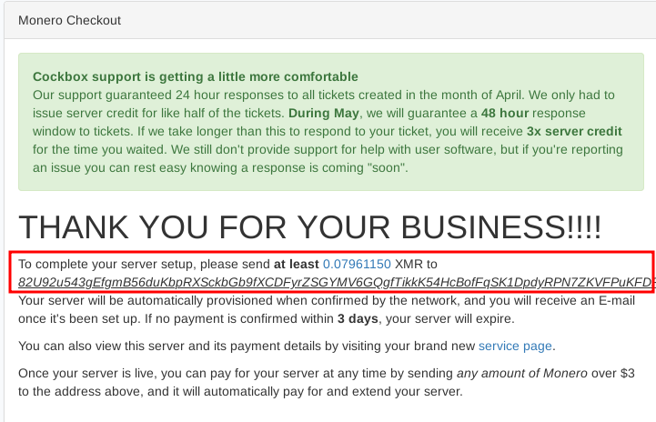

# The Private and Anonymous Email Fallacy

```
TLDR: The Mail protocol itself is not encrypted, the mail provider can see the contents of the mail messages. And due to the mail protocol requiring a clearnet presence, all mail providers can be harassed and be threatened to be forced out of business, even if they are in switzerland like how protonmail snitched it's users' IP addresses to help the french cops arrest activists.
```

## The Email protocol was not built with privacy in mind

First of all, you need to understand that the email protocol is by default not encrypted. for instance, everything that you send and recieve from your gmail account can be read by google employees:


But you need to understand that it doesn't matter who the mail provider is, the protcol used is going to be same everywhere, no matter how privacy-friendly they try to market themselves, like protonmail:


The result is that everything you send and recieve from your protonmail account can be read by the protonmail employees.

## Is email provider A more trustworthy than provider B ? 

Companies are after profit first and foremost, and yes surveillance capitalism is a very popular practice. **Wherever you see a mail service market itself as privacy friendly, you need to realize that you are being sold the illusion of privacy, for their surveillance-based profits.**


No matter how much marketing effort they put into twisting the privacy word for their own gain, the reality remains the same: the email protocol is flawed, any mail provider can see what you do, no matter how much they try to convince you otherwise. 

The mail protocol also requires a clearnet presence, meaning that you need at least a clearnet domain name, and a VPS to run your own mail service.

On top of all of that, if the mail provider accepts anonymous signups and recieves alot of abuse over time, expect them to implement KYC procedures like what Protonmail has been doing:


## Subpoenas and lawsuits

Secondly, [due to how fundamentally flawed the clearnet is compared to the darknet](../clearnetvsdarknet/index.md), any clearnet service (which mail services are) can be easily Subpoena'd and lawsuits can be filed against them to take them down or force them into complying with law enforcement requests.


As we explained previously, if your mail service has a clearnet presence, it makes it infinitely easier for statists to take it down due to how wide the attack surface is.

For instance companies providing email services can be threatened with the following:

- taking down the domain name itself
- taking down the VPS servers used to 
- taking down the actual internet connection of the company
- suing the company for not complying with law enforcement requests to hand over user data

## The Protonmail case : False privacy marketing can't protect against Subpoenas 

In 2021, the French authorities contacted europol to approach the swiss authorities to suphoena protonmail to hand over everything they had regarding the jmm18@protonmail.com account, which was used by an activist group called "The Youth for Climate collective and associated groups". And of course protonmail was forced into complying with the authorities' request, and that led to the arrest of a climate activist in september 6, 2021.

**All claims made by protonmail that they are not able to access the content of the users' mails is bullshit** because they encrypted it themseleves, meaning that they have the keys to decrypt the data, just like how we explained it in the case of incognito market's exit scam: **SERVERSIDE ENCRYPTION DOES NOT PROTECT THE USERS,** IT IS A MYTH!


The same concept applies to protonmail's bullshit claims of serverside-encrypted data, **the cops simply forced them (under a gag order, meaning they can't publicly admit it) to decrypt the user data with their own encryption keys (since they encrypted it themselves)**, and then the cops had everything they could possibly want out of protonmail:


**TLDR: just because a company is under the swiss jurisdiction does not mean that they are above other countries' laws**, this is yet another false sense of security and privacy that you are being lured into.

## The Cock.li case

To their credit, Cock.li has always been pro-individual freedom, without ever seeking profit off of the service that they were providing to the public. they have been operating for more than 11 years now, ever since 2013, allowing anonymous email registrations since the beginning.

As you can imagine, they've had enough time to make statist bootlickers increasingly more butthurt about the fact that people can get an email account anonymously online, here's what happened to them so far:

### Suphoenas, gag orders, and poisoned clearnet domains


### Hacks forcing them to remove the roundcube service


Given the fact that Cock.li is still standing after all of that gives me hope that anonymous email providers will still exist after all and remain available to the public:


But you need to understand that any other smaller provider would've immediately crumbled under the pressure. Meaning that despite the account signup being free and anonymous, you might not be able to access it later down the road if they end up getting forced offline.

Still i think that this is the next-best option overall. It is the best free option you have right now, but the actual best option will cost you some monero as explained below.

## Our recommendation: Anonymously host your own mail server

If you don't want to deal with all of that hassle, i recommend you do the following: 

First you need to [anonymously rent a domain name](../anondomain/index.md):


Then you need to rent a VPS anonymously as explained [here](../anonymousremoteserver/index.md):




And then lastly you can setup your own email service like i explained [here](../mailprivate/index.md):


The power behind this setup, which is an [anonymous clearnet service](../anonclearnetservices/index.md), is that the actual data is not stored on a remote server, but at home, without even revealing it's location. The actual mail service sits on your home server, and is being routed, through tor, to the VPS, where the ports are being port-forwarded to, and since both the rented VPS, and rented clearnet domain are paid for in monero and accessed via Tor, **Anonymity is maintained throughout, from the acquisition of the domain and VPS, to it's actual use.**

**The serverside privacy aspect is also preserved** since you are storing the data at your own home, unlike how it would be if the data were to be stored on the VPS, where the cloud provider could see everything stored onto it, including the content of your mailbox.

The drawback is of course the price. You need to spend 5euros worth of monero every year to rent the domain, and 5 euros worth of monero every month to rent the VPS, which totals at a yearly expense of 65 euros worth of monero, so it's not free, but on the other hand this has a very low chance of being taken down, and it's impossible to subpoena and harass the administrator behind it, because they have no way of figuring out who's renting it.

**Keep in mind that since it is a clearnet service, you should NOT use it for any sensitive activity,** as otherwise the cops would simply subpoena the cloud provider and the domain registrar into taking the service offline. Even if they can't trace it back to you, the basic flaw remains the same: the email protocol requires a clearnet presence, and because of that there will always be a domain and a VPS ready to be taken down easily.
