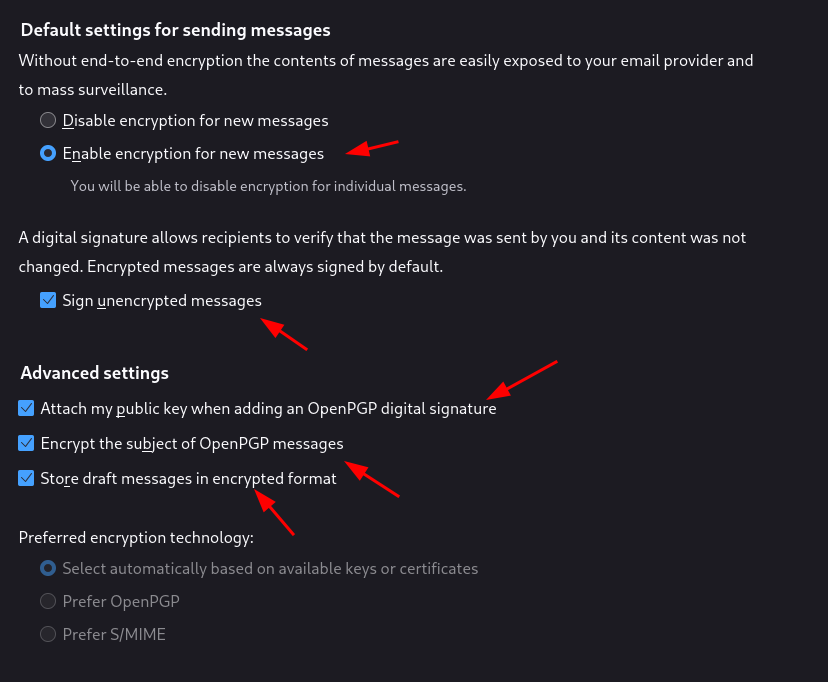
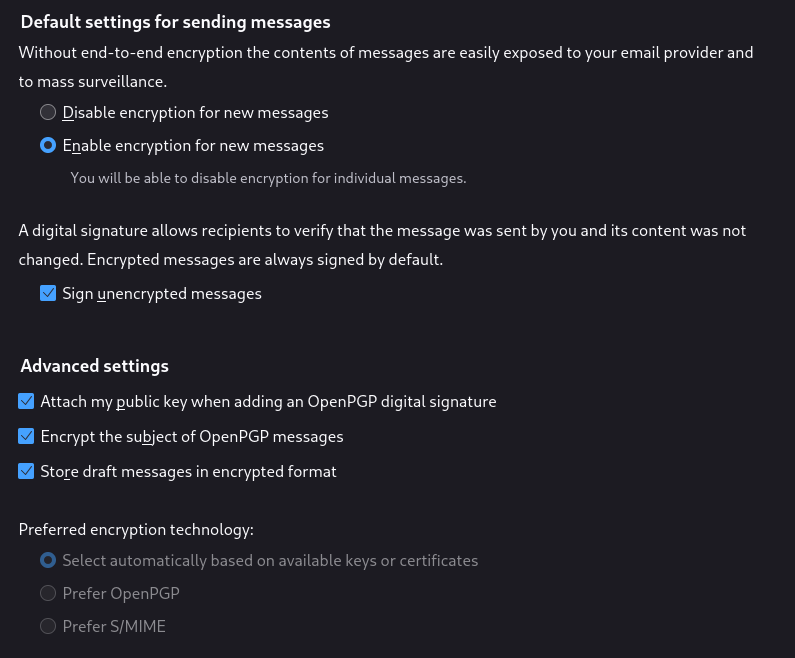

# Anonymous self-hosted clearnet mail server Setup 

```
TLDR: With enough kung-fu, you can achieve a private mail server (meaning you host it yourself), and keep it anonymous by routing it's traffic through Tor to a VPS that you anonymously rent.
```


In this tutorial we will setup a local mail server (to be able to keep control of our data), we will make it available publicly (so that it can communicate with other mail servers), but we'll make it go through TOR to guarantee Anonymity. 

Note that this setup involves self-hosting, [which I do not recommend if the service is supposed to be sensitive](../sensitiveremotevshome/index.md). If this is an issue for you, just install it on a [non-KYC remote VPS](../anonymousremoteserver/index.md) and skip the port-forwarding part if you don't want to host it at your house.


## **Initial VPN over Tor Setup**

First let's make it use an external VPS as a VPN server (make sure that you get it from a [non-KYC cloud provider](https://kycnot.me/services?type=VPS), where you create your account with an email that you also registered through TOR.), see [this tutorial](../anonymousremoteserver/index.md) i made for the full reasoning.
    
    
    root@mail:~# apt update -y ; apt upgrade -y ; apt autoremove -y ; apt install vim tor obfs4proxy -y
    	
    

Then we need to have the systemd services:
    
    
    root@mail:~# vim /etc/systemd/system/tortables.service                                                                                                                                                                                      
    root@mail:~# vim /etc/systemd/system/torwatch.service
    root@mail:~# vim /etc/systemd/system/vpn.service                                                                                                                                                                                            
    root@mail:~# vim /etc/systemd/system/sshtunnel.service
    	
    

The tortables systemd service will run iptables to make sure our server only communicates locally:
    
    
    root@mail:~# cat /etc/systemd/system/tortables.service
    [Unit]
    Description=Tor IP Tables
    After=network-online.target
    Wants=network-online.target
    
    [Service]
    Type=simple
    ExecStart=/root/iptables_vpn_tor.sh
    
    [Install]
    WantedBy=multi-user.target
    	
    root@mail:~# vim iptables_vpn_tor.sh
    root@mail:~# cat iptables_vpn_tor.sh
    #!/bin/bash
    
    
    #default private networks
    sudo iptables -F
    
    sudo iptables -A INPUT -m iprange --src-range 192.168.0.0-192.168.255.255 -j ACCEPT
    sudo iptables -A INPUT -m iprange --src-range 172.16.0.0-172.31.255.255 -j ACCEPT
    sudo iptables -A INPUT -m iprange --src-range 10.0.0.0-10.255.255.255 -j ACCEPT
    sudo iptables -A INPUT -m iprange --src-range 127.0.0.0-127.255.255.255 -j ACCEPT
    
    sudo iptables -A OUTPUT -m iprange --dst-range 192.168.0.0-192.168.255.255 -j ACCEPT
    sudo iptables -A OUTPUT -m iprange --dst-range 172.16.0.0-172.31.255.255 -j ACCEPT
    sudo iptables -A OUTPUT -m iprange --dst-range 10.0.0.0-10.255.255.255 -j ACCEPT
    sudo iptables -A OUTPUT -m iprange --dst-range 127.0.0.0-127.255.255.255 -j ACCEPT
    
    #ip range of tor VPN:
    
    sudo iptables -A OUTPUT -o tun0 -j ACCEPT
    sudo iptables -A INPUT -i tun0 -j ACCEPT
    
    sudo iptables -A INPUT -j DROP
    sudo iptables -A OUTPUT -j DROP
    
    

The torwatch systemd service will make sure the tor connection is still up:
    
    
    root@mail:~# cat /etc/systemd/system/torwatch.service
    [Unit]
    Description=torwatcher
    After=network-online.target
    Wants=network-online.target
    
    [Service]
    Type=simple
    ExecStart=/root/monitor_tor.sh
    ExecStop=kill -9 $(pidof /root/monitor_tor.sh)
    Restart=always
    
    [Install]
    WantedBy=multi-user.target
    root@mail:~# vim monitor_tor.sh
    root@mail:~# cat monitor_tor.sh
    #!/bin/bash
    
    counter=0
    while true; do
            echo TESTING
            timeout 10 ping -c1 10.8.0.1 &>/dev/null
            if [ $? -eq 0 ]; then
                    echo OK;
                    sleep 3
            else
                    if [ $counter -gt 0 ];
                    then
                            echo 'RESTARTING TOR...'
                            systemctl restart tor@default
                            counter=0
                            sleep 10
                    else
                            counter=$((counter+1))
                            echo "FAIL ( $counter / 2)";
                            sleep 3
                    fi
            fi
    done
    	
    

But as you can see it checks it by pinging 10.8.0.1, the OpenVPN server IP, meaning we need the vpn systemd service:
    
    
    root@mail:~# cat /etc/systemd/system/vpn.service
    [Unit]
    Description=VPN
    After=network-online.target
    Wants=network-online.target
    
    [Install]
    WantedBy=multi-user.target
    
    [Service]
    Type=simple
    ExecStart=/usr/sbin/openvpn /root/mail.ovpn
    ExecStop=kill -9 $(pidof openvpn)
    Restart=always
    
    root@mail:~# apt install openvpn -y
    	
    

Then we get the .ovpn file and modify it. the only requirement here is that you will need to setup the openvpn server to work on TCP, and not UDP as it is set by default. Why? because it will need to go through tor:
    
    
    root@mail:~# vim mail.ovpn
    root@mail:~# cat mail.ovpn
    client
    proto tcp-client
    remote x.x.x.x 1194
    dev tun
    resolv-retry infinite
    nobind
    persist-key
    persist-tun
    remote-cert-tls server
    verify-x509-name server_6SQ8FnOk0eJa3n0F name
    auth SHA256
    auth-nocache
    cipher AES-128-GCM
    tls-client
    tls-version-min 1.2
    tls-cipher TLS-ECDHE-ECDSA-WITH-AES-128-GCM-SHA256
    ignore-unknown-option block-outside-dns
    setenv opt block-outside-dns # Prevent Windows 10 DNS leak
    verb 3
    
    ### TOR SETTINGS ###
    socks-proxy 127.0.0.1 9050
    socks-proxy-retry
    up-delay
    route 10.0.0.195 255.255.255.255 net_gateway
    ###################
    
    

This will essentially force the openvpn connection to go through TOR, then we also edit our /etc/tor/torrc file, note that i intentionally route the traffic through a local bridge node, if you want to know how to set it up, please check [this](../tor/bridge/index.md) tutorial:
    
    
    root@mail-nihilism:~# cat /etc/tor/torrc
    UseBridges 1
    ClientTransportPlugin obfs4 exec /usr/bin/obfs4proxy
    Bridge obfs4 10.0.1.195:8042 6E9324EC8317DE331DE1EA7969BD868136785748 cert=tyhAPcDxgIcuqcUXXxtkYVPKrWMH7bYf7RJcLa8d+oGbQjoYSK10g4Pz7a/dbJkMXLVvAA iat-mode=0
    DataDirectory /var/lib/tor
    TransPort 9040
    SocksPort 9050
    DNSPort 53
    User debian-tor
    	
    root@mail:~# systemctl stop tor
    root@mail:~# tor
    May 15 12:00:17.068 [notice] Tor 0.3.5.16 running on Linux with Libevent 2.1.8-stable, OpenSSL 1.1.1n, Zlib 1.2.11, Liblzma 5.2.4, and Libzstd 1.3.8.
    May 15 12:00:17.068 [notice] Tor can't help you if you use it wrong! Learn how to be safe at https://www.torproject.org/download/download#warning
    May 15 12:00:17.068 [notice] Read configuration file "/etc/tor/torrc".
    May 15 12:00:17.076 [notice] Opening Socks listener on 127.0.0.1:9050
    May 15 12:00:17.076 [notice] Opened Socks listener on 127.0.0.1:9050
    May 15 12:00:17.076 [notice] Opening DNS listener on 127.0.0.1:53
    May 15 12:00:17.076 [notice] Opened DNS listener on 127.0.0.1:53
    May 15 12:00:17.076 [notice] Opening Transparent pf/netfilter listener on 127.0.0.1:9040
    May 15 12:00:17.076 [notice] Opened Transparent pf/netfilter listener on 127.0.0.1:9040
    May 15 12:00:17.000 [notice] Parsing GEOIP IPv4 file /usr/share/tor/geoip.
    May 15 12:00:17.000 [notice] Parsing GEOIP IPv6 file /usr/share/tor/geoip6.
    May 15 12:00:17.000 [notice] Bootstrapped 0%: Starting
    May 15 12:00:18.000 [notice] Starting with guard context "bridges"
    May 15 12:00:18.000 [notice] new bridge descriptor 'voidyt' (cached): $2E73653A148DFFF3CA28D53F0C366936FE554335~voidyt at 10.0.0.195
    May 15 12:00:18.000 [notice] Delaying directory fetches: Pluggable transport proxies still configuring
    May 15 12:00:19.000 [notice] Bootstrapped 5%: Connecting to directory server
    May 15 12:00:19.000 [notice] Bootstrapped 10%: Finishing handshake with directory server
    May 15 12:00:19.000 [notice] Bootstrapped 80%: Connecting to the Tor network
    May 15 12:00:19.000 [notice] Bootstrapped 90%: Establishing a Tor circuit
    May 15 12:00:19.000 [notice] Bootstrapped 100%: Done
    
    root@mail-nihilism:~# systemctl restart tor@default.service
    root@mail-nihilism:~# systemctl status tor@default.service
    ● tor@default.service - Anonymizing overlay network for TCP
         Loaded: loaded (/lib/systemd/system/tor@default.service; enabled-runtime; vendor preset: enabled)
         Active: active (running) since Thu 2022-12-08 12:14:21 CST; 29s ago
        Process: 3515 ExecStartPre=/usr/bin/install -Z -m 02755 -o debian-tor -g debian-tor -d /run/tor (code=exited, status=0/SUCCESS)
        Process: 3516 ExecStartPre=/usr/bin/tor --defaults-torrc /usr/share/tor/tor-service-defaults-torrc -f /etc/tor/torrc --RunAsDaemon 0 --verify-config (code=exited, status=0/SUCCESS)
       Main PID: 3517 (tor)
          Tasks: 8 (limit: 4673)
         Memory: 25.7M
            CPU: 1.180s
         CGroup: /system.slice/system-tor.slice/tor@default.service
                 ├─3517 /usr/bin/tor --defaults-torrc /usr/share/tor/tor-service-defaults-torrc -f /etc/tor/torrc --RunAsDaemon 0
                 └─3518 /usr/bin/obfs4proxy
    
    Dec 08 12:14:22 mail-nihilism Tor[3517]: Bootstrapped 1% (conn_pt): Connecting to pluggable transport
    Dec 08 12:14:23 mail-nihilism Tor[3517]: Opening Control listener on /run/tor/control
    Dec 08 12:14:23 mail-nihilism Tor[3517]: Opened Control listener connection (ready) on /run/tor/control
    Dec 08 12:14:23 mail-nihilism Tor[3517]: Bootstrapped 2% (conn_done_pt): Connected to pluggable transport
    Dec 08 12:14:23 mail-nihilism Tor[3517]: Bootstrapped 10% (conn_done): Connected to a relay
    Dec 08 12:14:23 mail-nihilism Tor[3517]: Bootstrapped 14% (handshake): Handshaking with a relay
    Dec 08 12:14:23 mail-nihilism Tor[3517]: Bootstrapped 15% (handshake_done): Handshake with a relay done
    Dec 08 12:14:23 mail-nihilism Tor[3517]: Bootstrapped 75% (enough_dirinfo): Loaded enough directory info to build circuits
    Dec 08 12:14:23 mail-nihilism Tor[3517]: Bootstrapped 95% (circuit_create): Establishing a Tor circuit
    Dec 08 12:14:23 mail-nihilism Tor[3517]: Bootstrapped 100% (done): Done
    
    

Now that tor has been setup to use the local TOR relay, we apply iptable rules:
    
    
    root@mail:~# ls
    iptables_vpn_tor.sh  mail.ovpn  monitor_tor.sh
    root@mail:~# chmod +x *.sh
    
    root@mail:~# systemctl daemon-reload
    root@mail-nihilism:~# systemctl enable --now tor@default.service tortables
    Synchronizing state of tor.service with SysV service script with /lib/systemd/systemd-sysv-install.
    Executing: /lib/systemd/systemd-sysv-install enable tor
    Created symlink /etc/systemd/system/multi-user.target.wants/tortables.service → /etc/systemd/system/tortables.service.
    root@mail:~# iptables -L
    
    Chain INPUT (policy ACCEPT)
    target     prot opt source               destination
    ACCEPT     all  --  anywhere             anywhere             source IP range 192.168.0.0-192.168.255.255
    ACCEPT     all  --  anywhere             anywhere             source IP range 172.16.0.0-172.31.255.255
    ACCEPT     all  --  anywhere             anywhere             source IP range 10.0.0.0-10.255.255.255
    ACCEPT     all  --  anywhere             anywhere             source IP range 127.0.0.0-127.255.255.255
    ACCEPT     all  --  anywhere             anywhere
    DROP       all  --  anywhere             anywhere
    
    Chain FORWARD (policy ACCEPT)
    target     prot opt source               destination
    
    Chain OUTPUT (policy ACCEPT)
    target     prot opt source               destination
    ACCEPT     all  --  anywhere             anywhere             destination IP range 192.168.0.0-192.168.255.255
    ACCEPT     all  --  anywhere             anywhere             destination IP range 172.16.0.0-172.31.255.255
    ACCEPT     all  --  anywhere             anywhere             destination IP range 10.0.0.0-10.255.255.255
    ACCEPT     all  --  anywhere             anywhere             destination IP range 127.0.0.0-127.255.255.255
    ACCEPT     all  --  anywhere             anywhere
    DROP       all  --  anywhere             anywhere
    	
    

And from there we can connect to the VPN server:
    
    
    root@mail:~# systemctl enable --now vpn torwatch
    Created symlink /etc/systemd/system/multi-user.target.wants/torwatch.service → /etc/systemd/system/torwatch.service.
    root@mail:~# systemctl status vpn torwatch
    
    root@mail:~# systemctl status vpn torwatch
    ● vpn.service - VPN
       Loaded: loaded (/etc/systemd/system/vpn.service; static; vendor preset: enabled)
       Active: active (running) since Sun 2022-05-15 12:03:26 CEST; 18s ago
     Main PID: 3144 (openvpn)
        Tasks: 1 (limit: 2359)
       Memory: 1.5M
       CGroup: /system.slice/vpn.service
               └─3144 /usr/sbin/openvpn /root/mail.ovpn
    
    May 15 12:03:28 mail openvpn[3144]: Sun May 15 12:03:28 2022 ROUTE_GATEWAY 10.0.0.1/255.255.0.0 IFACE=ens18 HWADDR=ee:b5:c9:3a:c3:fe
    May 15 12:03:28 mail openvpn[3144]: Sun May 15 12:03:28 2022 TUN/TAP device tun0 opened
    May 15 12:03:28 mail openvpn[3144]: Sun May 15 12:03:28 2022 TUN/TAP TX queue length set to 100
    May 15 12:03:28 mail openvpn[3144]: Sun May 15 12:03:28 2022 /sbin/ip link set dev tun0 up mtu 1500
    May 15 12:03:28 mail openvpn[3144]: Sun May 15 12:03:28 2022 /sbin/ip addr add dev tun0 10.8.0.2/24 broadcast 10.8.0.255
    May 15 12:03:28 mail openvpn[3144]: Sun May 15 12:03:28 2022 /sbin/ip route add 127.0.0.1/32 via 10.0.0.1
    May 15 12:03:28 mail openvpn[3144]: Sun May 15 12:03:28 2022 /sbin/ip route add 0.0.0.0/1 via 10.8.0.1
    May 15 12:03:28 mail openvpn[3144]: Sun May 15 12:03:28 2022 /sbin/ip route add 128.0.0.0/1 via 10.8.0.1
    May 15 12:03:28 mail openvpn[3144]: Sun May 15 12:03:28 2022 /sbin/ip route add 10.0.0.195/32 dev ens18
    May 15 12:03:28 mail openvpn[3144]: Sun May 15 12:03:28 2022 Initialization Sequence Completed
    
    ● torwatch.service - torwatcher
       Loaded: loaded (/etc/systemd/system/torwatch.service; enabled; vendor preset: enabled)
       Active: active (running) since Sun 2022-05-15 12:03:26 CEST; 18s ago
     Main PID: 3145 (monitor_tor.sh)
        Tasks: 2 (limit: 2359)
       Memory: 1.1M
       CGroup: /system.slice/torwatch.service
               ├─3145 /bin/bash /root/monitor_tor.sh
               └─3172 sleep 3
    
    May 15 12:03:26 mail systemd[1]: Started torwatcher.
    May 15 12:03:26 mail monitor_tor.sh[3145]: TESTING
    May 15 12:03:36 mail monitor_tor.sh[3145]: FAIL ( 1 / 2)
    May 15 12:03:39 mail monitor_tor.sh[3145]: TESTING
    May 15 12:03:39 mail monitor_tor.sh[3145]: OK
    May 15 12:03:42 mail monitor_tor.sh[3145]: TESTING
    May 15 12:03:42 mail monitor_tor.sh[3145]: OK
    	
    

And now our mail server uses the remote server as a VPN server, but only through TOR, meaning even if the VPS provider were to check the server logs, or the networking traffic, he would see that it all came from tor exit nodes, never from public ips.

## **Mail Server Setup**

Then we setup the mail itself on the local mail VM which is now connected to the VPN:
    
    
    root@mail:~# apt update -y ; apt upgrade -y ; apt install vim tmux curl certbot python3-certbot-nginx nginx -y
    	

Then install openvpn on the remote server using angristan's openvpn install script (make sure that it is running on a TCP port, otherwise you wont be able to force the openvpn connection through Tor, since it's a TCP-only protocol:

```
curl -O https://raw.githubusercontent.com/angristan/openvpn-install/master/openvpn-install.sh
chmod +x openvpn-install.sh
./openvpn-install.sh
```
    

Then we make sure that the ports are forwarded through the vpn connection:
    
    
    #on the VPN server we forward the ports to the local VM via iptables:
    
    root@mail-gw:~# cat iptables_forwardrules.sh
    #!/bin/bash
    iptables -A PREROUTING -t nat -i ens3 -p tcp -d 23.137.250.140 --dport 25 -j DNAT --to-destination 10.8.0.2:25
    iptables -A PREROUTING -t nat -i ens3 -p tcp -d 23.137.250.140 --dport 80 -j DNAT --to-destination 10.8.0.2:80
    iptables -A PREROUTING -t nat -i ens3 -p tcp -d 23.137.250.140 --dport 443 -j DNAT --to-destination 10.8.0.2:443
    iptables -A PREROUTING -t nat -i ens3 -p tcp -d 23.137.250.140 --dport 143 -j DNAT --to-destination 10.8.0.2:143
    iptables -A PREROUTING -t nat -i ens3 -p tcp -d 23.137.250.140 --dport 465 -j DNAT --to-destination 10.8.0.2:465
    iptables -A PREROUTING -t nat -i ens3 -p tcp -d 23.137.250.140 --dport 587 -j DNAT --to-destination 10.8.0.2:587
    iptables -A PREROUTING -t nat -i ens3 -p tcp -d 23.137.250.140 --dport 993 -j DNAT --to-destination 10.8.0.2:993
    
    root@mail:~# chmod +x iptables_forwardrules.sh
    root@mail:~# ./iptables_forwardrules.sh
    
    #from the VM we allow the packets to be forwarded to us:
    
    root@mail-nihilism:~# cat iptables_forwardrules.sh
    #!/bin/bash
    iptables -A FORWARD -p tcp -d 10.8.0.2 --dport 25 -j ACCEPT
    iptables -A FORWARD -p tcp -d 10.8.0.2 --dport 143 -j ACCEPT
    iptables -A FORWARD -p tcp -d 10.8.0.2 --dport 465 -j ACCEPT
    iptables -A FORWARD -p tcp -d 10.8.0.2 --dport 587 -j ACCEPT
    iptables -A FORWARD -p tcp -d 10.8.0.2 --dport 993 -j ACCEPT
    iptables -A FORWARD -p tcp -d 10.8.0.2 --dport 443 -j ACCEPT
    iptables -A FORWARD -p tcp -d 10.8.0.2 --dport 80 -j ACCEPT
    
    root@mail-nihilism:~# chmod +x iptables_forwardrules.sh
    root@mail-nihilism:~# ./iptables_forwardrules.sh
    
    

Dont forget to allow ip forwarding on the vpn server:
    
    
    root@mail-gw:~# sysctl net.ipv4.conf.ens3.forwarding=1
    net.ipv4.conf.ens3.forwarding = 1
    root@mail-gw:~# sysctl net.ipv6.conf.ens3.forwarding=1
    net.ipv6.conf.ens3.forwarding = 1
    root@mail-gw:~# echo " net.ipv6.conf.ens3.forwarding=1" >>/etc/sysctl.conf
    root@mail-gw:~# echo " net.ipv4.conf.ens3.forwarding=1" >>/etc/sysctl.conf
    root@mail-gw:~# sysctl -p
    net.ipv6.conf.ens3.forwarding = 1
    net.ipv4.conf.ens3.forwarding = 1
    
    #for arch users, install libvirt:
    sudo pacman -S libvirt
    vim /etc/sysctl.d/30-ipforward.conf
    cat /etc/sysctl.d/30-ipforward.conf
    net.ipv4.ip_forward=1
    net.ipv6.conf.default.forwarding=1
    net.ipv6.conf.all.forwarding=1
    
    [ nihilism ] [ /dev/pts/1 ] [~]
    → sysctl net.ipv4.ip_forward=1
    net.ipv4.ip_forward = 1
    


Then you make sure that your DNS records are set properly, example of the record on a [bind9](../dns/index.md) server:
    
    
    root@mail-gw:~# cat /var/cache/bind/db.nowhere.moe 
    
    mail.nowhere.moe.                  IN A       23.137.250.140
    
    

Then wait for it to propagate:
    
    
    root@mail-nihilism:~# curl ifconfig.me
    23.137.250.140root@mail-nihilism:~#
    root@mail-nihilism:~# curl ifconfig.me ; echo
    23.137.250.140
    root@mail-nihilism:~# ping mail.nowhere.moe
    PING mail.nowhere.moe (23.137.250.140) 56(84) bytes of data.
    64 bytes from 23.137.250.140 (23.137.250.140): icmp_seq=1 ttl=64 time=160 ms
    
    --- mail.nowhere.moe ping statistics ---
    2 packets transmitted, 1 received, 50% packet loss, time 1001ms
    rtt min/avg/max/mdev = 160.031/160.031/160.031/0.000 ms
    root@mail-nihilism:~# ping nowhere.moe
    PING nowhere.moe (23.137.250.141) 56(84) bytes of data.
    64 bytes from 23.137.250.141 (23.137.250.141): icmp_seq=1 ttl=63 time=204 ms
    
    

Once that's done we prepare nginx on the local VM still:
    
    
    root@mail-nihilism:~# rm /etc/nginx/sites-*/default
    
    root@mail-nihilism:~# cat /etc/nginx/sites-available/mail.nowhere.moe.conf
    server {
            listen 80;
            listen [::]:80;
            root /var/www/mail;
    
            index index.html;
    
            server_name mail.nowhere.moe;
    
            location / {
                    try_files $uri $uri/ =404;
            }
    }
    
    root@mail-nihilism:~# ln -s /etc/nginx/sites-available/mail.nowhere.moe.conf /etc/nginx/sites-enabled/
    
    root@mail-nihilism:~# systemctl restart nginx
    root@mail-nihilism:~# systemctl status nginx
    ● nginx.service - A high performance web server and a reverse proxy server
         Loaded: loaded (/lib/systemd/system/nginx.service; enabled; vendor preset: enabled)
         Active: active (running) since Thu 2022-12-08 13:18:14 CST; 19s ago
           Docs: man:nginx(8)
        Process: 5903 ExecStartPre=/usr/sbin/nginx -t -q -g daemon on; master_process on; (code=exited, status=0/SUCCESS)
        Process: 5904 ExecStart=/usr/sbin/nginx -g daemon on; master_process on; (code=exited, status=0/SUCCESS)
       Main PID: 5905 (nginx)
          Tasks: 3 (limit: 4673)
         Memory: 3.2M
            CPU: 49ms
         CGroup: /system.slice/nginx.service
                 ├─5905 nginx: master process /usr/sbin/nginx -g daemon on; master_process on;
                 ├─5906 nginx: worker process
                 └─5907 nginx: worker process
    
    Dec 08 13:18:14 mail-nihilism systemd[1]: Starting A high performance web server and a reverse proxy server...
    Dec 08 13:18:14 mail-nihilism systemd[1]: Started A high performance web server and a reverse proxy server.
    
    root@mail-nihilism:~# mkdir -p /var/www/mail/
    root@mail-nihilism:~# echo 'nowhere.moe' > /var/www/mail/index.md
    root@mail-nihilism:~# curl 127.0.0.1
    nowhere.moe
    root@mail-nihilism:~# ip a | grep inet
        inet 127.0.0.1/8 scope host lo
        inet6 ::1/128 scope host
        inet 10.0.0.203/16 brd 10.0.255.255 scope global dynamic ens18
        inet6 fe80::e4e7:41ff:fe70:e9a6/64 scope link
        inet 10.8.0.2/24 scope global tun0
        inet6 fe80::18b1:efc9:1ae0:d93f/64 scope link stable-privacy
    
    #from the vpn server:
    root@mail-gw:~# curl 10.8.0.2
    nowhere.moe
    
    

Now that's done we use certbot to get certificate from the local mail server:
    
    
    root@mail-nihilism:~# certbot --nginx
    Saving debug log to /var/log/letsencrypt/letsencrypt.log
    Plugins selected: Authenticator nginx, Installer nginx
    Enter email address (used for urgent renewal and security notices)
     (Enter 'c' to cancel): nihilist@nowhere.moe
    
    - - - - - - - - - - - - - - - - - - - - - - - - - - - - - - - - - - - - - - - -
    Please read the Terms of Service at
    https://letsencrypt.org/documents/LE-SA-v1.3-September-21-2022.pdf. You must
    agree in order to register with the ACME server. Do you agree?
    - - - - - - - - - - - - - - - - - - - - - - - - - - - - - - - - - - - - - - - -
    (Y)es/(N)o: Y
    
    - - - - - - - - - - - - - - - - - - - - - - - - - - - - - - - - - - - - - - - -
    Would you be willing, once your first certificate is successfully issued, to
    share your email address with the Electronic Frontier Foundation, a founding
    partner of the Let's Encrypt project and the non-profit organization that
    develops Certbot? We'd like to send you email about our work encrypting the web,
    EFF news, campaigns, and ways to support digital freedom.
    - - - - - - - - - - - - - - - - - - - - - - - - - - - - - - - - - - - - - - - -
    (Y)es/(N)o: N
    Account registered.
    
    Which names would you like to activate HTTPS for?
    - - - - - - - - - - - - - - - - - - - - - - - - - - - - - - - - - - - - - - - -
    1: mail.nowhere.moe
    - - - - - - - - - - - - - - - - - - - - - - - - - - - - - - - - - - - - - - - -
    Select the appropriate numbers separated by commas and/or spaces, or leave input
    blank to select all options shown (Enter 'c' to cancel):
    Requesting a certificate for mail.nowhere.moe
    Performing the following challenges:
    http-01 challenge for mail.nowhere.moe
    Waiting for verification...
    Cleaning up challenges
    Deploying Certificate to VirtualHost /etc/nginx/sites-enabled/mail.nowhere.moe.conf
    Redirecting all traffic on port 80 to ssl in /etc/nginx/sites-enabled/mail.nowhere.moe.conf
    
    - - - - - - - - - - - - - - - - - - - - - - - - - - - - - - - - - - - - - - - -
    Congratulations! You have successfully enabled https://mail.nowhere.moe
    - - - - - - - - - - - - - - - - - - - - - - - - - - - - - - - - - - - - - - - -
    
    IMPORTANT NOTES:
     - Congratulations! Your certificate and chain have been saved at:
       /etc/letsencrypt/live/mail.nowhere.moe/fullchain.pem
       Your key file has been saved at:
       /etc/letsencrypt/live/mail.nowhere.moe/privkey.pem
       Your certificate will expire on 2023-03-08. To obtain a new or
       tweaked version of this certificate in the future, simply run
       certbot again with the "certonly" option. To non-interactively
       renew *all* of your certificates, run "certbot renew"
     - If you like Certbot, please consider supporting our work by:
    
       Donating to ISRG / Let's Encrypt:   https://letsencrypt.org/donate
       Donating to EFF:                    https://eff.org/donate-le
    
    root@mail-nihilism:~# cat /etc/nginx/sites-available/mail.nowhere.moe.conf
    server {
            root /var/www/mail;
    
            index index.html;
    
            server_name mail.nowhere.moe;
    
            location / {
                    try_files $uri $uri/ =404;
            }
    
        listen [::]:443 ssl ipv6only=on; # managed by Certbot
        listen 443 ssl; # managed by Certbot
        ssl_certificate /etc/letsencrypt/live/mail.nowhere.moe/fullchain.pem; # managed by Certbot
        ssl_certificate_key /etc/letsencrypt/live/mail.nowhere.moe/privkey.pem; # managed by Certbot
        include /etc/letsencrypt/options-ssl-nginx.conf; # managed by Certbot
        ssl_dhparam /etc/letsencrypt/ssl-dhparams.pem; # managed by Certbot
    
    }
    
    server {
        if ($host = mail.nowhere.moe) {
            return 301 https://$host$request_uri;
        } # managed by Certbot
    
    
            listen 80;
            listen [::]:80;
    
            server_name mail.nowhere.moe;
        return 404; # managed by Certbot
    
    

And that's it! Now we can proceed with creating the mail server locally:
    
    
    root@mail-nihilism:~# wget https://raw.githubusercontent.com/LukeSmithxyz/emailwiz/master/emailwiz.sh -O emailwiz.sh
    --2022-12-08 13:27:42--  https://raw.githubusercontent.com/LukeSmithxyz/emailwiz/master/emailwiz.sh
    Resolving raw.githubusercontent.com (raw.githubusercontent.com)... 185.199.109.133, 185.199.110.133, 185.199.111.133, ...
    Connecting to raw.githubusercontent.com (raw.githubusercontent.com)|185.199.109.133|:443... connected.
    HTTP request sent, awaiting response... 200 OK
    Length: 13320 (13K) [text/plain]
    Saving to: ‘emailwiz.sh’
    
    emailwiz.sh                                                 100%[==========================================================================================================================================>]  13.01K  --.-KB/s    in 0.06s
    
    2022-12-08 13:27:44 (225 KB/s) - ‘emailwiz.sh’ saved [13320/13320]
    
    root@mail-nihilism:~# chmod +x emailwiz.sh
    root@mail-nihilism:~# sh emailwiz.sh
    	


(putting the TLD instead of mail.nowhere.moe here is intentional)

if it complains with the error "Please point your domain (nowhere.moe) to your server's ipv4 address, do the following:
    
    
    #add it into your /etc/hosts
    
    vim /etc/hosts
    cat /etc/hosts | grep nowhere.moe
    23.137.250.140 nowhere.moe
    
    #add it into your DNS zone too (ex in bind9 below):
    
    

` 

Then we change edit the DNS records as described above:


Here's how you can set it up on a bind9 DNS server:
    
    
    $TTL    604800
    @       IN      SOA     ns1.nowhere.moe. nihilist.nowhere.moe. (
                     33     ; Serial
                 604800     ; Refresh
                  86400     ; Retry
                2419200     ; Expire
                 604800 )   ; Negative Cache TTL
    ;
    ; name servers - NS records
                    3600     IN      NS      ns1.nowhere.moe.
                    3600     IN      NS      ns2.nowhere.moe.
                    3600     IN      A      23.137.250.141
                    3600     IN      AAAA      fe80::216:3eff:fe6c:c335
    
    ; mail-gw services
    @                                       IN MX      0 mail.nowhere.moe.
    nowhere.moe.                       IN TXT     "v=spf1 mx a:mail.nowhere.moe -all"
    mail.nowhere.moe.                  IN A       23.137.250.140
    mail._domainkey.nowhere.moe.       IN TXT     (
                                                    "v=DKIM1; k=rsa; p=MIIBIjANBgkqhkiG9w0BAQEFAAOCAQ8AMIIBCgKCAQEAu94n6zyhzWLZZrgvRq5HrSAh29TRi"
                                                    "jw6AXzFoJeahRPoAnJ3njOfOgbCzxUsVNO1L2+NX2P5iZMkdiVtB7rE71wUutegAb0wCDY5k5RNLUlAThxdlou0ro37H"
                                                    "SWK5GRAcEFKm1iab63uTtAXtIvZDPLYMxZMIUq4osxYEgAXY4BCzFBCyfohvr+eGd/kPbfOC9f7jrBnFiOVllnB+yPQKe"
                                                    "XwPeVlPrw68muFiVg4vWfMMzayINQgC12d73hKVZIwD8T6V9Kznv0dPi929CDWns2alU2dZypVSHxWm3BZyb4SCobdrFNW"
                                                    "xfzb1dz7n6/ms5u0EVAKU9ufGOgS4A70oQIDAQAB")
    _dmarc.nowhere.moe.                IN TXT     "v=DMARC1; p=reject; rua=mailto:dmarc@nowhere.moe; fo=1"
    
    [...]
    

Please note that on average the DNS records need 1-2 days to propagate fully throughout the world. So be patient once you've made the changes. Also note the DKIM record is on multiple lines, that's because there is a length limit that bind9 has for some reason, so above is how i managed to get around that restriction.

Then we add our first user:
    
    
    root@mail-nihilism:~#  useradd -G mail -m nihilist
    useradd: user 'nihilist' already exists
    root@mail-nihilism:~# id nihilist
    uid=1000(nihilist) gid=1000(nihilist) groups=1000(nihilist),24(cdrom),25(floppy),29(audio),30(dip),44(video),46(plugdev),108(netdev)
    root@mail-nihilism:~# passwd nihilist
    New password:
    Retype new password:
    passwd: password updated successfully
    
    root@mail:~# apt install nmap -y
    
    root@mail-nihilism:~# nmap 127.0.0.1
    Starting Nmap 7.80 ( https://nmap.org ) at 2022-12-08 13:49 CST
    Nmap scan report for localhost (127.0.0.1)
    Host is up (0.000026s latency).
    Not shown: 989 closed ports
    PORT     STATE SERVICE
    22/tcp   open  ssh
    25/tcp   open  smtp
    80/tcp   open  http
    143/tcp  open  imap
    443/tcp  open  https
    465/tcp  open  smtps
    587/tcp  open  submission
    783/tcp  open  spamassassin
    993/tcp  open  imaps
    9040/tcp open  tor-trans
    9050/tcp open  tor-socks
    
    Nmap done: 1 IP address (1 host up) scanned in 0.27 seconds
    root@mail-nihilism:~# nmap 10.0.0.202
    Starting Nmap 7.80 ( https://nmap.org ) at 2022-12-08 13:49 CST
    Nmap scan report for 10.0.0.202
    Host is up (0.000097s latency).
    Not shown: 992 closed ports
    PORT    STATE SERVICE
    22/tcp  open  ssh
    25/tcp  open  smtp
    80/tcp  open  http
    143/tcp open  imap
    443/tcp open  https
    465/tcp open  smtps
    587/tcp open  submission
    993/tcp open  imaps
    MAC Address: EE:B5:C9:3A:C3:FE (Unknown)
    
    

The ports we need are ready to be used locally, so let's login:
    
    
    [ 10.66.66.2/32 ] [ /dev/pts/38 ] [~]
    → sudo pacman -S thunderbird
    
    [ 10.66.66.2/32 ] [ /dev/pts/38 ] [~]
    → thunderbird
    	
    

Then test it on thunderbird:

 

And that's it! We managed to connect! now we test if the mail works:


(You probably guessed it, i accessed protonmail via tor to make sure i don't leak any personal info) And sending a mail to the VPS gets properly routed through the openvpn connection which is being sent through tor.

## **Miscellaneous**

If you want to use PGP encryption, you can manually do it in your terminal, please see this [tutorial](../pgp/index.md) to know how to do it.

However there's a way to do it in thunderbird:


If you don't have one, you can click create a new OpenPGP key, but i have one so i'll just import it:
    
    
    [ 10.8.0.3/24 ] [ nowhere ] [~]
    → gpg --output ~/.nihilist.privkey --export-secret-keys nihilist@nowhere.moe
    
    

`   

So from here you can copy your public key and paste it wherever you want, for example on your website, so that the users who want to message you will be able to encrypt their messages. Also add the following settings in thunderbird to automatically encrypt messages you wish to send out:



Now let's test it:


As you can see, by default you don't have the destination's PGP key, so for this first mail we won't encrypt it and see how it looks like on the receiver's end:

 

Now we see that the receiver got the unencrypted message, with our PGP signature as an attachment. The recipient can now save it, and use it to encrypt his messages with us.
    
    
    [ 10.8.0.3/24 ] [ nowhere ] [~]
    → gpg --gen-key
    gpg (GnuPG) 2.2.40; Copyright (C) 2022 g10 Code GmbH
    This is free software: you are free to change and redistribute it.
    There is NO WARRANTY, to the extent permitted by law.
    
    Note: Use "gpg --full-generate-key" for a full featured key generation dialog.
    
    GnuPG needs to construct a user ID to identify your key.
    
    Real name: nothing
    Email address: nothing@yourdoma.in
    You selected this USER-ID:
        "nothing <nothing@yourdoma.in>"
    
    Change (N)ame, (E)mail, or (O)kay/(Q)uit? O
    We need to generate a lot of random bytes. It is a good idea to perform
    some other action (type on the keyboard, move the mouse, utilize the
    disks) during the prime generation; this gives the random number
    generator a better chance to gain enough entropy.
    We need to generate a lot of random bytes. It is a good idea to perform
    some other action (type on the keyboard, move the mouse, utilize the
    disks) during the prime generation; this gives the random number
    generator a better chance to gain enough entropy.
    gpg: revocation certificate stored as '/home/nothing/.gnupg/openpgp-revocs.d/95FC37D748FA891A9C33B821CF39FCDC8049F9FE.rev'
    public and secret key created and signed.
    
    pub   rsa3072 2022-12-10 [SC] [expires: 2024-12-09]
          95FC37D748FA891A9C33B821CF39FCDC8049F9FE
    uid                      nothing <nothing@yourdoma.in>
    sub   rsa3072 2022-12-10 [E] [expires: 2024-12-09]
    
    [ 10.8.0.3/24 ] [ nowhere ] [~]
    → gpg --output ~/.nothing.privkey --export-secret-keys nothing@yourdoma.in

Now the user nothing can use his PGP key and import it into thunderbird aswell:

  

Same as before, now the user nothing also has E2E encryption setup, so let's now send a reply to nihilist but this time encrypted:


And that's it! We managed to setup a mail service, whose origin is unknown from the cloud provider's perspective, and who's able to send and recieve E2EE mails to prevent any unauthorized third-party from seeing the mails content.

