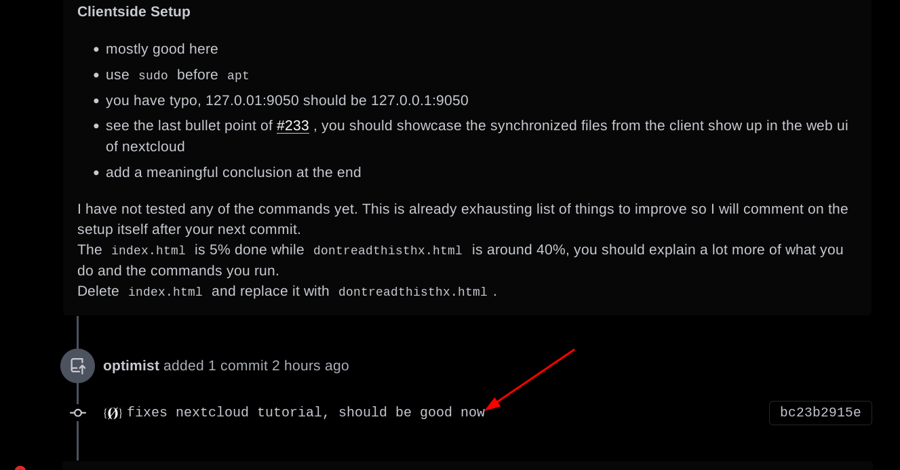

# How to become a Maintainer 

```
TLDR: Contribute so much and so well that you become eligible to be one of the 4 maintainers of the Opsec Bible.
```


Becoming a Maintainer is the next step to contribute to The Opsec Bible and Darknet Lantern projects, where you get to assist the other contributors contribute just like you did. The requirement is simple: **You should have contributed at least 3 times, having submitted contributions that were already nearly finished (95%) in one go.** If you are still submitting contributions that are 75% finished in one go, you are not ready to become a maintainer yet, maintainers are supposed to know the quality standard perfectly, to be able to enforce it [when doing contribution reviews](https://www.youtube.com/watch?v=jJuNQeG9Irc&t=4m14s), therefore i expect that they show that they understand it.


## **Onboarding new Contributors**

First of all, if there are new contributors that want to join in and contributors, maintainers need to invite them to the contributors chatroom:


Once added in private messages, the user can be invited in the Contributors chatroom, the contributors will be able to communicate with maintainers directly:


## **Converting Criticism into todolists**

As a maintainer, **you get to also be paid for writing valid (and actionnable) todolists**, since you get to have authority on what they contain, and you get to decide if they are valid or not. 

**WARNING: ALWAYS DOUBLE CHECK THAT THE NEW TODOLIST HAS NOT BEEN ALREADY COVERED IN AN EXISTING TUTORIAL / OR IS ALREADY SCHEDULED FOR ANOTHER FUTURE TUTORIAL**

This is why it is important for you to take part in the debates that are happening in [the public OPSEC chatroom](http://nowherejezfoltodf4jiyl6r56jnzintap5vyjlia7fkirfsnfizflqd.onion/simplex.html). 


As a maintainer, **you are getting rewarded 0.007 XMR per valid todolist** , all you need to do is write them (coming from criticisms that you either make, or that the other community members make), then you need to put them on each git issue that they are related to. **So if you write a new todolist, please make sure that you save the link to the todolists that you wrote** so that you can ask to recieve payment at the end of the month for all of the todolists you wrote, in one go.


The financial incentive lies is in tracking all the valid criticisms that are being thrown at us in the public chatrooms (which are all opportunities to improve, that's why we welcome it) **to then write alot of todolists** , for example if you write 10 valid todolists in 1 month time, you'll recieve 0.07 XMR for correctly writing them (as the payment is 0.007 XMR PER todolist correctly written). 


If there are any valid criticisms to tutorials that are supposed to be finished (meaning there are tutorials that need to be improved), write the todolist on the issue (in the completed column), and move it back to the "to be assigned" column

Therefore make sure that you take part in the criticisms and debates in in the opsec chatroom, as this is the place where you'll see the most criticism coming from, so if there are any valid criticisms coming from there, make sure that the criticism is at least saved somewhere (ideally on the targeted git issue, or on a new one that you created yourself.)

If you want to save the criticism somewhere on the git repo for later, go into the [maintainers project board](http://gdatura24gtdy23lxd7ht3xzx6mi7mdlkabpvuefhrjn4t5jduviw5ad.onion/nihilist/the-opsec-bible/projects/6) and create a git issue there, with the title starting with **"Criticism - For the tutorials XYZ", and make sure you add the label "criticism to convert into todolists"** , that'll help us make sure that criticisms aren't lost forever, but rather are stored somewhere, to be treated at a later time: 


See this [git issue](http://gdatura24gtdy23lxd7ht3xzx6mi7mdlkabpvuefhrjn4t5jduviw5ad.onion/nihilist/the-opsec-bible/issues/246) for instance, that i created to contain the valid criticism i recieved for the [Sensitive VMS tutorial](../sensitivevm/index.md), that i saved here to treat (or let another maintainer) treat at a later time.


When you decide to turn criticisms into todolists, follow the usual format as detailed in the previous ["how to become a contributor"](../contribute/index.md) tutorial:
    
    
    to be explained: (why + what)
    -
    -
    -
    
    to be showcased: (How)
    -
    -
    -
    
    

If you are not sure about if a particular todolist/criticism is valid or not, you can ask an administrator their opinion to know if it's OK or not aswell, to double check. But by default, as a maintainer your judgement is going to be trusted to write correct todolists. (With only other maintainers or administrators being able to overrule your judgement)

## **Assigning contributors onto todolists**

As a maintainer you also get to assign people to work on todolists:


You get to have authority on deciding what todolists get to contain (with only the other maintainers and administrators being able to overrule your decisions), you can validate them or edit them however you wish, only if they are not yet assigned (do not change a todolist if there's already someone working on it).

Disclaimer: Before you assign the contributor on the issue, double check that they have read rights on the repository:


**Sidenote:** the length of the deadline we give to contributors depends on how much the contributor has contributed in the past, they start at 2 weeks, to then arrive at 4 weeks per deadlines after 3 successful contributions. You can see the status of contributors on the [Contributors tracking project board](http://gdatura24gtdy23lxd7ht3xzx6mi7mdlkabpvuefhrjn4t5jduviw5ad.onion/nihilist/contributors-tracking/projects/10).


(don't forget to move the issue into the "assigned" column on the [project board](http://gdatura24gtdy23lxd7ht3xzx6mi7mdlkabpvuefhrjn4t5jduviw5ad.onion/nihilist/the-opsec-bible/projects/1) aswell:


**This is very important for you to move the issues in their proper place on the project boards, especially in the "To be assigned", "Doing", and "Awaiting Payments" as otherwise contributors wouldnt be aware that an issue is up for grabs, or that the administrators have to send payment to finished contribution.**

### Determining the price

As a maintainer you cat set the issue price based on TODO list content, the overall complexity of the issue and its importance in context of our blog.

One thing to be aware of is that **the price can't go lower once assigned**, so if you set a certain price for the blog post, the contributor **will get** at least that price once the blog post gets merged. The "carrot" promised can not shrink when the payment time comes - that would look bad for our project's reputation. However, the blog post can be rejected if they are valid reasons to do it (deadline passed, [ai written content](#ai-written-content), etc) - they don't receive any payment.

The person assigning the issue is responsible for setting the price correctly. In extreme cases, they could be asked to cover part of payment if it was set inadequately to the complexity. (however that has never happened yet)

If you are unsure about TODO list price, you can:

- Ask another Maintainer or Administrator for advice.
- Set the **price range** instead. This is especially useful when assigning issues to new contributors since we can't be sure about their reliability. After their work gets merged, you can pick any price from this range based on the quality of their contribution.
  

## **Reviewing Contributions**

And lastly, the maintainer's role is to review contributions whenever a contributor submits one, That's probably the most time consumming part. For example, we have the following contributor that's assigned on [this issue](http://gdatura24gtdy23lxd7ht3xzx6mi7mdlkabpvuefhrjn4t5jduviw5ad.onion/nihilist/the-opsec-bible/issues/233):


As you are most likely already aware since you are supposed to already be a contributor, whenever someone submits a contribution, they need to follow [the quality standard](../qualitystandard/index.md), **as a maintainer, you are supposed to make sure that they follow that standard whenever they try to contribute new content.**

Here for example, the contributor "optimist" submits a contribution after having followed the ["how to contribute"](../contribute/index.md) guide, and lets you know in the contributors chatroom:


Going there you see that the contributor correctly made a PR, but you need to review the changes:

> Don't mind the different PR example in this section, we're back to the nextcloud one later


It is possible to view his markdown changes directly in Forgejo without cloning anything.


Now going back to the `Files Changed` tab, you can add **line comments** where needed using the **+** sign on the left.


You should be presented with the input box where you can enter the required changes and click on **Start review**:


The comment should now be visible when browsing the PR changes:


As you can see, it has `Pending` status, which means contributor needs to respond to it somehow (either change the contents or dispute your request).

You should add comments where needed and then click on **Finish Review** near the top:


Here, you can write about overall status of the commit, give contributor the percentage estimate of how much is completed and **Request changes**:


Here is how a review looks like in the PR:


After that the contributor should ideally respond to each of your comments and then you can mark them as **Resolved**:


### Incomplete Contributions

If the contribution, does not follow the quality standard at all or it even deviates from the todolist that the contributor agreed to work on, you can either spend 10x more time reviewing what they took to write by making [the following assessment](http://gdatura24gtdy23lxd7ht3xzx6mi7mdlkabpvuefhrjn4t5jduviw5ad.onion/nihilist/the-opsec-bible/pulls/253#issuecomment-1997), or since this was a low effort you could simply post a low effort review like so:


    
    
    1) re-read the quality standard
    2) re-read the methodology on how to contribute
    3) re-read the todolist again and follow it this time 
    
    this is 30% completed.

Then the contributor pushes some more commits to fix their mistakes and ask for a second review:




And from there, if there are still mistakes that they can improve on, tell them that the contribution is (depending on your assessment) for example 80% completed, stating what's missing still. **Otherwise confirm that the contribution is OK and ready to be merged (using the good to merge git label)**

 


Then the administrator issues payment for both the contributor and to you the maintainer, for correctly reviewing a contribution. For maintainers specifically, the payment for the reviews will depend on how tedious the reviewing was.  **Starting from 21/09/2025 the maintainer payment rewards will scale based on the contributor rewards, as a percentage of it.** Beforehand it wasn't fair as the maintainer reward was the same for simple contributions, but also for the complex ones. Hence now we have the following payment grid based on the 2025 Q3's contributor payment rates:
    

  
  - no back and forth: 5% of contributor reward
  - 1 back and forth: 15% of contributor reward
  - 2 back and forths: 20% of contributor reward
  - 3 back and forths: 25% of contributor reward


Obviously, no need to be an ultra-perfectionnist for every detail that doesnt truly matter, however **The top priority here is that the blogpost needs to be CRYSTAL CLEAR** It needs to be easy to understand, from start to finish, while containing all the information one needs to understand what we are talking about, and how to achieve the targeted setup. **If the noobs out there don't understand what the hell we're talking about, then we are doing them a disservice by writing those blogposts.**

### **Dealing with Lazy and Incompetent Contributors**

Just warning you, this is the most annoying part of being a maintainer, so **if the reviewing is extra-tedious because you are facing an incompetent or lazy contributor, don't worry i'll send you extra monero your way for your trouble.**

I don't want this blog to contain ANY half-assed content, **the only acceptable content is VALID, FINISHED, QUALITY content.** It takes time to have quality, that's why we give a 1 month default deadline (which is more than enough 99% of the time, even for complex contributions). **if contributor A is not going to write a tutorial correctly before the deadline, REJECT THEIR CONTRIBUTION** , contributor B will write it correctly later on ([Sum Nihil](../../productivity/sum-nihil/index.md), don't care who does what, only care about what they do). 

With a 1 month deadline, there's no rush. Do not tolerate laziness or incompetence coming from contributors. Whoever wants to contribute to the blog is expected to follow the todolist, and follow the quality standard. If that contributor does not contribute quality, it means that they do not WANT to contribute quality. And if that's the case, do not waste your time on them.


**I repeat, If a contributor doesn't contribute quality after being told to do so, DO. NOT. CARE. REJECT THEIR CONTRIBUTION.** It's not for you to do it for them, _it is for them to step up to do it themselves,_ do not treat them like a baby, if something needs to be fixed, tell them to fix it, and wait for them to fix it. From my own experience, if the contributor is not competent, it is not worthwhile to keep recieving contributions coming from them, as they are simply wasting the reviewers' time. 

The contributor is expected to know what they are talking about, and they must be willing to write it in the correct way, so that their knowledge is correctly transmitted to the readers out there.


### AI written content

When a contributor submits something that looks clearly like LLM generated content, **do not waste time reviewing it**. Immediately unassign them from the blogpost without notice, move the issue back in the "to be assigned" column, and move that contributor into the "blacklisted column" in the contributors tracking board:


We will not ever tolerate that kind of laziness coming from our contributors. We are supposed to go the extra mile for our audience, whoever intends to disrespect our audience with some GPT-written crap can go start their own blog and do it on their own, not here. Write your own stuff, with your own brain and with your own 2 hands, period.

## Taking on the reviews

Since we have [multiple maintainers](../contribute/index.md#who-are-the-maintainers) working on Opsec Bible project, the work can be split between them. Each maintainer has their own specialties:

```
Maintainer Specialties (as of September 2025):
- Noone: paying contributors and donating to the project
- Nihilist: Opsec approach standardization, Organizing the nowhere projects organization, system administration, deniability, and productivity
- Oxeo: System administration, and dev expertise 
- Midas: System administration and dev expertise (with nixOS in particular)
- Doctor Dev: Code reviews, lantern repo responsibility, dev expertise
- Adhocinamorato: Analyzing opsec mistakes and standardizing their analysis
- crabmeat: Anarchism, Agorism, Consequences of Bad OPSEC, Statism related Topics, OPSEC Mistakes if it is not too technical
```

This means that if there is a contributor submitting work for an agorism-related issue, we'll assign it automatically to crabmeat, however in the case of multiple maintainers specializing on the same fields (such as system administration, which nihilist, oxeo and midas can review), we follow the usual **first come, first served** approach - when a [new PR](http://gdatura24gtdy23lxd7ht3xzx6mi7mdlkabpvuefhrjn4t5jduviw5ad.onion/nihilist/opsec-blogposts/pulls) is opened, you can reserve it by assigning yourself as a reviewer:


If you don't feel competent on the topic being discussed in the PR, you can ask other maintainers to do the review themselves or just double-check your review.

**Don't hesitate to ask other maintainers for help** in case of any doubts, having multiple maintainers review the same issue is also a possibility in case if the contribution is exceptionally complex.


## Writing blog posts as a Maintainer

Being a maintainer does not stop you for creating new blog posts. In fact, you are encouraged to do so. You can just assign the issue to yourself, set the deadline, *price* and start working on it.

> The person giving out payments has the right to change the final *price* if they disagree with the one you set for your issue.

After the work is finished, you should open a PR just like any [regular contributor](../contribute/index.md#how-to-contribute-new-tutorials) would do.

Then at least one **other maintainer has to review your contribution** before it is merged into main. That helps us spot mistakes, add valuable feedback and ensure the quality of your work.

This only applies to **new blog posts**, for smaller issues like Quick Fixes you usually can merge them on your own.


## Committing to `main` branch directly

As a maintainer, you should have full administrative access over the repository. This means you can push commits directly into the `main` branch.

However this is **only** acceptable when:

- Doing minor changes (fixing spelling mistakes or links)
- Adding new blog posts to `index` or `nav` after PR merge
- Editing `tags`, `date` or `category` of a blog post

You **need to** open a new pull request for:

- Submitting [a new blog post](#writing-blog-posts-as-a-maintainer) of your own (unless it's a tutorial `Quick Fix` tagged tutorial)
- Changing the content of an existing blog post in case your changes are substantial


## Being active as a Maintainer

Obviously, if you want to keep your position as a maintainer in the nowhere projects, i expect you to actually want to invest some time with our projects. If you are not going to be available to respond within the next `72 hours` (to either assign a contributor on an issue, to review a submitted contribution, or merge it), please warn the other maintainers and especially [nihilist](http://nowherejezfoltodf4jiyl6r56jnzintap5vyjlia7fkirfsnfizflqd.onion/nihilist.html) / [oxeo](http://nowherejezfoltodf4jiyl6r56jnzintap5vyjlia7fkirfsnfizflqd.onion/oxeo0.html) beforehand.

If you stop being active (`>72 hours`) without telling us beforehand that you're taking a break (which you have all the right in the world to do obviously, we're all human afterall) then we'll consider that you're abandoning your maintainer seat.

