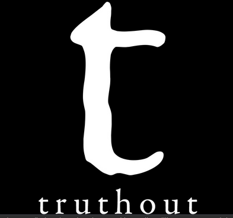

# Public media is funded propaganda

## What is public media ? 

If we look at the official definition of what are public medias, here is what we find: 

*"Public media refers to media organizations,such as radio, television, and online platforms,that are funded and operated in the public interest, often with government support or oversight. The core goal of public media is to provide unbiased, educational, informative, and culturally enriching content that serves the needs of the general population, rather than pursuing profit or serving commercial interests."*

In this definition, there are several key points that deserve closer examination.

First, the concept of the *"public interest"* needs to be questioned. What exactly is the public interest in having media funded by governments? Why should public media be considered superior to private media? 

The term public interest is often used to justify government-funded initiatives like public media, but it can be vague and politically loaded. Who defines what is in the public interest? Ideally, it reflects the needs of a democratic society: access to accurate information, civic education, cultural representation, and minority voices. But in practice, what's defined as "public interest" is shaped by political, cultural, and ideological forces.

The official definition attempts to answer this by emphasizing terms like *"unbiased"*, *"educational"*, *"informative"*, and *"culturally enriching"*. But the underlying suggestion is that private media, because it operates for profit, is inherently unable to provide these qualities. That assumption is worth challenging.

The traditional argument is that profit-driven media focuses on sensationalism, entertainment, and audience maximization. While that can be true (think clickbait or infotainment), it doesn't mean that all commercial media is shallow or manipulative. Likewise, public media also competes for attention, and in some countries, it has become ideological or unrepresentative of diverse views.

So the assumption that public = pure and private = corrupt is an oversimplification. Both systems can succeed or fail depending on how they are structured, funded, and held accountable.

If you want additional information about public medias, please refer to this [article](https://en.wikipedia.org/wiki/Public_broadcasting_in_the_United_States). 

## What public medias are existing ? 

In order to give you an overall picture about what can be the public medias, we will take a look at what is existing in USA: 

| Category           | Examples                                                                                           |
| ------------------ | -------------------------------------------------------------------------------------------------- |
| **Radio Networks** | NPR, APM, PRX, Pacifica                                                                            |
| **TV**             | PBS (and its member stations)                                                                      |
| **Oversight**      | Corporation for Public Broadcasting (CPB)                                                          |
| **Social Media**   | NPR @NPR on X, PBS, APM, WNYC, WBEZ, mostly on Facebook, Instagram, LinkedIn, YouTube             |
| **Podcasts**       | *Fresh Air*, *Up First*, *Planet Money*, *Radiolab*, *Code Switch*, *Throughline*, *Consider This* |

As you can see, nearly all forms of media are represented within the scope of public media. This means that governments have the ability to reach and influence a wide portion of the population whenever they choose to.

Here is an [article](https://news.gallup.com/poll/651977/americans-trust-media-remains-trend-low.aspx) that discusses how public trust in U.S. public media has been steadily declining.

## Why refering to public medias can be dangerous ? 

As previously mentioned, public media are funded by governments. For many people, money is seen as the primary driver of work. This means governments not only control the funding that keeps these media outlets operating, but also the salaries of the people who work there. In other words, they hold significant influence over the individuals within these organizations. So, what happens when a government that seeks to control every aspect of society also controls the media that most of its population reads, watches, or listens to? It uses that power to shape the narrative and define the information people receive.

This is precisely why public media can be dangerous. How can information be presented objectively when the media outlet ultimately serves the interests of the government? It’s simply not possible. Numerous examples exist where public media have broadcast misleading or biased information that later proved to be false.

1) **Australia – ABC and War Crimes Audio**

Australia’s ABC was criticized for including fabricated audio in a 2022 report on alleged war crimes by Australian soldiers. An independent investigation by Channel 7’s Spotlight revealed that the broadcaster added multiple gunshot sounds to the video, exaggerating the events. Former ABC chair Maurice Newman called it a “grotesque fabrication”.

2) **Japan – NHK and Black Lives Matter Misrepresentation**

In 2020, Japan's public broadcaster NHK aired an amateur-style animation about the Black Lives Matter movement that was widely condemned as crude and insensitive. NHK apologized and removed the segment, acknowledging it presented an "incomplete picture".

3) **China – CGTN’s Hong Kong Coverage**

China Global Television Network (CGTN), a state-run broadcaster, has been repeatedly accused by regulators like Britain's Ofcom and press freedom organizations of censoring sensitive topics (e.g. Hong Kong protests) and broadcasting government propaganda.

4) **Russia – Channel One & State-Synchronized Propaganda**

Russia's state-owned Channel One routinely broadcasts pro-government content and downplays or omits unfavorable news, such as issues in Chechnya, while framing foreign events (e.g., the Ukrainian conflict) to support Kremlin narratives. The channel is widely recognized as a propaganda tool.

Here is an example of the pro-Russian media campain in serbia: 

As you can see, governments around the world manipulate information to serve their own interests, or those of their allies. The real issue is that, even though people technically have access to a wide range of independent media, many stick to their usual habits and never question whether their primary sources of information may be compromised.

Here is an Oxford [report](https://www.ox.ac.uk/news/2021-01-13-social-media-manipulation-political-actors-industrial-scale-problem-oxford-report) about media manipulation. 

Since these media outlets are heavily used to spread government-driven narratives, people are no longer truly free to form their own opinions. Their views are shaped by information controlled by the state, making them much easier to manipulate. As a result, genuine political opposition struggles to survive, slowly fading under the weight of widespread disinformation.

Numerous examples demonstrate that government-led media manipulation has had a significant impact on public opinion:

1) **Russia, MH17 and Ukraine War**

Event: After MH17 was shot down in 2014, Russia's public media (e.g., Channel One) spread disinformation blaming Ukraine, despite international evidence pointing to Russian-backed forces.

Effect on Population: A majority of Russians polled believed Ukraine was responsible. This fueled nationalism, reinforced anti-Western sentiment, and built support for Russia's military actions in Ukraine, paving the way for the 2022 invasion.

[Source](https://www.newyorker.com/magazine/2019/12/16/the-kremlins-creative-director): The New Yorker

2) **Poland, TVP's Political Bias**

Event: Under the Law & Justice (PiS) party, state broadcaster TVP aired heavily biased content against the opposition, calling them "traitors" or "foreign agents".

Effect on Population: Public trust in media became highly polarized, with PiS supporters defending TVP and opponents calling it state propaganda. The manipulated media landscape contributed to deep political division and voter confusion.

[Source](https://freedomhouse.org/sites/default/files/2020-02/FH_Poland_Media_Report_Final_2017.pdf): Freedom House

3) **Hungary, Orban's Media Control**

Event: Nearly all public and private media in Hungary became pro-government through acquisitions or regulation. Public media pushed Orban's messaging on immigration and "national sovereignty."

Effect on Population: Orban's anti-immigration narrative gained traction; many Hungarians believed Europe was under threat, justifying authoritarian policies. Opposition parties lost access to fair media coverage.

[Source](https://apnews.com/article/hungarians-protest-media-propaganda-ef0f419ea38ea8d2beb4f0dd56d82d57): AP News

4) **United Kingdom, BBC and the Falklands War**

Event: During the Falklands War (1982), the BBC was criticized for maintaining "neutrality" in war coverage. However, it faced pressure to present a pro-British stance.

Effect on Population: The resulting coverage shaped patriotic sentiment and reinforced public support for the war, boosting Prime Minister Margaret Thatcher's approval.

[Source](https://en.wikipedia.org/wiki/BBC_controversies): Wikipedia

5) **Italy, RAI and Political Alignment**

Event: Under Prime Minister Giorgia Meloni, RAI began promoting more nationalist and conservative views, especially in cultural and news programming.

Effect on Population: Studies found a rise in skepticism toward immigration and EU policies, correlating with the shift in tone of public broadcasters.

[Source](https://www.lemonde.fr/en/m-le-mag/article/2024/07/23/giorgia-meloni-s-offensive-against-public-broadcasting_6695023_117.html): Le Monde

This is how governments maintain electoral success and preserve public support, essentially a modern strategy to prevent dissent and avoid revolutions. This is also how governments manage to justify the use of violence, framing it as necessary or legitimate in the eyes of the public.

## Ads, a new propaganda tool

Since advertisements have become widespread and people are exposed to them almost every day, it has become increasingly difficult to distinguish genuine information from promotional content. Moreover, individuals are often paid to disseminate advertisements, and, in many cases, to influence public opinion under the appearance of neutrality.

At first glance, advertising may seem harmless, after all, most ads are simply promoting products, and people are theoretically free to decide whether to buy or not. However, a deeper look reveals that the influence is far from neutral. In reality, many people who are paid to promote products are seen as celebrities or role models by their audiences. This gives them a certain level of influence and authority. Because they are often perceived as successful, their followers are inclined to adopt their lifestyle choices in hopes of achieving similar success. 

And here's the deeper issue: if those influencers are paid to endorse a specific product, there's a high chance that the product comes from a company that also funds or has ties to media outlets with particular interests. In many cases, this creates a subtle but powerful feedback loop of influence and control.

If you want a starting point about how ads are manipulating people, please follow this [link](https://money.com/marketing-politicians-manipulation-psychology/). 

A quite good example of political manipulation through advertising is the following case: 

**"Daisy" Political Ad (1964 U.S. Presidential Election)**

Context: Lyndon B. Johnson's campaign aired a famous commercial suggesting that electing his opponent Barry Goldwater could lead to nuclear war.

Manipulation: The ad used fear to sway voters, associating Goldwater with catastrophic consequences without explicit claims.

Effect on Public: It shaped public opinion by amplifying fears about nuclear conflict, contributing to Johnson's election victory.

Source: [Wikipedia](https://en.wikipedia.org/wiki/Daisy_(advertisement))

More recently, we also had the exemple of the 2016 U.S. presidential election, where targeted political ads on Facebook were used to influence voter behavior. One of the most well-known cases involved the Cambridge Analytica [scandal](https://www.cnbc.com/2018/03/21/facebook-cambridge-analytica-scandal-everything-you-need-to-know.html), in which the personal data of millions of Facebook users was harvested without consent. This data was used to create psychological profiles and deliver highly targeted ads that played on individuals' fears, values, and beliefs.

These ads were often misleading or emotionally charged, designed to push voters toward a specific candidate or to discourage others from voting at all. Many of them were never publicly visible outside the target audience, making it difficult to monitor or fact-check their content.

Effect on the population: The campaign significantly contributed to political polarization, misinformation, and distrust in democratic processes. It also sparked global concern about the role of social media and data in manipulating public opinion.

Here, we saw examples of direct political advertisement. But, what happens when famous people are promoting products for political goals? 

1) **Arnold Schwarzenegger, Hummer and Military Branding**

What: As a global icon, Schwarzenegger helped popularize the civilian Hummer (H1), a vehicle based on military design.

Political Impact: Promoting a militarized consumer product contributed to the normalization of military aesthetics in American culture. It paralleled U.S. foreign interventions and helped shape a public image that aligned patriotism with militarism.

2) **Jay-Z, Barclays Center and Urban Redevelopment**

What: Jay-Z publicly supported the building of the Barclays Center in Brooklyn, part of a massive real estate development project.

Political Impact: His influence helped secure public support for a controversial redevelopment that involved gentrification and displacement. This helped political and business interests push through public-private partnerships under the guise of community development.

3) **George Clooney, Nespresso & Ethical Sourcing**

What: Clooney fronted Nespresso ads while also advocating for ethical trade and anti-child labor.

Political Impact: His image helped improve the perception of global coffee trade practices, aligning consumer habits with political advocacy. It also softened criticism of multinational corporations by giving them a humanitarian face.

## The "Big 5" Media Corporations

In addition to public media, there are numerous private media outlets that provide additional channels of information to the public. In this context, we will focus on private media in the United States and explore who owns them:

1) **Comcast**

Owns: NBC, MSNBC, CNBC, Telemundo, Universal Pictures

Subsidiary: NBCUniversal

Reach: Cable TV, film, theme parks, internet services

Notable: One of the largest cable providers and media owners in the U.S.

2) **The Walt Disney Company**

Owns: ABC, ESPN, FX, National Geographic, Marvel, Lucasfilm, Pixar, Hulu (majority)

Acquired: 21st Century Fox assets in 2019

Reach: Film, TV, streaming (Disney+, Hulu, ESPN+)

3) **Warner Bros. Discovery**

Owns: CNN, HBO, TNT, TBS, Discovery Channel, DC Studios, Food Network, HGTV

Merger: WarnerMedia (AT&T) + Discovery in 2022

Reach: Huge in cable and streaming (Max)

4) **Paramount Global (formerly ViacomCBS)**

Owns: CBS, Showtime, MTV, Comedy Central, BET, Nickelodeon, Paramount Pictures, Pluto TV

Streaming: Paramount+

Reach: Longstanding major player in U.S. news and entertainment

5) **Fox Corporation**

Owns: Fox News, Fox Sports, Fox Broadcasting Company

Not part of the 21st Century Fox sale to Disney (news and sports retained)

Known for: Right-leaning news and opinion content

As you can see, five corporations control the majority of private media in the U.S. This gives them the power to shape public opinion at will, as they reach nearly the entire population.

But why would private media outlets try to influence political opinions, given that they are not public institutions? This is where corruption comes into play.

As stated in the [article](../individualreignssupreme/index.md), companies are mainly controlled by states. It all comes down to economic interests. These companies are designed to make money, that's their primary goal. States have the power to adjust taxes as they see fit. So, if these companies aim to minimize their tax burdens, they may quietly align themselves with the political parties or administrations that can offer them favorable tax policies.

Additionally, the political leanings of these companies' leadership can shape the content they produce, potentially turning their media platforms into vehicles for propaganda.

There's an additional concern in this situation: when just a few corporations control nearly all private media, it eliminates any meaningful counterbalance if they choose to push propaganda collectively. Smaller independent outlets simply don't have the same financial resources and lack government support. This mirrors the exact definition of statism described in this [article](../stateistheenemy/index.md), only in this case, the concentration of power has shifted from the state to private corporations.

To summarize, both public and private media are heavily influenced by governments. Public media is directly shaped by government ownership, while private media is often swayed through corruption and political influence. The outcome is that corruption spreads propaganda into homes across the U.S., and by extension, into homes around the world.

## Independent medias

Among the media outlets listed above, some truly independent ones are still operating and accessible to a wide audience. While it's often challenging to definitively determine a media outlet's level of independence, nonprofit status is a strong indicator of editorial freedom.

Here are a few examples of well-known, independent media outlets:

1) **[ProPublica](https://www.propublica.org/)**

Type: Nonprofit, investigative journalism

Focus: Public interest stories, particularly on corruption, inequality, and abuse of power.

Funding: Donations, grants, and some partnerships with other media outlets.

Why Independent: ProPublica is a nonprofit organization, which allows it to avoid corporate pressures. It's dedicated to investigative reporting without commercial interests.

2) **[Democracy-Now!](https://www.democracynow.org/)**

Type: Independent, nonprofit news organization

Focus: Progressive, global, and alternative news coverage with a focus on social justice issues, war, and inequality.

Funding: Donations from viewers, foundations, and supporters.

Why Independent: It's funded through viewer donations and foundation grants, not corporate sponsors. Its editorial independence allows for coverage often missing in mainstream media.

3) **[The-Intercept](https://theintercept.com/)**

Type: Investigative journalism

Focus: Government transparency, corporate power, social justice, and civil liberties.

Funding: Initially funded by digital entrepreneur Pierre Omidyar and now relies on subscriptions and some sponsorship.

Why Independent: The Intercept prioritizes investigative journalism without the usual corporate or government ties. It operates under First Look Media, a nonprofit organization.

4) **[Mother-Jones](https://www.motherjones.com/)**

Type: Nonprofit, progressive investigative journalism

Focus: Politics, social justice, environmental issues, and corporate accountability.

Funding: Donations, memberships, and subscriptions.

Why Independent: As a nonprofit, Mother Jones operates free from the financial pressures that can influence commercial media outlets. It's editorially independent and funded through reader contributions.

5) **[Truthout](https://truthout.org/)**

Type: Independent, nonprofit news outlet

Focus: Social justice, politics, and environmental issues.

Funding: Reader donations, grants, and crowdfunding.

Why Independent: Truthout operates as a nonprofit news organization with a focus on independent reporting. It's free from corporate sponsorship, which allows it to cover topics that other outlets may avoid.

Of course, independent media can have their own biases, that's part of human nature. However, these outlets are not designed to manipulate the masses in order to serve the interests of those in power. And that, ultimately, is what matters most. Manipulation and propaganda undermine freedom, whereas oriented media simply represent freedom of speech. It's crucial to keep this in mind when choosing your sources of information.

This blog is fully independent and advocates for freedom of speech and freedom in general.

## Conclusion 

We've seen that wherever governments have financial influence over information sources, propaganda and corruption inevitably follow. The economy is one of the preferred methods of pressure used by states, and it's an incredibly effective one. This is why nonprofit-oriented media can be a better choice for accessing unbiased information.

Throughout history, we've witnessed numerous cases where media played a key role in spreading propaganda. Entire wars were accepted by populations due to media bias, and freedoms were reduced under the guise of necessity. The power of manipulation and propaganda is nearly limitless, which is why it's our responsibility to undermine it by avoiding traditional media.

