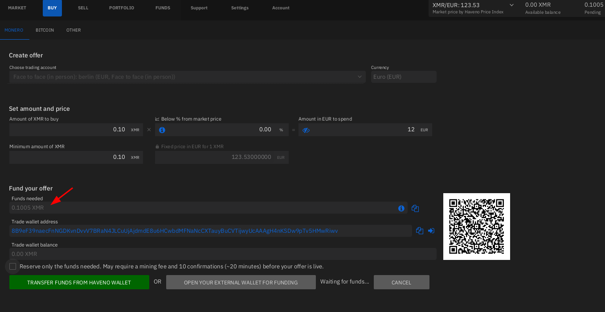

# How to get your first Monero ? (xmrbazaar.com, crypto swaps, p2p chats, or work) 

```
TLDR: Work for Monero, Trade goods for Monero, use CEXs to get Monero
```


## **Why is this important ?**

First of all, if you have seen our previous tutorials on [Haveno DEX](../haveno-client-f2f/index.md), you'd realize that to be able to buy some monero over there (in exchange of some of your fiat currency), you need to already have some monero to be able to initiate trades, because there is a security deposit (in monero) that you need to fund:

 

That's the Chicken in egg problem that got ported over from Bisq, to buy some monero you first need a small amount of monero (0.11 XMR approx). **Therefore the question is where can you get that first 0.11 XMR ?**

## **XMR in exchange of goods and services**

At the initiative of Douglas Tumann, the guy behind the excellent weekly show called ["Monero Talk"](https://www.youtube.com/@MoneroTalk) (whose goal is to raise awareness on what Monero is truly about), you can make use of the [Xmrbazaar website](https://xmrbazaar.com/) that he kickstarted:


On Xmrbazaar, you can sell and buy (legal) goods and services, peer to peer. You can view it as a craigslist or ebay but using Monero as it's only currency. It's as simple as signing up there, listing something that people are likely to want to purchase (it can be video games, guitars, tshirts, or literally just offering euros in exchange for some monero), **and with it you'll be able to not only participate in the Monero Circular Economy, and get your first XMR in the process.**


Another option could be to also go in the "Earn XMR" section, to view already existing offers, where you can try and provide goods and services to fulfill other people's needs. For example i have 2 offers in here, where i offer monero for whoever helps me write a new feature on my [Darknet Lantern](../darknetlantern/index.md) side-project, or for whoever helps me write a new blogpost as described in [this tutorial](../contribute/index.md).


From here, the more you participate in the Monero Circular Economy, by providing access to goods and services to everyone, the more monero you'll be able to get without having to go through any KYC hassle that centralised exchanges are being subjected to.

**I consider this to be the best way to get your first Monero, as it will help grow the Monero Circular Economy, and proving to everyone that you can indeed use it as an actual currency** , contrary to the other cryptocurrencies which are either just speculative assets or scams.

## **Centralised Exchanges**

If you're not interested in the monero circular economy, your next best option is going to be Centralised Exchanges, there are a ton of those out there.

However, there is one thing that you need to note. **in 99% of the cases, said centralised exchange is not anonymous on the serverside, which makes them subjectable to financial regulations.** If you managed to find a clearnet centralised exchange that is not forcing you to go through KYC (know your customer) procedures yet, you are just lucky, be aware that this is not meant to last. Chainanalysis and governments around the world are scared shitless that their population stops using their fiat currency, as it makes them unable to subject their population to their rules. 


**It is only a matter of time until every clearnet centralised exchange out there is forced to comply to financial regulations and force you through KYC procedures.** But until they manage to force every centralised exchange to comply, you can try to get your monero via the ones listed on [Kycnot.me](https://kycnot.me/?t=exchange&q=&fiat=on&cash=on):


If XMR is not readily available for fiat on one of these centralised exchanges, you can also first buy some BTC before swapping it to XMR.


Feel free to try to purchase crypto from any of those, especially the top ones should allow you to buy either XMR or BTC in exchange of a fiat payment like bank transfer, credit card purchase or just cash sent by mail. 

Now if your only option is to have a shitcoin like BTC, buy it and then swap it to get Monero instead, and then make sure that you withdraw the monero to the monero wallet that is on your laptop, as otherwise the centralised exchange can drain (steal) your funds. Always self-custody your own crypto, because if it's not your keys, it's not your crypto. See this [Kycnot.me](https://kycnot.me/?t=exchange&q=&xmr=on&btc=on) link to have a list of exchanges that support BTC to XMR trades:


One thing to note however, is that it doesn't matter if you get KYC'd if you buy your XMR somewhere. as long as it's not illegal for you to own Monero, you can safely let the adversary know that you purchased as small amount of monero, as they will anyway not be able to know where the monero you just purchased is going. **As long as you manage to get some Monero to a monero wallet that you control locally on your computer, by default, you are the only one that knows where that money goes.**

## **Conclusion**

And that's it! You now know where you can get your first Monero, to be able to make your first trade on [Haveno](../haveno-client-f2f/index.md)!

